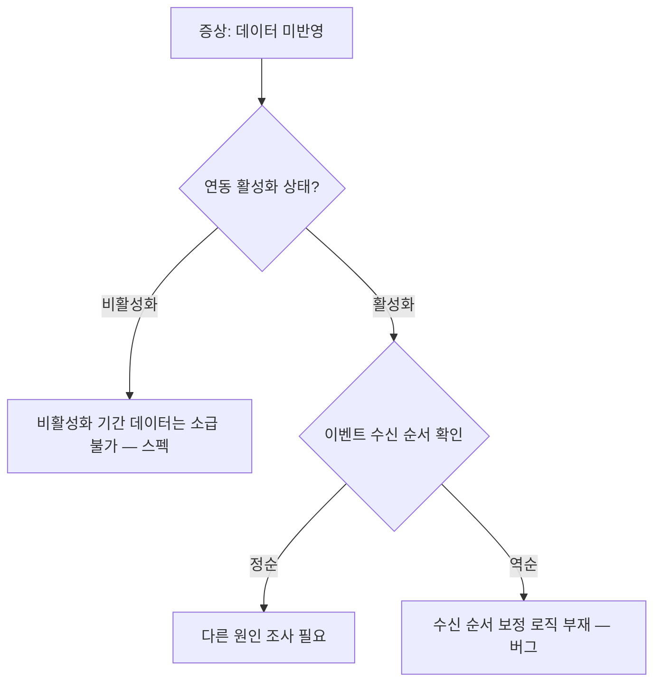
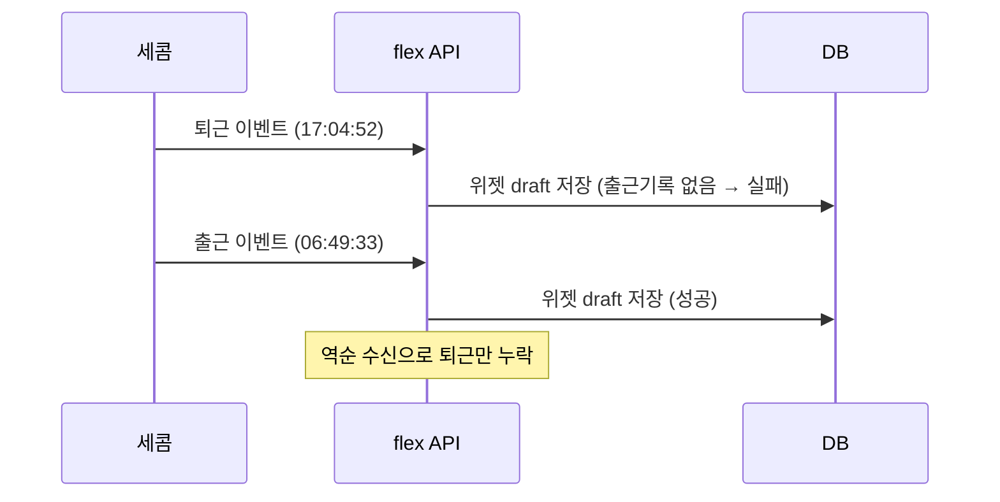

# Note Issue

## Purpose
Linear 티켓의 내용과 코멘트를 조회하여 operation-notes 문서를 생성하거나 업데이트한다.
**문서 작성/동기화에 집중**하며, 실제 조사는 `ops:investigate-issue`에서 수행한다.

- 새 티켓: Linear 내용을 바탕으로 operation-note 생성
- 기존 문서: Linear 최신 내용(새 코멘트, 상태 변경 등)과 동기화
- 해결된 티켓: 최종 기록 정리 + 스펙 확인/변경 건은 Gherkin 시나리오 작성

## 문서 작성 원칙 — 주니어 개발자가 읽는 문서
이 커맨드가 생성하는 문서는 **주니어 개발자가 맥락 없이 읽어도 이해할 수 있어야** 한다.

### 출처 표기 — 각주(footnote) 방식
모든 정보에는 어디서 가져온 것인지 출처를 **각주**로 표기한다.
본문의 가독성을 위해 출처 상세는 문서 하단 `## 각주` 섹션에 모은다.

```
✅ 좋은 예: 세콤 연동이 비활성화 상태였다[^1]
✅ 좋은 예: `SecomSyncService.syncAttendance()` 에서 활성화 여부를 체크한다[^2]

[^1]: Linear 코멘트 @담당자, 2024-01-15
[^2]: 코드: `flex-timetracking-backend` > secom-module/src/.../SecomSyncService.java:142

❌ 나쁜 예: 세콤 연동이 비활성화 상태였다
❌ 나쁜 예: 세콤 연동이 비활성화 상태였다 *(Linear 코멘트 @담당자, 2024-01-15)* ← 인라인 출처는 사용하지 않는다
```

**출처 유형별 각주 내용 형식:**
| 출처 유형 | 각주 내용 형식 |
|-----------|---------------|
| Linear 코멘트 | `[^n]: Linear 코멘트 @작성자, YYYY-MM-DD` |
| 코드 분석 | `[^n]: 코드: \`{repo}\` > {모듈}/{상대경로}:{라인}` |
| Slack 스레드 | `[^n]: Slack: #{채널} [스레드 링크]` |
| Metabase 쿼리 | `[^n]: Metabase: [쿼리 링크]` |
| 사용자 확인 | `[^n]: 사용자 확인, YYYY-MM-DD` |
| DB 데이터 | `[^n]: DB: {테이블명} WHERE {조건 요약}` |
| 연관 이슈 | `[^n]: [ticket-id](./ticket-id.md) 참고` |
| 출처 불명 | `[^n]: 출처 미확인` |

**각주 작성 규칙:**
- 각주 번호는 문서 전체에서 순차적으로 매긴다 (`[^1]`, `[^2]`, ...)
- 동일 출처를 여러 곳에서 참조하면 같은 각주 번호를 재사용한다
- 출처(근거)와 보충 설명을 모두 각주로 처리한다
  - **출처 각주**: `[^1]: Linear 코멘트 @담당자, 2024-01-15`
  - **보충 설명 각주**: `[^2]: Customer ID는 Linear에서 고객사를 식별하는 ID로, flex 내부의 company_id와 다르다`
- 각주는 문서 마지막 섹션(`## 각주`) 바로 위 또는 해당 섹션 안에 모은다

### 과정 기록
결론만 적지 않고, **어떤 단서에서 출발해서 어떻게 결론에 도달했는지** 과정을 남긴다.
과정 중 참조한 출처는 각주로 분리하여 본문 흐름을 유지한다.

```
✅ 좋은 예:
> 💡 **판단 근거**: Linear 코멘트에서 "1/10 비활성화, 1/15 재활성화" 언급 확인[^3]
> → `SecomSyncService.syncAttendance()`의 `isActive` 체크 로직 확인[^4]
> → 비활성화 기간의 데이터는 수신해도 저장하지 않는 구조
> → 따라서 1/10~1/15 데이터 미반영은 스펙에 의한 정상 동작

[^3]: Linear 코멘트 @홍길동, 2024-01-16
[^4]: 코드: secom-module/src/.../SecomSyncService.java:142 — `if (!setting.isActive()) return;`

❌ 나쁜 예: 비활성화 기간 데이터 미반영은 정상 동작이다.
```

### 용어 설명
도메인 특화 용어나 약어를 처음 사용할 때는 **각주**로 설명을 분리한다.
본문에 괄호로 설명을 넣으면 흐름이 끊기므로, 각주로 빼서 본문을 깔끔하게 유지한다.
```
✅ 좋은 예: Customer ID[^5]를 기준으로 조회했다
[^5]: Customer ID — Linear에서 고객사를 식별하는 ID. flex 내부의 company_id와는 다른 값이다.

✅ 좋은 예: dry-run[^6] 모드로 먼저 실행하여 확인했다
[^6]: dry-run — 실제 반영 없이 시뮬레이션만 수행하는 모드

❌ 나쁜 예: Customer ID(Linear에서 고객사를 식별하는 ID)를 기준으로 조회했다
```

### 문서 포맷팅 규칙

이 문서는 **작성자가 아닌 제3자가 읽는다**는 전제로 포맷한다.

#### 제목과 계층 구조
- **H1** (`#`): 티켓 ID + 제목 (문서당 1개)
- **H2** (`##`): 주요 섹션 (증상, 원인 분석, 해결, 참고 자료 등)
- **H3** (`###`): 섹션 내 소주제 (조사 과정, 데이터 확인 결과 등)
- **H4** (`####`): 세부 항목 (특정 API 결과, 코드 분석 등)
- 같은 레벨의 제목이 연속될 때는 제목만으로 내용을 구분할 수 있어야 한다

#### 시각 요소 사용 기준

| 상황 | 사용할 포맷 | 예시 |
|------|-----------|------|
| 구조화된 데이터 비교 | **테이블** | API 응답 비교, 필드별 값, 코드 위치 목록 |
| 시간순 사건 나열 | **번호 목록** | 1. 코멘트 → 2. 확인 → 3. 조치 |
| 핵심 발견/판단 근거 | **blockquote + 💡** | `> 💡 **판단 근거**: ...` |
| 주의/경고 사항 | **blockquote + ⚠️** | `> ⚠️ 10/17 데이터는 기간 외...` |
| 코드 로직 설명 | **코드 블록** | ```kotlin ... ``` |
| 단순 나열 | **불릿 목록** | - 항목1 - 항목2 |
| 분기가 있는 판단 흐름 | **mermaid flowchart** | 원인 추적 분기, 스펙 vs 버그 판별 |
| 시스템 간 데이터 흐름 | **mermaid sequence** | API 호출 순서, 연동 시스템 간 통신 |
| 상태 전이 | **mermaid stateDiagram** | 연동 상태 관리, 이슈 상태 변화 |

> mermaid 사용 기준: 단순 선형 흐름(A→B→C)은 번호 목록이나 화살표 텍스트가 더 간결하다. mermaid는 **분기·병렬·상호작용**이 있어 텍스트로 표현하면 복잡해지는 경우에만 사용한다.

#### mermaid 예시

**flowchart — 원인 추적 분기 (스펙 vs 버그 판별):**

> 사용 기준: 원인 추적에서 **2개 이상의 분기**가 발생하고, 각 분기의 결론이 다를 때 사용한다. 단순 선형 흐름(A→B→C)은 번호 목록이 더 간결하다.

**sequence — 시스템 간 데이터 흐름 (연동 장애 추적):**

> 사용 기준: **2개 이상 시스템 간** 메시지 교환이 있고, 순서가 문제의 핵심일 때 사용한다. 단일 시스템 내 처리는 코드 블록이나 번호 목록이 적합하다.

#### 테이블 작성 규칙
- **헤더 행 필수**: 각 컬럼이 무엇을 나타내는지 명확히
- **비고 컬럼 활용**: 값만으로 의미를 알기 어려우면 비고에 계산 근거나 해석을 덧붙인다
- **이상값 강조**: 문제가 되는 값은 **굵게** 표시하고, 정상이라면 어떤 값이어야 하는지 `(정상: X)` 형태로 병기
- **행이 5개 이상이면 요약 행** 추가: 합계, 핵심 결론 등

#### 데이터/로그 기록 규칙
사용자가 제공한 원시 데이터(SQL 결과, 로그, API 응답 등)를 문서에 기록할 때:
1. **요약 문장 선행**: 데이터 블록 앞에 "이 데이터가 보여주는 것"을 1-2줄로 먼저 서술
2. **컬럼/필드 설명**: 도메인 지식이 없으면 이해하기 어려운 필드에 설명 추가
3. **정상값 대비**: 이상 데이터 옆에 정상이면 어떤 값이어야 하는지 명시
4. **핵심 행 하이라이트**: 원인 파악에 결정적인 행을 **굵게** 또는 ⚠️로 강조
5. **시간순 정렬**: 여러 이벤트가 있으면 시간순으로 나열하여 사건 흐름 재구성

#### 긴 문서의 가독성
- **섹션 간 구분선** (`---`): 주요 섹션 전환 시 사용하여 시각적 구분
- **핵심 결론은 섹션 상단에**: 상세 분석 전에 결론을 먼저 제시하고, 아래에서 근거를 전개
- **코드 분석 결과**: 코드 블록과 설명을 분리하지 않고, 코드 블록 바로 아래에 해석을 붙인다

## Input
$ARGUMENTS

### Argument Resolution
- `$ARGUMENTS`가 비어있거나 티켓 ID 패턴(`[A-Z]+-\d+`, 예: CI-3861)이 없으면:
  1. 현재 git 브랜치명에서 티켓 ID 패턴을 추출 시도 (예: `fix/CI-3861-some-desc` → `CI-3861`)
  2. 브랜치에서 못 찾으면 현재 디렉토리명에서 추출 시도
  3. 찾은 경우: 사용자에게 `"티켓 ID를 {추출한ID}로 인식했습니다. 맞습니까?"` 확인 후 진행
  4. 못 찾은 경우: `"티켓 ID를 특정할 수 없습니다. 티켓 ID를 인자로 전달해주세요. (예: /ops:note-issue CI-3861)"` 출력 후 **즉시 종료**

### Branch Naming
worktree나 브랜치를 생성할 때 **`ops/{ticket-id}`** 를 브랜치명으로 사용한다. (예: `ops/CI-3861`)
이슈 번호가 브랜치명에 포함되어야 나중에 worktree 정리 시 어떤 이슈의 작업인지 식별할 수 있다.

## Operation Notes Directory Resolution

operation-notes 파일을 저장할 디렉토리를 아래 우선순위로 결정한다.
**스킬 실행 시작 시 한 번만 해석하고, 이후 모든 경로에 동일하게 적용한다.**

| 우선순위 | 경로 | 설명 |
|---------|------|------|
| 1 | `{repo-root}/operation-notes/` | repo 루트에 operation-notes 디렉토리가 존재 |
| 2 | `{repo-root}/.claude/operation-notes/` | .claude 하위에 존재 |
| 3 | `~/.claude/operation-notes/` | 글로벌 홈 디렉토리에 존재 |

- 디렉토리 **존재 여부**로 판단한다 (파일이 아닌 디렉토리).
- 셋 다 존재하지 않으면 사용자에게 `"operation-notes 디렉토리를 찾을 수 없습니다. 어디에 저장할까요?"` 로 물어본다.
- 해석된 경로를 이하 `{notes-dir}`로 표기한다.

### Note File Resolution

`{ticket-id}.md` 파일을 찾을 때 아래 순서로 탐색한다:
1. `{notes-dir}/{ticket-id}.md` (active — 진행 중)
2. `{notes-dir}/archive/{ticket-id}.md` (archive — 해결 완료)

- 파일을 **새로 생성**할 때는 항상 `{notes-dir}/` (루트)에 생성한다.
- 이슈가 **해결 완료**되면 `{notes-dir}/archive/`로 이동한다.
- 상대 링크 규칙:
  - 루트 → archive: `./archive/{ticket-id}.md`
  - archive → 루트: `../{ticket-id}.md`
  - archive → archive: `./{ticket-id}.md`

## Procedure

### Step 1-2: 데이터 수집 (🔀 병렬 처리)

아래 두 작업을 **subagent로 병렬 실행**한다:

| Agent | 작업 | 상세 |
|-------|------|------|
| 🤖 Agent A | **Linear 이슈 정보 수집** | MCP CLI로 이슈 + 코멘트 조회 |
| 🤖 Agent B | **연관 이슈 탐색** | operation-notes 전체 스캔 |

**Agent A: 티켓 정보 수집**
MCP CLI를 사용하여 Linear 이슈 정보를 수집한다. **반드시 `mcp-cli info`로 스키마를 먼저 확인한 후 호출한다.**

1. `mcp-cli call linear/get_issue`로 티켓 상세 정보 조회 (includeRelations: true)
2. `mcp-cli call linear/list_comments`로 코멘트 전체 조회

수집할 정보:
- 티켓 제목, 설명, 상태, 라벨
- 회사명, Customer ID, 문의자 이메일, 대상 구성원
- 담당자 (assignee)
- 코멘트 내용 (시간순 정렬)
- 첨부파일, 관련 링크

**Agent B: 연관 이슈 탐색**
기존 operation-notes에서 현재 이슈와 연관된 문서를 탐색한다.

1. `{notes-dir}/` 루트의 active 노트만 전체 스캔한다. archive 노트는 `{notes-dir}/INDEX.md`에서 키워드로 연관 문서를 찾아 필요한 것만 `{notes-dir}/archive/`에서 읽는다. (CLAUDE.md 제외)
2. 다음 기준으로 연관성을 판단한다:
   - **동일 회사/Customer ID**: 같은 고객의 이전 문의
   - **동일 기능 영역**: 같은 기능(예: 세콤연동, 근태, 급여 등)에 대한 이슈
   - **유사 증상/키워드**: 제목이나 증상 설명에서 공통 키워드
   - **동일 라벨**: Linear 이슈 라벨이 일치
3. 연관 이슈 목록을 저장 (Step 3, Step 4에서 사용)

### Step 3: 문서 생성 또는 업데이트
`{notes-dir}/{ticket-id}.md` 파일을 확인한다.

**문서가 이미 존재하는 경우 (업데이트 모드):**
- 기존 문서를 읽어서 현재 내용을 파악
- Step 1에서 수집한 Linear 최신 정보와 비교
- 변경/추가된 내용이 있으면 기존 문서에 반영:
  - 상태가 변경되었으면 상태 표기 업데이트 (예: 진행 중 → 해결 완료 시 템플릿 구조 변환)
  - 새 코멘트에서 추가 정보 추출하여 해당 섹션에 추가
  - 미결 사항 중 해결된 항목이 있으면 체크 표시
  - 연관 이슈 섹션 업데이트
- **⚠️ `investigate-issue`가 추가한 섹션(해결안/조사 방향, 참고 자료 등)은 건드리지 않는다**
- 변경 사항이 없으면 사용자에게 "변경 사항 없음"을 알리고 종료

**문서가 없는 경우 (신규 생성):**
이슈 상태에 맞는 템플릿으로 작성한다.

#### 해결 완료 템플릿
```markdown
# {ticket-id}: {제목 요약}

## 증상
- **회사**: {회사명} (Customer ID: {id})
- **문의자**: {이메일}
- **대상 구성원**: {있으면 기재}
- 문의 내용:
  1. {핵심 문의 사항 나열}

## 원인 분석

### 조사 과정
> 💡 {어떤 단서에서 출발해서 어떤 코드/데이터를 확인하여 이 결론에 도달했는지 단계별로 기술}
> → {확인한 것 1}[^n]
> → {확인한 것 2}[^n]
> → {결론}

### 원인
- {원인 정보}[^n]

## 해결
- {해결 내용}[^n]
- 관련 PR/커밋 링크 (있으면)

## 다음에 같은 문의가 오면
{조사·해결 과정을 모르는 제3자가 유사 문의를 받았을 때, 이 섹션만 읽고 빠르게 대응할 수 있도록 한다.}

1. **먼저 확인**: {가장 먼저 봐야 할 데이터/설정/로그 — 구체적 확인 방법 포함}
2. **원인 판별**: {확인 결과에 따른 분기 — "X이면 A, Y이면 B"}
3. **조치**: {각 원인별 해결 방법 — SQL, 설정 변경, 코드 수정 등}

## 시나리오
{스펙 확인 또는 스펙 변경 건일 때만 작성. 아래 Step 4 참고.}

## 연관 이슈
- [{관련-ticket-id}](./{관련-ticket-id}.md): {연관 이유 한 줄 요약}
{연관 이슈가 없으면 이 섹션 생략}

## 비고
### 참고 자료
- {조사 과정에서 수집된 링크: Slack 스레드, Metabase 쿼리, 관련 코드 위치 등}

### 재발 방지 / 향후 참고
- 동일 유형 문의 시 확인 포인트
- 로그 확인 방법 등 실무 가이드

## 각주
[^1]: {출처 또는 보충 설명}
[^2]: {출처 또는 보충 설명}
```

#### 진행 중 / 미착수 템플릿
```markdown
# {ticket-id}: {제목 요약}

> **상태**: {진행 중 | 미착수} — {마지막 업데이트 날짜}

## 증상
- **회사**: {회사명} (Customer ID: {id})
- **문의자**: {이메일}
- **대상 구성원**: {있으면 기재}
- 문의 내용:
  1. {핵심 문의 사항 나열}

## 현재까지 파악된 내용
- {정보}[^n]

{investigate-issue를 통해 조사가 진행되면 이 섹션 아래에 조사 과정이 추가됨}

## 연관 이슈
- [{관련-ticket-id}](./{관련-ticket-id}.md): {연관 이유 한 줄 요약}
{연관 이슈가 없으면 이 섹션 생략}

## 참고 자료
- {Linear 코멘트, Slack 스레드, 관련 코드 위치 등 조사에 활용 가능한 링크}

## 미결 사항
- [ ] {아직 확인되지 않은 항목}

## 각주
[^1]: {출처 또는 보충 설명}
```

### Step 4: Gherkin 시나리오 작성 (해결 완료 시)
이슈가 **해결 완료** 상태이고, investigation 결과가 아래 중 하나에 해당하면 Gherkin 시나리오를 작성한다.

**작성 조건:**
- **스펙 확인**: 문의된 동작이 의도된 스펙임이 확인된 경우 → 정상 동작을 시나리오로 문서화
- **스펙 변경/버그 수정**: 코드 수정이 이루어졌거나 예정된 경우 → 변경 후 기대 동작을 시나리오로 문서화

해당 사항이 없으면 (단순 데이터 수정, 설정 변경 등) 이 스텝을 스킵한다.

**Gherkin 작성 규칙:**
- `# language: ko` 헤더를 사용하여 한국어 키워드로 작성
- 기능(Feature)명은 해당 기능 영역으로 설정
- 시나리오명은 이슈의 핵심 상황을 구체적으로 기술
- 전제 조건(`주어진`), 동작(`만약`), 기대 결과(`그러면`)를 명확히 분리
- 하나의 이슈에서 여러 시나리오가 도출될 수 있음

**작성 예시 (스펙 확인):**
```gherkin
# language: ko
기능: 세콤 연동 활성화 상태 관리

  시나리오: 관리자가 세콤 연동을 비활성화한 상태에서 수동 동기화 시도
    주어진 회사의 세콤 연동이 비활성화 상태이다
    그리고 비활성화 기간 중 세콤에서 출퇴근 데이터가 전송되었다
    만약 관리자가 세콤 연동을 다시 활성화한다
    그러면 비활성화 기간의 데이터는 소급 반영되지 않는다
    그리고 활성화 이후 전송되는 데이터만 반영된다
```

**작성 예시 (스펙 변경/버그 수정):**
```gherkin
# language: ko
기능: 세콤 출퇴근 이벤트 수신 순서 처리

  시나리오: 세콤에서 퇴근 이벤트가 출근보다 먼저 수신될 때
    주어진 구성원의 세콤 연동이 활성화되어 있다
    그리고 해당 일자에 출근 기록이 아직 없다
    만약 세콤에서 퇴근 이벤트가 출근 이벤트보다 먼저 수신된다
    그러면 수신 순서를 시간 기준으로 보정하여 처리한다
    그리고 출근과 퇴근이 모두 정상 반영된다
```

작성한 시나리오를 operation-note의 **"## 시나리오"** 섹션에 기록한다.

### Step 4-1: 문서 검토 (🤖 검토 에이전트)
문서 생성/업데이트 후 **별도 subagent로 문서 검토**를 수행한다. 아래 체크리스트를 순서대로 검증하고, 위반 사항은 자동으로 수정한다.

**검토 체크리스트:**

#### A. 출처 표기 — 각주 (전수 검사)
- [ ] 모든 사실 정보에 각주(`[^n]`)가 달려 있는가? (출처 없는 사실 문장이 있으면 위반)
- [ ] 인라인 출처(`*(출처)*`)가 남아있지 않은가? → 모두 각주로 변환
- [ ] 각주 정의(`[^n]: ...`)가 문서 하단 `## 각주` 섹션에 모여 있는가?
- [ ] 각주 내용 형식이 올바른가?
  - Linear 코멘트: `[^n]: Linear 코멘트 @작성자, YYYY-MM-DD`
  - 코드 분석: `` [^n]: 코드: `{repo}` > {모듈}/{상대경로}:{라인} ``
  - Slack: `[^n]: Slack: #{채널} [스레드 링크]`
  - DB: `[^n]: DB: {테이블명} WHERE {조건 요약}`
  - 사용자 확인: `[^n]: 사용자 확인, YYYY-MM-DD`
  - 출처 불명: `[^n]: 출처 미확인`
- [ ] 동일 출처를 참조하는 곳이 같은 각주 번호를 사용하는가? (중복 각주 방지)
- [ ] 보충 설명(용어 정의, 배경 지식)도 각주로 분리되어 있는가?
- [ ] 코드 위치를 언급할 때 `파일경로:라인` 형태인가?

#### B. 과정 기록
- [ ] 결론만 있고 과정이 빠진 섹션이 없는가?
- [ ] 판단 근거(`> 💡 **판단 근거**: ...`)가 단서 → 확인 → 결론의 체인으로 작성되어 있는가?

#### C. 용어 설명
- [ ] 도메인 특화 용어/약어를 처음 사용할 때 설명이 있는가?

#### D. 문서 포맷팅
- [ ] H1~H4 계층 구조가 올바른가? (H1은 문서당 1개)
- [ ] 시각 요소 사용 기준에 맞는 포맷을 사용하고 있는가?
  - 구조화된 데이터 비교 → 테이블
  - 시간순 나열 → 번호 목록
  - 핵심 발견/판단 → blockquote + 💡
  - 분기가 있는 판단 흐름 → mermaid flowchart (텍스트로 표현하면 복잡한 경우만)
- [ ] 테이블에 헤더 행이 있는가?
- [ ] 이상값이 **굵게** 표시되고 정상값이 병기되어 있는가?
- [ ] 데이터/로그 블록 앞에 요약 문장이 있는가?

#### E. 섹션 완전성
- [ ] 이슈 상태에 맞는 필수 섹션이 모두 존재하는가?
  - 해결 완료: 증상, 원인 분석(조사 과정 포함), 해결, 다음에 같은 문의가 오면
  - 진행 중: 증상, 현재까지 파악된 내용, 미결 사항
- [ ] 연관 이슈가 있으면 연관 이슈 섹션이 있는가?

### Step 5: 연관 이슈 문서에 역방향 링크 추가
Step 2에서 찾은 연관 이슈의 문서에도 현재 이슈로의 링크를 추가한다.

- 각 연관 이슈 문서를 읽어서 "연관 이슈" 섹션이 있는지 확인
- **섹션이 있는 경우**: 현재 이슈가 이미 링크되어 있지 않으면 항목 추가
- **섹션이 없는 경우**: "## 비고" 또는 "## 미결 사항" 바로 위에 "## 연관 이슈" 섹션을 삽입
- 이미 링크가 있으면 스킵 (중복 방지)
- **상대 링크는 Note File Resolution의 규칙에 따라 작성한다:**
  - 현재 노트가 루트, 대상이 archive: `./archive/{ticket-id}.md`
  - 현재 노트가 archive, 대상이 루트: `../{ticket-id}.md`
  - 둘 다 같은 디렉토리: `./{ticket-id}.md`

### Step 6: 결과 보고
- 생성/업데이트된 파일 경로를 보고
- 핵심 내용 3줄 요약 제공
- 연관 이슈가 있으면 목록 보고
- 업데이트 모드였으면 변경된 내용 요약
- Gherkin 시나리오를 작성했으면 시나리오 내용을 함께 보고하고, 시나리오 테스트 추가를 안내
- **인덱스 업데이트**: `ops:update-index {ticket-id}` 를 실행하여 INDEX.md에 이 노트를 등록한다
- 조사가 필요하면 → `ops:investigate-issue {ticket-id}` 안내
- 코드 수정이 필요하면 → `ops:fix-issue {ticket-id}` 안내
- 쿡북 업데이트가 필요해 보이면 → `ops:update-cookbook {ticket-id}` 안내
  - 새로운 진단 패턴, DB 쿼리 템플릿, 코드 진입점이 발견된 경우
  - 이슈가 해결 완료되어 "다음에 같은 문의가 오면" 섹션이 작성된 경우

## 근로기준법 참고 가이드

이슈가 **근태/근무/휴가** 라벨이거나, 아래 키워드와 관련된 경우 **관련 근로기준법 조항을 조사**하여 문서의 "## 관련 법령" 섹션에 기록한다.

**대상 키워드**: 휴일대체, 보상휴가, 연차, 주휴일, 공휴일, 연장근로, 야간근로, 휴일근로, 소정근로시간, 근로시간, 휴게시간, 교대근무

**기록할 내용:**
- 관련 조항 (예: 근로기준법 제55조, 시행령 제30조)
- 조항의 핵심 내용 인용
- flex 시스템 기본값과 법령의 대응 관계 (있으면)
- 출처 링크 (국가법령정보센터 등)

**핵심 원칙:**
> 근로기준법은 **근로자 보호법**이다. 따라서:
> - 근로자에게 **유리한** 방향의 스펙 변경 → 법적 리스크 낮음
> - 근로자에게 **불리한** 방향의 스펙 변경 → 법적 리스크 높음, 노사 합의 필요 여부 확인
>
> 해결 방향을 기록할 때 각 옵션이 근로자에게 유리/불리한지 표기한다.

## Rules
- 코멘트에 이미지 URL이 있으면 참고용으로 언급하되, 문서에 직접 임베드하지 않는다.
- 코멘트가 충분하지 않아 정보가 부족하면 사용자에게 알린다.
- 문서는 **한국어**로 작성한다.
- bot이 생성한 동기화 코멘트(예: "This comment thread is synced to...")는 무시한다.
- 연관 이슈 링크는 Note File Resolution의 상대 링크 규칙에 따라 대상 파일 위치에 맞는 경로를 사용한다.
- 연관 이슈 판단 시 억지로 연결하지 않는다. 실제로 유의미한 연관이 있을 때만 링크한다.
- 역방향 링크 추가 시 기존 문서의 다른 내용은 변경하지 않는다.
- **해결안 도출이나 조사 방향 제안은 이 커맨드의 역할이 아니다** — 조사는 `ops:investigate-issue`에서 수행.
- 업데이트 모드에서 `investigate-issue`가 작성한 섹션(해결안/조사 방향, 참고 자료)은 수정하지 않는다.
- **출처 표기 필수 (각주 방식)**: 모든 사실 정보에 각주(`[^n]`)로 출처를 표기한다 (위 "문서 작성 원칙" 참고). 출처가 불분명한 정보는 `[^n]: 출처 미확인`으로 표기한다. 인라인 출처(`*(출처)*`)는 사용하지 않는다.
- **보충 설명도 각주로**: 도메인 용어, 배경 지식 등 본문 흐름을 끊는 설명은 각주로 분리한다.
- **과정 기록**: 코멘트에서 정보를 추출할 때 단순 복사가 아니라, 어떤 코멘트의 어떤 맥락에서 추출했는지 각주로 출처를 남긴다.
