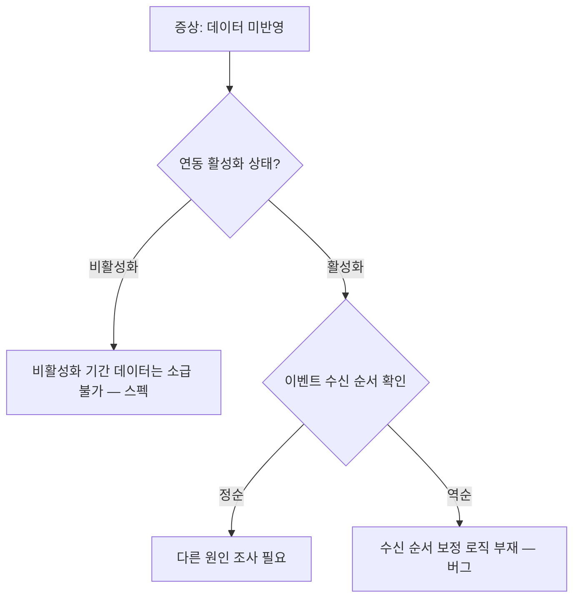
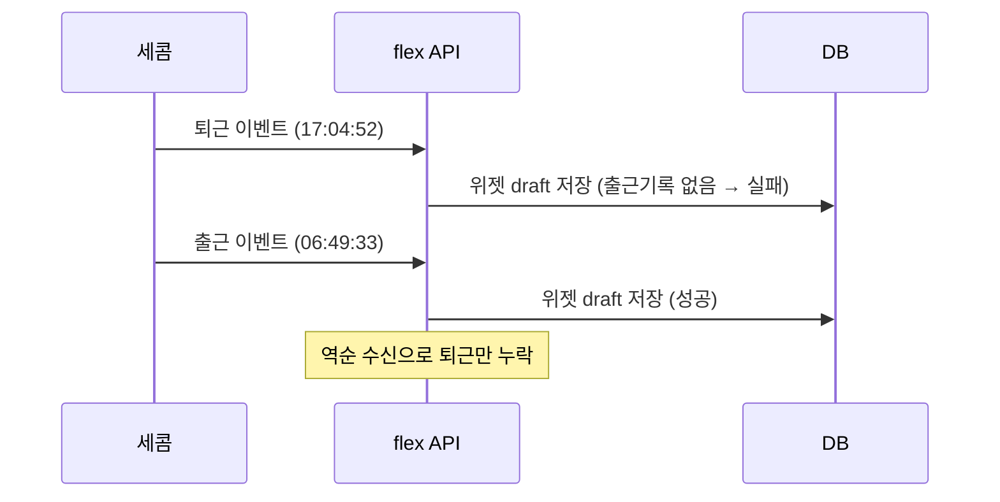

# Operation Note 문서 작성 가이드

이 문서는 operation-notes 문서를 작성할 때 공통으로 적용되는 규칙을 정의한다.
`note-issue`, `investigate-issue`, `fix-issue`, `close-note`, `maintain-notes` 등 모든 ops 커맨드가 이 가이드를 참조한다.

---

## 문서 작성 원칙 — 주니어 개발자가 읽는 문서
operation-note는 **주니어 개발자가 맥락 없이 읽어도 이해할 수 있어야** 한다.

### 출처 표기 — 각주(footnote) 방식
모든 정보에는 어디서 가져온 것인지 출처를 **각주**로 표기한다.
본문의 가독성을 위해 출처 상세는 문서 하단 `## 각주` 섹션에 모은다.

```
✅ 좋은 예: 세콤 연동이 비활성화 상태였다[^1]
✅ 좋은 예: `SecomSyncService.syncAttendance()` 에서 활성화 여부를 체크한다[^2]

[^1]: Linear 코멘트 @담당자, 2024-01-15
[^2]: 코드: `flex-timetracking-backend` > secom-module/src/.../SecomSyncService.java:142

❌ 나쁜 예: 세콤 연동이 비활성화 상태였다
❌ 나쁜 예: 세콤 연동이 비활성화 상태였다 *(Linear 코멘트 @담당자, 2024-01-15)* ← 인라인 출처는 사용하지 않는다
```

**출처 유형별 각주 내용 형식:**
| 출처 유형 | 각주 내용 형식 |
|-----------|---------------|
| Linear 코멘트 | `[^n]: Linear 코멘트 @작성자, YYYY-MM-DD` |
| 코드 분석 | `[^n]: 코드: \`{repo}\` > {모듈}/{상대경로}:{라인}` |
| PR | `[^n]: [PR #{번호}](https://github.com/flex-team/{repo}/pull/{번호}) — {제목 요약}` |
| 커밋 | `[^n]: [커밋 \`{해시7자}\`](https://github.com/flex-team/{repo}/commit/{풀해시}) — {메시지 요약}` |
| Slack 스레드 | `[^n]: Slack: #{채널} [스레드 링크]` |
| Metabase 쿼리 | `[^n]: Metabase: [쿼리 링크]` |
| 사용자 확인 | `[^n]: 사용자 확인, YYYY-MM-DD` |
| DB 데이터 | `[^n]: DB: {테이블명} WHERE {조건 요약}` |
| 연관 이슈 | `[^n]: [ticket-id](./ticket-id.md) 참고` |
| 출처 불명 | `[^n]: 출처 미확인` |

> **PR/커밋 참조 시 반드시 GitHub 링크를 포함한다.** 해시나 번호만 적으면 클릭해서 확인할 수 없다.

**각주 작성 규칙:**
- 각주 번호는 문서 전체에서 순차적으로 매긴다 (`[^1]`, `[^2]`, ...)
- 동일 출처를 여러 곳에서 참조하면 같은 각주 번호를 재사용한다
- 출처(근거)와 보충 설명을 모두 각주로 처리한다
  - **출처 각주**: `[^1]: Linear 코멘트 @담당자, 2024-01-15`
  - **보충 설명 각주**: `[^2]: Customer ID는 Linear에서 고객사를 식별하는 ID로, flex 내부의 company_id와 다르다`
- 각주는 문서 마지막 섹션(`## 각주`) 바로 위 또는 해당 섹션 안에 모은다

### 과정 기록
결론만 적지 않고, **어떤 단서에서 출발해서 어떻게 결론에 도달했는지** 과정을 남긴다.
과정 중 참조한 출처는 각주로 분리하여 본문 흐름을 유지한다.

```
✅ 좋은 예:
> 💡 **판단 근거**: Linear 코멘트에서 "1/10 비활성화, 1/15 재활성화" 언급 확인[^3]
> → `SecomSyncService.syncAttendance()`의 `isActive` 체크 로직 확인[^4]
> → 비활성화 기간의 데이터는 수신해도 저장하지 않는 구조
> → 따라서 1/10~1/15 데이터 미반영은 스펙에 의한 정상 동작

[^3]: Linear 코멘트 @홍길동, 2024-01-16
[^4]: 코드: secom-module/src/.../SecomSyncService.java:142 — `if (!setting.isActive()) return;`

❌ 나쁜 예: 비활성화 기간 데이터 미반영은 정상 동작이다.
```

### 용어 설명
도메인 특화 용어나 약어를 처음 사용할 때는 **각주**로 설명을 분리한다.
본문에 괄호로 설명을 넣으면 흐름이 끊기므로, 각주로 빼서 본문을 깔끔하게 유지한다.
```
✅ 좋은 예: Customer ID[^5]를 기준으로 조회했다
[^5]: Customer ID — Linear에서 고객사를 식별하는 ID. flex 내부의 company_id와는 다른 값이다.

✅ 좋은 예: dry-run[^6] 모드로 먼저 실행하여 확인했다
[^6]: dry-run — 실제 반영 없이 시뮬레이션만 수행하는 모드

❌ 나쁜 예: Customer ID(Linear에서 고객사를 식별하는 ID)를 기준으로 조회했다
```

---

## 문서 포맷팅 규칙

이 문서는 **작성자가 아닌 제3자가 읽는다**는 전제로 포맷한다.

### 제목과 계층 구조
- **H1** (`#`): 티켓 ID + 제목 (문서당 1개)
- **H2** (`##`): 주요 섹션 (증상, 원인 분석, 해결, 참고 자료 등)
- **H3** (`###`): 섹션 내 소주제 (조사 과정, 데이터 확인 결과 등)
- **H4** (`####`): 세부 항목 (특정 API 결과, 코드 분석 등)
- 같은 레벨의 제목이 연속될 때는 제목만으로 내용을 구분할 수 있어야 한다

### 시각 요소 사용 기준

| 상황 | 사용할 포맷 | 예시 |
|------|-----------|------|
| 구조화된 데이터 비교 | **테이블** | API 응답 비교, 필드별 값, 코드 위치 목록 |
| 시간순 사건 나열 | **번호 목록** | 1. 코멘트 → 2. 확인 → 3. 조치 |
| 핵심 발견/판단 근거 | **blockquote + 💡** | `> 💡 **판단 근거**: ...` |
| 주의/경고 사항 | **blockquote + ⚠️** | `> ⚠️ 10/17 데이터는 기간 외...` |
| 코드 로직 설명 | **코드 블록** | ```kotlin ... ``` |
| 단순 나열 | **불릿 목록** | - 항목1 - 항목2 |
| 분기가 있는 판단 흐름 | **mermaid flowchart** | 원인 추적 분기, 스펙 vs 버그 판별 |
| 시스템 간 데이터 흐름 | **mermaid sequence** | API 호출 순서, 연동 시스템 간 통신 |
| 상태 전이 | **mermaid stateDiagram** | 연동 상태 관리, 이슈 상태 변화 |

> mermaid 사용 기준: 단순 선형 흐름(A→B→C)은 번호 목록이나 화살표 텍스트가 더 간결하다. mermaid는 **분기·병렬·상호작용**이 있어 텍스트로 표현하면 복잡해지는 경우에만 사용한다.

### mermaid 예시

**flowchart — 원인 추적 분기 (스펙 vs 버그 판별):**

> 사용 기준: 원인 추적에서 **2개 이상의 분기**가 발생하고, 각 분기의 결론이 다를 때 사용한다. 단순 선형 흐름(A→B→C)은 번호 목록이 더 간결하다.

**sequence — 시스템 간 데이터 흐름 (연동 장애 추적):**

> 사용 기준: **2개 이상 시스템 간** 메시지 교환이 있고, 순서가 문제의 핵심일 때 사용한다. 단일 시스템 내 처리는 코드 블록이나 번호 목록이 적합하다.

### 테이블 작성 규칙
- **헤더 행 필수**: 각 컬럼이 무엇을 나타내는지 명확히
- **비고 컬럼 활용**: 값만으로 의미를 알기 어려우면 비고에 계산 근거나 해석을 덧붙인다
- **이상값 강조**: 문제가 되는 값은 **굵게** 표시하고, 정상이라면 어떤 값이어야 하는지 `(정상: X)` 형태로 병기
- **행이 5개 이상이면 요약 행** 추가: 합계, 핵심 결론 등

### 데이터/로그 기록 규칙
사용자가 제공한 원시 데이터(SQL 결과, 로그, API 응답 등)를 문서에 기록할 때:
1. **요약 문장 선행**: 데이터 블록 앞에 "이 데이터가 보여주는 것"을 1-2줄로 먼저 서술
2. **컬럼/필드 설명**: 도메인 지식이 없으면 이해하기 어려운 필드에 설명 추가
3. **정상값 대비**: 이상 데이터 옆에 정상이면 어떤 값이어야 하는지 명시
4. **핵심 행 하이라이트**: 원인 파악에 결정적인 행을 **굵게** 또는 ⚠️로 강조
5. **시간순 정렬**: 여러 이벤트가 있으면 시간순으로 나열하여 사건 흐름 재구성

### 긴 문서의 가독성
- **섹션 간 구분선** (`---`): 주요 섹션 전환 시 사용하여 시각적 구분
- **핵심 결론은 섹션 상단에**: 상세 분석 전에 결론을 먼저 제시하고, 아래에서 근거를 전개
- **코드 분석 결과**: 코드 블록과 설명을 분리하지 않고, 코드 블록 바로 아래에 해석을 붙인다

---

## 문서 검토 체크리스트

문서 생성/업데이트 후 아래 체크리스트로 검증한다. 위반 사항은 자동으로 수정한다.

### A. 출처 표기 — 각주 (전수 검사)
- [ ] 모든 사실 정보에 각주(`[^n]`)가 달려 있는가? (출처 없는 사실 문장이 있으면 위반)
- [ ] 인라인 출처(`*(출처)*`)가 남아있지 않은가? → 모두 각주로 변환
- [ ] 각주 정의(`[^n]: ...`)가 문서 하단 `## 각주` 섹션에 모여 있는가?
- [ ] 각주 내용 형식이 올바른가?
  - Linear 코멘트: `[^n]: Linear 코멘트 @작성자, YYYY-MM-DD`
  - 코드 분석: `` [^n]: 코드: `{repo}` > {모듈}/{상대경로}:{라인} ``
  - Slack: `[^n]: Slack: #{채널} [스레드 링크]`
  - DB: `[^n]: DB: {테이블명} WHERE {조건 요약}`
  - 사용자 확인: `[^n]: 사용자 확인, YYYY-MM-DD`
  - 출처 불명: `[^n]: 출처 미확인`
- [ ] 동일 출처를 참조하는 곳이 같은 각주 번호를 사용하는가? (중복 각주 방지)
- [ ] 보충 설명(용어 정의, 배경 지식)도 각주로 분리되어 있는가?
- [ ] 코드 위치를 언급할 때 `파일경로:라인` 형태인가?

### B. 과정 기록
- [ ] 결론만 있고 과정이 빠진 섹션이 없는가?
- [ ] 판단 근거(`> 💡 **판단 근거**: ...`)가 단서 → 확인 → 결론의 체인으로 작성되어 있는가?

### C. 용어 설명
- [ ] 도메인 특화 용어/약어를 처음 사용할 때 설명이 있는가?

### D. 문서 포맷팅
- [ ] H1~H4 계층 구조가 올바른가? (H1은 문서당 1개)
- [ ] 시각 요소 사용 기준에 맞는 포맷을 사용하고 있는가?
  - 구조화된 데이터 비교 → 테이블
  - 시간순 나열 → 번호 목록
  - 핵심 발견/판단 → blockquote + 💡
  - 분기가 있는 판단 흐름 → mermaid flowchart (텍스트로 표현하면 복잡한 경우만)
- [ ] 테이블에 헤더 행이 있는가?
- [ ] 이상값이 **굵게** 표시되고 정상값이 병기되어 있는가?
- [ ] 데이터/로그 블록 앞에 요약 문장이 있는가?

### E. 섹션 완전성
- [ ] 이슈 상태에 맞는 필수 섹션이 모두 존재하는가?
  - 해결 완료: 증상, 문제 평가, 원인 분석(조사 과정 포함), 해결, 다음에 같은 문의가 오면
  - 해결 완료 + 버그: 위 항목 + 영향 분석, 해결안 (verdict가 bug일 때)
  - 진행 중: 증상, 현재까지 파악된 내용, 미결 사항
  - 평가 완료: 증상, 문제 평가 (assess까지만 진행된 경우)
  > ⚠️ `문제 평가`, `영향 분석`, `해결안` 섹션은 파이프라인 v1(2026-04-09) 이후 생성된 노트에만 적용. 기존 아카이브 노트에는 이 섹션이 없는 것이 정상.
- [ ] 연관 이슈가 있으면 연관 이슈 섹션이 있는가?
