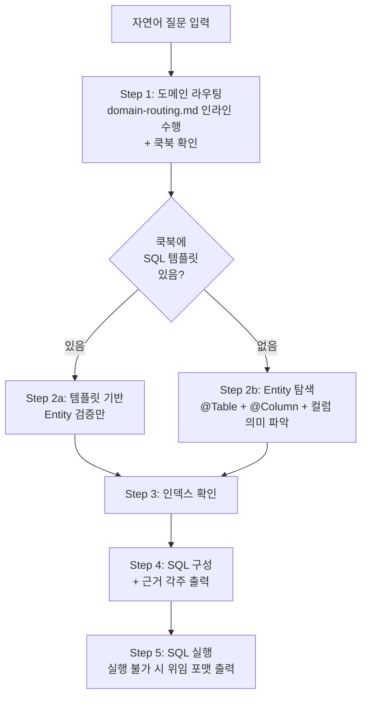

# DB Query Builder

## Purpose

자연어 질문을 받아 **근거 있는 SQL 쿼리**를 구성하는 오케스트레이터 스킬.
테이블명/컬럼명을 절대 추측하지 않고, 기존 지식(도메인맵 → 쿡북 → Entity → 인덱스)을 순서대로 탐색한다.

- SQL 쿼리를 구성하고, env를 결정한 뒤 **직접 실행까지 수행**한다.
- 결과와 근거 각주를 함께 출력한다.

## Input

$ARGUMENTS

### Argument Resolution

- `$ARGUMENTS` 가 자연어 질문이면 그대로 사용
- `$ARGUMENTS` 가 비어있으면:
  1. 현재 대화 세션에서 쿼리 의도를 추출 시도
  2. 못 찾으면 `"어떤 데이터를 조회하고 싶은지 알려주세요. (예: /ops-db-query-builder 특정 회사의 사번 보유 구성원 수)"` 출력 후 **즉시 종료**
- 질문이 너무 모호하면 (예: "데이터 좀 봐줘") → 구체적으로 어떤 데이터인지 사용자에게 질문 후 **즉시 종료**
- 복수 질문이 한 번에 들어오면 → 하나씩 순차 처리

## Execution



### Step 1. 도메인 라우팅 + 쿡북 확인

> **공통 가이드**: `domain-routing.md` 를 반드시 읽고 수행한다.
> ```
> Read: .claude/skills/ops-common/domain-routing.md
> ```
> 매칭 알고리즘(Step 1~5), 가중치 테이블, 동점 처리, 결과 구조가 모두 해당 파일에 정의되어 있다.

**수행 순서:**

1. `brain/domain-map.ttl` 을 Read로 전체 읽기
2. `domain-routing.md` 의 Step 1~5를 순서대로 수행 (domain-map.ttl의 Domain/Note/Glossary 블록 모두 활용)
3. 라우팅 결과에서 다음을 추출:
   - `repos`: 대상 서브모듈 목록
   - `modules`: 코드 내 모듈 경로 (`d:mod`)
   - `cookbook`: COOKBOOK.md 섹션 이름

4. `brain/COOKBOOK.md` 에서 해당 섹션을 읽고, **SQL 템플릿이 있는지** 확인
   - SQL 템플릿 있음 → Step 2a로 분기
   - SQL 템플릿 없음 → Step 2b로 분기

**다중 도메인 후보:**
- primary가 2개 이상이면 → 후보를 사용자에게 보여주고 주 대상 도메인 선택 요청
- 선택 후 해당 도메인으로 계속 진행

**매칭 없음:**
- "도메인을 특정하지 못했습니다" + 사용한 키워드 목록 출력 후 **즉시 종료**

### Step 2a. 쿡북 템플릿 기반 (쇼트서킷)

쿡북에 SQL 템플릿이 있으면 이 경로를 탄다. 템플릿을 그대로 쓰되, Entity와 일치하는지 **검증만** 수행한다.

**절차:**

1. 쿡북 SQL 템플릿에서 사용된 테이블명을 추출한다
2. 대상 repo + 모듈(`d:mod`) 범위에서 Entity 검증:
   ```
   Grep: pattern=@Table(name = "쿡북_테이블명"), path={repo}/{module}
   ```
3. Entity를 찾으면 → `@Column` 어노테이션으로 컬럼명도 교차 확인
4. **검증 결과:**
   - 일치 → 템플릿 채택, 파라미터 바인딩 후 Step 3으로
   - 불일치 (테이블명/컬럼명이 변경됨) → Step 2b로 폴백

**파라미터 바인딩:**
- 템플릿의 조건부를 사용자 질문 맥락으로 매핑
- 플레이스홀더는 `{파라미터명}` 형식 (예: `{회사ID}`, `{시작일}`, `{사용자ID}`)
- 질문에서 추출할 수 없는 파라미터는 플레이스홀더로 남긴다

### Step 2b. Entity 탐색 (풀 탐색)

쿡북에 SQL 템플릿이 없거나 Step 2a에서 검증 실패한 경우 이 경로를 탄다.
Step 1에서 특정된 **repo + 모듈(`d:mod`) 범위** 안에서 탐색한다.

**절차:**

#### 2b-1. Entity 찾기

도메인 키워드로 Entity 클래스를 검색한다. 탐색 범위는 `d:mod` 결과로 한정한다.

```
Grep: pattern={도메인 키워드}, path={repo}/{module}, glob=**/*Entity*.kt
```

키워드 선정: 질문에서 핵심 명사를 추출 (예: "사번" → EmployeeNumber, "구성원" → Member)
- 한글 키워드로 안 찾아지면 영문 동의어로 재시도
- Entity 클래스명에 키워드가 포함되지 않으면 → `@Table` 이름으로 검색 확대

#### 2b-2. 테이블/컬럼 확인

찾은 Entity 클래스를 Read하여:
- `@Table(name = "...")` → 실제 테이블명
- `@Column(name = "...")` → 실제 컬럼명
- 각 필드의 타입, nullable, default 확인

#### 2b-3. 컬럼 의미 파악

각 컬럼의 비즈니스 의미를 파악한다:

| 상황 | 대응 |
|------|------|
| 필드 타입이 enum | enum 클래스를 Read → 가능한 값 목록 확인 |
| 필드 의미가 불명확 | Repository/Service에서 해당 필드 사용처를 Grep → 비즈니스 맥락 파악 |
| FK (`@ManyToOne` + `@JoinColumn`) | 참조 Entity도 Read → 조인 대상 테이블 확인 |
| 의미 특정 불가 | 후보 해석을 사용자에게 보여주고 확인 요청 |

#### 2b-4. 연관 Entity 확인

조인이 필요한 경우, 관련 테이블도 2b-1 ~ 2b-3과 동일하게 탐색한다.

#### JPA 패턴 주의사항

| 패턴 | 대응 |
|------|------|
| `@Column` 생략 | Spring naming strategy(camelCase → snake_case) 기반 추론 + `db_describe` 로 교차 검증 |
| `@MappedSuperclass` / `@Inheritance` | 부모 클래스까지 추적하여 컬럼 확인 |
| `@Embedded` / `@Embeddable` | 분리된 클래스에서 필드 확인 |
| `@ManyToOne` + `@JoinColumn` | FK 컬럼명 추출 → 참조 테이블의 PK 확인 |
| `@OneToMany(mappedBy)` | 역방향 관계 — 실제 FK는 대상 Entity 쪽에 있음 |
| `@JoinTable` | 중간 테이블명/컬럼명을 어노테이션에서 확인 |
| `@Where` (soft-delete) | SQL WHERE 조건에 반영 필요 여부 확인 |

`db_describe` 로 실제 컬럼 목록을 교차 검증한다. 실행할 수 없으면 JPA 어노테이션 + Liquibase/Flyway 마이그레이션을 대안으로 사용하고 `[미교차검증]` 경고를 붙인다.

**Entity를 못 찾은 경우**: 탐색한 키워드와 검색 범위를 사용자에게 보여주고 **즉시 종료**.

### Step 3. 인덱스 확인

SQL의 WHERE/JOIN 컬럼이 인덱스를 활용할 수 있는지 확인한다. 기본적으로 수행하며, env 확인이 불가능한 경우에만 스킵한다.

**env 결정:**
- 이슈 조사 맥락 등으로 env가 이미 알려져 있으면 → 그 환경으로 조회
- env를 모르면 → 사용자에게 질문: `"인덱스 확인을 위해 어떤 환경(dev/qa/prod)을 사용할까요?"`
- env 확인이 불가능한 상황 (1Password 만료, 사용자 응답 불가 등) → "인덱스 미확인" 경고를 붙이고 Step 4로 진행

**인덱스 조회:**
```
db_show_indexes(env={env}, table={테이블명}, caller_id="ops-db-query-builder", description="쿼리 빌드: {질문 요약}")
```

`db_show_indexes` 를 실행할 수 없으면, JPA `@Table(indexes)` / `@Index` 어노테이션과 Liquibase/Flyway 마이그레이션(`CREATE INDEX`)으로 추론하고 `[JPA 추론]` 태그를 붙인다.

인덱스 확인이 불완전하면 `⚠️ 인덱스 미확인 (JPA 어노테이션 기반 추론)` 경고를 붙인다.

**검증:**
- WHERE 절에 사용할 컬럼이 인덱스에 포함되는지 확인
- JOIN 조건의 FK 컬럼이 인덱스를 타는지 확인
- ORDER BY 컬럼이 인덱스를 활용할 수 있는지 확인

**결과 반영:**
- 인덱스 활용 가능 → 출력에 `✅ 활용됨` 표기
- 인덱스 없는 컬럼으로 필터링 필요 → 출력에 `⚠️ 인덱스 없음 — 대량 데이터 시 성능 주의` 경고

### Step 4. SQL 구성 + 출력

앞 단계에서 확인한 정보를 조합하여 SQL 쿼리와 근거를 출력한다.

**출력 포맷:**

~~~markdown
```sql
-- {질문 요약}
{SQL 쿼리}
```

```
[근거]
- 테이블: {테이블명}
  └ {repo} > {Entity 파일 경로} @Table(name = "{테이블명}")
- 컬럼 {컬럼명}
  └ {Entity 파일} @Column(name = "{컬럼명}")
- 컬럼 {컬럼명} (enum: {값1}, {값2}, ...)
  └ {Entity 파일} @Column(name = "{컬럼명}") — {EnumClass}.kt
- 인덱스: {인덱스명} ({컬럼 목록}) ✅ 활용됨
- 인덱스: ⚠️ {컬럼명}에 인덱스 없음 — 대량 데이터 시 성능 주의
```
~~~

**출력 규칙:**
- 모든 테이블/컬럼에 Entity 출처를 붙인다. 출처 없는 SQL 요소는 출력하지 않는다.
- 플레이스홀더는 `{파라미터명}` 형식. 질문에서 값을 특정할 수 없는 파라미터는 플레이스홀더로 남긴다.
- 근거 각주의 파일 경로는 탐색 시점의 스냅샷이며, 코드 변경 시 무효화될 수 있다.
- 쿡북 템플릿 기반(Step 2a)인 경우, 출처에 쿡북 섹션도 함께 표기한다.

### Step 5. SQL 실행

SQL 구성이 완료되면 실행까지 수행한다.

**env 결정:**
- 이슈 조사 맥락에서 env가 이미 알려져 있으면 → 그 환경 사용
- env를 모르면 → 사용자에게 질문: `"어떤 환경(dev/qa/prod)에서 실행할까요?"`

**실행:**
```
db_query(env={env}, sql={Step 4에서 구성한 SQL}, caller_id={세션 caller_id}, description="{이슈ID} 조사: {질문 요약}")
```

**db_query 실행 규칙** (`db:db-query` 스킬 규칙 준수):
- 모든 테이블에 database를 명시한다 (prod: `flex.`, dev: `flexdev.`, qa: `flexqa.`)
- 유저 관련 테이블은 `view_` prefix 뷰를 사용한다 (`view_user`, `view_member` 등)
- 모든 SELECT에 LIMIT을 명시한다 (기본 100)
- 시간 범위가 필요한데 특정할 수 없으면 사용자에게 질문한다
- `db_` prefix 시간 컬럼은 KST, 그 외는 UTC 기준이다

**결과 출력:**
- 쿼리 결과를 근거 각주와 함께 출력한다
- 50행 초과 시 요약 + 전체 결과 파일 저장 제안

**실행 실패 시:**
- 1Password 만료 → 사용자에게 `eval $(op signin --account flexteam)` 안내 후 중단
- 테이블 미허용 (`confirmationRequired`) → 사용자에게 확인 요청 후 `confirmed=true`로 재실행
- 기타 오류 → 에러 메시지를 그대로 보여주고 중단

**실행할 수 없는 경우:**
SQL을 직접 실행할 수 없으면, Step 4에서 구성한 SQL과 근거 각주를 그대로 출력한 후 `delegation-guide.md` 의 "DB 쿼리 위임" 포맷에 따라 목적·환경·기대 결과·이상 시 해석·실행 방법을 추가로 안내한다.

## 에러/예외 처리 요약

| 상황 | 동작 |
|------|------|
| 도메인 라우팅 결과 없음 | "도메인을 특정하지 못했습니다" + 키워드 알려주고 종료 |
| 다중 도메인 후보 | 후보를 보여주고 선택 요청 |
| 쿡북 템플릿 검증 실패 | Step 2b 풀 탐색으로 폴백 |
| Entity 못 찾음 | 탐색 키워드/범위 보여주고 종료 |
| `@Column` 생략 | naming strategy 추론 + `db_describe` 교차 검증 |
| `db_show_indexes` 실패 | 인덱스 미확인 경고 붙이고 SQL 출력 |
| 여러 테이블 후보 | 후보 목록 보여주고 선택 요청 |
| 컬럼 의미 불명확 | 후보 해석 보여주고 확인 요청 |
| cross-domain 조인 | 각 도메인 Entity 탐색 후 동일 DB 여부 확인. 서로 다른 DB면 조인 불가 알림 |

## Rules

1. **추측 금지** — 테이블명/컬럼명을 절대 추측하지 않는다. Entity 출처 없이 SQL 요소를 사용하지 않는다.
2. **근거 각주 필수** — 모든 SQL 요소에 Entity 출처를 붙인다.
3. **인덱스 활용** — env가 확인 가능하면 인덱스를 확인하여 WHERE/JOIN이 인덱스를 타도록 구성한다.
4. **기존 패턴 재활용** — `domain-routing.md` 인라인 수행, `db_show_indexes`/`db_describe` 조합. 실행 불가 시 JPA 어노테이션 + 마이그레이션 기반 대안.
5. **구성부터 실행까지** — SQL 구성 후 env를 결정하여 직접 실행한다. `db:db-query` 스킬의 실행 규칙(database 명시, view_ prefix, LIMIT, 시간대 등)을 준수한다.
6. **단건 보장 서브쿼리는 IN으로 일괄화 금지** — `= (단건 서브쿼리)` 패턴이 필요한 경우, 여러 입력값을 `IN`으로 묶어 처리하지 않는다. 서브쿼리가 여러 행을 반환하면 상위 쿼리 결과가 교차오염된다. 사용자가 보여준 쿼리 패턴을 임의로 최적화(일괄화)하지 않는다. [CI-4271 — member_user_mapping 기반 겸직 매핑 조회 시 IN 일괄 처리로 잘못된 매핑 반환]
7. **`db_query` 실행은 반드시 메인 세션에서 직접 수행한다.** 실행할 수 없으면 위임 포맷으로 출력한다.
