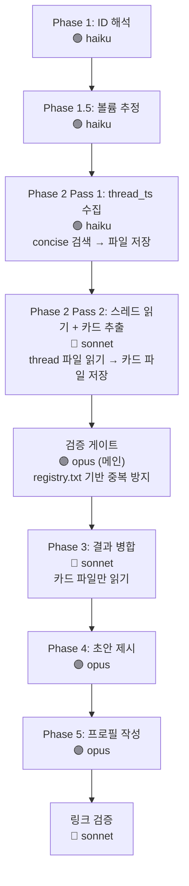

# Slack Profile Extractor

대상: **$ARGUMENTS**

인자가 없으면 사용자에게 이메일, 채널 목록, 기간을 질문한다.

---

## 인자 파싱

```
<email> --channels <ch1,ch2,...> --after <YYYY-MM-DD> [--before <YYYY-MM-DD>]
```

| 인자 | 필수 | 설명 | 예시 |
|------|:---:|------|------|
| email | ✅ | 대상자 이메일 | `user@flex.team` |
| --channels | ✅ | 스캔할 채널 목록 (쉼표 구분) | `dev-backend,general` |
| --after | ✅ | 검색 시작일 | `2025-01-01` |
| --before | | 검색 종료일 (기본: 오늘) | `2025-12-31` |
| --role | | 대상자 직군 (추출 포인트 조정) | `manager`, `engineer`, `designer` |

---

## 직군별 추출 포인트

대상자의 직군에 따라 같은 스레드에서도 **주목하는 포인트**가 달라진다. `--role`이 지정되지 않으면 메시지 내용에서 자동 추정한다.

| 직군 | 핵심 추출 포인트 | 부차적 포인트 |
|------|-----------------|--------------|
| **manager** (PM/PO) | 스펙 결정, 우선순위 판단, 고객 응대 패턴, 로드맵/방향성, 이해관계자 조율 | 기술적 판단, 코드 리뷰 |
| **engineer** (개발자) | 구현 결정 근거, 아키텍처 선택, 버그 원인 분석, 코드 리뷰 의견, 성능/안정성 판단 | 스펙 해석, 운영 대응 |
| **designer** (디자이너) | UX 의사결정 근거, 사용자 시나리오 해석, 디자인 시스템 원칙, 접근성/일관성 판단 | 기술 제약 이해, 고객 피드백 반영 |

**manager**: "왜 이렇게 결정했는지", "고객에게 어떻게 설명하는지", "무엇을 우선하고 무엇을 미루는지"가 핵심. CS 대응 에이전트로 쓰일 가능성이 가장 높다.

**engineer**: "왜 이 구현을 선택했는지", "어떤 트레이드오프가 있었는지", "이 코드가 왜 이렇게 생겼는지"가 핵심. 코드 리뷰/온보딩 에이전트로 쓰일 가능성이 높다.

**designer**: "왜 이 UI를 선택했는지", "어떤 사용자 시나리오를 고려했는지", "어떤 대안을 검토하고 왜 기각했는지"가 핵심. 디자인 리뷰/가이드라인 에이전트로 쓰일 가능성이 높다.

---

## 핵심 원칙

> **이 프로필을 읽은 에이전트가 Slack 원문 없이도 CS 대응할 수 있어야 한다.**

- 링크는 근거 추적용이지, 링크를 읽어야 이해되면 실패
- "요약 1줄"이 아니라 "재현 가능한 지식"을 기록
- 각 지식 카드는 자립적(self-contained)이어야 함
- **출처 링크 필수**: 모든 지식 카드에 실제 Slack permalink가 있어야 함. "product_qna 스레드"같은 채널명만 적는 것은 **금지**. 링크를 확보하지 못한 카드는 프로필에 넣지 않는다. 검색 preview에서 지식을 추출했더라도 반드시 해당 스레드의 permalink를 확보해야 한다.
- **permalink 형식 검증**: 출처 링크는 반드시 `https://flex-cv82520.slack.com/archives/{채널ID}/p{timestamp}` 형식이어야 한다.
  - ❌ `https://flex-cv82520.slack.com/archives/C01G5AFKNFL` — timestamp 없음, 채널 페이지로만 이동
  - ❌ `[tf-미사용연차수당 2025-07](https://...)` — 채널명+날짜는 permalink가 아님
  - ✅ `https://flex-cv82520.slack.com/archives/C01G5AFKNFL/p1707971264467309` — 스레드로 직접 이동
  - **채널 ID는 Phase 1에서 확인한 정확한 ID를 사용**. 서브에이전트가 hallucinate한 ID를 그대로 쓰지 않는다.
  - Phase 5(최종 프로필 작성) 완료 후 **링크 검증 단계**를 반드시 수행:
    1. 모든 출처 링크에서 `/p{timestamp}` 가 있는지 grep
    2. 사용된 채널 ID가 Phase 1 매핑과 일치하는지 확인
    3. timestamp 없는 링크가 1건이라도 있으면 수정 또는 해당 카드 제거

---

## Rules

1. **한 번에 한 사람만** 처리
2. **전수 읽기 필수**: 모든 고유 스레드를 읽는다. 샘플링하지 않음. 아래 Red Flags 참조.
3. **지식 카드 형식**: 각 항목은 스펙 + 자주 오는 케이스 + 의사결정 배경을 포함
4. **추론과 사실 구분**: 직접 인용은 사실, 패턴 도출은 "[추정]"으로 명시
5. **개인정보 금지**: 급여, 건강, 개인 연락처 등 민감 정보 제외
6. **기존 프로필 존재 시**: 덮어쓰기 전 사용자에게 append/overwrite 확인
7. **커밋하지 않음**: 사용자가 직접 커밋
8. **Phase 전환 시 진행 상황 보고**

---

## Red Flags — 전수 조사 보장

> **요청한 기간의 모든 메시지, 모든 스레드를 읽어야 한다. 예외 없음.**

| 합리화 | 현실 |
|--------|------|
| "컨텍스트가 부족해서 여기까지만" | 서브에이전트를 추가 디스패치해서 이어서 읽어라 |
| "충분히 읽었다" | 페이지네이션이 끝까지 갔는지 확인. cursor가 없어질 때까지 |
| "비슷한 내용이 반복된다" | 반복처럼 보여도 미세한 스펙 차이가 있을 수 있음. 전부 읽어라 |
| "단답이라 의미없다" | 단답도 스레드를 읽어야 맥락을 알 수 있음. 메시지는 스킵해도 스레드는 읽어라 |
| "MCP 호출이 너무 많다" | 사람을 대체하는 작업이다. 호출 수는 문제가 아님 |

### Slack 검색 API 제약 — 20페이지 하드 리밋

> **`slack_search_public_and_private`는 최대 20페이지(400건)까지만 반환한다.**
> cursor가 20페이지 이후에도 존재하더라도 API가 빈 결과를 반환하기 시작한다.
> 이 제한은 Slack API 자체의 한계이며, 에이전트나 MCP 설정으로 우회할 수 없다.

#### 20페이지 제한 대응 전략

1. **에이전트 할당 구간을 400건 미만으로 유지**: 볼륨 추정(Step A)에서 분기별 밀도를 파악한 후, 각 에이전트가 처리하는 구간의 총 메시지가 **350건 이하**가 되도록 분할한다 (20페이지 × 20건 = 400건에 여유 두기).
2. **>20건 분기가 연속되면 월 단위로 분할**: 분기당 >20건이 연속 3분기 이상이면 월 단위로 쪼개야 한다.
3. **에이전트 완료 보고에 페이지 제한 도달 여부 포함**: 완료 보고에 `20페이지 제한 도달: ✅/❌` 항목을 추가한다.
4. **제한 도달 시 보충 에이전트 디스패치**: 20페이지 제한에 도달한 에이전트가 있으면, 해당 구간을 절반으로 나눠 보충 에이전트를 디스패치한다. 이 과정을 모든 에이전트가 제한 없이 완료할 때까지 반복한다.

```
예시: customer-issue 2022-04~2024-01 → 20페이지 제한 도달
  → 보충 1: customer-issue 2022-04~2023-03
  → 보충 2: customer-issue 2023-03~2024-01
  → 각각이 또 제한 도달 시 다시 절반 분할
```

### 대량 데이터 처리 전략 — 반드시 따를 것

> **서브에이전트는 컨텍스트 한계가 있다. "한 에이전트가 채널 전체를 처리"하는 방식은 금지.**
> 반드시 아래 프로토콜을 따라 사전 분할 후 디스패치한다.

#### Step A: 볼륨 추정 (Phase 1에서 수행)

채널별로 `slack_search_public_and_private`를 **분기(3개월) 단위**로 호출하여 메시지 수를 파악한다.
- query: `from:<@USER_ID> in:<#CHANNEL_ID> after:YYYY-MM-01 before:YYYY-MM-DD`
- limit: 1, response_format: concise, include_context: false
- 페이지네이션 cursor 유무로 "1페이지 이상 존재" 판별
- 1페이지(20건) 이하면 cursor 없음 → 해당 분기 메시지 수 ≤ 20
- cursor 있으면 → 20건 초과, 추가 페이지 존재

이 결과로 **분기별 메시지 밀도 맵**을 만든다:
```
채널: customer-issue
  2021-Q1: 0건 (cursor 없음, 결과 0)
  2021-Q2: ≤20건 (cursor 없음)
  2021-Q3: >20건 (cursor 있음)
  ...
```

#### Step B: 에이전트 분할 기준

| 분기별 메시지 수 | 분할 단위 | 에이전트 수 |
|:---:|:---:|:---:|
| 0건 | 스킵 | 0 |
| ≤20건 | 인접 분기와 병합 가능 (단, 병합 후 총합 350건 미만 유지) | 병합 |
| 21~100건 | 분기(3개월) 1개 에이전트 | 1 |
| >100건 | **월 단위** 분할 | 최대 3 |

**핵심**: 하나의 에이전트에게 **350건 초과 메시지를 맡기지 않는다** (20페이지 × 20건 = 400건 하드 리밋).
에이전트 1개당 처리량 상한: **메시지 350건 + 스레드 100개 이내**.
350건을 넘길 가능성이 있으면 반드시 구간을 더 잘게 나눈다.

#### Step C: 2단계 에이전트 설계

각 에이전트는 **수집과 추출을 한 번에** 수행하되, 할당된 구간이 작으므로 컨텍스트 내에서 완료 가능.

에이전트에게 반드시 전달할 것:
1. **정확한 기간**: `after:YYYY-MM-DD before:YYYY-MM-DD` (분기 또는 월 단위)
2. **완료 보고 필수**: 아래 형식으로 반드시 보고
   ```
   ## 완료 보고
   - 검색 페이지: N페이지 (마지막 페이지 cursor 없음 확인: ✅/❌)
   - 20페이지 제한 도달: ✅/❌ (20페이지에서 결과가 여전히 있었는지)
   - 총 메시지: N건
   - 고유 스레드: M건
   - 읽은 스레드: M건 (전수 읽기 완료: ✅/❌)
   - 지식 카드: K건
   ```
3. **미완료 시 중단 금지**: "컨텍스트가 부족하면 지금까지의 중간 결과 + 미처리 cursor/스레드 목록을 출력하고 끝내라"
4. "페이지네이션을 cursor가 없어질 때까지 반복해라"
5. "고유 스레드를 전부 읽어라. 하나도 빠뜨리지 마라"
6. **출처 permalink 형식 엄수**: "지식 카드의 출처 링크는 반드시 `https://flex-cv82520.slack.com/archives/{채널ID}/p{timestamp}` 형식이어야 한다. 검색 결과의 permalink 필드에서 그대로 복사하라. 채널명+날짜 같은 설명문을 링크 텍스트로 사용하지 마라. permalink를 확보하지 못한 카드는 출처 없이 제출하되, 출처 없음을 명시하라."
7. **마크다운 개행 규칙**: "지식 카드의 bold 섹션 헤더(`**스펙/규칙**`, `**변경 이력**`, `**자주 오는 케이스**`, `**의사결정 배경**`, `**출처**`) 앞에는 반드시 빈 줄을 넣어라. 빈 줄 없으면 마크다운 렌더링이 깨진다."

#### Step D: 검증 게이트 (Phase 2 완료 후, Phase 3 진입 전)

**모든 에이전트가 완료된 후 반드시 수행. 검증 통과 전 Phase 3 진입 금지.**

1. 각 에이전트의 완료 보고에서 "마지막 페이지 cursor 없음 확인: ✅" 확인
2. "20페이지 제한 도달: ❌" 확인 — ✅(도달)이면 해당 구간을 절반으로 나눠 보충 에이전트 디스패치
3. "전수 읽기 완료: ✅" 확인
4. ❌가 하나라도 있으면 → 해당 구간에 보충 에이전트 디스패치 (20페이지 제한 대응 전략의 "제한 도달 시 보충" 규칙 참조)
4. 채널별 전체 합산:
   ```
   채널: customer-issue
     Q1: 15건/8스레드 ✅ | Q2: 45건/20스레드 ✅ | ...
     합계: 350건/120스레드, 전구간 ✅
   ```
5. 사용자에게 검증 결과 보고 후 Phase 3 진행

---

## 모델 배분

각 Phase별로 사용할 모델을 명시한다. Agent tool의 `model` 파라미터로 지정.

| Phase | 모델 | 이유 |
|-------|------|------|
| Phase 1: ID 해석 | **haiku** | 단순 API 호출 + 파싱 |
| Phase 1.5: 볼륨 추정 | **haiku** | 단순 검색 + cursor 유무 판별 |
| Phase 2 Pass 1: thread_ts 수집 | **haiku** | concise 검색 + permalink 파싱만. 판단 불필요 |
| Phase 2 Pass 2: 스레드 읽기 + 카드 추출 | **sonnet** | 맥락 이해 + 지식 카드 판단 필요 |
| 검증 게이트 | 메인(opus) | 결과 대조 + 보충 판단 |
| Phase 3: 결과 병합 | **sonnet** | 구조화된 카드 파일만 읽으므로 sonnet으로 충분 |
| Phase 4-5: 프로필 작성 | **opus** | 문서 구조화, 의사결정 원칙 도출, 응대 패턴 정리 |
| 링크 검증 + 수정 | **sonnet** | 패턴 매칭 + permalink 검색·교체 |

> **메인 오케스트레이터는 항상 opus.** 서브에이전트만 모델을 분리한다.

---

## 실행 프로세스



### Phase 1: Input Parsing & ID Resolution — 🟢 haiku

> Agent tool 사용 시 `model: "haiku"` 지정

1. `$ARGUMENTS`에서 email, channels[], after, before 파싱
2. `slack_search_users`로 email → user_id 조회
   - display_name 추출 → 파일명 slug 생성
3. 각 채널명에 대해 `slack_search_channels` → channel_id 조회
4. 기존 프로필 확인: `brain/profiles/{slug}.md` 존재 여부
5. 진행 보고

### Phase 1.5: 볼륨 추정 + 에이전트 분할 계획 — 🟢 haiku

> Agent tool 사용 시 `model: "haiku"` 지정

Phase 1 완료 후, Phase 2 디스패치 전에 반드시 수행.

1. **분기별 볼륨 추정**: 위 "대량 데이터 처리 전략 Step A" 참조
   - 전체 기간을 분기(Q1~Q4)로 나누어 각 채널×분기의 메시지 존재 여부 확인
   - 병렬로 호출하여 속도 최적화 (채널 7개 × 분기 20개 = 최대 140회지만, 0건인 구간이 많으므로 실제는 적음)
2. **분할 계획 수립**: "Step B: 에이전트 분할 기준" 테이블에 따라 에이전트 목록 작성
3. **사용자에게 분할 계획 보고** 후 Phase 2 진행

### Phase 2: 2-Pass 수집 아키텍처

> **토큰 절감을 위해 검색(Pass 1)과 추출(Pass 2)을 분리한다.**
> 검색은 `concise` 포맷 + haiku로 permalink만 수집하고, 스레드 읽기 + 카드 추출은 sonnet이 담당.

#### 중간 파일 구조

```
/tmp/slack-profile-{slug}/
├── threads/                         # Pass 1 결과
│   ├── {channel}-{period}.txt       # thread_ts 목록 (한 줄에 하나)
│   └── ...
├── cards/                           # Pass 2 결과
│   ├── {channel}-{period}.md        # 지식 카드 마크다운
│   └── ...
├── registry.txt                     # 읽은 thread_ts 전체 목록 (중복 방지)
└── merged-cards.md                  # Phase 3 결과
```

#### Pass 1: thread_ts 수집 — 🟢 haiku

> Agent tool 사용 시 `model: "haiku"` 지정
> **채널×기간 구간별로 디스패치.** 350건 이하가 되도록 구간 분할.

각 에이전트의 임무:
1. `slack_search_public_and_private` (**concise**, include_context: false)
   - query: `from:<@USER_ID> in:<#CHANNEL_ID> after:YYYY-MM-DD before:YYYY-MM-DD`
   - **cursor가 없어질 때까지** 반복
2. 각 메시지의 permalink에서 thread_ts 추출
3. thread_ts 기준 deduplicate
4. **reply_count 필터링**: reply_count=0이고 메시지가 단답(10자 미만)이면 스킵 대상으로 마킹
5. 결과를 `/tmp/slack-profile-{slug}/threads/{channel}-{period}.txt`에 저장
   - 형식: `{thread_ts}\t{reply_count}\t{skip여부}` (한 줄에 하나)
6. 스킵 대상이 아닌 thread_ts를 `/tmp/slack-profile-{slug}/registry.txt`에 append

**완료 보고**:
```
## Pass 1 완료 보고
- 검색 페이지: N (cursor 소진: ✅/❌, 20페이지 제한 도달: ✅/❌)
- 총 메시지: N건
- 고유 스레드: M건 (스킵 대상: S건)
- Pass 2 대상 스레드: M-S건
```

#### Pass 2: 스레드 읽기 + 카드 추출 — 🔵 sonnet

> Agent tool 사용 시 `model: "sonnet"` 지정
> Pass 1 완료 후 디스패치. 에이전트 1개당 **스레드 50개 이내**.

각 에이전트의 임무:
1. `/tmp/slack-profile-{slug}/threads/{channel}-{period}.txt` 읽기
2. 스킵 대상이 아닌 thread_ts에 대해 `slack_read_thread` (concise) 실행
3. **registry.txt 체크**: 이미 읽은 thread_ts는 스킵 (보충 에이전트용)
4. 지식 카드 추출
5. 결과를 `/tmp/slack-profile-{slug}/cards/{channel}-{period}.md`에 저장
6. 읽은 thread_ts를 registry.txt에 append

각 스레드를 읽은 후, 대상 인물의 발언에서 **지식 카드**를 추출한다.

**지식 카드 추출 기준**:
- 단답 메시지("넵", "완료", "ㅇㅇ")는 스킵
- 소셜/운영 메시지(회식, 인원체크)는 스킵
- **농담/감탄/비업무 발언 판별**: "코가 막혔다", "기가 막힘", "너무 빠르다;굳", "ㅋㅋㅋ", "헐" 등은 스펙이 아님. 에이전트가 이런 것을 시스템 동작으로 오해하면 환각(hallucination) 발생. 문맥상 명확히 업무 내용인지 판별하고, 확실하지 않으면 제외.
- 다음 중 하나라도 해당하면 지식 카드 생성:
  - 시스템 동작/스펙을 설명하는 발언
  - 의사결정 근거를 밝히는 발언
  - 고객 문의에 대한 판단/답변
  - 특정 방향이나 접근방식을 제안하는 발언
  - 다른 사람과 의견이 다른 경우

**지식 카드 형식** (각 카드는 이 구조를 따름):

```markdown
### {주제명}

**스펙/규칙** (현재 상태)
- {시스템이 어떻게 동작하는지 구체적으로. 조건, 결과, 예외를 빠짐없이}

**변경 이력** (해당 시 — 같은 주제에 대해 시간순으로 스펙이 바뀐 경우 반드시 기록)
- {YYYY-MM}: {당시 상태 또는 변경 내용} — [출처](permalink)
- {YYYY-MM}: {변경 후 상태} — [출처](permalink)
> 변경 이력이 있으면 "왜 지금 이런 상태인지"를 추적할 수 있다.
> 같은 주제의 스레드가 여러 시점에 걸쳐 있으면 시간순으로 정리.

**자주 오는 케이스** (해당 시)
- "{고객/CS가 묻는 전형적인 질문}"
  → {어떻게 답변해야 하는지, 확인해야 할 것은 무엇인지}

**의사결정 배경** (해당 시)
- 왜 이렇게 결정했는지. 어떤 대안을 검토했고 왜 기각했는지

**출처**: [스레드](permalink)
```

하나의 스레드에서 여러 지식 카드가 나올 수 있다.
여러 스레드에서 같은 주제가 나오면 하나의 카드로 통합하고 출처를 모두 남긴다.

#### 서브에이전트 출력 형식
```
## 수집 결과
- 총 메시지: N건, 고유 스레드: M건, 지식 카드: K건

## 지식 카드 목록
### {주제 1}
...
### {주제 2}
...
```

### Phase 3: 결과 병합 + 중복 통합 — 🔵 sonnet

> Agent tool 사용 시 `model: "sonnet"` 지정
> **구조화된 카드 파일만 읽으므로 sonnet으로 충분.** 에이전트 출력 전체를 읽지 않는다.

입력: `/tmp/slack-profile-{slug}/cards/*.md` (각 에이전트가 저장한 카드 파일)
출력: `/tmp/slack-profile-{slug}/merged-cards.md`

1. 모든 카드 파일 읽기 (원시 에이전트 출력이 아닌 구조화된 카드만)
2. 같은 주제의 카드를 통합 (예: "주기연장 일귀속"이 customer-issue와 squad-tracking 양쪽에서 나왔으면 하나로 merge)
3. 도메인 영역별로 그루핑
4. 관점/의사결정 원칙을 별도 섹션으로 분리
5. 응대 패턴을 별도 섹션으로 분리

### Phase 4: 초안 제시 + 사용자 확인

사용자에게 초안을 보여주고:
- "보강이 필요한 영역이 있나요?"
- "이대로 최종 프로필을 작성할까요?"

### Phase 5: 최종 프로필 작성 — 🟣 opus

> Agent tool 사용 시 `model: "opus"` 지정

`brain/profiles/{slug}.md` 파일을 생성한다.

### 링크 검증 — 🔵 sonnet

> Agent tool 사용 시 `model: "sonnet"` 지정

Phase 5 완료 후 반드시 수행. 상세 규칙은 "핵심 원칙 > permalink 형식 검증" 참조.

---

## 문서 템플릿

```markdown
# {Display Name} — Slack Knowledge Profile

> 생성일: {YYYY-MM-DD} | 분석 범위: {after} ~ {before}
> 채널: {channel list}
> 분석 스레드: {K}건 / 전체 메시지: {N}건
> 역할: {title}

---

## 인물 개요

### 전문 영역
{이 사람이 깊이 알고 있는 도메인과 영역. 구체적으로.}

### 의사결정 원칙
{반복적으로 드러나는 판단 기준. 각 원칙에 실제 사례를 붙인다.}

- **{원칙}**: {설명} — 사례: "{실제 발언 인용}" [출처](permalink)

### 응대 패턴
{CS/동료 문의에 어떻게 대응하는지. 에이전트가 이 패턴을 모방할 수 있을 정도로 구체적.}

1. {패턴명}: {설명}
   - 전형적 질문: "{예시}"
   - 전형적 응답 흐름: {1단계 → 2단계 → ...}

---

## 도메인별 지식

### {도메인 영역 1} (예: 초과근무/주기연장)

#### {주제 1} (예: 주기연장 일귀속)

**스펙/규칙**
- {구체적 동작 설명}

**자주 오는 케이스**
- "{질문}" → {답변/확인사항}

**의사결정 배경**
- {왜 이렇게 결정했는지}

**출처**: [스레드1](link), [스레드2](link)

#### {주제 2}
...

### {도메인 영역 2} (예: 연차/휴가)
...

---

## 의견 충돌 이력

### {주제}
- **맥락**: {무엇에 대한 논쟁이었는지}
- **안희종 입장**: {무엇을 주장했고 근거는 무엇}
- **상대 입장**: {누가 무엇을 주장}
- **결론**: {어떻게 결론났는지}
- **출처**: [스레드](link)
```

---

## 품질 체크리스트

프로필 작성 완료 후, 다음을 자가 검증:

- [ ] 각 지식 카드를 읽고 "이것만으로 CS 답변할 수 있는가?" — 불가하면 보강
- [ ] 스펙 항목에 조건/결과/예외가 빠짐없이 기술되었는가?
- [ ] "자주 오는 케이스"가 실제 슬랙에서 온 질문을 반영하는가?
- [ ] 의사결정 배경에 "왜?"와 "어떤 대안을 기각했는지"가 있는가?
- [ ] Slack 링크 없이 읽어도 내용이 완결적인가?
