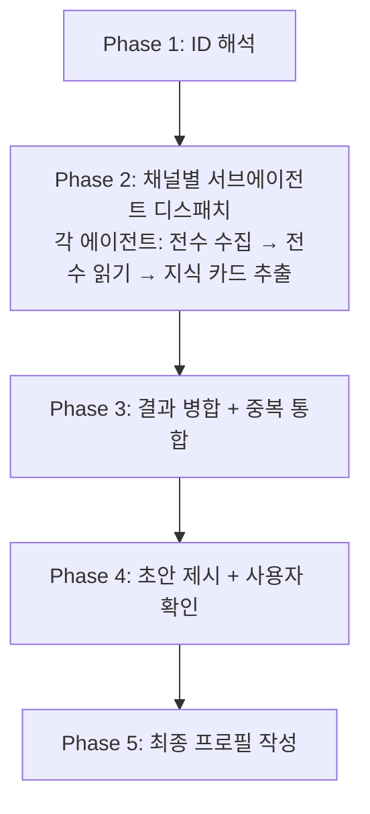

# Slack Profile Extractor

대상: **$ARGUMENTS**

인자가 없으면 사용자에게 이메일, 채널 목록, 기간을 질문한다.

---

## 인자 파싱

```
<email> --channels <ch1,ch2,...> --after <YYYY-MM-DD> [--before <YYYY-MM-DD>]
```

| 인자 | 필수 | 설명 | 예시 |
|------|:---:|------|------|
| email | ✅ | 대상자 이메일 | `user@flex.team` |
| --channels | ✅ | 스캔할 채널 목록 (쉼표 구분) | `dev-backend,general` |
| --after | ✅ | 검색 시작일 | `2025-01-01` |
| --before | | 검색 종료일 (기본: 오늘) | `2025-12-31` |
| --role | | 대상자 직군 (추출 포인트 조정) | `manager`, `engineer`, `designer` |

---

## 직군별 추출 포인트

대상자의 직군에 따라 같은 스레드에서도 **주목하는 포인트**가 달라진다. `--role`이 지정되지 않으면 메시지 내용에서 자동 추정한다.

| 직군 | 핵심 추출 포인트 | 부차적 포인트 |
|------|-----------------|--------------|
| **manager** (PM/PO) | 스펙 결정, 우선순위 판단, 고객 응대 패턴, 로드맵/방향성, 이해관계자 조율 | 기술적 판단, 코드 리뷰 |
| **engineer** (개발자) | 구현 결정 근거, 아키텍처 선택, 버그 원인 분석, 코드 리뷰 의견, 성능/안정성 판단 | 스펙 해석, 운영 대응 |
| **designer** (디자이너) | UX 의사결정 근거, 사용자 시나리오 해석, 디자인 시스템 원칙, 접근성/일관성 판단 | 기술 제약 이해, 고객 피드백 반영 |

**manager**: "왜 이렇게 결정했는지", "고객에게 어떻게 설명하는지", "무엇을 우선하고 무엇을 미루는지"가 핵심. CS 대응 에이전트로 쓰일 가능성이 가장 높다.

**engineer**: "왜 이 구현을 선택했는지", "어떤 트레이드오프가 있었는지", "이 코드가 왜 이렇게 생겼는지"가 핵심. 코드 리뷰/온보딩 에이전트로 쓰일 가능성이 높다.

**designer**: "왜 이 UI를 선택했는지", "어떤 사용자 시나리오를 고려했는지", "어떤 대안을 검토하고 왜 기각했는지"가 핵심. 디자인 리뷰/가이드라인 에이전트로 쓰일 가능성이 높다.

---

## 핵심 원칙

> **이 프로필을 읽은 에이전트가 Slack 원문 없이도 CS 대응할 수 있어야 한다.**

- 링크는 근거 추적용이지, 링크를 읽어야 이해되면 실패
- "요약 1줄"이 아니라 "재현 가능한 지식"을 기록
- 각 지식 카드는 자립적(self-contained)이어야 함
- **출처 링크 필수**: 모든 지식 카드에 실제 Slack permalink가 있어야 함. "product_qna 스레드"같은 채널명만 적는 것은 **금지**. 링크를 확보하지 못한 카드는 프로필에 넣지 않는다. 검색 preview에서 지식을 추출했더라도 반드시 해당 스레드의 permalink를 확보해야 한다.

---

## Rules

1. **한 번에 한 사람만** 처리
2. **전수 읽기 필수**: 모든 고유 스레드를 읽는다. 샘플링하지 않음. 아래 Red Flags 참조.
3. **지식 카드 형식**: 각 항목은 스펙 + 자주 오는 케이스 + 의사결정 배경을 포함
4. **추론과 사실 구분**: 직접 인용은 사실, 패턴 도출은 "[추정]"으로 명시
5. **개인정보 금지**: 급여, 건강, 개인 연락처 등 민감 정보 제외
6. **기존 프로필 존재 시**: 덮어쓰기 전 사용자에게 append/overwrite 확인
7. **커밋하지 않음**: 사용자가 직접 커밋
8. **Phase 전환 시 진행 상황 보고**

---

## Red Flags — 전수 조사 보장

> **요청한 기간의 모든 메시지, 모든 스레드를 읽어야 한다. 예외 없음.**

| 합리화 | 현실 |
|--------|------|
| "컨텍스트가 부족해서 여기까지만" | 서브에이전트를 추가 디스패치해서 이어서 읽어라 |
| "충분히 읽었다" | 페이지네이션이 끝까지 갔는지 확인. cursor가 없어질 때까지 |
| "비슷한 내용이 반복된다" | 반복처럼 보여도 미세한 스펙 차이가 있을 수 있음. 전부 읽어라 |
| "단답이라 의미없다" | 단답도 스레드를 읽어야 맥락을 알 수 있음. 메시지는 스킵해도 스레드는 읽어라 |
| "MCP 호출이 너무 많다" | 사람을 대체하는 작업이다. 호출 수는 문제가 아님 |

### 대량 데이터 처리 전략

메시지가 많아서 서브에이전트 하나로 전수 처리가 불가능할 때:

1. **월 단위 분할**: `after:YYYY-MM-01 before:YYYY-MM-31` 로 월별로 쪼개서 서브에이전트를 디스패치
   - 예: 2023-01 ~ 2026-03 (39개월) → 채널당 월별 에이전트 또는 분기별 에이전트
2. **이어서 읽기**: 이미 처리된 페이지/스레드를 제외 목록으로 넘겨서 미처리분만 계속
3. **완료 검증**: 모든 서브에이전트 완료 후, 각 채널의 총 메시지 수와 읽은 스레드 수를 대조
   - 페이지네이션이 끝까지 갔는가? (cursor가 없어졌는가?)
   - 고유 스레드 수 == 읽은 스레드 수인가?
   - 차이가 있으면 추가 에이전트 디스패치

**서브에이전트에게 반드시 전달할 것**:
- "페이지네이션을 cursor가 없어질 때까지 반복해라"
- "고유 스레드를 전부 읽어라. 하나도 빠뜨리지 마라"
- "컨텍스트가 부족하면 중간 결과를 출력하고 끝내라. 그러면 이어서 읽기로 나머지를 처리한다"

---

## 실행 프로세스



### Phase 1: Input Parsing & ID Resolution

1. `$ARGUMENTS`에서 email, channels[], after, before 파싱
2. `slack_search_users`로 email → user_id 조회
   - display_name 추출 → 파일명 slug 생성
3. 각 채널명에 대해 `slack_search_channels` → channel_id 조회
4. 기존 프로필 확인: `brain/profiles/{slug}.md` 존재 여부
5. 진행 보고

### Phase 2: 채널별 서브에이전트 병렬 디스패치

각 채널에 대해 **서브에이전트를 background로 디스패치**한다. (3개 채널이면 3개 서브에이전트)

각 서브에이전트의 임무:

#### Step 2-1: 메시지 전수 수집 (detailed 포맷)
- `slack_search_public_and_private` (detailed, include_context: false)
- query: `from:<@USER_ID> in:<#CHANNEL_ID> after:YYYY-MM-DD`
- cursor로 끝까지 페이지네이션
- 각 메시지의 permalink에서 `thread_ts=` 추출

#### Step 2-2: 고유 스레드 deduplicate
- thread_ts 기준 중복 제거

#### Step 2-3: 모든 스레드 전수 읽기
- `slack_read_thread` (concise) 로 각 고유 스레드 읽기

#### Step 2-4: 지식 카드 추출
각 스레드를 읽은 후, 대상 인물의 발언에서 **지식 카드**를 추출한다.

**지식 카드 추출 기준**:
- 단답 메시지("넵", "완료", "ㅇㅇ")는 스킵
- 소셜/운영 메시지(회식, 인원체크)는 스킵
- **농담/감탄/비업무 발언 판별**: "코가 막혔다", "기가 막힘", "너무 빠르다;굳", "ㅋㅋㅋ", "헐" 등은 스펙이 아님. 에이전트가 이런 것을 시스템 동작으로 오해하면 환각(hallucination) 발생. 문맥상 명확히 업무 내용인지 판별하고, 확실하지 않으면 제외.
- 다음 중 하나라도 해당하면 지식 카드 생성:
  - 시스템 동작/스펙을 설명하는 발언
  - 의사결정 근거를 밝히는 발언
  - 고객 문의에 대한 판단/답변
  - 특정 방향이나 접근방식을 제안하는 발언
  - 다른 사람과 의견이 다른 경우

**지식 카드 형식** (각 카드는 이 구조를 따름):

```markdown
### {주제명}

**스펙/규칙** (현재 상태)
- {시스템이 어떻게 동작하는지 구체적으로. 조건, 결과, 예외를 빠짐없이}

**변경 이력** (해당 시 — 같은 주제에 대해 시간순으로 스펙이 바뀐 경우 반드시 기록)
- {YYYY-MM}: {당시 상태 또는 변경 내용} — [출처](permalink)
- {YYYY-MM}: {변경 후 상태} — [출처](permalink)
> 변경 이력이 있으면 "왜 지금 이런 상태인지"를 추적할 수 있다.
> 같은 주제의 스레드가 여러 시점에 걸쳐 있으면 시간순으로 정리.

**자주 오는 케이스** (해당 시)
- "{고객/CS가 묻는 전형적인 질문}"
  → {어떻게 답변해야 하는지, 확인해야 할 것은 무엇인지}

**의사결정 배경** (해당 시)
- 왜 이렇게 결정했는지. 어떤 대안을 검토했고 왜 기각했는지

**출처**: [스레드](permalink)
```

하나의 스레드에서 여러 지식 카드가 나올 수 있다.
여러 스레드에서 같은 주제가 나오면 하나의 카드로 통합하고 출처를 모두 남긴다.

#### 서브에이전트 출력 형식
```
## 수집 결과
- 총 메시지: N건, 고유 스레드: M건, 지식 카드: K건

## 지식 카드 목록
### {주제 1}
...
### {주제 2}
...
```

### Phase 3: 결과 병합 + 중복 통합

서브에이전트 결과를 모두 수집한 후:
1. 같은 주제의 카드를 통합 (예: "주기연장 일귀속"이 customer-issue와 squad-tracking 양쪽에서 나왔으면 하나로 merge)
2. 도메인 영역별로 그루핑
3. 관점/의사결정 원칙을 별도 섹션으로 분리
4. 응대 패턴을 별도 섹션으로 분리

### Phase 4: 초안 제시 + 사용자 확인

사용자에게 초안을 보여주고:
- "보강이 필요한 영역이 있나요?"
- "이대로 최종 프로필을 작성할까요?"

### Phase 5: 최종 프로필 작성

`brain/profiles/{slug}.md` 파일을 생성한다.

---

## 문서 템플릿

```markdown
# {Display Name} — Slack Knowledge Profile

> 생성일: {YYYY-MM-DD} | 분석 범위: {after} ~ {before}
> 채널: {channel list}
> 분석 스레드: {K}건 / 전체 메시지: {N}건
> 역할: {title}

---

## 인물 개요

### 전문 영역
{이 사람이 깊이 알고 있는 도메인과 영역. 구체적으로.}

### 의사결정 원칙
{반복적으로 드러나는 판단 기준. 각 원칙에 실제 사례를 붙인다.}

- **{원칙}**: {설명} — 사례: "{실제 발언 인용}" [출처](permalink)

### 응대 패턴
{CS/동료 문의에 어떻게 대응하는지. 에이전트가 이 패턴을 모방할 수 있을 정도로 구체적.}

1. {패턴명}: {설명}
   - 전형적 질문: "{예시}"
   - 전형적 응답 흐름: {1단계 → 2단계 → ...}

---

## 도메인별 지식

### {도메인 영역 1} (예: 초과근무/주기연장)

#### {주제 1} (예: 주기연장 일귀속)

**스펙/규칙**
- {구체적 동작 설명}

**자주 오는 케이스**
- "{질문}" → {답변/확인사항}

**의사결정 배경**
- {왜 이렇게 결정했는지}

**출처**: [스레드1](link), [스레드2](link)

#### {주제 2}
...

### {도메인 영역 2} (예: 연차/휴가)
...

---

## 의견 충돌 이력

### {주제}
- **맥락**: {무엇에 대한 논쟁이었는지}
- **안희종 입장**: {무엇을 주장했고 근거는 무엇}
- **상대 입장**: {누가 무엇을 주장}
- **결론**: {어떻게 결론났는지}
- **출처**: [스레드](link)
```

---

## 품질 체크리스트

프로필 작성 완료 후, 다음을 자가 검증:

- [ ] 각 지식 카드를 읽고 "이것만으로 CS 답변할 수 있는가?" — 불가하면 보강
- [ ] 스펙 항목에 조건/결과/예외가 빠짐없이 기술되었는가?
- [ ] "자주 오는 케이스"가 실제 슬랙에서 온 질문을 반영하는가?
- [ ] 의사결정 배경에 "왜?"와 "어떤 대안을 기각했는지"가 있는가?
- [ ] Slack 링크 없이 읽어도 내용이 완결적인가?
