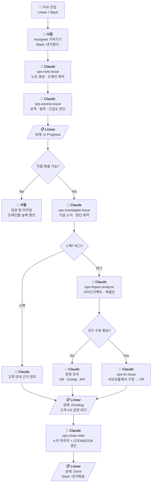

# oncall-worktree

온콜 업무를 위한 인덱스 repo. 이슈가 어느 코드베이스에 해당하는지 모르는 상태에서도 시작점을 찾을 수 있도록, 관련 프로젝트를 git submodule로 묶고 운영 지식을 축적하는 곳이다.

## 배경

Enterprise Product Division으로 팀이 재편되면서 제품 온콜을 이 팀에서 전부 담당하게 되었다. 도메인별로 어느 repo를 봐야 하는지 모르는 뉴비가 온콜에 바로 투입되어도 시작점을 찾을 수 있도록 한 곳에 단일화하는 것이 이 repo의 목적이다.

## 셋업

```bash
git clone --recurse-submodules git@github.com:flex-team/flex-support-oncall.git
cd flex-support-oncall
```

서브모듈은 매일 08:00 KST에 자동 갱신되므로 이후에는 `git pull`만 하면 된다.

## 온콜 워크플로우



### 이슈 인입 채널

| 채널 | 용도 |
|------|------|
| [#customer-issue](https://flex-cv82520.slack.com/archives/CRU35U9FC) | 실제 고객 문의 → [CI 팀(Linear)](https://linear.app/flexteam/team/CI)에 자동 등록 |
| [#product-qna](https://flex-cv82520.slack.com/archives/C01G5AFKNFL) | 동료들의 제품 문의 |
| [#customer-voc](https://flex-cv82520.slack.com/archives/C042D5X10JG) | 고객 요구사항 |
| [#flexteam-feedback](https://flex-cv82520.slack.com/archives/C01SEAZV737) | 우리팀(flexteam)의 피드백 |
| [#make-better](https://flex-cv82520.slack.com/archives/C04GFJAJBNU) | 사내 제안 |
| [#idea](https://flex-cv82520.slack.com/archives/C01J2TPHSF7) | 우리팀의 제품 관련 아이디어 |

### 이슈 추적 (Linear)

- [지난 1주간 온콜 이슈](https://linear.app/flexteam/view/%EC%A7%80%EB%82%9C-1%EC%A3%BC%EA%B0%84-%EC%98%A8%EC%BD%9C-%EC%9D%B4%EC%8A%88-13e4abe72fd1)
- [지난 1개월간 온콜 이슈](https://linear.app/flexteam/view/%EC%A7%80%EB%82%9C-1%EA%B0%9C%EC%9B%94%EA%B0%84-%EC%98%A8%EC%BD%9C-%EC%9D%B4%EC%8A%88-d5ef72e76373)

| 상태 | 의미 |
|------|------|
| Todo | 대기중 |
| In Progress | 파악 중 |
| Pending | 고객/CS 확인 대기 |
| Done | 해결 완료 |

- [#customer-issue](https://flex-cv82520.slack.com/archives/CRU35U9FC) 에 :내가왔다: 이모지를 추가하면 자동으로 할당
- :내가해냄: 또는 :white_check_mark: 을 찍으면 완료 처리

## 자동화

| 주기 | 작업 | 도구 |
|------|------|------|
| 매일 08:00 KST | 서브모듈 최신 커밋 동기화 | GitHub Action (`sync-submodules`) |
| 매일 09:00 KST | 노트 유지보수 + brain 산출물 갱신 | GitHub Action (`claude-ops-maintain-notes`) |

## 알람 채널

| 도메인 | 채널 | 설명 |
|---|---|--|
| 트래킹 BE | [alram-system-error-tracking-be](https://flex-cv82520.slack.com/archives/C03DDNUEV29) | tracking, work-event-transmitter |
| 트래킹 FE | [alram-system-error-tracking-fe-prod](https://flex-cv82520.slack.com/archives/C096SFWRC05) | |
| 페이롤 BE | [alarm-error-payroll-prod](https://flex-cv82520.slack.com/archives/C04TM7A9DHN) | payroll, yearend, digicon |

## 도메인별 슬랙 멘션

| 도메인 | 현재 멘션 | 이전 멘션 |
|--------|-----------|-----------|
| 근무/휴가 | `@ug-division-ep-on-call` | `@ug-squad-tracking-on-call` |
| 급여 | `@ug-division-ep-on-call` | `@ug-squad-payroll-on-call` |
| 모바일 앱 | `@ug-team-mobile` | (동일) |
| 할일/승인/캘린더 | `@ug-ai-division-on-call` | `@ug-team-service-platform-on-call` |
| 워크플로우 | `@ug-division-ep-on-call` | `@ug-squad-flow` |
| 비용 관리 | `@ug-division-ep-on-call` | `@ug-squad-expense-management` |
| 구성원 | `@ug-division-ep-on-call` | `@ug-core-ops` |
| 성과관리 | `@ug-division-ep-on-call` | `@ug-performance-ops` |
| 채용 | `@ug-division-ep-on-call` | `@ug-recruiting-ops` |
| 전자계약 | `@ug-division-ep-on-call` | `@ug-digicon-voc` |
| 보험 | `@ug-division-ep-on-call` | `@ug-tf-insurance` |
| 인사이트 | `@ug-insight-ops` | (동일) |
| 미니 | `@ug-division-ep-on-call` | `@ug-squad-mini` |
| 랜딩페이지 | `@ug-team-design-platform` | (동일) |
| 블로그 | `@ug-team-design-platform` | (동일) |
| 기타 | — | — |
