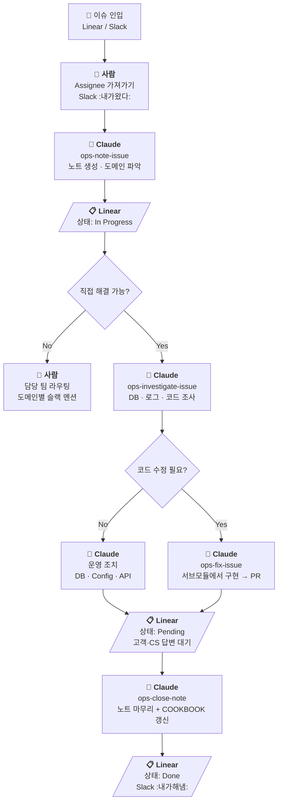

# oncall-worktree

온콜 업무를 위한 인덱스 repo. 관련 프로젝트들을 git submodule로 묶고, 이슈가 어느 코드베이스에 있는지 빠르게 찾는 시작점 역할을 한다.



## 배경

Enterprise Product Division으로 팀이 재편되면서 제품 온콜을 이 팀에서 전부 담당하게 되었다. 제품 스펙에 대한 이해가 충분하지 않은 상태라 당장 이슈를 직접 해결하기보다는, 문의 채널을 단일화하여 인입받고 적절한 담당자에게 라우팅하는 것으로 운영 중이다.

문제는 어떤 이슈가 어느 repo에 해당하는지, 어디로 라우팅해야 하는지조차 파악이 안 되는 상황이라는 것. 도메인별로 어느 repo를 봐야 하는지 알면 해당 repo로 바로 가면 되지만, 그걸 모르는 뉴비가 온콜에 바로 투입되어도 시작점을 찾을 수 있도록 한 곳에 단일화하는 것이 이 repo의 목적이다.

관련 코드베이스를 서브모듈로 모으고, 운영 과정에서 축적되는 진단 가이드(`COOKBOOK.md`)·과거 사례(`operation-notes/`)·용어집(`GLOSSARY.md`)·키워드 인덱스(`INDEX.md`) 등을 여기에 정리한다.

## 이슈 인입 채널

| 채널 | 용도 |
|------|------|
| [#customer-issue](https://flex-cv82520.slack.com/archives/CRU35U9FC) | 실제 고객 문의 → [CI 팀(Linear)](https://linear.app/flexteam/team/CI)에 자동 등록 |
| [#product-qna](https://flex-cv82520.slack.com/archives/C01G5AFKNFL) | 동료들의 제품 문의 |
| [#customer-voc](https://flex-cv82520.slack.com/archives/C042D5X10JG) | 고객 요구사항 |
| [#flexteam-feedback](https://flex-cv82520.slack.com/archives/C01SEAZV737) | 우리팀(flexteam)의 피드백 |
| [#make-better](https://flex-cv82520.slack.com/archives/C04GFJAJBNU) | 사내 제안 (소소한 제안) |
| [#idea](https://flex-cv82520.slack.com/archives/C01J2TPHSF7) | 우리팀의 제품 관련 아이디어 |

## 이슈 추적 (Linear)

온콜 이슈 현황 파악을 위해 아래 Linear 뷰를 사용한다.

- [지난 1주간 온콜 이슈](https://linear.app/flexteam/view/%EC%A7%80%EB%82%9C-1%EC%A3%BC%EA%B0%84-%EC%98%A8%EC%BD%9C-%EC%9D%B4%EC%8A%88-13e4abe72fd1)
- [지난 1개월간 온콜 이슈](https://linear.app/flexteam/view/%EC%A7%80%EB%82%9C-1%EA%B0%9C%EC%9B%94%EA%B0%84-%EC%98%A8%EC%BD%9C-%EC%9D%B4%EC%8A%88-d5ef72e76373)

### 이슈 상태 규칙

| 상태 | 의미 |
|------|------|
| Todo | 대기중인 것 |
| In Progress | 파악하고 있는 것 |
| Pending | 고객 또는 CS분들 확인을 기다리는 것 |
| Done | 해결된 것 |

### 이슈 할당

- [#customer-issue](https://flex-cv82520.slack.com/archives/CRU35U9FC) 에 :내가왔다: 이모지를 추가하면 자동으로 할당
- :내가해냄: 또는 :white_check_mark: 을 찍으면 완료 처리

## 운영 방식

### 자동화

| 주기 | 작업 | 도구 |
|------|------|------|
| 매일 08:00 KST | 서브모듈 최신 커밋 동기화 | GitHub Action (`sync-submodules`) |
| 매일 09:00 KST | 노트 유지보수 + brain 산출물 갱신 | GitHub Action (`claude-ops-maintain-notes`) |

서브모듈은 자동 갱신되므로 로컬에서는 `git pull`만 하면 항상 최신 코드베이스를 탐색할 수 있다.

`claude-ops-maintain-notes`는 매일 09:00에 Claude Code가 자동 실행하며, 수동 실행(`workflow_dispatch`)도 가능하다.

수행 내용:
1. 활성 노트(`brain/notes/*.md`) 전체 조회
2. Linear 이슈 상태 일괄 확인 → 노트 상태 갱신
3. 완료된 이슈에 대해 `ops-learn` 실행 → GLOSSARY, COOKBOOK, domain-map.ttl 갱신
4. 완료 + 산출물 반영 완료 노트를 `archive/`로 이동
5. `ops-compact` 실행 → 농축, 퇴출, COOKBOOK 계층 조정
6. 결과 커밋 & push

## 셋업

```bash
# 처음 클론할 때 (서브모듈 포함)
git clone --recurse-submodules <repo-url>

# 이미 클론한 상태에서 서브모듈 초기화
git submodule update --init --recursive

# 서브모듈을 최신으로 업데이트 (각 서브모듈의 추적 브랜치에서 pull)
git submodule update --remote --merge
```

> [!TIP]
> 자주 쓴다면 alias를 등록하면 편하다.
> ```bash
> git config alias.sup 'submodule update --remote --merge'
> # 이후 git sup 으로 실행
> ```

## 서브모듈 추가하기

```bash
git submodule add -b <branch> git@github.com:flex-team/<repo-name>.git <directory-name>
# 예: git submodule add -b main git@github.com:flex-team/flex-timetracking-backend.git flex-timetracking-backend
```

서브모듈을 추가한 후 `CLAUDE.md`의 서브모듈 맵 테이블도 함께 업데이트할 것.

## 알람

| 도메인 | 채널 | 설명 |
|---|---|--|
| 트래킹 BE | [alram-system-error-tracking-be](https://flex-cv82520.slack.com/archives/C03DDNUEV29) | tracking, work-event-transmitter |
| 트래킹 FE | [alram-system-error-tracking-fe-prod](https://flex-cv82520.slack.com/archives/C096SFWRC05) | |
| 페이롤 BE | [alarm-error-payroll-prod](https://flex-cv82520.slack.com/archives/C04TM7A9DHN) | payroll, yearend, digicon |


## 참고: 도메인별 슬랙 멘션 이력

과거 문의마다 어떤 멘션을 사용했는지 확인하기 위한 참고 테이블.

| 도메인 | 현재 멘션 | 이전 멘션 |
|--------|-----------|-----------|
| 근무/휴가 | `@ug-division-ep-on-call` | `@ug-squad-tracking-on-call` |
| 급여 | `@ug-division-ep-on-call` | `@ug-squad-payroll-on-call` |
| 모바일 앱 | `@ug-team-mobile` | (동일) |
| 할일/승인/캘린더 | `@ug-ai-division-on-call` | `@ug-team-service-platform-on-call` |
| 워크플로우 | `@ug-division-ep-on-call` | `@ug-squad-flow` |
| 비용 관리 | `@ug-division-ep-on-call` | `@ug-squad-expense-management` |
| 구성원 | `@ug-division-ep-on-call` | `@ug-core-ops` |
| 성과관리 | `@ug-division-ep-on-call` | `@ug-performance-ops` |
| 채용 | `@ug-division-ep-on-call` | `@ug-recruiting-ops` |
| 전자계약 | `@ug-division-ep-on-call` | `@ug-digicon-voc` |
| 보험 | `@ug-division-ep-on-call` | `@ug-tf-insurance` |
| 인사이트 | `@ug-insight-ops` | (동일) |
| 미니 | `@ug-division-ep-on-call` | `@ug-squad-mini` |
| 랜딩페이지 | `@ug-team-design-platform` | (동일) |
| 블로그 | `@ug-team-design-platform` | (동일) |
| 기타 | — | — |
