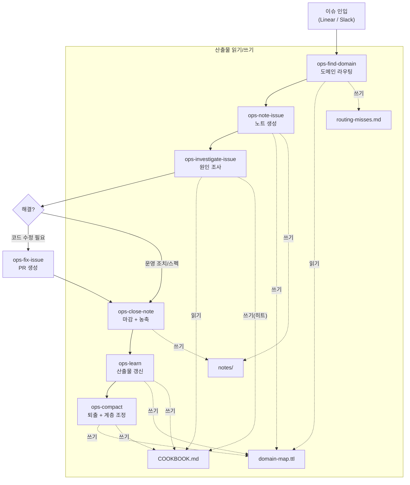
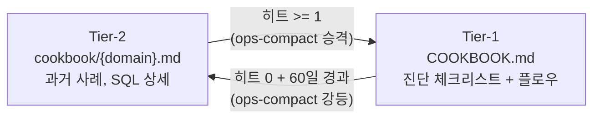
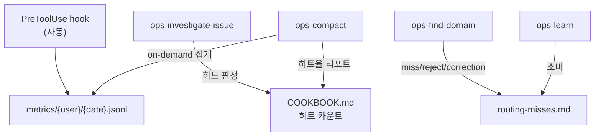
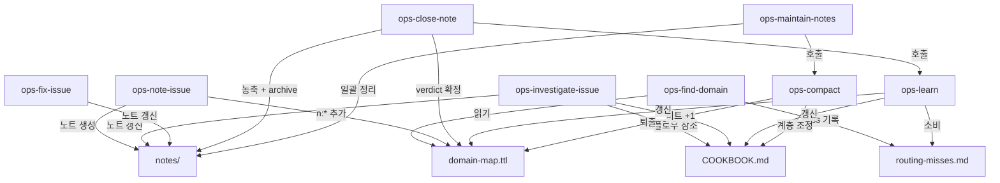

# brain 시스템 가이드

> 온콜 담당자를 위한 brain 디렉토리 동작 방식 요약.
> 상세 규칙은 `CLAUDE.md`, 온톨로지는 `ontology.md` 참조.

## 개요

`brain/` 은 온콜 이슈의 조사-기록-패턴 축적을 담당하는 지식 관리 시스템이다.
도메인 스펙은 각 서브모듈 repo에 있으며, 이 디렉토리는 **도메인 간 라우팅, 진단 패턴, 운영 절차**만 관리한다.

### 핵심 산출물

| 산출물 | 파일 | 역할 |
|--------|------|------|
| 도메인 맵 | `domain-map.ttl` | 키워드/동의어 -> 도메인 라우팅, 노트 참조 |
| 쿡북 Tier-1 | `COOKBOOK.md` | 히트 실적 있는 진단 플로우 + 체크리스트 |
| 쿡북 Tier-2 | `cookbook/{domain}.md` | SQL 템플릿, 과거 사례 상세 |
| 이슈 노트 | `notes/{ticket-id}.md` | 진행 중 이슈 조사 기록 |
| 아카이브 | `notes/archive/{ticket-id}.md` | 해결 완료 이슈 |
| 라우팅 미스 | `routing-misses.md` | 도메인 매칭 실패/거부/불일치 로그 |

---

## 지식 라이프사이클

각 단계 요약:

1. **ops-find-domain** -- `domain-map.ttl` 에서 키워드 매칭으로 도메인 특정. 실패 시 `routing-misses.md` 에 기록
2. **ops-note-issue** -- 노트 생성 + `domain-map.ttl` 에 `n:{ticket-id}` 추가
3. **ops-investigate-issue** -- `COOKBOOK.md` 플로우를 히트율 순으로 시도. 히트 시 카운트 +1
4. **ops-close-note** -- 노트 농축(증상 표현/키워드 흡수) + archive 이동 + `ops-learn` 호출
5. **ops-learn** -- `COOKBOOK`, `domain-map.ttl` 일괄 갱신
6. **ops-compact** -- 퇴출 기준에 따라 오래된 참조 제거 + COOKBOOK 계층 조정

---

## COOKBOOK Tier-1 / Tier-2 구조

| 계층 | 위치 | 내용 | 진입 조건 |
|------|------|------|-----------|
| **Tier-1** | `COOKBOOK.md` | 히트 실적 있는 진단 플로우, 체크리스트 | Tier-2에서 히트 발생 시 승격 |
| **Tier-2** | `cookbook/{domain}.md` | SQL 템플릿, 과거 사례 상세, 신규 플로우 | 신규 등록 또는 Tier-1에서 강등 |

- **승격**: Tier-2 플로우가 `investigate-issue` 에서 히트 -> `ops-compact` 실행 시 Tier-1으로 이동
- **강등**: Tier-1 플로우가 히트 0 + 추가일로부터 60일 경과 -> `ops-compact` 실행 시 Tier-2로 이동. 강등 시 트리거 표현을 `domain-map.ttl` `d:syn` 에 흡수

---

## 메트릭스 수집 흐름

| 수집처 | 형식 | 방식 | 용도 |
|--------|------|------|------|
| `metrics/{user}/{date}.jsonl` | JSONL | 자동 (PreToolUse hook) | 모든 스킬 호출 기록 (단일 소스) |
| `COOKBOOK.md` 히트 카운트 | Markdown 인라인 | `investigate-issue` 가 갱신 | 플로우별 히트 실적 |
| `routing-misses.md` | Markdown | `ops-find-domain` 기록, `ops-learn` 소비 | 라우팅 miss/reject/correction |

---

## ops 스킬 관계도

---

## 퇴출 기준 요약

`ops-compact` 에서 archive 노트의 `domain-map.ttl` 참조(`n:*`)를 제거하는 기준:

| 기준 | 조건 | 설명 |
|------|------|------|
| **R1** | `d:v = "bug"` + COOKBOOK 플로우 없음 | 코드 수정으로 해결, 재현 불가능한 버그 |
| **R2** | `d:ca` 날짜 + 90일 경과 | 농축 완료 후 충분한 시간 경과 (`d:ca` 없으면 퇴출 제외) |
| **R3** | 동일 도메인 중복 | 같은 원인/코드 위치를 기술하는 다른 노트 존재 |

퇴출 시:
- `n:{ticket-id}` 트리플을 `domain-map.ttl` 에서 삭제
- `compact-log.md` 에 이력 기록
- archive 파일 자체는 삭제하지 않음 (필요 시 직접 참조 가능)

절대 퇴출하지 않는 것: `g:*`(용어집) 항목, active 노트(`notes/` 루트)
