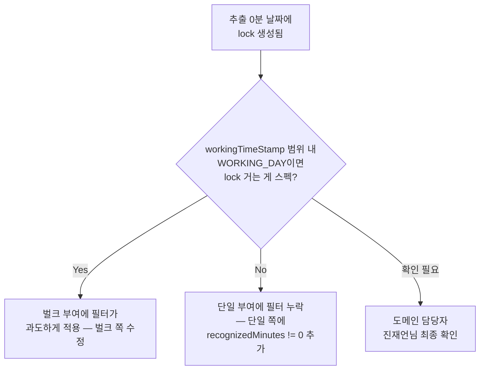

# CI-4147: 보상휴가 회수했으나 근무 수정이 안됨

> **상태**: 진행 중 — 2026-03-19

## 증상

- **문제 정의**: 보상휴가[^1]를 부여 후 회수했으나 근무 화면의 잠금(🔒)이 해제되지 않아 퇴근 기록 수정이 불가
- **회사**: 아이리스브라이트 (Customer ID: 197864)
- **요청자**: gj.jo@irisbr.com (856974)
- **대상자**: gw0914@irisbr.com (849839, userIdHash: ODzZqXXQ0R)
- **영향 범위**: 해당 구성원 1명 (동일 패턴이 다른 유저에게도 발생 가능)
- **문제 시점**: 2026-03-10 근무일
- 문의 내용[^2]:
  1. 보상휴가 부여된 일자에 퇴근 기록 수정이 필요하여 휴가 모두 회수
  2. 회수 후에도 근무 화면에서 자물쇠 표기가 사라지지 않음

## 현재까지 파악된 내용

- 3/10 날짜에 2건의 보상휴가 lock이 등록됨[^3]:
  - lock 1686098 (assign 161264, 3분) → 회수 완료, lock 취소됨 ✅
  - lock 1697307 (assign 161513, 215분) → 미회수, lock 유지 중 🔒
- assign 161513의 보상휴가는 **사용 이력 없음** → 회수 시 lock 해제 가능[^4]
- assign 161513의 `apply_working_time_stamp`: 3/11 00:00 → 3/12 00:00 KST[^5]
- assign 161513의 `assign_times`: date=3/11, WORKING_DAY, 야간 215분 인정[^6]
- **그런데 lock은 3/10에도 존재** — assign_times에 3/10 데이터가 없음에도 lock_1697307이 3/10을 커버[^3]

## 원인 분석

**단일 부여 API에서 초과근무가 인정되지 않은 날짜(3/10)에도 근무 잠금이 생성되는 현상.**

### 핵심 증거

1. **부여 API 요청** (2026-03-13 12:28:28 KST)[^7]:
   - `workingTimeStampFrom`: 1772982000000 (3/9 00:00 KST → 커버 날짜: 3/9, 3/10, 3/11)
   - `compensatoryTimeOffMinutesToAssign`: night=215
   - `dayWorkTypes`: [WORKING_DAY, WEEKLY_UNPAID_HOLIDAY, WEEKLY_PAID_HOLIDAY, PERIOD]

2. **부여 API 응답**의 `dailyExceededWorkReconizedTimes`[^7]:
   - 3/10: NIGHT 5분 초과 / 부여가능 3분 (이미 assign 161264에서 부여 완료)
   - 3/11: NIGHT 430분 초과 / 부여가능 215분
   - → 실제 추출: **3/10에서 0분, 3/11에서 215분**

3. **DB 저장 vs lock 생성 불일치**[^6][^3]:
   - `assign_times`: 3/11만 저장 (3/10은 추출 0분이라 미저장)
   - `lock_event`: 3/10 + 3/11 **두 건** 생성

### 가설 목록

| # | 가설 | 확인 방법 | 상태 |
|---|------|----------|------|
| 1 | 고객이 보상휴가를 모두 회수하지 않음 | withdrawal 테이블 조회 | ✅ 확정 — assign 161264만 회수, 161513 미회수[^8] |
| 2 | assign 161513이 사용되어 회수해도 lock 해제 불가 | v2_user_time_off_use 조회 | ❌ 소거 — 사용 이력 0건[^4] |
| 3 | 단일 부여 경로에서 추출 0분인 날짜에도 lock 생성 | 코드 + access log + DB 비교 | ✅ 확정 — response에서 3/10 추출 0분, 하지만 lock 존재[^7][^3] |

📋 부여~잠금 발생 타임테이블

**① 2026-03-13 12:28:28 KST — 보상휴가 부여 API**
- traceId: `274fd35be7265f460f7ad9d7afc69d41`
- POST /api/v3/.../users/ODzZqXXQ0R/compensatory-time-off-assigns (200, 647ms)
- workingTimeStampFrom: 1772982000000 (3/9 KST) → workingTimeStampTo: 1773241200000 (3/12 KST)
- NIGHT 215분 부여 요청 → 3/10에서 0분, 3/11에서 215분 추출

**② 동시 — assign_times DB 저장**
- `createCompensatoryTimeOffAssignTimes` 에서 recognized != 0 필터 → 3/11만 저장

**③ 동시 — lock 생성**
- `extractedCompensatoryAssignTimes.compensatoryTimeOffAssignTimes` 를 필터 없이 순회
- lock_1697307: 3/10 00:00→3/11 00:00 KST (추출 0분인데 lock 생성)
- lock_1697308: 3/11 00:00→3/12 00:00 KST (추출 215분, 정상)

**④ 2026-03-18 11:47:54 KST — assign 161264 회수**
- LOCK_CANCEL(ref=1686098) 생성 → 3/10의 lock 하나 해제
- 하지만 lock_1697307 (assign 161513)은 여전히 active

**⑤ 2026-03-18 15:47:27 KST — 고객 근무 조회**
- traceId: `ca8b469eb6eef85e1a54db3537aad5dd`
- date-attributes 응답: 3/10🔒, 3/11🔒

📊 DB 조회 결과 — lock 이벤트 + assign 데이터

**lock 이벤트 (v2_user_work_schedule_lock_event WHERE user_id=849839 AND date_from='2026-03-10'):**

| lock_id | event_type | trigger(assign_id) | lock ts (KST) | assign_times ts (KST) | 일치 |
|---------|-----------|-------------------|---------------|----------------------|------|
| 1686098 | LOCK_REGISTER | 161264 | 3/10→3/11 | 3/10→3/11 | ✅ (취소됨) |
| 1702637 | LOCK_CANCEL | 161264 | ref=1686098 | — | — |
| **1697307** | **LOCK_REGISTER** | **161513** | **3/10→3/11** | **3/11→3/12** | **❌ 불일치** |

**보상휴가 부여 (v2_user_compensatory_time_off_assign):**

| assign_id | custom_time_off_id | 분 | apply_from (KST) | apply_to (KST) | 회수 |
|-----------|-------------------|-----|-----------------|----------------|------|
| 161264 | 1655021 | 3 | 3/10 | 3/11 | ✅ |
| 161513 | 1658702 | 215 | 3/11 | 3/12 | ❌ |

**부여 근거 (v2_user_compensatory_time_off_assign_times WHERE assign=161513):**

| date_from | date_to | day_work_type | 인정 시간 |
|-----------|---------|--------------|----------|
| 3/11 | 3/11 | WORKING_DAY | 215분 (야간) |
| (3/10) | (3/10) | (WORKING_DAY) | **(0분 — DB 미저장, lock만 생성)** |

**사용 이력 (v2_user_time_off_use WHERE assign=1658702):** 0건

### 코드 분석 — 벌크 부여 vs 단일 부여 비대칭

> 💡 **판단 근거**: 단일 부여와 벌크 부여가 lock 생성 시 서로 다른 데이터 소스를 순회한다. 벌크는 DB 저장 후 데이터(0분 필터 완료)를, 단일은 추출 원본(0분 포함)을 사용한다.

**단일 부여** (`assignCompensatoryTimeOffToUser`, line 423-450)[^9]:
- `extractedCompensatoryAssignTimes.compensatoryTimeOffAssignTimes` 를 **필터 없이** 순회하여 lock 생성
- 추출 0분인 날짜(3/10)도 컬렉션에 포함 → lock 생성됨

**벌크 부여** (`bulkAssignCompensatoryTimeOffToUsers`, line 258-292)[^10]:
- DB에 저장된 `savedUserCompensatoryTimeOffAssignWithTimes` 를 순회
- `createCompensatoryTimeOffAssignTimes` (line 585)에서 `recognizedMinutes != 0` 필터 후 저장[^11]
- → 0분 항목은 DB에 없으므로 lock도 생성 안 됨

**진재언님 확인** (Slack 스레드)[^12]:
- "보상휴가 잠금은 반드시 보상휴가 회수를 통해 풀어야 한다"
- "사용된 이력이 없는 상태에서 회수해야 한다"
- "10~12니까 10일, 11일 아닌가요?" — workingTimeStamp 범위 기준으로 3/10, 3/11 lock이 맞을 수 있다는 뉘앙스

### 스펙 vs 버그 판별

**판정: 확인 필요 — 벌크/단일 부여 간 비대칭이 의도인지 여부**

- workingTimeStamp 범위(3/9~3/12)에서 WORKING_DAY인 3/10, 3/11에 lock을 거는 것이 의도된 스펙이라면 → 벌크 부여에 필터가 과도하게 적용된 것
- 인정된 초과근무가 있는 날짜에만 lock을 거는 것이 스펙이라면 → 단일 부여에 필터가 누락된 버그
- 도메인 담당자(진재언님) 최종 확인 필요

## 코드 위치

| 역할 | 위치 |
|------|------|
| 단일 부여 lock 생성 (핵심) | `flex-timetracking-backend` > compensatory-time-off/service/.../UserCompensatoryTimeOffAssignUpdateService.kt:423-450 |
| 벌크 부여 lock 생성 | 같은 파일:258-292 |
| assign_times DB 저장 필터 | 같은 파일:585 (`recognizedMinutes != 0`) |

📋 전체 코드 위치

| 역할 | 위치 |
|------|------|
| Lock 해제 조건 (회수 시) | compensatory-time-off/service/.../UserCompensatoryTimeOffWithdrawService.kt:85-96 |
| Lock 이벤트 Entity | work-schedule/repository/.../UserWorkScheduleLockEventEntity.kt (테이블: v2_user_work_schedule_lock_event) |
| Lock 생성 구현 | work-schedule/service/.../UserWorkScheduleLockUpdateServiceImpl.kt:140-171 (createLockEntity) |
| Lock 활성 판별 | work-schedule/service/.../filter/UserWorkScheduleLockEventPackActiveFilter.kt:10-37 |
| 보상휴가 부여 Entity | compensatory-time-off/repository/.../UserCompensatoryTimeOffAssignEntity.kt |
| 부여 근거 Entity | compensatory-time-off/repository/.../UserCompensatoryTimeOffAssignTimesEntity.kt |
| 회수 기록 Entity | time-off/repository/.../UserCustomTimeOffAssignWithdrawal.kt |
| 사용 이력 Entity | time-off/repository/.../UserTimeOffUse.kt (테이블: v2_user_time_off_use) |

## 해결안 / 조사 방향

### 즉시 대응 — assign 161513 회수

- assign 161513의 보상휴가는 **사용 이력 없음** (v2_user_time_off_use 0건)[^4]
- 회수하면 `cancelLock` 이 `trigger_id=161513` 인 LOCK_REGISTER를 전부 찾아 LOCK_CANCEL 생성[^13]
- lock_1697307(3/10) + lock_1697308(3/11) 모두 해제됨
- > ⚠️ 고객이 이 보상휴가를 회수하고자 하는 것인지 확인 필요 — 회수하면 215분 보상휴가도 사라짐

### 근본 원인 확인 — 벌크/단일 비대칭

- 도메인 담당자에게 확인: 추출 0분인 날짜에도 lock을 거는 것이 의도된 스펙인지?
- 의도적이라면 → 벌크 부여도 동일하게 lock을 걸어야 함 (벌크 쪽 수정)
- 의도적이지 않다면 → 단일 부여에 `recognizedMinutes != 0` 필터 추가 (단일 쪽 수정)

## 연관 이슈

- [CI-3858](./archive/CI-3858.md): 보상휴가 부여 시 '부여가능한 시간 없음' — 동일 보상휴가 도메인, 부여/조회 간 비대칭 패턴 참고

## 참고 자료

- [Linear 이슈](https://linear.app/flexteam/issue/CI-4147)
- [Slack 스레드](https://flex-cv82520.slack.com/archives/CRU35U9FC/p1773811175831909)
- [Intercom 대화](https://app.intercom.com/a/apps/xj5aqcy9/conversations/215473526541697)
- [부여 API access log](https://log-dashboard.grapeisfruit.com/_dashboards/app/discover#/doc/f16cda60-f2fb-11ee-9a9d-4b897330ccb0/flex-app.be-access-2026.03.13?id=b585e321-c203-4edd-8cd0-c6c0440bdb89)
- [Metabase 회사 정보](https://metabase.dp.grapeisfruit.com/dashboard/256?customer_id=197864)
- [Metabase 대상자 정보](https://metabase.dp.grapeisfruit.com/question/5699?customer_id=197864&email=gw0914%40irisbr.com)

## 미결 사항

- [x] 3/10 잠금 원인 추적 (assign 161513의 lock 2건 생성 확인)
- [x] assign 161513 사용 이력 확인 → 0건, 회수 시 lock 해제 가능
- [x] 벌크/단일 부여 코드 비대칭 확인
- [ ] 도메인 담당자 확인: 추출 0분 날짜의 lock이 스펙인지 버그인지
- [ ] 고객에게 assign 161513 회수 안내 여부 결정
- [ ] 동일 패턴이 다른 고객에서도 발생하는지 영향 범위 확인

## 각주

[^1]: 보상휴가(compensatory time off) — 초과근무에 대한 보상으로 부여되는 휴가. 초과근무기록을 원장으로 하여 계산됨
[^2]: Linear 이슈 CI-4147 설명 및 Intercom 대화, 2026-03-18
[^3]: DB: `v2_user_work_schedule_lock_event` WHERE user_id=849839 AND date_from='2026-03-10'
[^4]: DB: `v2_user_time_off_use` WHERE user_id=849839 AND user_time_off_assign_id=1658702 → 0건
[^5]: DB: `v2_user_compensatory_time_off_assign` WHERE id=161513
[^6]: DB: `v2_user_compensatory_time_off_assign_times` WHERE user_compensatory_time_off_assign_id=161513
[^7]: access log: traceId 274fd35be7265f460f7ad9d7afc69d41, 2026-03-13T03:28:28Z — [부여 API access log](https://log-dashboard.grapeisfruit.com/_dashboards/app/discover#/doc/f16cda60-f2fb-11ee-9a9d-4b897330ccb0/flex-app.be-access-2026.03.13?id=b585e321-c203-4edd-8cd0-c6c0440bdb89)
[^8]: DB: `v2_user_custom_time_off_assign_withdrawal` WHERE user_time_off_assign_id IN (1655021, 1658702) → 1655021만 회수
[^9]: 코드: `flex-timetracking-backend` > compensatory-time-off/service/.../UserCompensatoryTimeOffAssignUpdateService.kt:423-450
[^10]: 코드: `flex-timetracking-backend` > compensatory-time-off/service/.../UserCompensatoryTimeOffAssignUpdateService.kt:258-292
[^11]: 코드: `flex-timetracking-backend` > compensatory-time-off/service/.../UserCompensatoryTimeOffAssignUpdateService.kt:585 — `recognizedMinutes != 0` 필터
[^12]: Slack: #ci-4147 스레드 진재언 2026-03-19 16:24, 16:36, 16:38
[^13]: 코드: `flex-timetracking-backend` > work-schedule/service/.../UserWorkScheduleLockUpdateServiceImpl.kt:84-120 — cancelLock은 trigger_id로 모든 LOCK_REGISTER를 찾아 LOCK_CANCEL 생성
