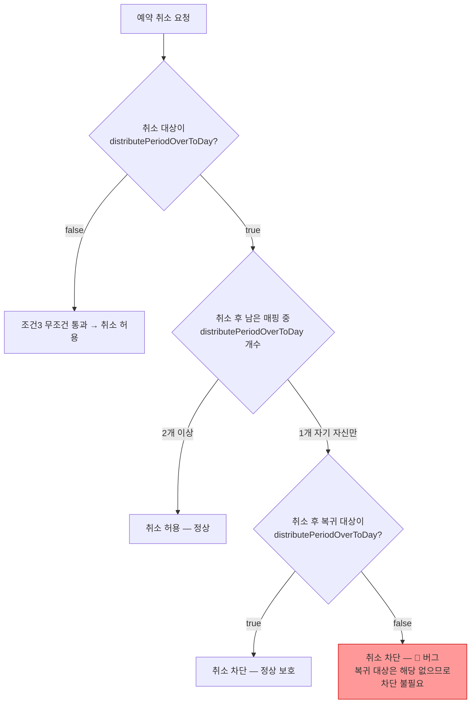

# CI-4148: 근무유형 변경 예약 취소가 안됨

> **상태**: 수정 PR 제출 — 2026-03-18
> **PR**: https://github.com/flex-team/flex-timetracking-backend/pull/12027

## 증상
- **문제 정의**: 근무유형 변경 예약 취소가 안되며, 일괄 변경 시도 시에도 오류 발생
- **회사**: 앱솔브랩 (Customer ID[^8]: 127024)
- **요청자**: hulee@celimax.co.kr[^1]
- **대상자**: lolita@celimax.co.kr 외 37명 (총 42명)[^1]
- **영향 범위**: 42명 + 다른 고객사에서도 동일 케이스 발생 확인됨[^7]
- **문제 시점**: 2026-03-17 근무유형 생성, 3/23 적용 예약[^1]
- 문의 내용:
  1. 9시-6시 근무유형을 3/23 날짜로 10시-7시 근무유형으로 변경 시도[^1]
  2. "10-7시_260317" 근무유형이 생성되며 42명 구성원에 대해 3/23 수정 예약됨[^1]
  3. 롤백 시도 — 구성원별로 들어가서 예약 취소하려 했으나 예약 취소 불가[^1]
  4. 근무 정보 일괄 변경 시도 (42명 체크 후 9시-6시 유지, 근무유형 적용일만 3/20 등으로 수정) — 오류 발생, 오류 알람도 확인 불가[^1]

## 현재까지 파악된 내용
- 근무유형 변경 예약[^2] 후 개별 구성원의 예약 취소가 동작하지 않는 상태 — **버그 확정** (상세는 원인 분석 참조)[^1]
- 일괄 변경으로 우회 시도했으나 오류 발생, 오류 메시지도 확인 불가[^1]
- 다른 고객사에서도 동일 케이스 발생 확인됨[^7]
- 도메인: `flex-timetracking-backend` > `/work-rule` (근무유형 관련 모듈)

## 원인 분석

**버그 확정**: 예약 취소 검증 로직(`UserWorkRuleAllowCancelMappingCalculator`)의 조건3이 `distributePeriodOverToDay` 컬럼값만 확인하고, `applyStartDateForDistributePeriodOver`를 고려하지 않아, 실질적으로 주기연장일귀속[^5]인 근무유형을 false로 잘못 판단한다.[^11]

**핵심 증거:**
- Access log: `DELETE /api/v2/work-rule/users/jkEgLXRm8p/work-rules/1466343` → HTTP 400 `WORKRULE_400_005` "근무 유형을 취소할 수 없어요"[^9]
- 스택트레이스: `UserWorkRuleCannotRemoveException` at `UserWorkRuleUpdateServiceImpl.validateForRemove:326`[^9]
- DB: 복귀 대상(181404, "9시-6시")의 `distribute_period_over_to_day=NULL` 이지만 `apply_start_date_for_distribute_period_over=2026-02-02` → 오늘(3/18) 기준 실질적 주기연장일귀속[^10][^11]
- Calculator는 `customerWorkRule.distributePeriodOverToDay`(컬럼값=false)만 확인 → 181404를 주기연장일귀속으로 카운트하지 않음[^6]
- `WorkingHourRuleProps.getDistributePeriodOverToDayByWorkingPeriod()`에는 이미 `applyStartDate` 고려 로직이 있으나, Calculator가 이를 사용하지 않음[^11]

### 가설 목록

| # | 가설 | 확인 방법 | 상태 |
|---|------|----------|------|
| 1 | 취소 검증 로직의 `distributePeriodOverToDay` 조건이 취소 대상만 보고 잘못 차단 | 코드 정적 분석 + Slack 스레드의 김주원 분석 확인 | ✅ 확정 |
| 2 | 일괄 변경 API에서 별도의 validation 실패 | access log 확인 필요 | 🔍 추가 확인 필요 |

### 조사 과정

> 💡 **판단 근거**: Slack 스레드에서 김주원 분석[^4] → `UserWorkRuleAllowCancelMappingCalculator` 코드 직접 확인[^6] → 조건3(line 91-107) 로직 검증 → 버그 확정

<details>
<summary>📋 취소 가능 조건 3가지 (코드 분석)</summary>

`flex-timetracking-backend` > `work-rule/domain/src/main/kotlin/team/flex/workrule/user/UserWorkRuleAllowCancelMappingCalculator.kt`

**3가지 조건을 동시에 만족해야 취소 가능:**

1. **isLastAppliedUserWorkRule** (line 74-81): 유저 기준 마지막에 매핑된 근무유형이어야 함
2. **isAppliedAtFuture** (line 83-89): 미래에 매핑된 근무유형이어야 함 (예약된 것만 취소 가능)
3. **isAppliedNotUniqueNewWorkRule** (line 91-107): 취소 대상이 `distributePeriodOverToDay=true`인 경우, 전체 매핑 중 `distributePeriodOverToDay=true`인 것이 2개 이상이어야 함

**버그 발생 지점 — 조건3 (line 95-107):**
```kotlin
val isAppliedNotUniqueNewWorkRule =
    if (targetCustomerWorkRule.distributePeriodOverToDay) {
        allMappedUserWorkRule
            .filter { userWorkRule ->
                customerWorkRules
                    .first { it.customerWorkRuleId == userWorkRule.customerWorkRuleIdentity.customerWorkRuleId }
                    .distributePeriodOverToDay
            }
            .size != 1  // ← 1개뿐이면 취소 차단
    } else {
        true
    }
```

**이 케이스에서의 동작:**
1. 유저 매핑: [9-6시(`distributePeriodOverToDay=false`)] + [10-7시_260317(`distributePeriodOverToDay=true`)]
2. 취소 대상: 10-7시_260317 → `distributePeriodOverToDay=true`이므로 조건3 진입
3. 전체 매핑 중 `distributePeriodOverToDay=true` 개수 = 1개 (10-7시 자신만 해당)
4. `size != 1` → `false` → **취소 차단**

**올바른 동작**: 취소 후 복귀 대상(9-6시)이 `distributePeriodOverToDay=false`이므로, 취소 후 `distributePeriodOverToDay` 매핑이 0개가 되어도 무방. 취소가 허용되어야 함.

</details>

<details>
<summary>📋 검증이 호출되는 위치</summary>

`flex-timetracking-backend` > `work-rule/service/src/main/kotlin/team/flex/workrule/user/UserWorkRuleUpdateServiceImpl.kt:302-328`

```kotlin
private fun validateForRemove(...) {
    val allowCancelMapping = UserWorkRuleAllowCancelMappingCalculator
        .calculateAllowCancelMapping(...)
        .first { it.userWorkRuleModel.userWorkRuleIdentity.userWorkRuleId == targetUserWorkRuleIdentity.userWorkRuleId }
        .allowCancelMapping

    if (!allowCancelMapping) {
        throw UserWorkRuleCannotRemoveException()  // → HTTP 400
    }
}
```

`UserWorkRuleCannotRemoveException`은 `FlexBadRequestException`을 상속하여 HTTP 400을 반환.[^6]

</details>

### 5 Whys

1. **왜 예약 취소가 안 되는가?** → `UserWorkRuleCannotRemoveException` 발생 (HTTP 400)[^3]
2. **왜 예외가 발생하는가?** → `allowCancelMapping = false`로 계산됨[^6]
3. **왜 false인가?** → 조건3에서 `distributePeriodOverToDay=true`인 매핑이 1개뿐이라 취소 차단[^6]
4. **왜 1개뿐이면 차단하는가?** → 취소 후 주기연장일귀속[^5] 매핑이 0개가 되는 것을 방지하는 의도[^6]
5. **(근본 원인) 왜 이것이 문제인가?** → 검증이 "취소 후 상태"가 아닌 "취소 대상"만 확인하므로, 복귀 대상이 주기연장일귀속이 아닌 경우에도 취소를 차단하는 의도하지 않은 사이드이펙트[^4]

### 스펙 vs 버그 판별

**버그** ✅



- 검증 로직의 **의도**: 취소 후 주기연장일귀속 매핑이 0개가 되어 문제가 생기는 것을 방지[^4]
- **현실**: 취소 후 복귀 대상(9-6시)은 원래 주기연장일귀속이 아니므로, 0개가 되어도 문제 없음[^4]
- **결론**: 검증 조건이 과도하게 넓어, 의도하지 않은 상황까지 차단하고 있음

## 코드 위치

| 파일 | 역할 |
|------|------|
| `flex-timetracking-backend` > `work-rule/domain/.../UserWorkRuleAllowCancelMappingCalculator.kt:91-107` | **버그 위치** — 조건3 검증 로직 |
| `flex-timetracking-backend` > `work-rule/service/.../UserWorkRuleUpdateServiceImpl.kt:302-328` | 검증 호출 및 예외 발생 |
| `flex-timetracking-backend` > `work-rule/exception/.../UserWorkRuleCannotRemoveException.kt` | 400 에러 응답 |

## 수정 시 사이드이펙트 포인트

| # | 영향 지점 | 위험도 | 설명 |
|---|----------|--------|------|
| 1 | `UserWorkRuleMappingService` (API 레이어) | 🟢 | `allowCancelMapping` 값을 프론트엔드에 내려주는 역할. 로직 변경의 영향 없음 |
| 2 | `UserWorkRuleUpdateServiceImpl` (서비스 레이어) | 🟡 | 실제 삭제 수행 전 검증. 조건 완화 시 기존에 차단되던 케이스가 허용됨 — 정상적으로 주기연장일귀속이 필요한 유저의 마지막 매핑 삭제도 허용되지 않도록 주의 필요 |
| 3 | 기존 데이터 정합성 | 🟢 | 조건 수정은 미래 요청에만 영향. 이미 저장된 데이터에는 영향 없음 |
| 4 | 다른 고객사 동일 케이스 | 🟡 | 김현욱님 보고에 따르면 다른 고객사에서도 동일 문제 발생 중[^7]. 수정 배포 시 함께 해결됨 |

## 해결

### 수정 PR
- **PR**: https://github.com/flex-team/flex-timetracking-backend/pull/12027 (draft)
- **브랜치**: `fix/CI-4148`

### 수정 내용
- `UserWorkRuleAllowCancelMappingCalculator`에 `isEffectivelyDistributePeriodOverToDay()` 헬퍼 함수 추가[^12]
- 조건3에서 `distributePeriodOverToDay` 컬럼값 + `applyStartDateForDistributePeriodOver` 함께 고려
- 테스트 3개 추가: CI-4148 재현, applyStartDate 미도래, applyStartDate null

### 미해결
- 일괄 변경(문의 4번) 실패의 정확한 원인은 별도 traceId access log 확인 필요 — 동일 검증 로직에 걸렸을 가능성 높음

## 참고 자료
- Slack 스레드: https://flex-cv82520.slack.com/archives/CRU35U9FC/p1773813100570109
- 400 에러로그: https://log-dashboard.grapeisfruit.com/_dashboards/app/discover#/doc/f16cda60-f2fb-11ee-9a9d-4b897330ccb0/flex-app.be-access-2026.03.18?id=801195f2-d25e-4973-8d4a-d687c20873ac [^3]
- Intercom: https://app.intercom.com/a/apps/xj5aqcy9/conversations/215473513131324
- Metabase 회사 정보: https://metabase.dp.grapeisfruit.com/dashboard/256?customer_id=127024
- Linear: https://linear.app/flexteam/issue/CI-4148/근무유형-변경-예약-취소가-안됨
- 김주원 분석 (Slack): 취소 가능 조건 스크린샷 + 버그 판단 근거[^4]

## 연관 이슈
- [CI-4180](./CI-4180.md): 동일 고객사(앱솔브랩)에서 근무유형 적용 시 500 오류 발생. 예약 취소 과정에서 데이터 정합성이 깨져 매핑 없음 상태가 된 것으로 추정

## 미결 사항
- [x] 근무유형 변경 예약 취소 기능의 코드 확인 — 어떤 조건에서 취소가 차단되는지
- [x] Access log 확인 — `DELETE /api/v2/work-rule/users/jkEgLXRm8p/work-rules/1466343` → 400 `WORKRULE_400_005`[^9]
- [x] DB 데이터 확인 — 취소 대상 `distribute_period_over_to_day=1`, 복귀 대상 `NULL`(+ `apply_start_date=2026-02-02`)[^10]
- [x] 수정 PR 제출 — https://github.com/flex-team/flex-timetracking-backend/pull/12027 [^12]
- [ ] 일괄 변경 시 발생하는 오류의 원인 파악 (별도 traceId access log 확인 필요)
- [ ] PR 리뷰 및 머지
- [ ] 배포 후 앱솔브랩(127024) 42명 예약 취소 가능 확인

## 각주
[^1]: Linear 이슈 설명, CI-4148, 2026-03-18
[^2]: 근무유형 변경 예약 — 특정 날짜부터 구성원의 근무유형을 다른 유형으로 변경하도록 예약하는 기능. `flex-timetracking-backend` 의 `/work-rule` 모듈에서 관리
[^3]: 이지선, Slack 스레드 2026-03-18 14:56 KST — 400 에러로그 링크 공유
[^4]: 김주원, Slack 스레드 2026-03-18 15:29 KST — 코드 정적 분석 결과, 버그로 판단
[^5]: 주기연장일귀속(`distributePeriodOverToDay`) — 근무유형의 속성으로, 연장근무 시간을 해당 근무일에 귀속시킬지 여부를 결정하는 플래그
[^6]: `flex-timetracking-backend` > `work-rule/domain/src/main/kotlin/team/flex/workrule/user/UserWorkRuleAllowCancelMappingCalculator.kt:91-107`, `work-rule/service/src/main/kotlin/team/flex/workrule/user/UserWorkRuleUpdateServiceImpl.kt:302-328`, `work-rule/exception/src/main/kotlin/team/flex/workrule/exception/UserWorkRuleCannotRemoveException.kt`
[^7]: 김현욱, Slack 스레드 2026-03-18 17:29 KST — 동일 케이스로 다른 고객사에서도 확인 요청 인입
[^8]: Customer ID — Linear에서 고객사를 식별하는 ID. flex 내부의 company_id와는 다른 값이다.
[^9]: Access log (prod), traceId: `6e2e12f6e20e9abb99b7ceafaa1dea56`, 2026-03-18 14:52:08 KST — `DELETE /api/v2/work-rule/users/jkEgLXRm8p/work-rules/1466343` → 400 `WORKRULE_400_005`, 요청자: hulee@celimax.co.kr(userId:894491), 대상: userId:529379
[^10]: DB 조회 (prod `flex.v2_user_work_rule`, `flex.v2_customer_work_rule`), 2026-03-18 — userWorkRuleId=1466343(customerWorkRuleId=267146, `distribute_period_over_to_day=1`), 복귀 대상 userWorkRuleId=853613(customerWorkRuleId=181404, `distribute_period_over_to_day=NULL`, `apply_start_date_for_distribute_period_over=2026-02-02`)
[^11]: `flex-timetracking-backend` > `work-rule/model/src/main/kotlin/team/flex/workrule/WorkingHourRuleProps.kt:94-105` — `getDistributePeriodOverToDayByWorkingPeriod()` 함수에서 `applyStartDateForDistributePeriodOver` 고려 로직이 이미 존재하나, `UserWorkRuleAllowCancelMappingCalculator` 에서는 사용하지 않음
[^12]: 수정 PR — https://github.com/flex-team/flex-timetracking-backend/pull/12027, 브랜치 `fix/CI-4148`, `isEffectivelyDistributePeriodOverToDay()` 헬퍼 함수 추가
