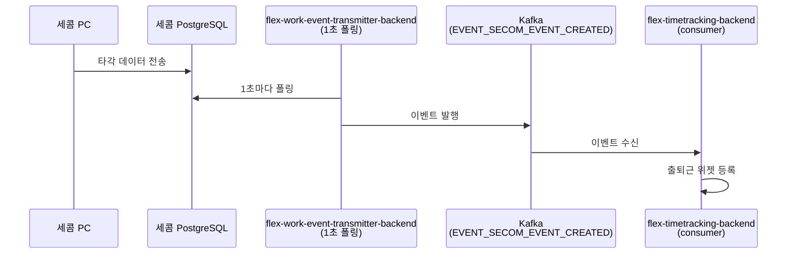

# CI-4157: 세콤 출퇴근 연동 확인 요청

> **상태**: 조사 완료 — 3/18 잔존 위젯으로 인한 dry-run validation 실패 (확정, 2026-03-19)

## 증상

- **문제 정의**: 세콤 PC가 꺼진 이후 수동전송 + PC 재가동했으나 퇴근/출근이 flex에 반영되지 않음. 진행 중인 위젯이 잔존하는 상태[^1]
- **회사**: 주식회사 크로노스튜디오 (Customer ID: 185358)
- **요청자**: jiwon.yoo (CS)
- **대상자**: jyyun (jyyun@chronostudio.net, userId: 853218)
- **영향 범위**: 해당 유저 1인 (전사 영향 여부 미확인)
- **문제 시점**: 2026-03-18 오후 5시경 수동전송 이후 ~ 현재
- 문의 내용:
  1. 전일(3/18) 세콤 PC가 꺼져서 오후 5시경 수동전송 + 세콤 PC를 다시 킴[^1]
  2. 이후 퇴근/출근이 플렉스에 반영되지 않음[^1]
  3. 진행 중인 위젯이 존재한다고 CS 보고[^1]

---

## 현재까지 파악된 내용

### 세콤 연동 설정

- 연동 설정: id=253, SECOM, active=true, workClockRegisterEnabled=true[^2]
- 연동 자체는 활성화 상태

### 세콤 이벤트 전달 경로

### 3/18 수동전송 시점 이벤트

3/18 17시경 수동전송 후 벌크 처리된 출근 위젯 등록이 확인됨[^3]:

| 시간 (KST) | 이벤트 | 비고 |
|---|---|---|
| 3/18 17:07~17:17 | 여러 유저 출근 위젯 wet-run (userId: 859648, 897076, 775913, 764255, 668690) | 수동전송 시점 벌크 처리 |
| 3/18 19:11 | ServerTriggeredUserWorkClockStopServiceImpl — STOP 등록 성공 | 서버 트리거 자동 퇴근 |
| 3/18 21:39 | ServerTriggeredUserWorkClockStopServiceImpl — STOP 등록 시도 결과 | 서버 트리거 자동 퇴근 |
| 3/19 09:38 | 위젯 상태 조회 (2-A) — **targetDate=3/18** | 3/19에도 3/18 위젯 상태 확인 중 |

### 3/19 이벤트 수신 확인

> ⚠️ **기존 판단 수정**: 초기 조사에서 "3/19 출근 이벤트 0건"으로 판단했으나[^3], 추가 DB 조회 결과 3/19 WORK_START 이벤트 3건이 정상 수신된 것으로 확인됨[^4]. 초기 로그 검색은 customerId 기준이었고, userId 기준 검색에서 이벤트가 발견됨.

---

## 원인 분석

**L1 (한 줄 요약):** 3/18 근무 위젯이 미종료 상태로 잔존하여, 3/19 출근 세콤 이벤트가 dry-run validation에서 차단됨 (WORK_CLOCK_START_CONTINUOUS_NOT_ALLOWED 추정)

### 가설 목록

| # | 가설 | 확인 방법 | 상태 |
|---|------|----------|------|
| 1 | ContinuousStartException[^6]으로 consumer 단계에서 차단 | consumer WARN 로그 | ❌ 소거 — exception이 아닌 dry-run validation 단계에서 차단[^7] |
| 2 | 세콤 PC→PostgreSQL 전송 미복구로 이벤트 미수신 | DB 이벤트 테이블 | ❌ 소거 — 3/19 WORK_START 이벤트 3건 정상 수신[^4] |
| 3 | 이전 근무 위젯 미종료 → dry-run validation 실패 | consumer 로그 + CS 보고 | ✅ 확정[^8] |

### 조사 과정 (L2 — 최종 확정 판단 경로)

> 💡 **판단 근거**: consumer 로그 WARN 0건[^7] → 가설1 소거 → DB에 3/19 이벤트 존재[^4] → 가설2 소거 → `UserWorkClockStartByDraftEventServiceImpl` "validation 실패" 로그 발견[^8] + CS "진행중인 위젯존재" 보고[^1] → 이전 위젯 미종료가 원인 → 가설3 확정

### 5 Whys

1. **왜 3/19 출근이 반영 안 되는가?** → dry-run validation에서 실패하여 위젯이 등록되지 않음[^8]
2. **왜 validation이 실패했는가?** → 이전 근무 세션(3/18)의 위젯이 아직 종료되지 않은 상태
3. **왜 3/18 위젯이 종료되지 않았는가?** → (추가 확인 필요) 3/18 WORK_STOP 이벤트 5건이 수신되었으나 위젯 종료가 정상 처리되지 않았을 가능성[^4]
4. **왜 STOP이 처리되지 않았을 수 있는가?** → 3/18 수동전송 시 START 이벤트 자체가 DisabledWidget(userId 668668) 등의 이유로 위젯이 미생성 → 위젯이 없는 상태에서 STOP도 무효

### 스펙 vs 버그

**스펙** — 이전 근무 위젯이 종료되지 않은 상태에서 새 출근 차단은 의도된 동작. 문제는 3/18 위젯이 정상 종료되지 않은 상황.

📋 OpenSearch 로그 조사 상세 (초기 조사)

**검색 조건:**
- 환경: prod
- 인덱스: flex-app.be-api-2026.03.18, flex-app.be-api-2026.03.19
- 시간: 2026-03-18 08:00 ~ 2026-03-19 12:00 KST
- 앱: flex-prod-prod-time-tracking-consumer

**발견된 이벤트 (customerId 185358):**

| 시간 (KST) | 이벤트 | 비고 |
|---|---|---|
| 3/18 17:07~17:17 | 여러 유저 출근 위젯 wet-run (userId: 859648, 897076, 775913, 764255, 668690) | 수동전송 시점 벌크 처리 |
| 3/18 19:11 | ServerTriggeredUserWorkClockStopServiceImpl — STOP 등록 성공 | 서버 트리거 자동 퇴근 |
| 3/18 21:39 | ServerTriggeredUserWorkClockStopServiceImpl — STOP 등록 시도 결과 | 서버 트리거 자동 퇴근 |
| 3/19 09:38 | 위젯 상태 조회 (2-A) — **targetDate=3/18** | 3/19에도 3/18 위젯 상태 확인 중 |

**3/19 출근 이벤트: customerId 기준 0건** — 이후 userId 기준 추가 조사에서 3건 발견[^4]

**transmitter 로그 (flex-prod-prod-work-event-transmitter-cron):**
- 3/18~19 WARN: 0건
- 3/18~19 ERROR: 0건
- → 세콤 PostgreSQL 연결 자체는 정상

📋 DB 조회: jyyun(853218) 세콤 이벤트

**쿼리:** `v2_user_external_provider_event WHERE customer_external_provider_id = 253 AND user_id = 853218 AND event_time >= '2026-03-17'`

jyyun의 3/17 이후 세콤 이벤트 전체 목록. 3/18 수동전송분(17:06 일괄 created_at)과 3/19 정상 수신분이 명확히 구분된다[^4].

| event_time (KST) | event_type | created_at (KST) | 비고 |
|---|---|---|---|
| 3/18 09:51 | WORK_START | 17:06 | 수동전송 |
| 3/18 13:16 | WORK_START | 17:06 | 수동전송 |
| 3/18 14:08 | WORK_START | 17:06 | 수동전송 |
| 3/18 16:05 | WORK_START | 17:06 | 수동전송 |
| 3/18 16:10 | WORK_START | 17:06 | 수동전송 |
| 3/18 19:37 | WORK_STOP | 19:39 | 정상 수신 |
| 3/18 19:39 | WORK_STOP | 19:41 | 정상 수신 |
| 3/18 19:40 | WORK_STOP | 19:41 | 정상 수신 |
| 3/18 20:27 | WORK_STOP | 20:27 | 정상 수신 |
| 3/18 22:16 | WORK_STOP | 22:17 | 정상 수신 |
| **3/19 09:53** | **WORK_START** | **09:54** | **위젯 등록 실패** |
| 3/19 12:48 | WORK_START | 12:49 | 위젯 등록 실패 (추정) |
| 3/19 13:40 | WORK_START | 13:41 | 위젯 등록 실패 (추정) |

> ⚠️ 3/18 수동전송 시 START만 5건이고 STOP은 0건. created_at이 모두 17:06으로 동일하여 수동전송 벌크임을 확인. 이후 19:37~22:16에 STOP 5건이 정상 수신되었으나, 위젯이 종료되지 않은 상태로 남아 있음.

📋 OpenSearch 로그: 3/19 09:54 KST 이벤트 처리 흐름

인덱스: `flex-app.be-api-2026.03.19`, app: `flex-prod-prod-time-tracking-consumer`

3/19 09:53 출근 이벤트의 consumer 처리 흐름. draft 등록까지는 성공했으나 dry-run validation에서 최종 차단됨[^8].

| 순서 | 시간 (UTC) | 로거 | 메시지 |
|---|---|---|---|
| 1 | 00:54:30.012 | UserWorkClockDraftEventRegisterServiceImpl | 같은 날짜의 이벤트가 없으므로 등록 가능 |
| 2 | 00:54:30.013 | ExternalWorkClockEventRegisterServiceImpl | added 'START' draft event (eventId=14278130 / draftId=5528045) |
| 3 | 00:54:30.078 | UserWorkClockStartByDraftEventServiceImpl | dry-run 시작 (윤정윤, REGULAR) |
| 4 | 00:54:30.084 | UserWorkClockStartByDraftEventServiceImpl | 출근 시간 판단: onTime=false (09:53 vs 10:00) |
| 5 | 00:54:30.085 | TrackingWorkplaceRestrictionServiceImpl | 근무지 제한 검증 통과 (IP) |
| 6 | 00:54:30.172 | UserWorkClockStartByDraftEventServiceImpl | dry-run 종료 |
| 7 | 00:54:30.172 | **UserWorkClockStartByDraftEventServiceImpl** | **❌ 근무 위젯 출근 validation 실패** |
| 8 | 00:54:30.177 | SecomEventRegisterService | 외부 시스템 이벤트 처리 완료 |

> ⚠️ dry-run은 순서 3~6에서 실행되며, 순서 7에서 실패 판정. ContinuousStartException WARN 로그는 0건[^7]이므로, exception throw가 아닌 dry-run validation 단계에서 조용히 차단된 것.

### 코드 위치

| 컴포넌트 | 파일 | 역할 |
|---------|------|------|
| 세콤 폴링 스케줄러 | `flex-work-event-transmitter-backend` > `scheduler/.../WorkEventTransmitterScheduler.kt` | 1초마다 세콤 PostgreSQL 폴링 |
| 세콤 이벤트 전송 | `flex-work-event-transmitter-backend` > `service/.../SecomWorkEventTransmitterServiceImpl.kt` | 세콤 이벤트 → Kafka 발행 |
| Kafka 컨슈머 | `flex-timetracking-backend` > `external-work-clock/consumer/.../SecomExternalProviderEventConsumer.kt` | Kafka 이벤트 수신 및 처리 |
| 위젯 등록 | `flex-timetracking-backend` > `external-work-clock/service/.../ExternalWorkClockEventRegisterServiceImpl.kt` | 출퇴근 위젯 등록 |
| dry-run validation | `flex-timetracking-backend` > `work-clock/service/.../UserWorkClockStartByDraftEventServiceImpl.kt` | 출근 dry-run 검증 |
| 중첩근무 처리 | `flex-timetracking-backend` > `external-work-clock/service/.../AbstractExternalEventRegisterService.kt:100-103` | `WorkClockContinuousStartException` catch |

---

## 해결안 / 조사 방향

### 즉시 대응

1. jyyun(853218)의 3/18 잔존 위젯을 Operation API로 수동 종료
2. 종료 후 3/19 출근 이벤트 재처리 (Operation API 또는 세콤 수동전송)

### 근본 해결 (추가 조사 필요)

1. 3/18 WORK_STOP 5건이 수신되었음에도 위젯이 종료되지 않은 이유 확인
2. 수동전송 벌크 이벤트 시 위젯 생성/종료 순서 문제 가능성 검토

---

## 연관 이슈

- [CI-3849](./archive/CI-3849.md) — 세콤 연동 활성화 풀림 및 수동 전송 미반영 (연동 비활성화 패턴)
- [CI-3861](./archive/CI-3861.md) — 세콤 수동 전송 미반영 (이벤트 역순 수신)
- [CI-4202](./CI-4202.md) — 캡스 수동 동기화 실패 (테이블 매핑 설정 오류)

## 참고 자료

- Linear 이슈: https://linear.app/flexteam/issue/CI-4157/세콤-출퇴근-연동-확인-요청
- Slack 스레드: https://flex-cv82520.slack.com/archives/CRU35U9FC/p1773886424673699
- Metabase 고객 정보: https://metabase.dp.grapeisfruit.com/dashboard/256?customer_id=185358

## 미결 사항

- [x] jyyun의 userId 확인 → 853218 (윤정윤)
- [x] 세콤 이벤트 수신 여부 → 3/19 이벤트 3건 정상 수신[^4]
- [x] 위젯 등록 실패 원인 → dry-run validation 실패[^8]
- [ ] 3/18 위젯이 종료되지 않은 구체적 이유
- [ ] Operation API로 잔존 위젯 수동 종료

## 각주

[^1]: Linear 이슈 설명 + Slack 스레드, CI-4157, 2026-03-19
[^2]: DB: `v2_external_work_clock_provider_setting` WHERE id=253, customerId=185358
[^3]: OpenSearch: `flex-app.be-api-2026.03.19` 인덱스, app=`flex-prod-prod-time-tracking-consumer`, log 필드에서 "185358" 검색 → customerId 기준 3/19 출근 wet-run 0건 (2026-03-19 KST)
[^4]: DB: `v2_user_external_provider_event` WHERE customer_external_provider_id=253 AND user_id=853218 AND event_time >= '2026-03-19' → WORK_START 3건 (09:53, 12:48, 13:40 KST)
[^5]: OpenSearch: `flex-app.be-cron-2026.03.18,flex-app.be-cron-2026.03.19` 인덱스, app=`flex-prod-prod-work-event-transmitter-cron`, WARN/ERROR 필터 → 각 0건
[^6]: `WorkClockContinuousStartException` — 이전 출근 위젯이 종료되지 않은 상태에서 새 출근 이벤트가 들어올 때 발생하는 예외. `AbstractExternalEventRegisterService.kt:100-103` 에서 catch 처리됨
[^7]: OpenSearch: `flex-app.be-api-2026.03.19`, `AbstractExternalEventRegisterService` WARN + "185358" → 0건
[^8]: OpenSearch: `flex-app.be-api-2026.03.19`, `UserWorkClockStartByDraftEventServiceImpl` + "185358_853218" → "근무 위젯 출근 validation 실패" 로그 확인 (2026-03-19T00:54:30 UTC)

## Claude 활동 로그

| 시각(KST) | 활동 |
|-----------|------|
| 2026-03-19 | 이슈 노트 생성 — Linear 이슈 확인 + OpenSearch 로그 조사 결과 반영 |
| 2026-03-19 | 조사 완료 업데이트 — DB 조회 + OpenSearch 추가 조사로 원인 확정 (dry-run validation 실패). 가설 목록·5 Whys·데이터 조사 결과 추가 |
