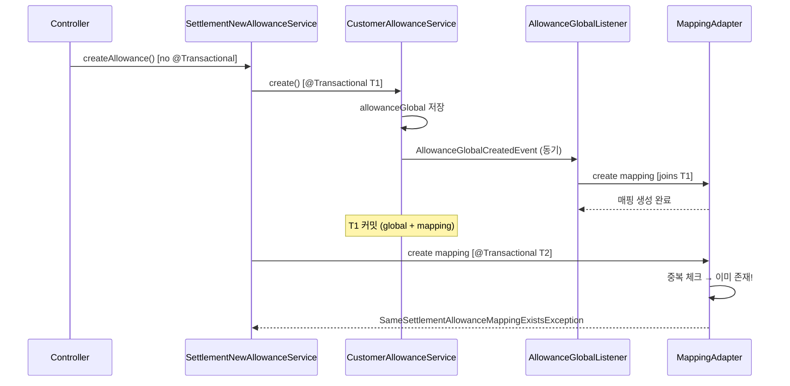

# CI-4216: 급여정산 지급항목 추가 시 중복 코드 오류 발생

> **상태**: 버그 확정 — v3.128.0 리그레션 — 핫픽스 배포 완료(PR #8686) — 데이터 패치 대기 — 2026-03-25

## 증상

- **문제 정의**: 급여정산 지급 단계에서 지급항목을 추가 생성하면 "정산 템플릿[^5]에 이미 같은 코드의 항목이 추가되어 있습니다" 오류가 발생하며 항목이 생성되지 않음. 동시에 정산 템플릿 목록에는 항목이 계속 누적됨[^1]
- **회사**: 넥슨에이치큐 (Customer ID: 219571)[^2], 에딧메이트 (Customer ID: 125966)[^14]
- **요청자**: 넥슨에이치큐 pp[^3], 에딧메이트 PP[^14]
- **대상자**: pp (k_why@nexon-hq.com)[^3][^6]
- **영향 범위**: v3.128.0 배포(2026-03-25 10:00 KST) ~ 핫픽스 배포 사이 **121개 고객, 488건 고아 레코드**[^15]. Access log 기준 3개사 19건 API 실패 + 신규 온보딩 96개사 기본 지급항목 생성 경로에서도 동일 버그 발현[^15]
- **문제 시점**: 2026-03-25 15:48~18:27 KST (v3.128.0 배포 후)[^6][^15]
- 문의 내용:
  1. 급여정산 작업 중 지급항목 추가 시 중복 코드 오류로 항목 생성 불가[^1]
  2. 오류에도 불구하고 정산 템플릿 목록에는 항목이 누적되는 비정상 동작[^1]
  3. 에딧메이트에서도 동일 증상 별도 보고 — 급여템플릿에 항목이 여러 개 생성됨[^14]

---

## 원인 분석

**v3.128.0의 #8655 리팩토링에서 `SettlementNewAllowanceService`의 의존성이 `AllowanceGlobalCommandPort` → `CustomerAllowanceUseCase`로 변경되면서, 이벤트 발행 경로가 활성화되어 매핑 중복 생성이 발생한다.**[^7][^8]

> 💡 **판단 근거**: v3.128.0 diff에서 `allowanceGlobalCommandPort.create()` → `customerAllowanceUseCase.create()` 변경 확인[^7] → `CustomerAllowanceService.create()`는 `AllowanceGlobalCreatedEvent`를 발행[^9] → `AllowanceGlobalListener`가 동기적으로 모든 활성 템플릿에 매핑 추가[^10] → 이후 명시적 매핑 생성 시 중복 오류

### 가설 목록

| # | 가설 | 확인 방법 | 상태 |
|---|------|----------|------|
| 1 | v3.128.0 리팩토링으로 이벤트 경로 활성화 → 매핑 이중 생성 | 코드 diff + access log | ✅ 확정 |
| 2 | FE 상태 관리 문제로 UI에만 누적 | BE access log에서 400 확인 | ❌ 소거 — BE에서 오류 발생, FE 문제 아님 |

### 조사 과정

v3.127.x → v3.128.0 변경 체인[^7]:

1. `SettlementNewAllowanceService.allowanceGlobalCommandPort` → `customerAllowanceUseCase` 변경
2. `CustomerAllowanceUseCase.create()` = `CustomerAllowanceService.create()` (`@Transactional`)
3. 이 메서드가 `AllowanceGlobalCreatedEvent` 발행[^9]
4. `AllowanceGlobalListener.onAllowanceGlobalCreated()` 가 동기적으로 실행[^10]
5. 모든 활성 템플릿에 매핑 자동 생성 → 트랜잭션 커밋
6. `createByAllowanceGlobal()` 에서 같은 매핑 다시 생성 시도 → `PAYROLL_400_213`

<details>
<summary>v3.128.0 diff 상세</summary>

```diff
# AllowanceApplicationServiceConfiguration.kt
- allowanceGlobalCommandPort: AllowanceGlobalCommandPort,
+ customerAllowanceUseCase: CustomerAllowanceUseCase,

# SettlementNewAllowanceService.kt
- val allowanceGlobal = allowanceGlobalCommandPort.create(...)
+ val allowanceGlobal = customerAllowanceUseCase.create(...)
```

PR: #8655 (WP9: payment/allowance Repository를 Port/Adapter 패턴으로 전환)

</details>

### 트랜잭션 흐름 (버그 발현 구조)



### 부작용: 고아 레코드 누적

`SettlementNewAllowanceService.createAllowance()`에 `@Transactional`이 없으므로[^11]:
- Step 1 (`customerAllowanceUseCase.create()`) — **독립 트랜잭션 T1**으로 커밋됨
- Step 2 (명시적 매핑) — T2에서 실패하지만 T1은 이미 커밋
- Step 3 (`settlementAllowancePort.create()`) — 도달하지 못함

**결과**: 매 시도마다 `allowance_global` + `customizable_allowance_template` 매핑은 생성되지만, 실제 정산 지급항목(`customizable_allowance`)은 생성되지 않는 **고아 레코드**가 누적된다.

### 5 Whys

1. 왜 중복 오류가 발생하나? → 같은 `allowanceGlobalId`로 매핑이 이미 존재[^12]
2. 왜 이미 존재하나? → `AllowanceGlobalListener`가 이벤트 수신 시 자동 매핑[^10]
3. 왜 이벤트가 발행되나? → `CustomerAllowanceService.create()`가 `AllowanceGlobalCreatedEvent` 발행[^9]
4. 왜 이 서비스가 호출되나? → v3.128.0에서 `allowanceGlobalCommandPort` → `customerAllowanceUseCase`로 변경[^7]
5. 왜 변경했나? → #8655 Port/Adapter 리팩토링에서 저수준 포트를 고수준 유스케이스로 교체 (이벤트 발행 부작용 미인지)[^7]

### 스펙 vs 버그

**버그 확정** — v3.128.0 리팩토링의 의도치 않은 부작용. 이전 버전(v3.127.x)에서는 정상 동작했다.

---

## 영향 범위

### Access Log (v3.128.0 배포 ~ 핫픽스)[^6][^15]

| Customer ID | 고객명 | 호출 | 성공 | 실패 | 시간대 (KST) |
|-------------|--------|------|------|------|-------------|
| **219571** | 넥슨에이치큐 | 9 | 0 | **9** | 15:48~16:04 |
| **125966** | 에딧메이트 | 9 | 0 | **9** | 17:13~17:18 |
| **61627** | (미확인) | 1 | 0 | **1** | 16:57 |
| 211398 | (미확인) | 1 | 1 | 0 | 18:27 (핫픽스 이후) |

> 모든 400 응답은 동일 에러코드 `PAYROLL_400_213`. 211398의 성공은 핫픽스 배포 이후 시점.

### DB 고아 레코드 (전체)[^15]

| 구분 | 규모 |
|------|------|
| 영향받은 고객 | **121개** |
| 전체 고아 레코드 | **488건** (active 471, deleted 17) |
| 같은 시간대 정상 생성 | 55개 고객, 1,113건 |

**패턴별 분류:**

| 패턴 | 고객 수 | 건수 | 설명 |
|------|---------|------|------|
| 신규 온보딩 (228xxx 대역) | 96 | 384 (각 4건) | 기본 지급항목 A001/A002/A003/H001 생성 실패 |
| 기존 고객 (다건) | 4 | 37 | 125966(17), 219571(10), 26372(5), 74332(5) |
| 기존 고객 (소건) | 21 | 67 | 1~3건씩 |

> 신규 온보딩 경로도 `CustomerAllowanceUseCase.create()`를 호출하여 동일한 이벤트 이중 발행 버그 경로를 탔다.

<details>
<summary>넥슨에이치큐(219571) 고아 매핑 상세</summary>

| template_id | allowance_global_id | code | is_active | deleted_at | db_created_at (KST) |
|-------------|---------------------|------|-----------|------------|---------------------|
| 1203608 | 1058823 | A026 | 0 | 2026-03-25 06:49:23 | 2026-03-25 15:48:10 |
| 1203612 | 1058825 | A027 | 0 | 2026-03-25 06:53:22 | 2026-03-25 15:49:50 |
| 1203613 | 1058826 | A028 | 0 | 2026-03-25 06:50:32 | 2026-03-25 15:50:03 |
| 1203614 | 1058827 | A029 | 0 | 2026-03-25 06:50:29 | 2026-03-25 15:50:08 |
| 1203619 | 1058832 | A030 | 0 | 2026-03-25 06:57:00 | 2026-03-25 15:54:17 |
| 1203636 | 1058849 | A031 | 1 | NULL | 2026-03-25 15:58:53 |
| 1203637 | 1058850 | A032 | 1 | NULL | 2026-03-25 15:59:04 |
| 1203638 | 1058851 | A033 | 1 | NULL | 2026-03-25 15:59:22 |
| 1203643 | 1058856 | A034 | 0 | 2026-03-25 07:03:52 | 2026-03-25 16:02:58 |
| 1203644 | 1058857 | A035 | 1 | NULL | 2026-03-25 16:04:34 |

10건 중 active 4건(A031~A035), soft-deleted 6건(A026~A030, A034). 모두 settlement_template_id: 208293.

</details>

---

## 수정 시 사이드이펙트 포인트

| # | 영향 지점 | 위험도 | 설명 |
|---|----------|--------|------|
| 1 | `AllowanceGlobalListener` | 🟡 | 리스너를 변경하면 "수당 항목 설정에서 새 항목 추가 시 전체 템플릿 자동 반영" 기능에 영향 |
| 2 | `CustomerAllowanceService.create()` 이벤트 | 🔴 | 이벤트 발행 자체를 제거하면 다른 리스너에도 영향 |
| 3 | 고아 데이터 정리 | 🔴 | **488건** 고아 매핑(121개 고객) + 대응 `allowance_global` 레코드 정리 필요 |

---

## 해결안

### 즉시 대응 (표면 원인 해결)

**옵션 A (권장): `SettlementNewAllowanceService`에서 `allowanceGlobalCommandPort`로 복원**

v3.128.0에서 변경된 의존성을 원래대로 되돌린다. `customerAllowanceUseCase` 대신 `allowanceGlobalCommandPort`를 직접 호출하여 이벤트 발행을 우회한다.

- 장점: 최소 변경, v3.127.x 동작으로 확실히 복원
- 단점: Port/Adapter 리팩토링 방향과 역행 (저수준 포트 직접 사용)

**옵션 B: `SettlementNewAllowanceService`에서 명시적 매핑 생성을 제거하고 리스너에 위임**

이벤트 리스너가 이미 매핑을 생성하므로, `createByAllowanceGlobal()` 호출을 제거하고 리스너가 생성한 매핑을 조회하여 사용한다.

- 장점: 리팩토링 방향 유지, 중복 로직 제거
- 단점: 리스너의 정확한 동작에 의존 (리스너 변경 시 연쇄 영향)

### 데이터 패치

고아 레코드 정리가 필요하다 (121개 고객, 488건):

**패치 대상 추출 쿼리:**
```sql
SELECT cat.id as template_id, cat.allowance_global_id, cat.allowance_global_code,
  cat.customer_id, cat.settlement_template_id, cat.is_active, cat.deleted_at
FROM flex_payroll.customizable_allowance_template cat
WHERE cat.db_created_at >= '2026-03-25 10:00:00'
AND NOT EXISTS (
  SELECT 1 FROM flex_payroll.customizable_allowance ca WHERE ca.template_id = cat.id
)
ORDER BY cat.customer_id, cat.db_created_at;
```

**패치 방향 결정 필요:**
1. 고아 매핑 soft-delete → 사용자가 다시 추가하도록 안내
2. 대응 `customizable_allowance` 레코드 생성 → 자동 복구
3. 신규 온보딩 96개사는 기본 항목이므로 자동 복구가 적합할 수 있음

### 근본 해결

`SettlementNewAllowanceService.createAllowance()`에 `@Transactional`을 추가하여 전체 흐름을 하나의 트랜잭션으로 묶어야 한다. 다만 이것만으로는 이벤트 리스너와의 중복 문제가 해결되지 않으므로, 옵션 A 또는 B와 병행해야 한다.

---

## 코드 위치

| 파일 | 역할 |
|------|------|
| `flex-payroll-backend` > `work-income/service/.../SettlementNewAllowanceService.kt` | 신규 지급항목 생성 진입점 (버그 위치) |
| `flex-payroll-backend` > `allowance/service/.../CustomerAllowanceService.kt:28-71` | allowanceGlobal 생성 + 이벤트 발행 |
| `flex-payroll-backend` > `work-income/service/.../listener/AllowanceGlobalListener.kt` | 이벤트 수신 → 전체 템플릿 매핑 자동 생성 |

<details>
<summary>전체 코드 위치 목록</summary>

| 파일 | 역할 |
|------|------|
| `work-income/repository-jpa/.../SettlementAllowanceMappingPersistenceAdapter.kt:30-39` | 중복 체크 + 예외 발생 지점 |
| `work-income/repository-jpa/.../CustomizableAllowanceTemplate.kt` | Entity (`customizable_allowance_template` 테이블) |
| `work-income/api/.../SettlementNewAllowanceController.kt:52` | API 엔드포인트 |
| `work-income/service/.../AllowanceApplicationServiceConfiguration.kt` | Bean 설정 (의존성 변경 지점) |
| `exception/.../PayrollError.kt:70` | `SAME_SETTLEMENT_ALLOWANCE_MAPPING_EXISTS` 에러 코드 |

</details>

---

## 참고 자료

- Linear: [CI-4216](https://linear.app/flexteam/issue/CI-4216/급여정산-지급항목-추가-시-중복-코드-오류-발생)
- 고객사 정보: [Metabase #256](https://metabase.dp.grapeisfruit.com/dashboard/256?customer_id=219571)
- 문의자 정보: [Metabase #5699](https://metabase.dp.grapeisfruit.com/question/5699?customer_id=219571&email=pp)
- Slack 스레드: [#CRU35U9FC](https://flex-cv82520.slack.com/archives/CRU35U9FC/p1774422523302589?thread_ts=1774422523.302589&cid=CRU35U9FC)
- PR #8655: WP9 payment/allowance Port/Adapter 전환 (원인 커밋)
- PR #8686: 핫픽스[^16]
- Linear 관련 이슈: CI-4175, CI-832, CI-2222, CI-2504[^4]
- 에딧메이트 Slack 스레드: [#CRU35U9FC](https://flex-cv82520.slack.com/archives/CRU35U9FC/p1774427017467619?thread_ts=1774427017.467619&cid=CRU35U9FC)[^14]
- dev 재현 traceId: `573e873fd436ffaad48bbe7542edc836`[^17]

## 미결 사항

- [x] 정산 템플릿의 중복 코드 검증 로직 확인
- [x] 항목 미생성인데 템플릿 목록에 누적되는 원인 파악
- [x] v3.128.0 사이드이펙트 확인
- [x] access log 호출 현황 확인 — 3개사 19건 실패[^15]
- [x] DB 고아 레코드 확인 — 121개 고객 488건[^15]
- [x] 핫픽스 배포 — PR #8686[^16]
- [ ] 고아 레코드(488건, 121개 고객) 데이터 패치 방향 결정 및 실행
- [ ] 에딧메이트(125966) 고객 별도 안내 필요 여부 확인

---

## 각주

[^1]: Linear 이슈 CI-4216 설명, 2026-03-25
[^2]: Metabase: [고객사 대시보드 #256](https://metabase.dp.grapeisfruit.com/dashboard/256?customer_id=219571)
[^3]: Linear 이슈 CI-4216 — 문의자 및 대상자 pp
[^4]: Linear 이슈 CI-4216 관련 이슈 링크
[^5]: 정산 템플릿 — 급여정산 시 사용하는 지급/공제 항목의 구성 양식. `flex-payroll-backend`에서 관리
[^6]: OpenSearch access log 조회: `flex-app.be-access-2026.03.24~25`, ipath `*new-allowances/item*`, method POST
[^7]: 코드: `flex-payroll-backend` > `work-income/service/.../AllowanceApplicationServiceConfiguration.kt` — v3.128.0 diff (PR #8655)
[^8]: 코드: `flex-payroll-backend` > `work-income/service/.../SettlementNewAllowanceService.kt:31` — `allowanceGlobalCommandPort` → `customerAllowanceUseCase`
[^9]: 코드: `flex-payroll-backend` > `allowance/service/.../CustomerAllowanceService.kt:71` — `.also { publishCreateEvent(it) }`
[^10]: 코드: `flex-payroll-backend` > `work-income/service/.../listener/AllowanceGlobalListener.kt:17-24` — `@EventListener onAllowanceGlobalCreated`
[^11]: 코드: `flex-payroll-backend` > `work-income/service/.../SettlementNewAllowanceService.kt:20` — `createAllowance()`에 `@Transactional` 없음
[^12]: 코드: `flex-payroll-backend` > `work-income/repository-jpa/.../SettlementAllowanceMappingPersistenceAdapter.kt:30-39`
[^13]: DB: `customizable_allowance_template` WHERE customer_id = (넥슨에이치큐 company_id), prod 환경
[^14]: Linear 첨부 — 에딧메이트(125966) Slack 이슈 리포트, @김찬미, 2026-03-25
[^15]: DB: `flex_payroll.customizable_allowance_template` WHERE db_created_at >= '2026-03-25 10:00:00' AND NOT EXISTS (customizable_allowance), prod 환경. OpenSearch: `flex-app.be-access-2026.03.25`, ipath `*new-allowances/item*`, POST
[^16]: GitHub: [flex-payroll-backend PR #8686](https://github.com/flex-team/flex-payroll-backend/pull/8686) — 핫픽스
[^17]: Linear 코멘트 @이지우, 2026-03-25 — dev 환경 재현 traceId
