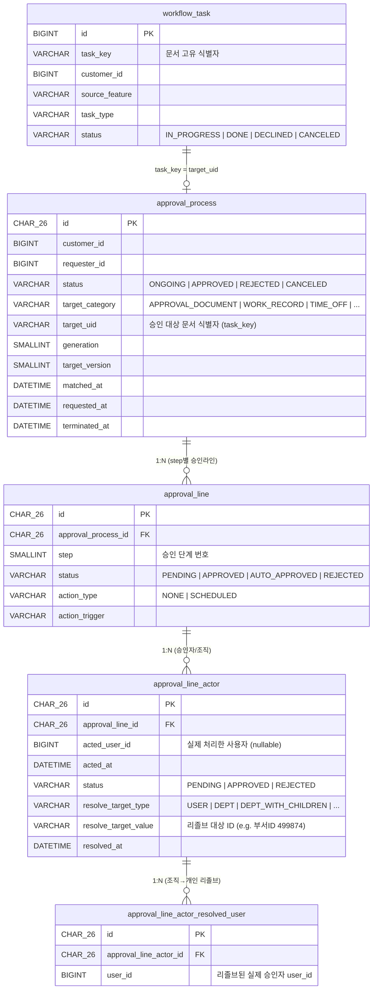
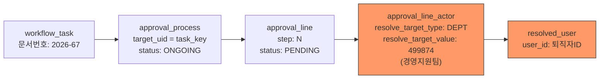

# CI-4244: 워크플로우 문서 강제 승인 요청

## 증상
- **문제 정의**: 승인 라인에 경영지원팀(조직)이 설정된 워크플로우 문서에 대해, 기존 팀원 전원 퇴사로 승인 진행 불가 — 강제 승인 요청
- **회사**: 세잎프닥 (Customer ID[^1]: 161808)
- **요청자**: wldus7312@safedoc.kr (CS 인터콤 문의)
- **대상자**: junhs@safedoc.io (현재 경영지원팀 구성원, 입사 전 문서 승인 불가)
- **영향 범위**: 워크플로우 문서 6건 — 2026-67, 2026-66, 2026-46, 2026-43, 2026-23, 2026-10
- **문제 시점**: 2026-03-27

## 원인

- `approval_line_actor` 의 `resolve_target_type` = `DEPT`, `resolve_target_value` = 499874 (경영지원팀)
- `approval_line_actor_resolved_user` 에 매핑된 user가 문서 생성 시점의 경영지원팀 소속 구성원 → **전원 퇴사**
- 조직 승인라인은 UI의 "퇴직자 승인자 교체" 기능이 차단됨[^2] → 운영 오퍼레이션 필요
- CI-4228과 동일 패턴이나, 개인이 아닌 **조직(DEPT)**이 승인라인이라는 차이점 존재

## 해결

### 조사 결과

**문서번호 → task_key 매핑:**

| 문서번호 | task_key | writer_id |
|---------|----------|-----------|
| 2026-10 | db24b37b01124923a3560fbbe2856ed4 | 856841 |
| 2026-23 | da20a038df1a4895b46b2a4302847eda | 923394 |
| 2026-43 | b8ef6c4ba77f4e5cad64e74a1695a9e5 | 906110 |
| 2026-46 | 6091a58393e34140bc76b02da1e7bbf3 | 804754 |
| 2026-66 | a70f950ca699464ab8ff92a7de385b94 | 874966 |
| 2026-67 | 7f058b6abb784fdda2456ca2747706f5 | 874966 |

**퇴직 승인자별 대상 문서:**

| user_id | 대상 문서 | 비고 |
|---------|----------|------|
| 911597 | 2026-10 | [metabase](https://metabase.dp.grapeisfruit.com/dashboard/245?email=anhj%40safedoc.kr%7C%2B3xzLWNbk0O%3D%40offboarded.user) |
| 930246 | 2026-23, 2026-43, 2026-46 + **2026-59** | 2026-59는 문의 외 추가 건, 요청자도 퇴사자[^3] |
| 941623 | 2026-66, 2026-67 | [metabase](https://metabase.dp.grapeisfruit.com/dashboard/245?email=kimms%40safedoc.io%7C%2BKq0559mL0v%3D%40offboarded.user) |

> Metabase 퇴사자 미처리 승인 대시보드에서 각 user_id별 미처리 건이 모두 워크플로우 문서임을 확인[^4]

### 처리 절차

**`bulk-approve-for-user` API 사용**
- 초기에는 문서별 개별 처리(`act-approval-process` + `produce-approval-process-event`)를 계획했으나,
  metabase에서 각 퇴사자별 미처리 건이 모두 승인 처리 대상임을 확인하여 `bulk-approve-for-user` 로 전환[^4]

```
POST /api/operation/v2/approval/process/customers/161808/users/{userId}/bulk-approve-for-user
```

- 911597, 941623: 모든 미처리 건이 문의 범위 내 → 바로 처리
- 930246: 문의 외 추가 건(2026-59) 존재 → 이주화님 확인 후 처리[^3]

### 미결 사항

- [ ] 930246 유저의 추가 건(2026-59) 처리 여부 — 이주화님 확인 대기 중
- [ ] 처리 완료 후 결과 확인 및 고객 회신

## 승인 테이블 ERD



### 이 케이스의 데이터 흐름



> `approval_line_actor` 가 DEPT(조직) 타입이고, `resolved_user` 에 매핑된 사용자가 전원 퇴사 → PENDING 상태에서 진행 불가

## 연관 이슈

- [CI-4228](./archive/CI-4228.md): 삭제된 구성원 승인 라인 교체 — 유사 케이스
- [CI-3174](https://linear.app/flexteam/issue/CI-3174): 조직 승인 + 전원 퇴사 → **가장 유사한 케이스**
- [CI-2161](https://linear.app/flexteam/issue/CI-2161): 동일 패턴 → act + produce API 연속 실행으로 처리
- [CI-3769](https://linear.app/flexteam/issue/CI-3769): 삭제된 구성원 강제 승인 — workflow Operation API
- [CI-3951](./archive/CI-3951.md): 퇴직자 승인자 교체 — 동일 도메인
- [CI-4266](./archive/CI-4266.md): 휴직자 승인 라인 강제 승인 — 휴직자 케이스 (퇴직자/삭제 아닌 패턴)

## 비고

### 코드 위치
- `flex-approval-backend` — 승인 도메인 Entity (`approval-core/repository/.../process/jdbc/`)
- `flex-flow-backend` — 워크플로우 task (`thread/operation-api/`)

### 참고 자료
- [CI-4244 Linear 이슈](https://linear.app/flexteam/issue/CI-4244)
- [CI-4228 아카이브 노트](./archive/CI-4228.md)
- [Slack 스레드](https://flex-cv82520.slack.com/archives/CRU35U9FC/p1774596342567519) — 조사 과정 + 처리 절차 논의
- Notion: [워크플로우 이슈 대응 런북](https://www.notion.so/flexnotion/1810592a4a9280a0bdbae18828042359)
- Metabase: [퇴사자 미처리 승인](https://metabase.dp.grapeisfruit.com/dashboard/245) / [고객사](https://metabase.dp.grapeisfruit.com/dashboard/256?customer_id=161808)
- Swagger: [approval Operation API](https://flex-raccoon.grapeisfruit.com/swagger/approval)

## 각주
[^1]: Customer ID — Linear에서 고객사를 식별하는 ID. flex 내부의 `company_id` 와는 다른 값이다.
[^2]: 조직이 승인라인인 경우 "퇴직자 승인자 교체" 기능이 UI에서 차단됨 (Linear 이슈 설명)
[^3]: Slack 스레드, 김영준 (2026-03-31) — 930246 유저의 2026-59 건은 요청자도 퇴사자. 이주화님에게 처리 여부 확인 중
[^4]: Slack 스레드, 김영준 (2026-03-31) — Metabase 대시보드에서 퇴사자별 미처리 건 전수 확인 후 bulk-approve 전환
