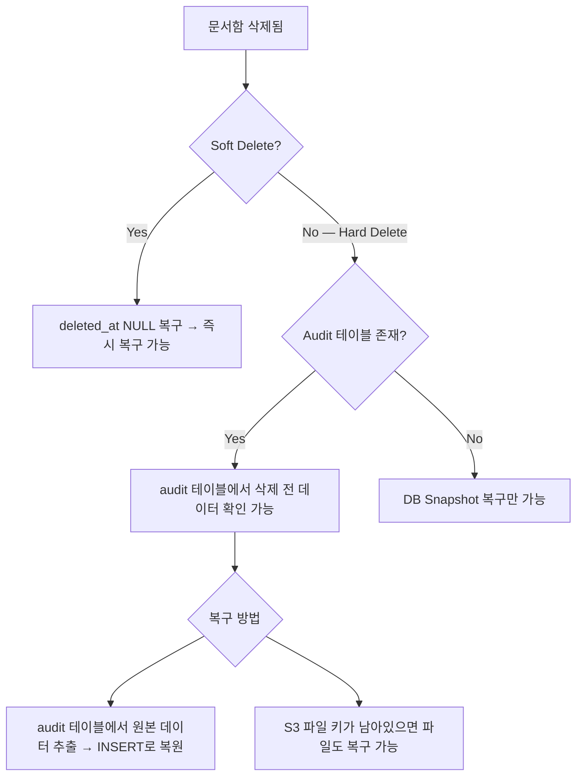

# CI-4256: 삭제한 문서함(신분증) 복구 가능 여부 확인

> **상태**: 진행 중 — 2026-03-31

## 증상
- **문제 정의**: 관리자가 문서함 설정에서 '신분증' 문서함을 개인 서류 삭제로 착각하여 문서함 자체를 삭제함. 복구 가능 여부 확인 요청
- **회사**: 주식회사 라포랩스 (Customer ID: 32728)
- **요청자**: @김한나 (CS)[^1]
- **대상자**: 라포랩스 전체 구성원 (신분증 문서함에 업로드된 파일 보유자 전원)
- **영향 범위**: 신분증 문서함에 파일을 업로드한 전체 구성원
- **문제 시점**: 2026-03-31 오전 9:50~10:00[^1]
- 문의 내용:
  1. 문서함 설정에서 '신분증' 문서함을 삭제함 (개인 서류 삭제로 착각)[^1]
  2. 삭제 시 경고 문구가 있었으나, 본인의 문서가 삭제되는 것이라 생각했다고 함[^2]
  3. 복구 가능 여부 확인 요청[^1]

## 현재까지 파악된 내용

### 코드 분석 결과

> 💡 삭제 API 엔드포인트에서 출발하여 삭제 로직을 추적[^3]
> → `UserDocumentServiceImpl.deleteAll()`이 `userDocumentRepository.deleteAll()` 직접 호출[^4]
> → UserDocument, UserDocumentFile 엔티티에 `deleted_at` 등 soft delete 컬럼 없음[^5]
> → **Hard Delete(물리 삭제)** 확인
> → 복구 API/로직 존재하지 않음[^6]

- **삭제 API**: `POST /action/v2/core/customers/{customerIdHash}/user-documents/delete-bulk`[^3]
- **삭제 방식**: Hard Delete — `user_document`, `user_document_file`, `user_document_file_change` 3개 테이블에서 물리 삭제[^4]
- **삭제 순서**: 파일 삭제(배치 100건씩) → 변경이력 삭제 → 문서함 설정 삭제[^4]
- **Hibernate Envers Audit**: `user_document_audit`, `user_document_file_audit` 테이블에 변경 이력이 남아있음[^7]
- **PresetType**: 신분증 = `IDENTITY_CARD`[^8]

### 관련 DB 테이블

| 테이블 | 역할 | Soft Delete | Audit |
|--------|------|:-----------:|:-----:|
| `user_document` | 문서함 설정 (이름, 권한, 순서) | **없음** | 있음 |
| `user_document_file` | 구성원별 업로드 파일 (파일명, S3 키) | **없음** | 있음 |
| `user_document_file_change` | 파일 변경 추적 | **없음** | 없음 |

### 과거 유사 사례 분석

Linear 코멘트에서 과거 유사 케이스를 확인함[^9]:

| 사례 | 상황 | 결론 |
|------|------|------|
| QNA-1180 | 구성원이 문서함 파일 삭제 | **복구 불가** — 즉시 삭제 원칙[^9] |
| CI-1480 | 워크플로우 문서 삭제 이력 확인/복구 | **원칙적 복구 불가** — 예외 검토 시에도 엑셀 추출 등 우회 대응[^9] |
| CI-3723 | 삭제된 계약서 서식 복구 | **복구 성공** — soft delete 이력이 남아있어 대상 ID 특정 후 복원[^9] |
| CI-4195 | 삭제된 평가 복구 | **복구 성공** — soft delete(`deleted_at`) NULL 복구[^9] |

> 💡 **핵심 판별 기준**: soft delete면 운영/API/쿼리로 복구 가능, hard delete면 복구 난이도 급상승[^9]
> → CI-4256은 **hard delete** → 제품 내 복구 불가

### 복구 가능성 검토

## 발견한 스펙/제약
- 문서함 삭제는 hard delete로, 삭제 시 문서함 설정 + 전체 구성원의 업로드 파일이 함께 삭제됨[^4]
- 삭제 확인 경고가 UI에 표시되지만, 사용자가 개인 파일 삭제로 오인할 수 있는 UX 이슈가 존재[^2]

## 연관 이슈
- [CI-4257](./CI-4257.md): 계약서 선택 발송 시 미발송 임시저장 계약서 삭제됨 — 동일 라벨(구성원/문서/증명서), 문서 삭제 후 복구 불가 케이스

## 참고 자료
- Linear: https://linear.app/flexteam/issue/CI-4256
- Slack: https://flex-cv82520.slack.com/archives/CRU35U9FC/p1774920930386869[^1]
- 과거 사례: [QNA-1180](https://linear.app/flexteam/issue/QNA-1180/), [CI-1480](https://linear.app/flexteam/issue/CI-1480/), [CI-3723](https://linear.app/flexteam/issue/CI-3723/)
- 관련 코드: `flex-core-backend` > `core/api/.../UserDocumentActionController.kt`[^3]

## 미결 사항
- [ ] `user_document_audit` 테이블에서 Customer ID 32728의 IDENTITY_CARD 삭제 이력 확인
- [ ] audit 데이터에서 `user_document_file`의 S3 `file_key` 확인 — 파일이 S3에 아직 존재하는지
- [ ] audit 데이터 기반 INSERT로 문서함 + 파일 복원 가능 여부 검증
- [ ] 복구 불가 시 고객 안내 문구 확정

## 각주
[^1]: Linear 이슈 CI-4256 본문 및 Slack 스레드, 2026-03-31
[^2]: Linear 코멘트 @김한나, 2026-03-31 — 삭제 경고 문구 스크린샷 첨부. 사용자가 개인 서류 삭제로 착각
[^3]: 코드: `flex-core-backend` > core/api/src/main/kotlin/team/flex/core/document/user/UserDocumentActionController.kt:101-121
[^4]: 코드: `flex-core-backend` > core/service-business/src/main/kotlin/team/flex/core/service/business/document/user/UserDocumentServiceImpl.kt:72-96
[^5]: 코드: `flex-core-backend` > core/repository/src/main/kotlin/team/flex/core/repository/document/user/model/UserDocument.kt — deleted_at 컬럼 없음
[^6]: 코드: `flex-core-backend` 전체에서 user-document 관련 restore/undelete/recovery 메서드 미존재
[^7]: 코드: `flex-core-backend` > core/repository/src/main/kotlin/team/flex/core/repository/document/user/model/UserDocument.kt — `@Audited` 어노테이션 사용
[^8]: 코드: `flex-core-backend` > core/model/src/main/kotlin/team/flex/core/document/user/constant/UserDocumentPresetType.kt — `IDENTITY_CARD`
[^9]: Linear 코멘트 (자동 생성), 2026-03-31 — QNA-1180, CI-1480, CI-3723, CI-4195 분석 결과
