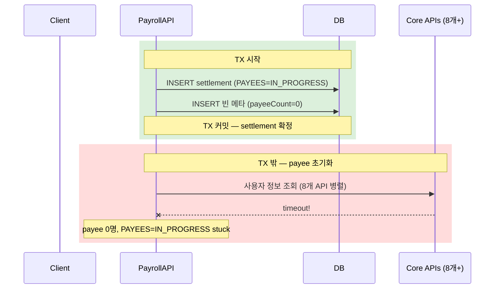

# CI-4260: 사업장 담당자 계정 급여정산 실행 시 알 수 없는 오류

> **상태**: 진행 중 — 2026-03-31

## 증상
- **문제 정의**: 사업장 담당자 계정으로 급여정산 실행 시 인가(authorization) 타임아웃으로 500 에러 발생, 정산이 대상자 0명 상태로 stuck
- **회사**: 주식회사 이도 (Customer ID: 212445)
- **요청자**: 정인지 (inji@flex.team)[^1]
- **대상자**: sangyeon+yido1@flex.team (userId: 834904)[^1]
- **영향 범위**: 사업장 담당자 계정으로 정산 실행하는 모든 대규모 회사에서 재현 가능. Sentry 기준 30명 이상 영향[^2]
- **문제 시점**: 2026-03-31 10:18 KST (최초 에러), Sentry 이슈는 2026-03-12부터 반복 발생[^2]
- 문의 내용:
  1. 사업장 담당자 계정으로 급여정산 실행 시 "알 수 없는 오류" 발생[^1]
  2. 재실행 시 사업장 대상자 인원만 정상 실행되지만, 이전 실패 건이 대상자 0명으로 리스트에 남음[^1]
  3. 이전 이도 사업장 담당자 교육 때도 동일 현상 발생[^3]

## 현재까지 파악된 내용

### Access Log (에러 2건)

정산 실행 및 결과 조회 API에서 외부 서비스 호출 타임아웃 발생:

| # | 시각 (KST) | API | Status | traceId |
|---|-----------|-----|--------|---------|
| 1 | 10:18:37 | `POST /api/v2/payroll/settlements/work-income` | **500** | `4e0f854fb6604f9cdb3226b8d9e67b88` |
| 2 | 10:19:09 | `POST /action/v2/payroll/work-income/settlements/payee-results/list-page-by-filters` | **500** | `f992e1c0dacd620f97060a9258f2112c` |

두 건 모두 동일 pod(`fc867c99b-94ctc`)에서 발생[^4]

### 에러 스택트레이스

```
FlexRemoteUnknownStateException: java.io.InterruptedIOException: timeout
  → SocketTimeoutException: timeout
    → SocketException: Socket closed
```

retrofit2/okhttp 기반 외부 마이크로서비스 호출 중 소켓 타임아웃[^5]. `PayrollAuthorityJpaEntity` insert SQL 빌드 과정이 로그에 보이며, 이후 원격 호출에서 timeout 발생[^4]

### 원인 가설: 인가 로직의 전체 구성원 조회

> 💡 **판단 근거**: 윤성복이 Linear 코멘트에서 "인가 타임아웃" 가능성을 지적[^6]
> → 담당자 계정에 연결된 인원은 205명이지만, 회사 전체 구성원은 약 2,000명[^7]
> → 인가 로직이 "2천명 중 작업할 수 있는 인원을 찾는" 구조로, 전체 구성원을 조회[^8]
> → 구성원 수가 많은 회사에서 인가 조회 시 타임아웃 발생

### DB 상태: 오늘 생성된 정산 5건

동일 template(215786), 4월분 정산(`belonged_year_month=2026-04-01`):

| settlement_id | 생성 시각(KST) | status | 대상자 수 | 비고 |
|---|---|---|---|---|
| **87549** | 10:18:31 | IN_PROGRESS | **0명** | 에러 발생 건 (정상: 205명) |
| 87558 | 10:53:06 | IN_PROGRESS | 205명 | 재실행 — 정상 |
| **87560** | 11:05:34 | IN_PROGRESS | **0명** | |
| **87561** | 11:06:00 | IN_PROGRESS | **0명** | |
| 87562 | 11:06:09 | IN_PROGRESS | 205명 | 재실행 — 정상 |

- 대상자 0명인 건(87549, 87560, 87561): `work_income_settlement_payee` 레코드 0건, `PAYEES: IN_PROGRESS`에서 stuck[^9]
- `settlement_result`는 5건 모두 미생성[^9]
- 정상 완료된 3/27 정산 건은 모든 progress DONE + result COMPLETED[^9]

> ⚠️ 대상자 0명 건은 IN_PROGRESS 상태로 남아 사용자 화면에 계속 노출됨. 정리(CANCEL 또는 삭제) 필요.

### Sentry 매칭 이슈

| Sentry ID | 발생 건수 | 영향 사용자 | 첫 발생 | Culprit |
|---|---|---|---|---|
| [FLEX-PROD-PAYROLL-API-67Q](https://sentry.grapeisfruit.com/organizations/flex-team/issues/FLEX-PROD-PAYROLL-API-67Q) | 101건 | 30명 | 3/12 | `POST .../payee-results/list-page-by-filters` |
| [FLEX-PROD-PAYROLL-API-6CF](https://sentry.grapeisfruit.com/organizations/flex-team/issues/FLEX-PROD-PAYROLL-API-6CF) | 43건 | 4명 | 3/27 | `ExceptionMapper.convert` |

- 67Q 최신 이벤트: `customerId=212445, userId=834904` — 이 고객 건과 정확히 일치[^5]
- 6CF 최신 이벤트: `delegator: inji@flex.team` — 리포터와 일치[^5]
- **이 에러는 3/12부터 30명 이상에게 반복 발생 중인 시스템 이슈**[^2]

### 트랜잭션 경계 분석 — all-or-nothing 미동작 원인

> 💡 이성환 요청: "트랜젝션이 all or nothing으로 동작하지 않는 상황에 대해 분석"[^11]

`WorkIncomeSettlementCreateService.create()` 의 실행 구조[^12]:

```
transactionTemplate.execute {                    // ← TX 시작
    settlement INSERT (PAYEES = IN_PROGRESS)
    빈 메타 생성 (totalPayeeCount = 0)
}                                                // ← TX 커밋 ★ settlement 확정

// TX 밖 — 이미 커밋된 후
try {
    initSettlementPayees()                       // ← payee 생성 (외부 API 8개+ 병렬 호출)
} finally {
    refreshPayeeCounts()                         // ← 메타 갱신
}
```

**settlement 생성(TX 안)과 payee 추가(TX 밖)가 서로 다른 트랜잭션 경계에 있다.**

이는 의도적 설계이다. `WorkIncomeSettlementApplicationServiceImpl:110`에 `// NOTE: 트랜잭션으로 감싸지면 안됩니다.` 주석이 있다[^13]. payee 초기화 과정에서 8개 이상의 외부 코어 API를 병렬 호출하므로, 하나의 TX로 감싸면 DB 커넥션을 오래 점유하게 되기 때문이다.

#### 타임아웃 시 발생하는 시퀀스



#### 문제점 3가지

1. **settlement은 커밋, payee는 실패** → 대상자 0명 정산이 UI에 노출[^12]
2. **PAYEES progress 복구 로직 부재** → IN_PROGRESS에서 FAILED/CANCELED로 전이시키는 코드가 없음[^12]
3. **Sequence 기반 페이징으로 부분 실패 가능** → 첫 페이지 성공, 둘째 페이지 실패 시 일부 payee만 존재[^14]

#### 인가 타임아웃 설정

| 호출 | 대상 | callTimeout | readTimeout |
|------|------|-------------|-------------|
| `doesUserHaveAuthority` | flex-permission | **3초** (기본) | **3초** (기본) |
| `resolveAccessibleUsers` | flex-permission | **6초** (커스텀) | **6초** (커스텀) |

윤성복: "현재 6초 안밖으로 걸리고 있는데 타임아웃을 10초로 더 늘리는 정도가 빠르게 가능"[^15]

#### 개선 방향

| 구분 | 방안 | 효과 |
|------|------|------|
| 단기 A | payee 초기화 실패 시 settlement 상태를 FAILED/CANCELED로 전이하는 보상 로직 추가 | 중간 상태 방지 |
| 단기 B | 타임아웃 10초로 조정 (윤성복 제안) | 성공률 향상 (근본 해결 아님) |
| 중기 | settlement 생성을 "임시" 상태로 먼저 만들고, payee 완료 후 "확정" 전환 | all-or-nothing 보장 |

### 진행 상황 (2026-03-31 오후)

1. **authorization 라이브러리 버전업 완료**: 윤성복이 flex-permission-backend v3.58.3 배포 — authorization timeout 6초→10초 조정, nexus publish 완료[^16]
2. **hotfix PR 생성**: [flex-payroll-backend#8714](https://github.com/flex-team/flex-payroll-backend/pull/8714) — authorization 라이브러리 버전업 적용[^17]
3. **이성환 hotfix 대응 요청**: payroll에 대응하여 hotfix 요청[^18]
4. **FE 에러 메시지 분석 (이지우)**: `WorkIncomeSettlementProgressResponse[]`가 빈 배열(0번째 요소 undefined)일 때 "현재 진행중 상태인 단계가 존재하지 않습니다" 에러 표시[^19]. 연관 오퍼레이션: `listWorkIncomeSettlementSettlementsByFilter`, `GetWorkIncomeSettlementResultWithSettlementContinuable`[^19]
5. **김주원 FE팀 문의**: 정산 생성 타임아웃 및 정합성 이슈에 대해 FE팀에 에러 메시지 발생 조건 확인 중[^20]
6. **payroll hotfix 배포 완료**: 인가 라이브러리 버전업 + 정합성 이슈 개선 포함[^22]. 트랜잭션 all-or-nothing은 FE UI 이슈로 추가 확인 필요[^22]
7. **PR #8713 폐기**: 별도 작업한 보상 로직 PR은 폐기[^23]

> ⚠️ 이성환: "의도라 하더라도 잘못된 구현같아보이네요" — 대상자 0명 상태에서 이어서 진행 불가능한 점이 문제[^21]

### 데이터 보정 (2026-03-31)

오늘 생성된 정산 6건 중 3건이 payee 0명, result 0건으로 정합성 깨짐[^24]:

| settlement_id | status | belonged_year_month | created_at (KST) | payee_count | 비고 |
|---|---|---|---|---|---|
| **87549** | IN_PROGRESS | 2026-04-01 | 10:18:32 | **0** (정상: 205) | 최초 에러 건 |
| 87558 | IN_PROGRESS | 2026-04-01 | 10:53:07 | 205 | 정상 |
| **87560** | IN_PROGRESS | 2026-04-01 | 11:05:35 | **0** (정상: 205) | |
| **87561** | IN_PROGRESS | 2026-04-01 | 11:06:01 | **0** (정상: 205) | |
| 87562 | IN_PROGRESS | 2026-04-01 | 11:06:09 | 205 | 정상 |
| 87615 | CANCELED | 2026-03-01 | 17:00:08 | 31 | 이미 취소됨 |

보정 방법: 87549, 87560, 87561을 CANCELED 처리[^24]

## 연관 이슈
- [CI-4131](./archive/CI-4131.md): 동일 회사(이도, 212445) 급여정산 초과근무수당 올림 계산 이슈[^10]
- [CI-4153](./archive/CI-4153.md): 이도 권한세분화 배포 후 롤백 — 권한 관련 장애 이력[^10]

## 참고 자료
- Linear: https://linear.app/flexteam/issue/CI-4260
- Slack 스레드: https://flex-cv82520.slack.com/archives/CRU35U9FC/p1774922191460479
- Metabase 고객 정보: https://metabase.dp.grapeisfruit.com/dashboard/256?customer_id=212445
- Sentry 67Q: https://sentry.grapeisfruit.com/organizations/flex-team/issues/FLEX-PROD-PAYROLL-API-67Q
- Sentry 6CF: https://sentry.grapeisfruit.com/organizations/flex-team/issues/FLEX-PROD-PAYROLL-API-6CF
- PR: https://github.com/flex-team/flex-payroll-backend/pull/8714 (authorization 라이브러리 버전업)
- flex-permission-backend v3.58.3: https://github.com/flex-team/flex-permission-backend/releases/tag/v3.58.3

## 미결 사항
- [x] 인가 로직에서 정확히 어떤 외부 서비스를 호출하다 타임아웃이 나는지 확인 → flex-permission `doesUserHaveAuthority` (callTimeout 3초)
- [x] 트랜잭션 경계 분석 (이성환 요청) → settlement TX와 payee 초기화가 의도적으로 분리되어 있음
- [x] 타임아웃 조정 → flex-permission v3.58.3 배포 완료 (6초→10초)
- [x] payroll 라이브러리 버전업 PR → [#8714](https://github.com/flex-team/flex-payroll-backend/pull/8714) 생성
- [x] hotfix 배포 완료 (인가 라이브러리 버전업 + 정합성 이슈 개선)
- [x] PR #8713 폐기
- [ ] 실패한 정산 건(87549, 87560, 87561) CANCELED 처리 — 쿼리 준비 완료, 실행 대기
- [ ] 트랜잭션 all-or-nothing → FE UI 이슈로 추가 확인 필요
- [ ] 정인지 질문에 대한 답변: "실 사용 전에 해소 가능한지?"

## 각주
[^1]: Linear 이슈 CI-4260 본문 및 첨부(Slack 이슈 리포트), 2026-03-31
[^2]: Sentry FLEX-PROD-PAYROLL-API-67Q — 101건 발생, 30명 영향, firstSeen 2026-03-12
[^3]: Linear 이슈 CI-4260 본문 — "이전 이도 사업장 담당자 교육 때와 동일한 현상"
[^4]: OpenSearch access log — `flex-app.be-access-2026.03.31`, customerId=212445
[^5]: Sentry FLEX-PROD-PAYROLL-API-67Q 이벤트 상세 — traceId: f992e1c0dacd620f97060a9258f2112c
[^6]: Linear 코멘트 @윤성복, 2026-03-31 02:00 UTC — "인가 타임아웃나는 케이스같은데"
[^7]: Linear 코멘트 @윤성복, 2026-03-31 02:03 UTC — "주식회사 이도면 거의 2000명이지않나요?"
[^8]: Linear 코멘트 @윤성복, 2026-03-31 02:13 UTC — "2천명 중 작업할 수 있는 인원을 찾는건 2천명을 찾아야해서요"
[^9]: DB: `flex_payroll.work_income_settlement` WHERE customer_id=212445 AND created_at >= '2026-03-31'
[^10]: brain/domain-map.ttl 및 brain/notes/archive/ 탐색 결과
[^11]: Linear 코멘트 @이성환, 2026-03-31 02:32 UTC — "트랜젝션이 all or nothing으로 동작하지 않는 상황에 대해 분석을 부탁드립니다"
[^12]: 코드: `flex-payroll-backend` > work-income/service/.../WorkIncomeSettlementCreateService.kt:55-104
[^13]: 코드: `flex-payroll-backend` > work-income/service/.../WorkIncomeSettlementApplicationServiceImpl.kt:110 — `// NOTE: 트랜잭션으로 감싸지면 안됩니다.`
[^14]: 코드: `flex-payroll-backend` > work-income/service/.../payee/WorkIncomeSettlementPayeeCommandService.kt:36-49 — Sequence 기반 페이징 처리
[^15]: Linear 코멘트 @윤성복, 2026-03-31 02:24 UTC — "현재 6초 안밖으로 걸리고 있는데 타임아웃을 10초로 더 늘리는 정도가 빠르게 가능합니다"
[^16]: Linear 코멘트 @윤성복, 2026-03-31 05:03 UTC — flex-permission-backend v3.58.3 배포, authorization timeout 6→10초
[^17]: Linear 첨부 — PR [flex-payroll-backend#8714](https://github.com/flex-team/flex-payroll-backend/pull/8714) "CI-4260 authorization 라이브러리를 버전업한다."
[^18]: Linear 코멘트 @이성환, 2026-03-31 05:07 UTC — "payroll에 이것 대응하여 hotfix 부탁드립니다"
[^19]: Linear 코멘트 @이지우, 2026-03-31 06:28 UTC — FE 파서 로직 분석, `parseActiveWorkIncomeSettlementStep.ts:50-52`
[^20]: Linear 코멘트 @김주원, 2026-03-31 06:19 UTC — FE팀에 에러 메시지 발생 조건 문의
[^21]: Linear 코멘트 @이성환, 2026-03-31 03:17 UTC — "의도라 하더라도 잘못된 구현같아보이네요"
[^22]: Linear 코멘트 @김주원, 2026-03-31 08:12 UTC — "payroll 핫픽스 배포됐습니다. 인가 최신 라이브러리 + 정합성 이슈 개선"
[^23]: 사용자 확인, 2026-03-31 — PR #8713 폐기
[^24]: DB: `flex_payroll.work_income_settlement` LEFT JOIN `work_income_settlement_payee` WHERE customer_id=212445 AND created_at >= '2026-03-31'
