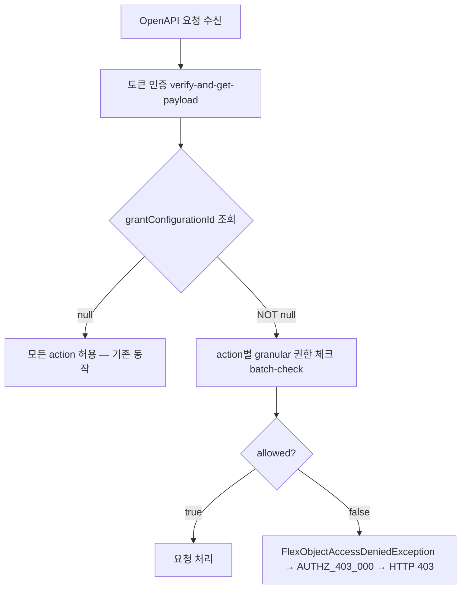

# CI-4270: OpenAPI 호출 시 403 에러 응답 — grant configuration 권한 세분화

> **상태**: 추가 조사 필요 (DB↔OpenFGA 동기화 문제 추정) — 2026-03-31
> **담당**: 윤성복 (김주원 → 윤성복 이관)[^14]

## 증상

- **문제 정의**: OpenAPI 호출 시 인증 API, /v2/departments/all, /v2/users/employee-numbers 외 모든 API에서 403 에러 응답[^1]
- **회사**: 쎄트렉아이 (Customer ID: 96860)
- **요청자**: 유지원 (CS)
- **대상자**: 쎄트렉아이 OpenAPI 연동 시스템 (ihk@satreci.com)
- **영향 범위**: 해당 회사의 OpenAPI 토큰을 사용하는 모든 API 호출 (bypass 대상 제외)
- **문제 시점**: 2026-03-31 16:00 KST 경 — 정상 동작하던 것이 갑자기 에러로 전환[^1]
- 문의 내용:
  1. OpenAPI 호출 시 AUTHZ_403_000 ("접근할 수 없습니다.") 에러가 반환됨[^2]
  2. /v2/users/work-schedules-with-work-clock/dates/2026-03-31/2026-03-31 등 다수 엔드포인트 실패
  3. /v2/departments/all, /v2/users/employee-numbers는 정상 동작

---

## 원인 분석

### 결론

DB에는 23개 authority group(`open_api_user_work_schedule` 포함)이 모두 설정되어 있으나, authorization engine(OpenFGA) batch-check에서 `allowed=false`를 반환 — **DB↔OpenFGA 동기화 문제 추정**.

### 조사 과정

> 💡 **판단 근거**: access log에서 403 패턴 확인[^4] → IP ACL, 토큰 ownerType 가설 소거 → grant-configuration 조회에서 NOT null 확인[^5] → batch-check에서 명시적 거부 확인[^6] → 코드에서 grantConfigurationId null 분기 확인[^7]
> → grantConfigurationId가 설정된 토큰은 명시적 허용 action만 접근 가능한 구조 — 스펙

핵심 증거 상세

1. access log에서 customerId=96860의 403 응답 **165건** 확인. 모두 OpenAPI 경로(/v2/...)[^4]
2. grant-configuration 조회 응답: `{"grantConfigurationId":"24e2e98a-f487-48ce-b84b-1d3a7ab8bddf"}`(NOT null)[^5]
3. authorization batch-check 요청[^6]:
   - subject: `open_api_token` / session `21c61f41-983a-4950-ba9e-3633049ce4c9`
   - action: `open_api_user_work_schedule`
   - resource: customer 96860
4. batch-check 응답: `{"result":[{"allowed":false}]}` — 명시적 거부[^6]

### 메커니즘

1. 토큰 인증 성공 (verify-and-get-payload → 200)
2. grantConfigurationId 조회 → NOT null (`24e2e98a-...`)[^5]
3. grantConfigurationId가 null이 아니므로 action별 granular 권한 체크 실행[^7]
4. `open_api_user_work_schedule` 등의 action이 허용 목록에 없음[^6]
5. `FlexObjectAccessDeniedException` → AUTHZ_403_000 → HTTP 403[^8]

### bypass되는 API

일부 API는 `executeIfGrantAllActions()` 호출 없이 bypass되어 정상 동작한다:

| 엔드포인트 | 코드 위치 | 이유 |
|-----------|----------|------|
| /v2/departments/all | DepartmentApiController.kt:38[^9] | access check 없음 |
| /v2/users/employee-numbers | UserApiController.kt:53[^10] | access check 없음 |

### 가설 목록

| # | 가설 | 확인 방법 | 상태 |
|---|------|----------|------|
| 1 | IP ACL 검증 실패 | access log — 일부 API 성공 + authorization-api 호출 확인 | ❌ 소거 |
| 2 | 토큰 ownerType 불일치 | 응답이 403이지 401이 아님 | ❌ 소거 |
| 3 | grant configuration에 필요한 action 미포함 | DB 조회 — flex_grant_authority_group에 23개 action 모두 존재[^12][^13] | ❌ 소거 |
| 4 | DB↔OpenFGA 동기화 실패 — DB에 설정된 권한이 OpenFGA에 반영 안 됨 | OpenFGA 튜플 확인 필요 | 🔍 추가 확인 필요 |

### DB 조사 결과

flex_grant / flex_grant_authority_group 조회 결과

**flex_grant 테이블**[^12]:
- id: `24e2e98a-f487-48ce-b84b-1d3a7ab8bddf`
- service_key: `flex-openapi`
- customer_id: `96860`
- title_text: `21c61f41-983a-4950-ba9e-3633049ce4c9` (session state)
- status: `ACTIVATE`
- created_at: `2026-03-30 15:46:33`
- created_by: `system`

**flex_grant_authority_group 테이블**[^13]: 23건 모두 `2026-03-30 15:46:33`에 생성

포함된 action 목록:
`open_api_user_bank_account`, `open_api_user_basic_info`, `open_api_user_birthday`, `open_api_user_cost_center`, `open_api_user_custom_property`, `open_api_user_department`, `open_api_user_email`, `open_api_user_employment_contract`, `open_api_user_family`, `open_api_user_gender`, `open_api_user_home_address`, `open_api_user_job_group`, `open_api_user_job_level`, `open_api_user_job_rank`, `open_api_user_job_role`, `open_api_user_job_title`, `open_api_user_join_date`, `open_api_user_leave_of_absence`, `open_api_user_phone_number`, `open_api_user_profile_image`, `open_api_user_ssn`, `open_api_user_time_off`, `open_api_user_work_schedule`

### 스펙 vs 버그 판별

DB에는 `open_api_user_work_schedule`을 포함한 23개 action이 모두 설정되어 있으나 OpenFGA batch-check에서 `allowed=false`를 반환하고 있어, DB↔OpenFGA 동기화 문제로 추정된다. 추가 확인이 필요하다.

코드 근거

| 파일 | 라인 | 설명 |
|------|------|------|
| OpenApiAccessCheckServiceImpl.kt | 42-56 | grantConfigurationId null이면 모든 action 허용, NOT null이면 batch-check 실행[^7] |
| UserWorkScheduleApiController.kt | 87-127 | work-schedules API에서 access check 호출 |
| DepartmentApiController.kt | 38-47 | departments/all — access check 없음 (bypass)[^9] |
| UserApiController.kt | 53-76 | employee-numbers — access check 없음 (bypass)[^10] |
| AuthorizationError.kt | 17 | AUTHZ_403_000 에러 코드 정의[^8] |

---

## 해결안 / 조사 방향

1. **OpenFGA 튜플 동기화 상태 확인 필요**: DB에는 23개 action이 모두 존재하나 OpenFGA batch-check에서 거부됨 — OpenFGA 튜플이 DB와 일치하는지 확인
2. **authorization 담당자(윤성복)에게 OpenFGA 상태 확인 요청**: grantConfigurationId=`24e2e98a-f487-48ce-b84b-1d3a7ab8bddf`에 대한 OpenFGA 튜플 존재 여부

---

## 발견한 스펙/제약

- grantConfigurationId가 null인 토큰은 모든 OpenAPI action에 접근 가능하지만, NOT null인 토큰은 명시적으로 허용된 action만 접근 가능하다[^7]
- DepartmentApiController, UserApiController의 일부 엔드포인트는 access check를 수행하지 않아 grant configuration과 무관하게 항상 접근 가능하다[^9][^10]

---

## 미결 사항

- [x] grant configuration에 포함된 action 목록 확인 → 23개 모두 포함[^13]
- [ ] OpenFGA 튜플 상태 확인 — DB 설정이 반영되었는지
- [ ] 4시경에 어떤 변경이 발생했는지 (grant는 어제 생성, 이슈는 오늘 4시 발생)
- [ ] token_session_state_grant_configuration_mapping 매핑 시점 확인 (DB 접근 권한 필요)

---

## 참고 자료

- Linear: https://linear.app/flexteam/issue/CI-4270/api-호출시-에러-응답으로-수신됨
- Slack: https://flex-cv82520.slack.com/archives/CRU35U9FC/p1774943948178299
- Intercom: https://app.intercom.com/a/apps/xj5aqcy9/conversations/215473712150146
- Metabase 회사 정보: https://metabase.dp.grapeisfruit.com/dashboard/256?customer_id=96860

---

## Claude 활동 로그

| 시각 (KST) | 작업 | 쿡북 참조 |
|------------|------|----------|
| 2026-03-31 17:10 | 조사 수행 — access log 분석, 코드 추적, 원인 확정 | 미스 — openapi 도메인에 쿡북 플로우 없음 |
| 2026-03-31 17:50 | operation note 생성 | -- |
| 2026-03-31 | DB 조사 결과 반영 — 가설 3 소거, 가설 4(DB↔OpenFGA 동기화) 추가 | -- |

## 각주

[^1]: Linear 이슈 CI-4270 설명, 2026-03-31 — 문의자 보고 및 CS 접수 내용
[^2]: Linear 코멘트 @유지원, 2026-03-31 — 에러 응답 JSON (AUTHZ_403_000)
[^3]: grant configuration — OpenAPI 토큰에 부여된 권한 세분화 설정. grantConfigurationId가 존재하면 토큰이 접근 가능한 action을 명시적으로 제한한다
[^4]: access log: customerId=96860, responseStatus=403, flex-app.be-access-2026.03.31 인덱스
[^5]: access log: traceId=f71b375c1a6d848da0d2f0e72bb31a89의 grant-configuration 응답
[^6]: access log: traceId=f71b375c1a6d848da0d2f0e72bb31a89의 batch-check 요청/응답
[^7]: 코드: `flex-openapi-backend` > openapi/api/src/main/kotlin/team/flex/openapi/authorization/OpenApiAccessCheckServiceImpl.kt:38-56
[^8]: 코드: `flex-permission-backend` > authorization/exception/src/main/kotlin/team/flex/authorization/exception/AuthorizationError.kt:17
[^9]: 코드: `flex-openapi-backend` > openapi/api/src/main/kotlin/team/flex/openapi/department/DepartmentApiController.kt:38-47
[^10]: 코드: `flex-openapi-backend` > openapi/api/src/main/kotlin/team/flex/openapi/user/UserApiController.kt:53-76
[^12]: DB: flex_authorization.flex_grant WHERE id = '24e2e98a-f487-48ce-b84b-1d3a7ab8bddf'
[^13]: DB: flex_authorization.flex_grant_authority_group WHERE grant_id = '24e2e98a-f487-48ce-b84b-1d3a7ab8bddf' (23건)
[^14]: Linear 코멘트 @김주원, 2026-03-31 — "@seongbok 님께 티켓 넘겨 드릴게요"
