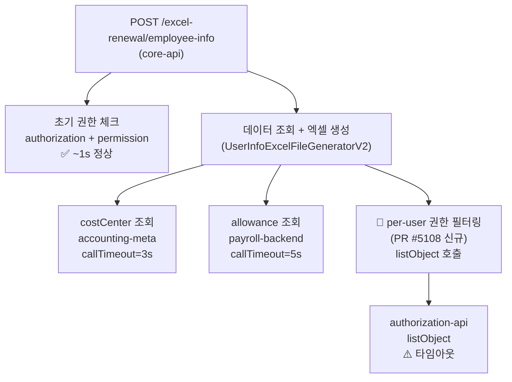

# CI-4295: 시몬스 구성원 엑셀 다운로드 시 500 에러 (listObject 타임아웃)

> **상태**: Todo (미착수) — 2026-04-06

## 증상
- **문제 정의**: 구성원 정보 엑셀 다운로드 시 `COMMON_500_000` 에러 발생 (listObject 타임아웃)
- **회사**: 시몬스 (Customer ID: 77952)
- **요청자**: 이도경 (CS)[^1]
- **대상자**: 시몬스 관리자 3명 — minji.sung@simmons.co.kr (userId: 554892), lee0ju@simmons.co.kr (userId: 768557), jjh3110@simmons.co.kr (userId: 649575)[^2]
- **영향 범위**: 시몬스 전체 관리자 (모든 관리자 PC에서 동일 발생)[^3]
- **문제 시점**: 2026-04-01 18:15 KST ~ 현재 (v3.97.0 배포 이후)[^4]
- 문의 내용:
  1. 구성원 메뉴에서 엑셀 다운로드 시 "예상치 못한 오류가 발생했습니다" 에러[^1]

## 현재까지 파악된 내용

### Access Log 분석

> 💡 **판단 근거**: access log에서 `POST /action/v2/core/downloads/excel-renewal/employee-info` 요청을 customerId=77952로 조회[^5]
> → 04-01 오전까지 200 성공, **04-01 18:15부터 100% 500 실패**로 전환
> → v3.97.0 배포(04-01)와 시점 일치[^4]

| 시간 (KST) | 사용자 | 응답 | 응답시간 | traceId |
|------------|--------|------|---------|---------|
| 04-01 09:20 | yesol.choi | **200** | 8,595ms | `896a0d65...` |
| 04-01 10:30 | hy.kim | **200** | 51,783ms | `f069241548...` |
| 04-01 13:58 | yesol.choi | **200** | 47,633ms | `0e87571d...` |
| **04-01 18:15** | **lee0ju** | **500** | **6,610ms** | `6097b3f9...` |
| 04-01 18:15~18:29 | lee0ju | **500** | ~6,500ms | (반복 시도 8건) |
| 04-01 18:27~18:59 | minji.sung | **500** | ~6,500ms | (2건) |
| 04-02 09:26~09:28 | minji.sung, jjh3110 | **500** | ~6,500ms | (3건) |

**특징:**
- 500 에러 시 응답시간이 일관적으로 **~6.5초** → 특정 원격 호출 타임아웃[^6]
- 성공 시에도 **47~51초** 걸리는 무거운 API[^5]
- 실패 요청의 requestBody: **15개 항목 전체 선택 + ~500명 이상 userIdHashes** (content-length: 10,542)[^7]

### 에러 스택트레이스

```
FlexRemoteUnknownStateException: java.io.InterruptedIOException: timeout
  at SocketException: Socket closed → NioSocketImpl → OkHttp interceptor chain
```
[^6]

### Trace 추적 (traceId: `3f60275e1749038dceb99913a3a14cc3`)

authorization-api, permission-api, subscription-api 내부 호출은 **모두 200 정상 완료** (18:15:35~36)[^8]. core-api는 이 호출들 완료 후 **6초 뒤**(18:15:42)에 500 에러 → 권한 체크 이후 단계에서 타임아웃 발생.

### 코멘트 기반 원인 특정

> 💡 **판단 근거**: Linear 코멘트에서 임준규님이 "listObject 타임아웃"으로 특정[^9]
> → 윤성복님이 "최신 client에는 10초까지 늘려두긴했습니다만 10초로도 안돼보이는군요" 확인[^10]
> → v3.97.0에 포함된 PR #5108 (CORE-5163 per-user 권한 기반 데이터 필터링)이 원인으로 추정[^4]

**원인**: v3.97.0 배포의 per-user 권한 필터링(PR #5108)이 엑셀 생성 과정에서 authorization-api의 `listObject` 호출을 추가 → 시몬스(대규모 회사, ~500명+)에서 타임아웃 발생

### 코드 호출 체인


[^11]

### 논의된 해결 방향

1. **단기**: 타임아웃 증가 — 이미 10초로 늘렸지만 부족[^10]
2. **중기**: `hasPermission`으로 전체 권한자를 별도 처리[^12]
3. **장기**: `listObject`가 대규모 회사에서도 타임아웃 안 나게 최적화 필요[^13]

## 연관 이슈
- [CI-4260](./archive/CI-4260.md): 사업장 담당자 급여정산 인가 타임아웃 500 에러 — 동일하게 인가 API 타임아웃 패턴 (6초→10초 조정으로 해결)[^14]

## 참고 자료
- Linear: [CI-4295](https://linear.app/flexteam/issue/CI-4295)
- Slack 스레드: [#cs-issue-report](https://flex-cv82520.slack.com/archives/CRU35U9FC/p1775090719095129)
- Kibana 대시보드: [access log (customerId=77952, status=500)](https://log-dashboard.grapeisfruit.com/_dashboards/app/data-explorer/discover#?_a=(discover:(columns:!(json.ipath,json.exception),isDirty:!f,sort:!()),metadata:(indexPattern:f16cda60-f2fb-11ee-9a9d-4b897330ccb0,view:discover))&_g=(filters:!(),refreshInterval:(pause:!t,value:0),time:(from:'2026-04-02T00:22:24.874Z',to:'2026-04-02T01:07:30.415Z'))&_q=(filters:!(('$state':(store:appState),meta:(alias:!n,disabled:!f,index:f16cda60-f2fb-11ee-9a9d-4b897330ccb0,key:json.authentication.customerId,negate:!f,params:(query:77952),type:phrase),query:(match_phrase:(json.authentication.customerId:77952))),('$state':(store:appState),meta:(alias:!n,disabled:!f,index:f16cda60-f2fb-11ee-9a9d-4b897330ccb0,key:json.responseStatus,negate:!f,params:(query:500),type:phrase),query:(match_phrase:(json.responseStatus:500)))),query:(language:kuery,query:'')))[^15]
- 배포: flex-core-backend v3.97.0 (2026-04-01), PR #5108 (CORE-5163 per-user 권한 필터링)
- 관련 코드: `flex-core-backend` > `download/api/src/main/kotlin/team/flex/core/api/download/UserInfoDownloadActionControllerV2.kt`

## 미결 사항
- [ ] `listObject` 호출이 정확히 어디서 발생하는지 코드 레벨 확인 (PR #5108 변경분)
- [ ] 타임아웃 10초로도 부족한 상황에서의 해결책 결정 (hasPermission 분기 vs listObject 최적화)
- [ ] 시몬스 외 대규모 고객사(이도 등)도 동일 영향 있는지 확인
- [ ] 현재도 지속 발생 여부 확인 (일시적 부하 가능성 검토)[^16]
- [ ] 담당: 윤성복, 임준규

## 각주
[^1]: Linear 이슈 설명 + 코멘트 @이도경, 2026-04-02
[^2]: access log: `flex-app.be-access-2026.04.01`, `flex-app.be-access-2026.04.02` — customerId=77952, path=excel-renewal/employee-info
[^3]: Linear 코멘트 @이도경, 2026-04-02 — "관리자 컴퓨터 모두 다 발생한다고 합니다"
[^4]: Linear 코멘트 @이성환, 2026-04-02 — "이거 어제 배포나갔을텐데". flex-core-backend v3.97.0 (2026-04-01 배포), PR #5108 (CORE-5163) 포함
[^5]: access log 조회 결과: `POST /action/v2/core/downloads/excel-renewal/employee-info`, customerId=77952, 2026-04-01~02
[^6]: API error log: traceId `acecd168d76a89829b81406fd8049a29` — `FlexRemoteUnknownStateException: java.io.InterruptedIOException: timeout`
[^7]: access log requestBody: traceId `3f60275e1749038dceb99913a3a14cc3` — downloadItemTypes 15개, userIdHashes ~500개, content-length: 10,542
[^8]: access log trace 분석: traceId `3f60275e1749038dceb99913a3a14cc3` — authorization-api, permission-api, subscription-api 모두 200
[^9]: Linear 코멘트 @임준규, 2026-04-02 — "listObject 타임아웃인가"
[^10]: Linear 코멘트 @윤성복, 2026-04-02 — "최신 client에는 10초까지 늘려두긴했습니다만 10초로도 안돼보이는군요"
[^11]: 코드: `flex-core-backend` > `download/api/src/.../UserInfoDownloadActionControllerV2.kt`, `UserInfoExcelFileGeneratorV2`, 배포 PR #5108 변경분
[^12]: Linear 코멘트 @임준규, 2026-04-02 — "아니면 일단 hasPermission으로 여기도 전체 권한자를 따로 처리하게 할 수도 있긴 합니다"
[^13]: Linear 코멘트 @임준규, 2026-04-02 — "어차피 이도가 시몬스 만큼 사람이 많을거라 listObject가 타임아웃 안나게는 만들어야 할 것 같습니다"
[^14]: [CI-4260](./archive/CI-4260.md) — 인가 타임아웃 6초→10초 조정
[^15]: Linear 코멘트 @김영준(Enhance), 2026-04-02 — Kibana access log 대시보드 링크
[^16]: Linear 코멘트 @윤성복, 2026-04-02 02:50 — "지금도 발생하나요? 일시적인 부하상황으로 설명은 가능할 것 같은데 지속발생한다면 다른 원인으로 봐야할 것 같아서요"
