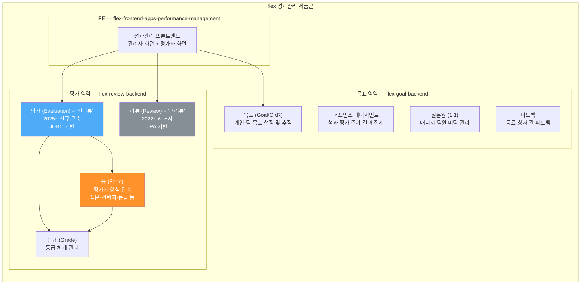
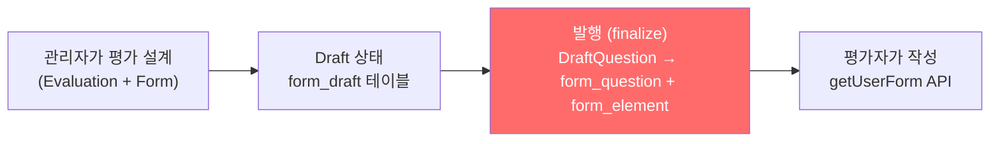
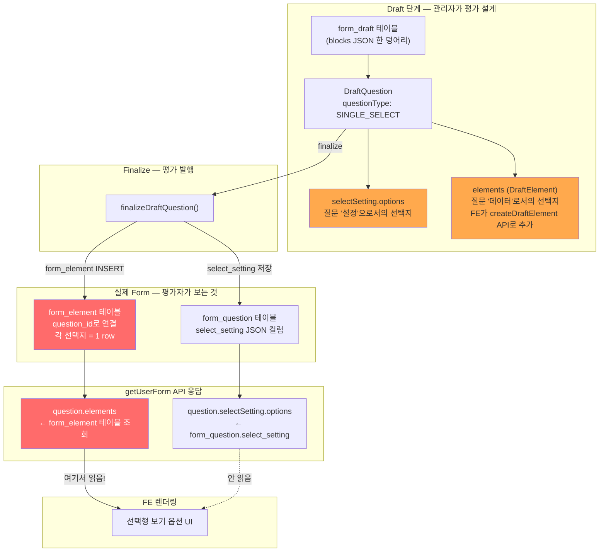
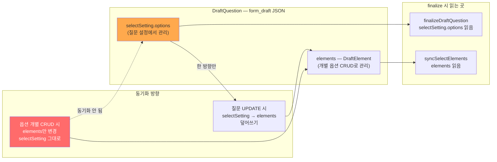
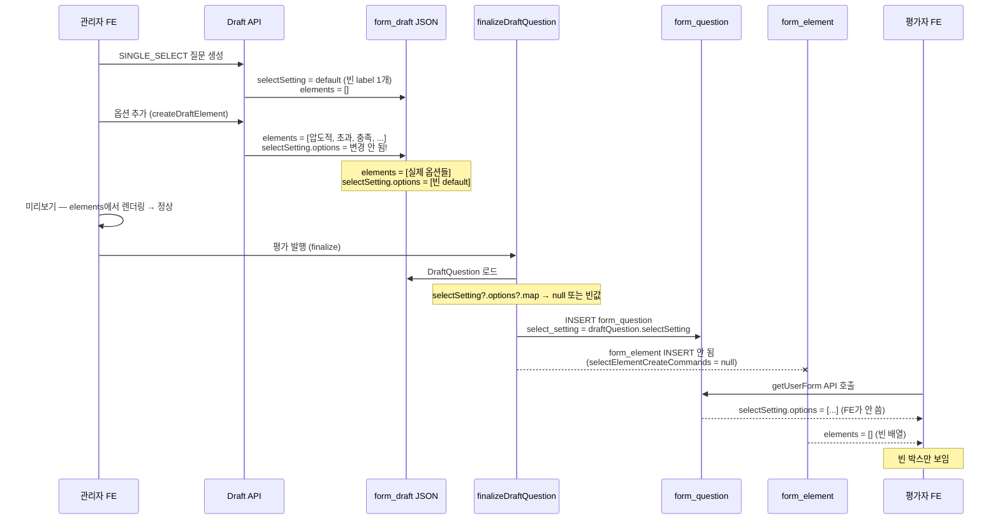

# CI-4376: 인턴십 중간체크인 선택형 문항 보기 옵션 빈 박스

> **상태**: 조사 완료, 데이터 패치 + 코드 수정 필요 — 2026-04-09

## 도메인 가이드: 성과관리 제품 전체 그림

> 이 도메인에 익숙하지 않은 온콜 담당자를 위한 배경 설명.

### 제품 구조



### 용어 정리: 뭐가 뭔지

| 부르는 말 | 정체 | repo | DB |
|-----------|------|------|----|
| **평가** = **신리뷰** = **Evaluation** | 2025년부터 새로 만든 평가 시스템 | `flex-review-backend` `/evaluation/` | `flex_review` |
| **구리뷰** = **Review** | 2022년부터 쓰던 레거시 리뷰 시스템 | `flex-review-backend` `/review/` | `flex_review` |
| **목표** = **Goal** = **OKR** | 개인·팀 목표 관리 | `flex-goal-backend` | 별도 |
| **퍼포먼스 매니지먼트** | 성과 평가 주기 운영 (목표 영역) | `flex-goal-backend` | 별도 |
| **원온원** | 1:1 미팅 | `flex-goal-backend` | 별도 |
| **폼 (Form)** | 평가지 양식. 질문·선택지·등급 등 | `flex-review-backend` `/form/` | `flex_review` |

> **핵심**: "평가"와 "신리뷰"는 **같은 것**. "구리뷰"는 레거시. 둘 다 `flex-review-backend` 안에 있고 `flex_review` DB를 공유하지만, 코드 모듈과 테이블이 완전히 분리되어 있다.

### 이 이슈와의 관계

이 이슈는 **평가(Evaluation, 신리뷰)** 영역의 **폼(Form)** 모듈에서 발생한 버그:



- **관리자가 설계**: Evaluation 모듈이 평가 주기를 관리하고, Form 모듈이 평가지(질문·선택지)를 관리
- **finalize**: Draft(초안) → 실제 Form으로 변환. 이 과정에서 `form_element` 미생성 버그 발생
- **평가자가 작성**: Form 모듈의 getUserForm API로 평가지를 조회

---

## 증상

- **문제 정의**: SINGLE_SELECT 질문의 보기 옵션이 텍스트 없이 빈 박스로 표시됨
- **회사**: 플렉스팀 (Customer ID: 42)
- **요청자**: 강주희 (인사팀)
- **대상자**: 인턴십 중간체크인 평가 대상자 전원
- **영향 범위**: 해당 evaluation의 모든 평가자 — SINGLE_SELECT 문항 3개 전부 동일 증상
- **문제 시점**: 2026-04-09 10:51 KST (evaluation step 시작 직후)
- 문의 내용:
  1. 인턴십 중간체크인 시작 후 대상자들에게 선택형 문항의 보기 옵션이 보여지지 않음
  2. 사전 테스트 시에는 문제 없었음[^1]

## 원인 분석

### 데이터 모델 이해

evaluation(평가)이 평가자에게 보이기까지의 데이터 흐름:



핵심 개념 정리:

| 개념 | 역할 |
|------|------|
| `form_draft` | 관리자가 설계 중인 평가지 초안. JSON 한 덩어리로 저장 |
| `DraftQuestion.selectSetting.options` | 질문의 "설정"으로서의 선택지 목록 |
| `DraftQuestion.elements` | 질문의 "실제 데이터"로서의 선택지 목록 |
| `form_question` | finalize 후 확정된 질문 (`select_setting` JSON 포함) |
| `form_element` | finalize 후 확정된 선택지 (**FE가 여기서 렌더링**) |
| finalize | Draft → 실제 Form으로 변환하는 과정 |

### selectSetting.options와 elements의 비동기화 구조



- `createDraftElement` / `updateDraftElement` / `deleteDraftElement` API는 `DraftQuestion.elements`만 수정하고 `selectSetting.options`는 **건드리지 않음**[^2]
- 반대로 `DraftQuestionUpdateCommand` 로 질문을 업데이트하면 `selectSetting.options → elements` 방향으로 덮어씀[^3]
- finalize 시 `finalizeDraftQuestion()` 은 `selectSetting.options`를 읽어 `form_element`을 생성함[^4]

### 버그 시퀀스



### 조사 과정

> 1. access log에서 getUserForm API 응답 확인[^5]
> 2. SINGLE_SELECT 질문 3건 모두: `selectSetting.options` = 정상, `elements` = `[]`, `elementOrdering.ordering` = `[]`
> 3. `elementOrdering.ordering = []` → finalize 시점에 `selectElementCreateCommands`가 null로 평가된 것이 확실[^6]
> 4. `form_question.select_setting` 에는 옵션 데이터가 있음 → finalize 이후 별도 경로로 채워졌거나, DraftQuestion JSON 역직렬화에서 `selectSetting`이 유실
> 5. 코드 분석: `DraftQuestion.elements`와 `selectSetting.options`가 독립 관리되는 구조 확인[^2]

### 원인 (김보라 확인, 2026-04-09 23:57)

- **트리거 행동**: 관리자가 09:49경 선택형 질문의 타입을 `복수 선택(MULTI_SELECT)` → `단일 선택(SINGLE_SELECT)` 으로 변경[^9]
- **직접 원인**: `DraftBlockCommandService.correctQuestionElementIfQuestionTypeChanged()` 에서 questionType 변경을 감지하고 `elements = emptyList()` 로 초기화. 그러나 `toDraftQuestion()` 이 이미 `selectSetting.options` 에서 elements를 재생성한 뒤여서, 정상적으로 만들어진 elements를 다시 지움[^10]
- **결과**: finalize 시 `syncSelectElements(draftElements=[], originElements=[A,B,C])` 실행 → origin elements 전부 삭제, 새로 생성 없음 → `form_element` 테이블 데이터 삭제
- **ULID 타임스탬프**: evaluation(09:21) → block 설정 수정(09:34~09:49) → userForm(10:51)[^7]

<details>
<summary>📋 초기 분석과 실제 원인의 차이 (포스트모템)</summary>

초기 분석(Claude)에서는 `selectSetting.options` 와 `elements` 의 비동기화 구조를 구조적 원인으로 지목했으나, 실제 트리거는 관리자의 "MULTI→SINGLE 타입 변경" 행위였다.

**놓친 이유**:
1. access log에서 피해 측(getUserForm) 응답만 확인하고, 원인 측(Draft 수정 API) 호출 이력을 검색하지 않음
2. "사전 테스트 시 정상이었다"는 문의자 보고를 "preview가 다른 데이터를 보여주기 때문"으로만 해석. "사이에 설정 변경이 있었을 수 있다"는 가능성을 탐색하지 않음
3. finalize(발행) 코드 경로만 분석하고, draft update(수정) 코드 경로(`correctQuestionElementIfQuestionTypeChanged`)는 탐색하지 않음

→ investigate-issue 스킬에 **Step 2: 인과 타임라인 재구성** 단계를 추가하여 개선함.

</details>

## 영향 범위

- 이 evaluation의 SINGLE_SELECT 문항이 있는 모든 평가자
- 동일 패턴(createDraftElement로 옵션 추가 후 finalize)을 거친 다른 evaluation에도 재현 가능

## 해결

### 즉시 대응 — 데이터 패치

`form_question.select_setting` JSON의 options를 기반으로 `form_element` 레코드 INSERT. 대상 3건:

| blockId (question_id) | 옵션 수 | 내용 |
|----------------------|---------|------|
| `01knqtjeja1wjhvbky7ad017hm` | 5 | 압도적/초과/충족/부족/미흡 |
| `01knqtjek53q2en6a5sk08ht2f` | 3 | Role Model/Meet Expectations/Needs Improvement |
| `01knqtjekpkm0p4s49fh68ska9` | 3 | Full Sync/Open to Sync/Re-thinking |

### 근본 수정 — 코드 변경 (BE)

**PR**: https://github.com/flex-team/flex-review-backend/pull/5251

`correctQuestionElementIfQuestionTypeChanged()` 에서 선택형 타입 간 변경(SINGLE_SELECT ↔ MULTI_SELECT)은 `toDraftQuestion()` 이 이미 elements를 재생성하므로 초기화 불필요. 해당 경우를 예외 처리:

```kotlin
// 선택형 타입 간 변경은 toDraftQuestion()에서 이미 elements를 재생성하므로 초기화 불필요
if (origin.questionType in QuestionType.selectTypes() &&
    changed.questionType in QuestionType.selectTypes()) {
    return changed
}
```

## 발견한 스펙/제약

- `QuestionSelectSetting.default()` 는 빈 label 1개짜리 옵션을 가짐[^8] — SINGLE_SELECT 생성 시 selectSetting이 null이면 이 default가 적용됨
- 관리자 미리보기(draft preview)는 `DraftQuestion.elements`에서 렌더링하여 정상 보임 → "사전 테스트 문제 없었다"는 보고와 일치[^1]
- finalize 코드 경로가 두 개 존재 (경로 A: `DraftFormFinalizeService`, 경로 B: `DraftEvaluationFormCommandService`) — evaluation은 경로 B를 사용[^4]

## 다음에 같은 문의가 오면

1. **먼저 확인**: getUserForm API access log에서 SINGLE_SELECT question의 `elements` 배열이 비어있는지 확인
2. **원인 판별**:
   - `elements = []` 이고 `selectSetting.options`에 데이터 있음 → `form_element` 미생성 버그 (이 이슈 패턴)
   - `elements`에도 `selectSetting`에도 데이터 없음 → draft 설정 자체가 안 된 것
3. **조치**: `form_question.select_setting` JSON에서 options를 읽어 `form_element` INSERT (customerId, questionId, label, description 필요)

## 연관 이슈

- 없음 (신규 패턴)

## 참고 자료

- Slack 스레드: https://flex-cv82520.slack.com/archives/C01SEAZV737/p1775700451104769
- Linear: https://linear.app/flexteam/issue/CI-4376
- 관련 코드:
  - `DraftEvaluationFormCommandService.finalizeDraftQuestion()` — evaluation/service/src/main/kotlin/.../draft/DraftEvaluationFormCommandService.kt:1321
  - `DraftBlockCommandService.createAllDraftElements()` — form/service/src/main/kotlin/.../draft/DraftBlockCommandService.kt:241
  - `DraftItemCommandConverter.toDraftQuestion()` — form/service/src/main/kotlin/.../draft/converter/DraftItemCommandConverter.kt:133
  - elements fix 커밋: `55ee41b49` (2026-03-17), `20e242541` (2026-03-16)
- OpenSearch access log 쿼리: `json.path:"user-forms/01knqz066f4n0pmdbx2dsjf4v6"` (인덱스: flex-app.be-access-2026.04.09)

## 미결 사항

- [x] 근본 원인 코드 수정 — PR#5251 (`correctQuestionElementIfQuestionTypeChanged` 선택형↔선택형 예외처리)
- [ ] 데이터 패치 실행 (form_element INSERT 3건) — 고객은 새로 생성하여 우회 완료
- [ ] 동일 패턴의 다른 evaluation이 있는지 전수 조사 (form_question.question_type = 'SINGLE_SELECT' AND form_element 없는 건)

## 각주

[^1]: Slack 스레드 — 강주희: "사전에 테스트 해봤을때는 문제 없었는데" (관리자 draft preview는 elements에서 렌더링하여 정상 동작)
[^2]: `DraftBlockCommandService.createAllDraftElements()` (form/service/.../DraftBlockCommandService.kt:241-272) — `DraftQuestion.elements`에만 추가, `selectSetting.options`는 미갱신
[^3]: `DraftItemCommandConverter.toDraftQuestion()` (form/service/.../DraftItemCommandConverter.kt:133-209) — 커밋 55ee41b49에서 수정. `selectSetting.options`에서 `elements`를 재생성
[^4]: `DraftEvaluationFormCommandService.finalizeDraftQuestion()` (evaluation/service/.../DraftEvaluationFormCommandService.kt:1321-1389) — `selectSetting?.takeIf{...}?.options?.map{...}` 체인으로 `form_element` 생성
[^5]: access log (flex-app.be-access-2026.04.09) — getUserForm API 응답에서 SINGLE_SELECT 3건 모두 `elements: []`, `selectSetting.options: [...]` 확인
[^6]: `elementOrdering`은 `selectElementCreateCommands?.map{it.elementIdentity}?.let{ElementOrdering.of(it)} ?: ElementOrdering.empty()` 로 계산됨. `ordering = []`이면 `selectElementCreateCommands`가 null
[^7]: ULID 디코딩: evaluation `01knqsv7r4` → 2026-04-09 09:21 KST. elements fix는 v4.27.0 (2026-03-17)에 포함
[^8]: `QuestionSelectSetting.default()` → `options = listOf(QuestionSelectOption(label="", description=""))` (form/model/.../Question.kt:156-158)
[^9]: Slack — 김보라: "오늘 9시 49분정도에 설정수정을 하였는데 선택질문의 setting이 UserForm쪽에는 비어진 상태로 들어간것 같습니다" + "사용자가 선택형 질문중에서 복수 선택 → 단일 선택 으로 바꾸는 설정 수정의 행위가 있었고"
[^10]: `DraftBlockCommandService.correctQuestionElementIfQuestionTypeChanged()` — questionType 변경 감지 시 `elements = emptyList()` 로 초기화. 선택형↔선택형 변환에서도 동일하게 초기화하여 `toDraftQuestion()` 이 만든 elements를 덮어씀. PR#5251로 수정

## Claude 활동 로그

| 시각(KST) | 활동 |
|-----------|------|
| 2026-04-09 21:20 | 이슈 접수, 도메인 라우팅 (:review) |
| 2026-04-09 21:25 | Slack 스레드 확인, COOKBOOK 참조 |
| 2026-04-09 21:30 | flex-review-backend 코드 탐색 (getUserForm → elements 조회 경로) |
| 2026-04-09 21:40 | finalize 코드 경로 분석 (경로 A/B, selectSetting vs elements 비동기화 발견) |
| 2026-04-09 21:50 | ULID 타임스탬프 디코딩, 배포 버전 확인 → 현재 코드 버그 확정 |
| 2026-04-09 22:00 | access log 조회 → elements=[], selectSetting.options 정상 확인 |
| 2026-04-09 22:05 | Slack 스레드에 분석 결과 공유 |
| 2026-04-09 22:10 | operation-note 생성 |
