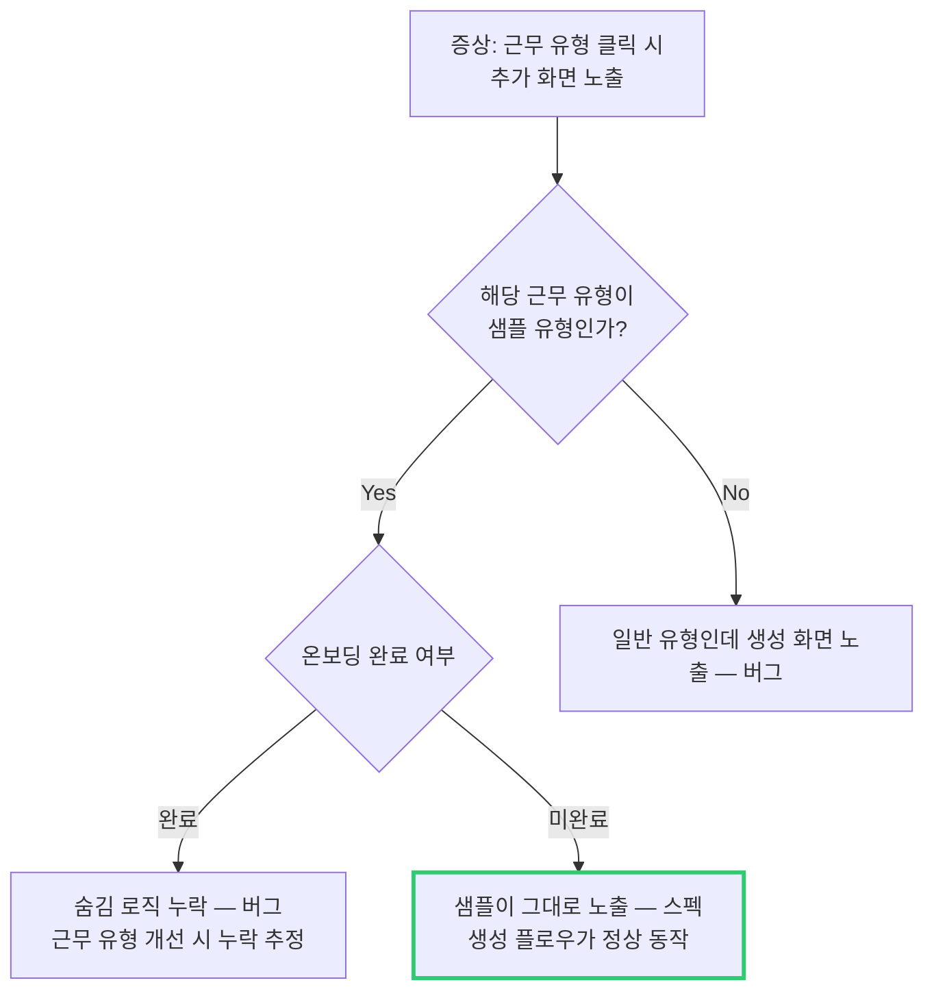

# CI-4379: 근무 유형 클릭 시 수정 화면 대신 추가 화면 노출

## 증상
- **문제 정의**: 기존 근무 유형을 클릭하면 수정 화면이 아닌 새 유형 추가(생성) 화면이 표시됨
- **회사**: (주)제이디컴포넌트 (Customer ID: 165149)
- **요청자**: anna@jdcomponent.com (김한나 접수)[^1]
- **대상자**: 해당 회사 관리자 (설정 페이지 접근자)
- **영향 범위**: 해당 회사 근무 유형 설정 사용자
- **문제 시점**: 2026-04-09 인입
- 문의 내용:
  1. 설정 > 근무 유형에서 기존 근무 유형을 클릭하면 유형 설정(수정) 화면이 아닌 새 유형 추가 화면이 나타남[^1]
  2. 기존에 사용하고 있는 근무 유형인데 왜 그런지 확인 요청[^1]
- **재현 경로**: 설정 - 근무 유형 - 근무 유형 클릭[^1]
- **첨부**: 영상 첨부됨 (7초부터 확인)[^2]

## 원인 분석

### 조사 과정

> 💡 Linear 코멘트에서 내부 개발자들의 즉각적인 분석으로 원인 파악
> → 해당 근무 유형이 **샘플 근무 유형**[^5]임을 확인[^4]
> → 샘플 유형은 온보딩 시 자동 생성되며, 생성 플로우를 통해 설정하는 것이 의도된 동작[^4]
> → 해당 회사가 근무 유형을 한 번도 설정(온보딩)하지 않아 샘플 상태 그대로 사용 중이었음[^8][^13]
> → 생성 플로우 안내로 해결 가능 확인[^6][^11]

### 원인
- 해당 회사가 **온보딩을 한 번도 완료하지 않아** 샘플 근무 유형이 미설정 상태로 남아있었음[^13]
- 샘플 근무 유형 클릭 시 생성(설정) 플로우가 표시되는 것은 **의도된 동작**[^4][^9]

## 영향 범위
- 온보딩 미완료 회사에서 샘플 근무 유형을 그대로 사용 중인 경우 동일 증상 발생 가능
- 금전적/법적 영향: 해당 없음 (설정 UI 이슈)

## 해결
- **고객 안내**: 생성 플로우를 그대로 진행하면 자동으로 매핑되어 정상 사용 가능함을 안내[^11][^13]
- 코드 수정 불필요 — 의도된 동작[^9]

## 발견한 스펙/제약
- 샘플 근무 유형은 온보딩 시 자동 생성되며, 생성 플로우를 통해 실제 설정을 완료하는 것이 의도된 사용 흐름[^4]
- 온보딩 완료 후 샘플 유형은 숨김 처리되어야 하나, 근무 유형 개선 작업 시 해당 로직이 누락되었을 가능성이 별도로 존재함[^7]

## 다음에 같은 문의가 오면

1. **먼저 확인**: 해당 회사의 근무 유형이 샘플 상태(미설정)인지 확인 — 설정 > 근무 유형에서 클릭 시 생성 화면이 뜨면 샘플 상태
2. **원인 판별**: 온보딩을 완료했는데도 샘플이 보이면 → 숨김 로직 누락 가능성 (FE 코드 확인 필요). 온보딩 미완료라면 → 정상 동작
3. **조치**: 고객에게 "생성 플로우를 그대로 진행하면 근무 유형이 자동으로 설정됩니다"라고 안내

## 참고 자료
- Linear: [CI-4379](https://linear.app/flexteam/issue/CI-4379)
- Slack 스레드: [인입 채널](https://flex-cv82520.slack.com/archives/CRU35U9FC/p1775703405274669)
- Intercom: [대화](https://app.intercom.com/a/apps/xj5aqcy9/conversations/215473833849873)
- Metabase 회사 정보: [dashboard](https://metabase.dp.grapeisfruit.com/dashboard/256?customer_id=165149)

## 각주
[^1]: Linear 이슈 설명, @김한나, 2026-04-09
[^2]: Linear 코멘트 @김한나, 2026-04-09
[^3]: Linear 코멘트 @김영준(Enhance), 2026-04-09
[^4]: Linear 코멘트 @안희종, 2026-04-09 — "저 샘플 근무 유형이 온보딩할 때 깔아만 놓고 바로 세팅해서 쓰는 게 의도"
[^5]: 샘플 근무 유형 — 온보딩 과정에서 자동 생성되는 미리 정의된 근무 유형 템플릿. 사용자가 생성 플로우를 통해 실제 설정을 완료해야 정식 근무 유형으로 전환된다.
[^6]: Linear 코멘트 @안희종, 2026-04-09 — "그냥 생성 플로우 타고 설정하시면 자동으로 매핑되긴 할거에요"
[^7]: Linear 코멘트 @권재호, 2026-04-09 — "샘플 근무 유형은 온보딩 끝나면 숨김 처리되고 해제가 안되어야하는 처리가 들어가있었는데 근무 유형 개선하면서 해당 로직이 누락되었나보네요"
[^8]: Linear 코멘트 @안희종, 2026-04-09 — "온보딩을 한 번도 안 탄 것 아닐까.."
[^9]: Linear 코멘트 @지무근, 2026-04-09 — "저것의 의도된 플로우긴 한데 맥락 없이 보면 헷갈리네요"
[^10]: Linear 코멘트 @박준홍, 2026-04-09 — "그럼 이것은 따로 대응하지 않아도 되나요?"
[^11]: Linear 코멘트 @안희종, 2026-04-09 — "상황 설명하고 고객한테 그냥 그 생성 플로우 타시면 될꺼다 안내하면 될 것 같습니다"
[^12]: Linear 코멘트 @박준홍, 2026-04-09 — "@hanna.kim 확인한번 부탁드려요"
[^13]: Linear 코멘트 @김한나, 2026-04-09 — "그럼 여기는 근무 유형을 설정해본 적이 없는 것이죠? 안내드려보겠습니다."
