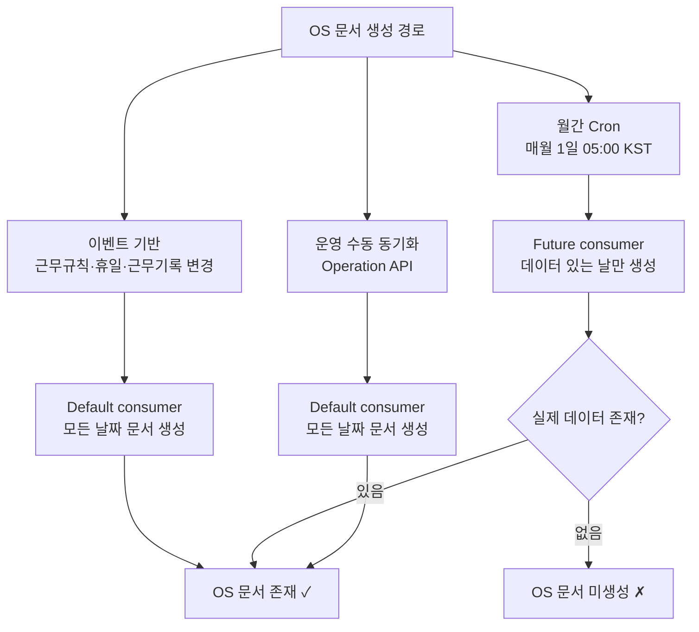

# CI-4413: 휴일 대체 시 특정 구성원에게 특정 일자가 미노출

> **상태**: 해결 완료 — 2026-04-13
> **verdict**: `bug` — **이슈 A 확정 (OS 문서 미생성, CI-3949 재현)**. Operation API 수동 sync 로 즉시 대응 완료

## 증상

- **문제 정의**: 근태관리 > 휴일대체 화면에서 특정 구성원에게 **4월 26일** 일자가 선택지로 노출되지 않음[^1]
- **회사**: 와이즐리컴퍼니 (Customer ID: 1677)[^1]
- **요청자**: jnlee@wisely.store (Intercom 문의 접수)[^1]
- **대상자**: nypark@wisely.store[^1]
- **영향 범위**: 최초 보고 1명 + 이미지상 다른 구성원에서도 26일 미노출 사례 확인됨 — 범위 미확정[^2]
- **문제 시점**: 2026-04-26 (해당 일자 노출 자체가 안 됨)
- 문의 내용:
  1. 동일한 근무 유형이 적용되어 있고, 별도 변경 예약 역시 없는 상태[^1]
  2. 4월 26일만 노출되지 않음. 다른 구성원도 동일 증상 사례 존재[^2]
  3. 원인 확인 요청, 오류라면 노출 가능하도록 조정 가능한지 문의[^1]

## 문제 평가
> assess 완료 — 2026-04-13

- **도메인**: `:time-tracking` (근태/휴가) — repo: `flex-timetracking-backend`, `flex-timetracking-frontend`
- **이슈 타입**: Data (UI 미노출이지만 데이터/sync 계층 문제 가능성 우세, CI-3949 선례 일치)

### 성격

**OS `prod-v2-tracking-work-schedules` 문서 누락 또는 `holidayProps` null 중 하나로 강하게 추정**. CI-3949 에서 확립된 2가지 분기가 그대로 재현되는 양상[^8].

- 증상 동일: "휴일대체 탭에 특정 일자 미표기 + 동일 회사 내 일부 구성원만 영향"
- **2026-04-26은 일요일**[^9] — 대부분 회사에서 주휴일(유급)로 설정되므로 휴일대체 대상에 포함되는 것이 자연스러움
- 따라서 "왜 다른 유저는 보이고 이 유저만 안 보이는가"가 핵심 — **유저 단위 OS 문서 sync 누락이 지배적 가설**
- 1차 분기:
  - OS 문서 없음 → **이슈 A** (CI-3949): 자동근무 미사용 + 근무 미수정 유저의 sync 이벤트 미발생. 아키텍처 이슈, 미수정 상태.
  - OS 문서 있으나 `holidayProps` null → **이슈 B** (CI-3949): 해당 날짜 시점 활성 근무유형의 `dayWorkingType`이 `WEEKLY_UNPAID_HOLIDAY`이면 스펙. 다른 값이면 별도 조사.

### 영향 범위

- **최소 확정**: nypark@wisely.store 1명 + 스크린샷상 와이즐리컴퍼니 내 복수 구성원[^2]
- **추정 상한**: 와이즐리컴퍼니(1677)에서 "자동근무 미사용 + 2026-04-26 근무 미수정" 조건을 만족하는 구성원 전체
- **진행형 여부**: 예. 2026-04-26 까지 계속 노출 안 되는 상태 지속 → 사전 휴일대체 신청 불가
- **확산 가능성**: 타 회사에서 2026-04-26을 유급휴일로 갖고 자동근무 미사용 구성원이 있는 경우 동일 증상 가능. 다만 본 티켓 범위는 와이즐리에 한정.

### 긴급도

**중 (즉시 조치 가능 + 사용자 권리 영향)**[^10]

- **완화 요인**: CI-3949 에서 확립된 즉시 대응책(수동 OS sync API) 존재 → 조사 후 단시간 내 해결 가능
- **긴급화 요인**:
  - 4/26까지 약 2주 — 사전 휴일대체 신청 창이 닫혀가는 중
  - 휴일대체 UI 미노출은 근로자에게 **불리한** 방향 (대체휴일 취득 기회 감소)
  - 와이즐리 내 다수 구성원 영향 가능성
- **판단**: 당일 중 OS/DB 조회로 이슈 A/B 분기 판별 → 이슈 A면 수동 sync 실행, 이슈 B면 근무유형 설정 확인 후 고객 안내

### 조사 방향

**CI-3949 의 "다음에 같은 문의가 오면" 플레이북을 그대로 적용**[^11]:

1. **OS 조회** — `prod-v2-tracking-work-schedules` 에서 nypark + 2026-04-26 문서 존재 여부 확인
2. **분기**:
   - 문서 없음 → 이슈 A 확정 → `POST /action/operation/v2/time-tracking/sync-os-work-schedule-advanced` 수동 sync 실행 (대상자 확장 전 범위 COUNT 선행)
   - 문서 있고 `holidayProps` null → 이슈 B 후보 → `v2_user_work_rule` + `v2_customer_work_rule` 에서 2026-04-26 시점 활성 근무유형의 일요일 `dayWorkingType` 확인
3. **범위 확장** — 와이즐리 내 동일 증상 구성원 전체 파악(COUNT) 후 일괄 sync
4. **COOKBOOK 매칭**: `:time-tracking` 도메인 — CI-3949 사례가 재사용 가능한 패턴으로 `g:tt-04` glossary에 이미 등록됨[^7]

---

## 원인 분석

> **verdict**: `bug` — **이슈 A 확정: OS `prod-v2-tracking-work-schedules` 문서 미생성 (CI-3949 재현)**

### 핵심 결론 (L1)

**nypark의 `v2_user_work_plan` 이 2026-02-01부터 `RESET` 상태**(실질적 자동근무 미사용)인 상태에서 4/26에 대한 근무 수정도 없어 sync 이벤트가 발행되지 않았고, 결과적으로 OS 문서가 생성되지 않음. 휴일대체 탭이 `ORIGINAL_HOLIDAY` exists 필터로 조회하므로 미표기 발생[^12]. **CI-3949 이슈 A 와 동일한 메커니즘**. Operation API `sync-os-work-schedule-advanced` 수동 실행으로 OS 문서 생성 확인 및 UI 복구 완료[^17].

### 핵심 근거 (L2)

| # | 확인 사실 | 출처 |
|---|----------|------|
| 1 | nypark user_id = **875779** (customer_id=1677) | DB 조회[^13] |
| 2 | 2026-04-26 시점 활성 근무유형 = `customer_work_rule_id=256740` ("2026년 근태", date_from=2026-02-01, event_time=2026-01-30 17:45) | DB 조회[^14] |
| 3 | rule 256740 **일요일 `dayWorkingType` = `WEEKLY_PAID_HOLIDAY`** (유급 주휴일) | DB 조회[^15] |
| 4 | rule 256740 **auto_conversion_enabled = ON** (자동근무 사용) | DB 조회[^15] |
| 5 | 2026-04-26 = 일요일 | 달력[^9] |

> 💡 **판단 근거**: 일요일=`WEEKLY_PAID_HOLIDAY` → CI-3949 archive의 `TrackingUserOriginalDayBaseHolidayLookUpServiceImpl.kt:82-87` 제외 로직(`WEEKLY_UNPAID_HOLIDAY`만 제외)을 적용하면 **이 날짜는 `originalHolidaysByDate`에 포함되어야 정상**[^12]. 따라서 UI 미노출은 "스펙에 의한 제외"가 아니다.

> 💡 **이중 레이어 구조**: `v2_customer_work_rule` (회사 설정) 은 `auto_conversion_enabled=ON` 이지만[^15], `v2_user_work_plan` (유저 개인 플랜) 최신 이벤트가 **`RESET` (2026-02-01~)** 이라 **실질적으로 자동근무 미사용 상태**[^18]. CI-3949 archive의 미결 사항(`762929: 자동근무 있는데도 미표기`)과 동일한 레이어 오해 케이스로, 본 조사에서 **진짜 판별 기준은 `v2_user_work_plan` 의 최신 event_type** 임이 밝혀짐.

### 가설 목록

| # | 가설 | 확인 방법 | 상태 |
|---|------|----------|------|
| 1 | 이슈 B — 활성 근무유형의 일요일이 `WEEKLY_UNPAID_HOLIDAY`라서 제외(스펙) | DB: `v2_customer_work_rule` 일요일 `dayWorkingType` | ❌ **소거** — 일요일=`WEEKLY_PAID_HOLIDAY`[^15] |
| 2 | 이슈 A — OS `prod-v2-tracking-work-schedules` 문서 미생성 | Operation API sync 실행 후 OS 문서 생성 확인 | ✅ **확정** — sync 실행 후 OS 문서 생성 + UI 노출 복구[^17] |
| 3 | 이슈 A 근본 원인 — `v2_user_work_plan` RESET 상태(실질적 자동근무 미사용) + 근무 미수정으로 sync 이벤트 미발생 | DB: `v2_user_work_plan` 최신 event_type | ✅ **확정** — 2026-01-30 RESET 이벤트로 2026-02-01부터 자동근무 plan 해제[^18] |
| 4 | 이슈 C (신규) — OS 문서 있으나 `holidayProps` null | OS 조회 | ❌ **소거** — 문서 자체가 없었음(가설 2 확정) |

<details>
<summary>📊 DB 조회 결과 상세 (4쿼리)</summary>

**쿼리 1** — `flex.view_user` (PII 마스킹 적용):

| user_id | customer_id | email | name_in_office | deleted_date |
|---------|-------------|-------|----------------|--------------|
| 875779 | 1677 | [MASKED] | [MASKED] | NULL |

**쿼리 2** — `flex.v2_user_work_rule` (nypark 875779, 시간순):

| id | cwr_id | event_type | date_from | date_to | event_time |
|----|--------|-----------|-----------|---------|------------|
| 1316242 | 357 | REGISTER | 1970-01-01 | 9999-12-31 | 2025-09-11 |
| 1393273 | 256246 | REGISTER | 2026-01-01 | 9999-12-31 | 2025-12-26 |
| 1395467 | 256740 | REGISTER | 2026-01-01 | 9999-12-31 | 2025-12-30 |
| 1396932 | 256740 | REGISTER | 2026-03-01 | 9999-12-31 | 2025-12-31 |
| 1397471 | 357 | REGISTER | 2026-01-01 | 9999-12-31 | 2025-12-31 |
| **1432598** | **256740** | REGISTER | **2026-02-01** | 9999-12-31 | **2026-01-30 17:45** |

→ 2026-04-26 시점 date_from ≤ 2026-04-26 ≤ date_to 를 만족하는 가장 최신 event = **id=1432598 (cwr 256740, 적용 2026-02-01부터)**

**쿼리 3** — `flex.v2_customer_work_rule` (와이즐리 근무유형 3개):

| id | 이름 | control_type | 일요일 `dayWorkingType` | 토요일 `dayWorkingType` | auto_conversion |
|----|------|--------------|------------------------|-------------------------|-----------------|
| 357 | 기본 | FIXED | `WEEKLY_PAID_HOLIDAY` | `WEEKLY_UNPAID_HOLIDAY` | ON |
| 256246 | 기본_20251226 | CHECK_IN_FLEXIBLE | `WEEKLY_PAID_HOLIDAY` | `WEEKLY_UNPAID_HOLIDAY` | ON |
| **256740** | **2026년 근태** | CHECK_IN_FLEXIBLE | **`WEEKLY_PAID_HOLIDAY`** ✓ | `WEEKLY_UNPAID_HOLIDAY` | **ON** |

3개 rule 모두 패턴 동일 (일=유급, 토=무급). 2026-04-26(일) = 유급 주휴일로 일관되게 취급됨.

**쿼리 4** — `flex.v2_user_work_plan` (nypark 875779, 자동근무 플랜 이력):

| id | event_type | date_from | date_to | event_time |
|----|-----------|-----------|---------|------------|
| 2335177 | REGISTER | 2025-09-11 | 9999-12-31 | 2025-09-11 |
| 2677247 | RESET | 2026-01-01 | 9999-12-31 | 2025-12-26 |
| 2694034 | REGISTER | 2026-01-01 | 9999-12-31 | 2025-12-31 |
| **2778615** | **RESET** ⚠️ | **2026-02-01** | 9999-12-31 | **2026-01-30 17:45** |

→ 최신(2026-01-30) 이벤트가 `RESET` → **2026-02-01부터 유저 개인의 자동근무 plan 해제 상태**. 회사 설정은 `auto_conversion_enabled=ON` 이어도, 유저 레벨에서 플랜이 RESET 이면 자동근무 미사용으로 취급되어 sync 이벤트 미발생[^18].

</details>

---

## 해결

### 즉시 대응 — Operation API 수동 sync 실행

**API 호출**[^17]:
```
POST /action/operation/v2/time-tracking/sync-os-work-schedule-advanced
```

**Request Body** (1단계 nypark 단일 sync):
```json
{
  "jobType": "WORK_SCHEDULE_ENRICHMENT_OPERATION_EVENT",
  "targets": [
    {"customerId": 1677, "userIds": [875779]}
  ],
  "dateFrom": "2026-04-26",
  "dateTo": "2026-04-26"
}
```

**실행 결과**: OS 문서 생성 확인, UI에서 4/26 노출 복구 완료[^17]

---

## 발견한 스펙/제약

### OS 문서 동기화 시점 — 3가지 경로



| 경로 | 트리거 | consumer | 빈 문서 생성 | 범위 |
|------|--------|----------|------------|------|
| 이벤트 기반 | 근무규칙/휴일/근무기록 변경 | Default | **생성함** | 변경일 ±1개월(realtime), 이후 +2개월(batch)[^19] |
| 월간 Cron | 매월 1일 05:00 KST | **Future** | **생성 안 함** | 현재 ~ +2개월 말일[^20] |
| 수동 동기화 | Operation API 호출 | Default | **생성함** | 지정 범위[^21] |

### 미래 데이터에 대한 스펙 — Future vs Default

`FutureSearchWorkScheduleSyncService.makeSyncDataForDay()`[^22] 에서 미래 날짜의 daily 문서 생성 시 아래 필터를 적용한다:

```kotlin
// FutureSearchWorkScheduleSyncService.kt L61-67
.filter {
    // 싱크 할 데이터가 있는 경우만 싱크
    it.workClockInOutTimes != null ||
        (it.workTimeBlocks ?: emptyList()).isNotEmpty() ||
        (it.restTimeBlocks ?: emptyList()).isNotEmpty() ||
        (it.timeOffTimeBlocks ?: emptyList()).isNotEmpty()
}
```

`DefaultSearchWorkScheduleSyncService.makeSyncDataForDay()`[^23] 에는 이 필터가 **없다** — converter 결과를 그대로 반환하여 빈 문서도 저장한다.

| | Future consumer | Default consumer |
|---|---|---|
| daily 문서 | 4가지 데이터[^24] 중 하나 이상 있어야 저장 | **무조건 저장** |
| periodic 문서 | `dayTimeBlocks` 비어있으면 null | **무조건 저장** |
| 설계 의도 | 미래 빈 문서 대량 생성 방지 (토큰/스토리지 절약) | 과거~현재 문서 완전성 보장 |

### 휴일대체가 안 나오는 케이스 (총 7가지)

#### 1. OS 문서 미생성 (이번 이슈)

- **조건**: 미래 날짜에 근무계획/휴가/출퇴근 기록이 없고, Future consumer로만 동기화된 경우
- **화면**: 근태관리 → 휴일대체 (OpenSearch 기반 어드민 API)[^3]
- **코드**: `FutureSearchWorkScheduleSyncService.makeSyncDataForDay()` L61-67[^22]

#### 2. WEEKLY_UNPAID_HOLIDAY (휴무일) 제외

- **조건**: 해당 날짜의 근무규칙에서 요일이 `WEEKLY_UNPAID_HOLIDAY`(무급 휴무일)로 설정
- **예시**: 토요일이 `WEEKLY_UNPAID_HOLIDAY`인 근무규칙 → 토요일 미노출
- **코드**: `mergeUserHolidayAndWeeklyHolidaysAndFilterExactDate()` L356[^25]

#### 3. SHIFT 근무자 주휴일 제외

- **조건**: 근무규칙의 `controlType === WorkingHourControlType.SHIFT`
- **효과**: 주휴일(토/일 등) 전체 제외, 쉬는날만 표시
- **코드**: `getUserAlternativeHolidayStatus()` L87-92[^26]

#### 4. 단시간 근로 규칙 적용 기간

- **조건**: `ShortHoursPartTime` 근무규칙 적용 기간에서 `checkValidHoliday` 불통과
- **코드**: `TrackingUserOriginalHolidayLookUpServiceImpl.filterHolidaysIfShortHoursPartTimeWorkRuleApplied()`[^27]

#### 5. 노동절 (MAYDAY)

- **조건**: `holidayType == TrackingHolidayType.MAYDAY`
- **효과**: 휴일대체 자체 불가 (예외 발생)
- **코드**: `UserAlternativeHolidayCandidateLookUpService` L65-67[^28]

#### 6. 쉬는날-주휴일 경합

- **조건**: 같은 날에 쉬는날과 주휴일이 겹침
- **효과**: 쉬는날 우선, 주휴일 행 제거 (중복 방지)
- **코드**: `mergeUserHolidayAndWeeklyHolidaysAndFilterExactDate()` L344-347[^25]

#### 7. 쉬는날 정책 비활성화

- **조건**: 해당 날짜를 포함하는 HolidayPolicy가 비활성화 상태
- **효과**: `getEnabledHolidayPolicies`에서 조회되지 않음
- **코드**: `UserHolidayPolicyLookUpService`[^29]

---

## 다음에 같은 문의가 오면

1. **먼저 확인**: OpenSearch dev tools에서 `prod-v2-tracking-work-schedules` 인덱스에 해당 유저+날짜 문서가 존재하는지 확인
2. **원인 판별**:
   - 문서 없음 → **이슈 A** (OS sync 누락) → 수동 sync 실행
   - 문서 있으나 `holidayProps` null → **이슈 B** → 해당 날짜 시점 활성 근무유형의 `dayWorkingType` 확인 (`WEEKLY_UNPAID_HOLIDAY`면 스펙)
3. **조치**:
   - 이슈 A: `POST /action/operation/v2/time-tracking/sync-os-work-schedule-advanced` 수동 sync
   - 이슈 B: 근무유형 설정이 의도된 것인지 고객에게 확인 후 안내

## 알려진 이슈 히스토리

| 시점 | 이벤트 |
|------|--------|
| 2025-10-28 | 김영준님 슬랙에서 이슈 인지[^16] — "위클리때 다시 한번 얘기 꺼내보겠습니당" |
| 2026-02-24 | [CI-3949](./archive/CI-3949.md) — 동일 패턴 재발, 수동 sync로 대응[^8] |
| 2026-04-13 | CI-4413 — 또 재발 (현재 이슈) |

## 연관 이슈

- [CI-3949](./archive/CI-3949.md): **동일 이슈** — 휴일대체 탭에 3/2 미표기, OS 문서 미생성. 수동 sync로 대응, 근본 수정 미완료

## 비고

### 참고 자료

- COOKBOOK F1: 휴일대체 탭 미표기 진단 플로우[^30]
- Linear: [CI-4413](https://linear.app/flexteam/issue/CI-4413)
- 수동 동기화 API: `POST /action/operation/v2/time-tracking/sync-os-work-schedule-advanced`[^21]

### 재발 방지 / 향후 참고

- 근본 수정 필요: Future consumer 필터 조건에 휴일 정보 포함 또는 휴일대체 API를 DB 기반으로 전환
- 이 이슈는 2025-10-28부터 인지된 아키텍처 이슈이나 3회 재발 중

## 각주

[^1]: Linear 이슈 설명, 2026-04-13
[^2]: Linear 코멘트 @김현욱, 2026-04-13 — "다른 구성원도 26일이 노출되지 않는 건이 있어서요"
[^3]: 코드: `flex-timetracking-backend` > time-tracking/api/.../CustomerAlternativeHolidayLookUpController.kt — `searchAlternativeHolidayInfoByDepartments()`
[^7]: `brain/COOKBOOK.md` > F1: 휴일대체 탭 미표기 + glossary `g:tt-04`
[^8]: [CI-3949](./archive/CI-3949.md) 참고 — 동일 아키텍처 이슈, verdict: bug (설계 한계)
[^9]: 2026년 달력 확인 — 4월 1일=수요일, 4월 26일=일요일
[^10]: 근로기준법 제55조(휴일) — 유급휴일 대체는 근로자 권리 관련
[^11]: [CI-3949](./archive/CI-3949.md) "다음에 같은 문의가 오면" 섹션
[^12]: 코드: `flex-timetracking-backend` > tracking-search/service/.../OsDailyWorkScheduleWithHolidaySearchChildCondition — `ORIGINAL_HOLIDAY` exists 필터
[^13]: DB: `flex.view_user` WHERE customer_id=1677 AND email='nypark@wisely.store'
[^14]: DB: `flex.v2_user_work_rule` WHERE user_id=875779 — REGISTER 6건 중 eventTimeStamp 최신=id 1432598 (cwr 256740, 2026-02-01~)
[^15]: DB: `flex.v2_customer_work_rule` WHERE id=256740 — sunday_working_hour_rule.dayWorkingType=`WEEKLY_PAID_HOLIDAY`, auto_conversion_enabled=ON
[^16]: Slack: #dev-time-tracking [스레드](https://flex-cv82520.slack.com/archives/C038DUJJ5ND/p1761630027146609?thread_ts=1761628998.149819&cid=C038DUJJ5ND) — "휴일대체 원장을 OS로 쓰는데, 자동근무안쓰고, 근무 건드리는게 많이 없는 유저는 조회가 안되는 이슈"
[^17]: Operation API `sync-os-work-schedule-advanced` 실행, 2026-04-13
[^18]: DB: `flex.v2_user_work_plan` WHERE user_id=875779 — 최신 이벤트 id=2778615: event_type=RESET, date_from=2026-02-01
[^19]: 코드: `flex-timetracking-backend` > tracking-search/service/.../WorkScheduleEnrichmentEventQueueService.kt — ±1개월 realtime, 이후 batch. `WorkScheduleEnrichmentDateRangeChunkService` 가 +2개월로 제한
[^20]: 코드: `flex-timetracking-backend` > applications/cron/.../TimeTrackingSearchWorkScheduleScheduler.kt:55-70 — `@Scheduled(cron = "0 0 5 1 * *")`, `FUTURE_MONTH_OFF_SET_FROM_NOW = 2L`
[^21]: 코드: `flex-timetracking-backend` > time-tracking/operation-api/.../WorkScheduleOsSyncAdvancedController.kt
[^22]: 코드: `flex-timetracking-backend` > tracking-search/service/.../FutureSearchWorkScheduleSyncService.kt:61-67
[^23]: 코드: `flex-timetracking-backend` > tracking-search/service/.../DefaultSearchWorkScheduleSyncService.kt:35-56 — 필터 없이 converter 결과 그대로 반환
[^24]: workClockInOutTimes (출퇴근 타각), workTimeBlocks (근무 블록), restTimeBlocks (휴게 블록), timeOffTimeBlocks (휴가 블록)
[^25]: 코드: `flex-timetracking-backend` > time-tracking/service/.../CustomerUserAlternativeHolidayStatusLookUpService.kt:325-360
[^26]: 코드: `flex-timetracking-backend` > time-tracking/service/.../CustomerUserAlternativeHolidayStatusLookUpService.kt:87-92
[^27]: 코드: `flex-timetracking-backend` > tracking-holiday/service/.../TrackingUserOriginalHolidayLookUpServiceImpl.kt
[^28]: 코드: `flex-timetracking-backend` > time-tracking/service/.../UserAlternativeHolidayCandidateLookUpService.kt:65-67
[^29]: 코드: `flex-timetracking-backend` > holiday/service/.../UserHolidayPolicyLookUpService.kt
[^30]: `brain/COOKBOOK.md` > F1: 휴일대체 탭 미표기
