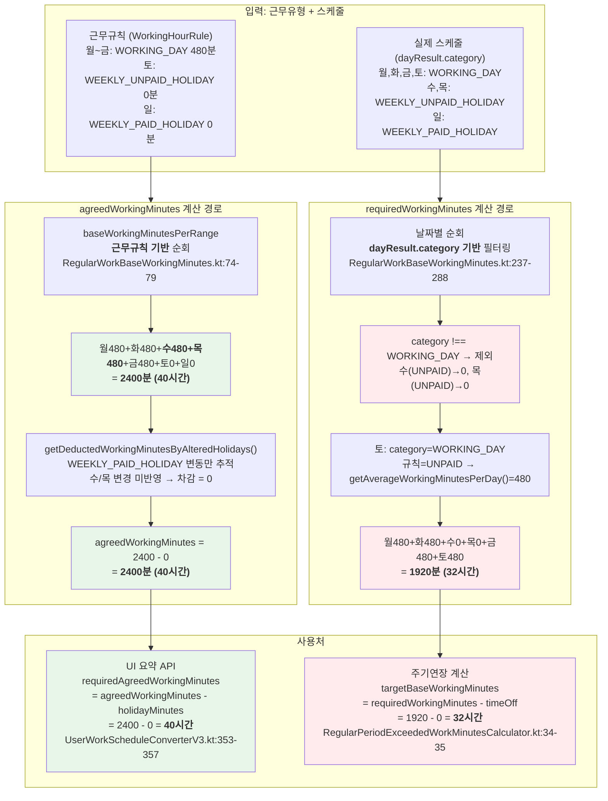
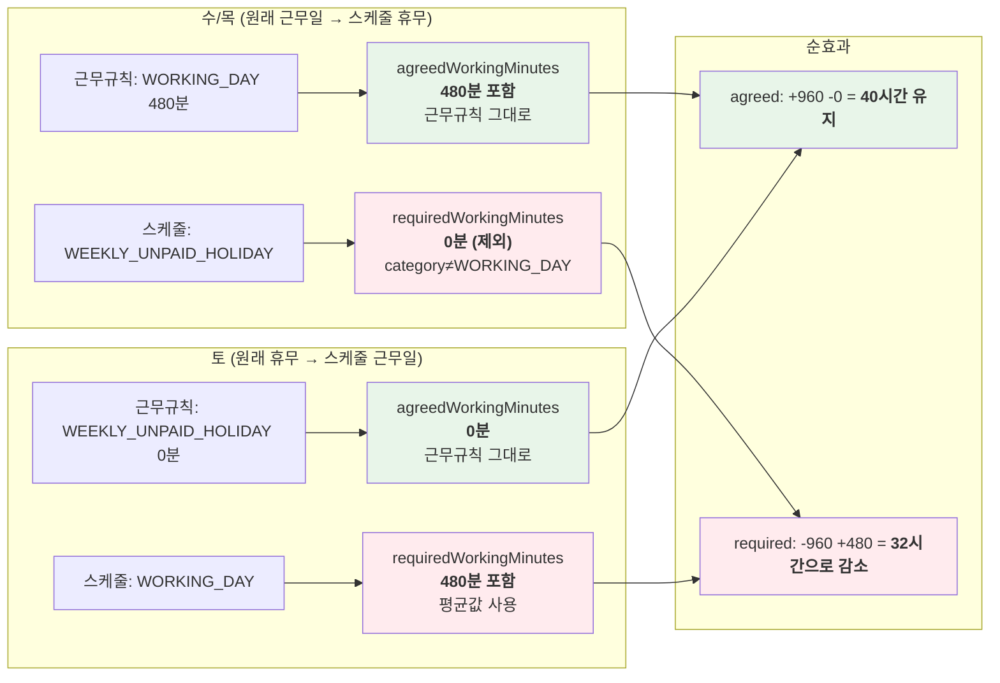
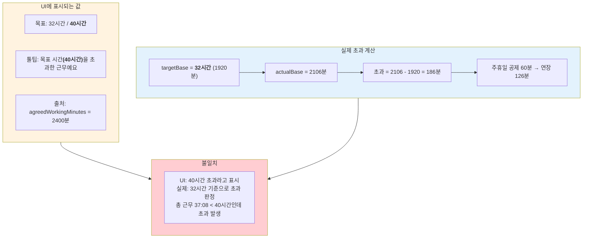

# CI-3839: 주 연장근무 발생 원인 확인

> Linear: https://linear.app/flexteam/issue/CI-3839

---

## 1. 이슈 개요

| 항목 | 내용 |
|------|------|
| 회사 | 유한회사 미소 (Customer ID: 71027) |
| 대상자 | miso143.soojeong@gmail.com |
| 기간 | 2026.1.19 ~ 1.25 (1주) |
| 근무유형 | CX 40 스케줄근무_20251111 (customerWorkRuleId: 251526) |
| 문의 내용 | 주 40시간을 초과하지 않았는데(37:08) 연장근무 5:08 발생 |

---

## 2. 현상

### 2-1. 근무 기록

| 날짜 | 요일 | 근무시간 | 스케줄 카테고리 | 비고 |
|------|------|---------|---------------|------|
| 19 | 월 | 8:00 | WORKING_DAY | |
| 20 | 화 | 8:00 | WORKING_DAY | |
| 21 | **수** | 2:06 | **WEEKLY_UNPAID_HOLIDAY** | 스케줄 휴무일에 근무 |
| 22 | **목** | 0:00 | **WEEKLY_UNPAID_HOLIDAY** | 스케줄 휴무일 |
| 23 | 금 | 8:00 | WORKING_DAY | 오후 2:54~5:00에 주기연장 표시 |
| 24 | **토** | 10:02 🔥 | **WORKING_DAY** | 스케줄 근무일 (원래 무급휴일) |
| 25 | **일** | 1:00 | WEEKLY_PAID_HOLIDAY | 주휴일 근무 |
| **합계** | | **37:08** | | |

### 2-2. 요약 화면 데이터

```
총 근무: 37시간 8분 / 52시간
목표: 32시간 / 40시간     ← currentTargetWorkingMinutes / requiredAgreedWorkingMinutes
  기본: 32시간
초과: 5시간 8분
  연장: 2시간 6분          ← 주기연장 (overWorkMinutes=126)
  연장: 2시간 2분          ← 일일연장 (토요일 8h 초과)
  휴일: 1시간              ← 주휴일 근무 (holidayWorkMinutes=60)
```

### 2-3. 툴팁 표시

23일(금) 오후 2:54~5:00 구간에 연장근무 표시:
> "목표 시간(40시간)을 초과한 근무예요."

**→ 총 37:08 < 40시간인데 "40시간 초과"라고 표시됨**

---

## 3. 근무유형 설정

### 3-1. 주요 설정

| 설정 | 값 |
|------|-----|
| controlType | `SHIFT` (스케줄 근무) |
| workingHourType | `FULL_TIME` |
| workingHourCalculationStrategy | `REGULAR_FIFTY_TWO_HOURS_PER_WEEK` |
| workingPeriodRule | WEEK / 1주 / 시작일 2024-03-18 |
| baseAgreedDayWorkingMinutes | 480분 (8시간) |
| useRegardedOverWork | **false** |
| exceedStatutoryWorkingMinutesSettingEnabled | false |
| distributePeriodOverToDay | false |

### 3-2. 요일별 근무규칙 (근무유형 원래 설정)

| 요일 | dayWorkingType | agreedWorkingMinutes | regularWorkDay |
|------|---------------|---------------------|----------------|
| 월 | WORKING_DAY | 480 | true |
| 화 | WORKING_DAY | 480 | true |
| **수** | **WORKING_DAY** | **480** | **true** |
| **목** | **WORKING_DAY** | **480** | **true** |
| 금 | WORKING_DAY | 480 | true |
| 토 | WEEKLY_UNPAID_HOLIDAY | 0 | false |
| 일 | WEEKLY_PAID_HOLIDAY | 0 | false |

**핵심: 근무규칙상 수/목은 근무일(480분)이지만, 스케줄(SHIFT)에 의해 해당 주에 수/목이 휴무, 토가 근무일로 배정됨.**

---

## 4. 원인 분석

### 4-1. UI 표시와 초과 계산에 서로 다른 기준값이 사용됨

| 용도 | 필드 | 값 | 계산 기준 |
|------|------|-----|----------|
| **UI 목표 표시** | `requiredAgreedWorkingMinutes` | **40시간** | `agreedWorkingMinutes` (근무규칙 기반) |
| **주기연장 계산** | `targetBaseWorkingMinutes` | **32시간** | `requiredWorkingMinutes` (스케줄 기반) |

### 4-2. `agreedWorkingMinutes` = 40시간 (근무규칙 기반)

```
계산 경로: RegularWorkBaseWorkingMinutes.kt:190-212

baseWorkingMinutesPerRange (근무규칙의 workingMinutesPerDay 합산):
  → RegularWorkBaseWorkingMinutes.kt:74-79
  월(480) + 화(480) + 수(480) + 목(480) + 금(480) + 토(0) + 일(0) = 2400분

getDeductedWorkingMinutesByAlteredHolidays():
  → RegularWorkBaseWorkingMinutes.kt:103-166
  → WEEKLY_PAID_HOLIDAY 변동만 추적
  → 수/목(WORKING_DAY→UNPAID), 토(UNPAID→WORKING_DAY) 변경은 반영 안 됨
  → 차감 = 0

agreedWorkingMinutes = 2400 - 0 = 2400분 (40시간)
```

**사용처:**
```kotlin
// UserWorkScheduleConverterV3.kt:353-357
val 필요_소정_근로_시간 = max(
    calculationResult.workMinutesCalculationBasis.agreedWorkingMinutes
        - calculationResult.paidSummary.workingHolidayMinutes,
    0,
)
// → requiredAgreedWorkingMinutes = 2400 - 0 = 40시간 (UI에 표시)
```

### 4-3. `requiredWorkingMinutes` = 32시간 (스케줄 기반)

```
계산 경로: RegularWorkBaseWorkingMinutes.kt:237-288

날짜별 순회, dayResult.category === WORKING_DAY인 날만 합산:
  월: WORKING_DAY → 규칙도 WORKING_DAY → 480
  화: WORKING_DAY → 규칙도 WORKING_DAY → 480
  수: WEEKLY_UNPAID_HOLIDAY → category ≠ WORKING_DAY → 제외 (0)
  목: WEEKLY_UNPAID_HOLIDAY → category ≠ WORKING_DAY → 제외 (0)
  금: WORKING_DAY → 규칙도 WORKING_DAY → 480
  토: WORKING_DAY → 규칙은 UNPAID → getAverageWorkingMinutesPerDay() = 480
  일: WEEKLY_PAID_HOLIDAY → 제외 (0)
  합계 = 1920분 (32시간)
```

**사용처:**
```kotlin
// RegularPeriodExceededWorkMinutesCalculator.kt:34-35
private val targetBaseWorkingMinutes =
    workMinutesCalculationBasis.requiredWorkingMinutes - timeOffMinutes
// → 1920 - 0 = 1920분 (32시간, 주기연장 계산 기준)
```

### 4-4. 수/목/토 처리 비교

| 날짜 | 근무규칙 | 스케줄 | agreedWorkingMinutes | requiredWorkingMinutes |
|------|---------|--------|---------------------|----------------------|
| 수 | WORKING_DAY 480분 | WEEKLY_UNPAID_HOLIDAY | **480분 포함** (규칙 그대로) | **0분 제외** (category≠WORKING_DAY) |
| 목 | WORKING_DAY 480분 | WEEKLY_UNPAID_HOLIDAY | **480분 포함** (규칙 그대로) | **0분 제외** (category≠WORKING_DAY) |
| 토 | WEEKLY_UNPAID_HOLIDAY 0분 | WORKING_DAY | **0분** (규칙 그대로) | **480분 포함** (평균값) |
| **순효과** | | | **+960분 (40시간 유지)** | **-480분 (32시간으로 감소)** |

---

## 5. 주기연장 상세 계산

### 5-1. 디버깅 결과

```kotlin
// RegularWorkMinutesCalculator.kt:72
val periodSummary = periodScopeCalculator.getSummaryResult()

SimplePeriodExceededCalculationSummary(
  regardedOverWorkMinutes = 0,    // useRegardedOverWork=false → 법내연장 비활성
  overWorkMinutes = 126,          // 연장 2:06
  holidayWorkMinutes = 60,        // 휴일 근무 1:00
  holidayNightWorkMinutes = 0
)
```

### 5-2. 계산 과정 (RegularPeriodExceededWorkMinutesCalculator)

**Step 1: 입력값 산출**

```
targetBaseWorkingMinutes                                          [line 34-35]
  = requiredWorkingMinutes(1920) - timeOff(0) = 1920분

actualBaseWorkingMinutes                                          [line 42-44]
  = ∑paidSummary.actualWorkingMinutes - ∑over카테고리 timeBlocks
  = (480+480+126+0+480+602+60) - 122(토 일일연장)
  = 2228 - 122 = 2106분

dayRegardedOverWorkingMinutes = 0                                 [line 46-47]
statutoryWorkingMinutes = 2400분 (40시간)
holidayWorkingMinutesBucket = 60분 (일요일 주휴일 근무)            [line 61]
```

**Step 2: 버킷 계산**

```
regardedOverBucket                                                [line 66-72]
  = min(
      max(2106 - 1920 - 0, 0),  = 186
      max(2400 - 0 - 1920, 0),  = 480
    ) = 186분

overBucket                                                        [line 77-78]
  = max(2106 - 2400, 0) = 0분
```

**Step 3: 휴일 재배분 (getSummaryResult)**

```
초기: regardedOver=186, over=0, remainHoliday=60

[line 89]  60 >= 0 → holidayTotal=0, remainHoliday=60, over=0
[line 105] 60 < 186 → holidayTotal=60, regardedOver=186-60=126
[line 112] 60 >= 0 → holidayWork=60, holidayNight=0
```

**Step 4: useRegardedOverWork=false 적용**

```
[line 121] finalRegardedOver = 0          (법내연장 비활성)
[line 122] finalOver = 0 + 126 = 126     (법내연장→연장으로 합산)
```

### 5-3. 초과 구성 합계

| 구분 | 시간 | 출처 |
|------|------|------|
| 주기연장 (overWorkMinutes) | 126분 (2:06) | 32시간 초과분에서 주휴일 공제 |
| 일일연장 | 122분 (2:02) | 토요일 8시간 초과분 |
| 주기휴일 (holidayWorkMinutes) | 60분 (1:00) | 일요일 주휴일 근무 |
| **총 초과** | **308분 (5:08)** | ✅ UI 표시와 일치 |

### 5-4. 만약 requiredWorkingMinutes가 40시간이었다면?

```
targetBase = 2400
regardedOverBucket = min(max(2106-2400, 0), ...) = 0
overBucket = max(2106-2400, 0) = 0
→ 주기연장 = 0, 휴일 60분만 남음
→ 총 초과 = 122(일일연장) + 60(휴일) = 182분 (3:02)
```

---

## 6. 일연장 기준: 하이브리드 방식

일연장 판정에 사용되는 `baseWorkingMinutesPerDay`는 근무규칙과 스케줄을 모두 고려합니다.

**`getWorkMinutesPerDayByDayInput()` (RegularWorkWorkingHourRule.kt:86-101)**

| 근무규칙 | 스케줄 | baseWorkingMinutesPerDay |
|---------|--------|------------------------|
| WORKING_DAY (480) | WORKING_DAY | 480 (근무규칙 그대로) |
| WORKING_DAY (480) | WEEKLY_PAID_HOLIDAY | 0 (주휴 대체) |
| WEEKLY_UNPAID_HOLIDAY (0) | **WORKING_DAY** | **평균값 480** (토요일 케이스) |
| WEEKLY_UNPAID_HOLIDAY (0) | WEEKLY_UNPAID_HOLIDAY | 0 (그대로) |

토요일: 규칙 UNPAID(0분) + 스케줄 WORKING_DAY → 평균값 480분
→ 일연장 = 10:02 - 8:00 = **2:02 (122분)**

---

## 7. 세 가지 계산 방식 비교

| | 기준 방식 | 수/목 처리 | 토 처리 | 결과 | 코드 위치 |
|---|---|---|---|---|---|
| `agreedWorkingMinutes` | 근무규칙 기반 | 480분 포함 | 0분 | **40시간** | RegularWorkBaseWorkingMinutes.kt:190-212 |
| `requiredWorkingMinutes` | 스케줄 기반 | 0 (제외) | 480분 | **32시간** | RegularWorkBaseWorkingMinutes.kt:237-288 |
| `baseWorkingMinutesPerDay` | 하이브리드 | 규칙 480분 | 평균 480분 | 일별 판단 | RegularWorkWorkingHourRule.kt:86-101 |

---

## 8. 주기연장의 일별 분배 (PeriodOvertimeWorkDistributor)

### 8-1. 분배 메커니즘

주기연장은 기간 단위로 계산된 후, `PeriodOvertimeWorkDistributor`에 의해 일별 timeBlock으로 **역배분**됩니다.

**코드:** `work-time/calculation/src/main/kotlin/team/flex/worktime/calculation/period/PeriodOvertimeWorkDistributor.kt`

| 항목 | 내용 |
|------|------|
| 분배 순서 | **역순** — 마지막 날부터 차감 (line 40: `sortedByDescending { it.date }`) |
| 블록 내 순서 | 종료 시간 기준 역순 (line 126: `sortedByDescending { it.zonedDateTimeRange.to }`) |
| 분배 대상 블록 | NORMAL, NIGHT, REGARDED_OVER, REGARDED_OVER_NIGHT (line 55-57) |
| 분배 우선순위 | OVER 먼저 → REGARDED_OVER (line 40-113) |
| 블록 분할 방식 | 끝에서부터 자르기 (line 163-171: `splitFromEnd`) |

### 8-2. 분배된 블록의 구조

```kotlin
// PeriodOvertimeWorkDistributor.kt:163-171
SimpleWorkMinutesCalculationTimeBlockResult(
    category = OVER,                    // 변환된 카테고리
    zonedDateTimeRange = ZonedDateTimeRange(
        from = 원본블록.to - splitAmount, // 끝에서부터 자름
        to = 원본블록.to,
    ),
    originalCategory = NORMAL,          // 원본 카테고리 보존
    periodOver = true,                  // ← 핵심: 주기연장 플래그
)
```

### 8-3. 이 이슈에서의 분배 과정

```
입력: overWorkMinutes=126, regardedOverWorkMinutes=0

역순 순회:
  일(25) → WEEKLY_PAID_HOLIDAY, 별도 휴일 처리 → skip
  토(24) → WORKING_DAY, 10:02 근무
         → 이미 일일연장(122분)으로 OVER 블록이 있음
         → NORMAL 블록(480분)에서 126분 차감
         → NORMAL 14:54~23:00 → NORMAL 14:54~20:54 + OVER(periodOver) 20:54~23:00
  (126분 소진 완료)

결과: 토요일에 주기연장 분배됨
```

> **참고:** 위 순서는 논리적 추정입니다. 실제 분배 결과는 금요일에 표시되고 있으므로(2:54~5:00), 토요일의 NORMAL 블록이 일일연장으로 이미 소진되어 금요일로 넘어간 것으로 보입니다.
>
> 토요일 10:02(602분) 중 baseWorkingMinutes=480분이므로 122분이 일일연장. 남은 NORMAL 480분에서 126분 차감이 가능하지만, 실제 timeBlock 구조에 따라 금요일에 분배될 수 있습니다.

### 8-4. UI 연결: 툴팁의 "목표 시간(40시간)"

분배된 timeBlock은 API 응답의 `legalTimeBlocks`에 포함되며, `periodOver=true`인 블록에는 추가 정보가 함께 전달됩니다.

**변환 코드:** `UserWorkScheduleConverterV3.kt:352-375`

```kotlin
if (it.periodOver) {
    val 필요_소정_근로_시간 = max(
        calculationResult.workMinutesCalculationBasis.agreedWorkingMinutes
            - calculationResult.paidSummary.workingHolidayMinutes,
        0,
    )
    WorkScheduleOverWorkLegalTimeBlockValueDto(
        periodOver = true,
        periodFrom = period.applyTimeRangeFrom,
        periodToExclusive = period.applyTimeRangeTo,
        requiredWorkingMinutesInPeriod = 필요_소정_근로_시간,  // ← 40시간
    )
}
```

**API 응답 DTO:** `WorkScheduleOverWorkLegalTimeBlockValueDto`

```kotlin
data class WorkScheduleOverWorkLegalTimeBlockValueDto(
    val periodOver: Boolean,              // true
    val periodFrom: EpochMilliseconds?,   // 주기 시작일
    val periodToExclusive: EpochMilliseconds?,  // 주기 종료일
    val requiredWorkingMinutesInPeriod: Minutes?,  // ← 2400분 (40시간)
)
```

**프론트엔드:**
- `requiredWorkingMinutesInPeriod = 2400분`을 받아서
- "목표 시간(**40시간**)을 초과한 근무예요" 텍스트를 생성

### 8-5. 불일치 정리

```
주기연장 계산 기준:  requiredWorkingMinutes = 1920분 (32시간)  ← 실제 초과 판정
툴팁 표시 기준:     agreedWorkingMinutes   = 2400분 (40시간)  ← UI 표시
```

**두 곳 모두 `UserWorkScheduleConverterV3.kt`에서 `agreedWorkingMinutes`를 사용하지만, 실제 초과 계산은 `requiredWorkingMinutes`로 수행됨.** 결과적으로:
- 32시간 기준으로 초과를 판정하고
- 40시간 기준이라고 사용자에게 표시

---

## 9. 다이어그램

### 9-1. 전체 흐름: 두 값의 분기점



### 9-2. 수/목/토 처리 비교



### 9-3. UI 표시 vs 실제 계산 불일치



---

## 연관 이슈
- [CI-3862](./CI-3862.md): 동일 기능 영역(주휴일 배치) — 주휴일 배치 주기 허용 설정과 게시 검증 간 불일치
- [CI-4048](./CI-4048.md): 초단시간 근로자 연장근무 9시간 발생 로직 문의 — 연장근무 계산 로직 관련

## 10. 미결 사항

- [ ] 이 동작이 의도된 것인지, 버그인지 판단 → **보류**
- [ ] `agreedWorkingMinutes` 주석 "현재(2025-08-22) 활용되지 않는다"의 의미 확인
  - 실제로는 요약 API의 `requiredAgreedWorkingMinutes` 계산에 사용되고 있음
- [ ] `requiredWorkingMinutes`가 스케줄 교대(WORKING_DAY↔UNPAID) 시 비대칭적으로 처리되는 것이 의도된 설계인지 확인
  - 근무일 2일 빠지고 1일 추가 → 순감소 8시간 (40→32)
