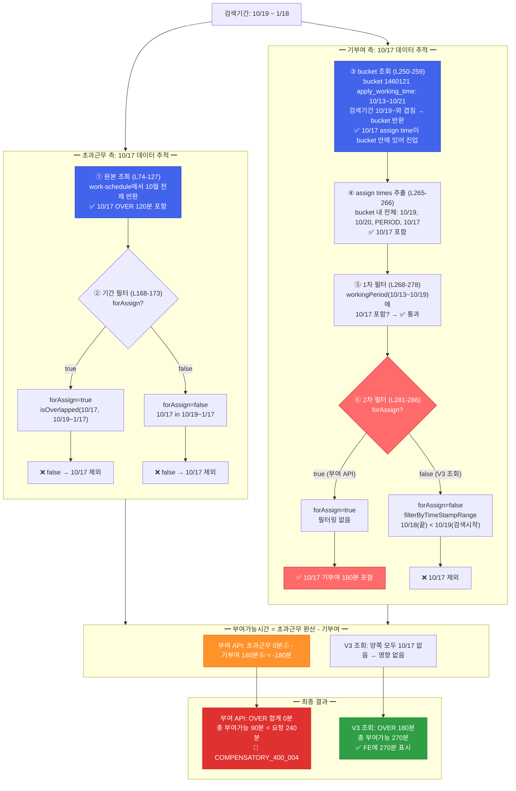

# CI-3858: 보상휴가 지급시 '부여가능한 보상휴가 시간이 없어요' 라고 나오는 원인 확인 요청

> **상태**: 버그 확정, 수정 예정 (진재언, 2/11까지) — 2026-02-10

## 기본 정보

| 항목 | 내용 |
|------|------|
| **회사명** | (주)시스트라코리아 |
| **Customer ID** | 106311 |
| **customerIdHash** | `pVEkqLWQ0M` |
| **문의자** | dhkim1@systra.com |
| **이슈 대상자** | hskim1@systra.com (userId: 476598, userIdHash: `5M0nV2aP06`) |
| **라벨** | 근태/근무/휴가 |
| **Linear** | [CI-3858](https://linear.app/flexteam/issue/CI-3858/보상휴가-지급시-부여가능한-보상휴가-시간이-없어요-라고-나오는-원인-확인-요청) |

## 증상

- 보상 지급 가능 시간 내에서 지급 시도했으나 '부여 가능한 보상휴가 시간이 없어요' 라는 문구가 노출
- 근무조회기간: 25년10월19일 ~ 26년1월18일

## 원인 확정: 10/17 기부여분의 비대칭 처리

**핵심 문제**: 근무조회기간 시작일(10/19) 이전인 10/17의 데이터가 비대칭적으로 처리됨

| 구분 | 10/17 데이터 | 포함 여부 | 이유 |
|------|-------------|----------|------|
| 초과근무 (`exceededWorkTimes`) | OVER 120분 | **제외** | dateRange(10/17) < 검색시작(10/19), `isOverlapped` 불일치 |
| 기부여 (`alreadyAssigned`) | OVER 180분 | **포함** | workingPeriod(10/13~10/19)가 검색기간과 겹침 |

결과:
- 10/17 초과근무 120분 × 150% = 180분 → 부여필요시간에 **미반영** (0분)
- 10/17 기부여 180분 → 기부여시간에 **반영** (180분)
- 부여가능 = 0 - 180 = **-180분**
- 12/23의 OVER 180분을 완전히 상쇄 → OVER 총 부여가능 = 0분
- 총 부여가능 90분 < 요청 240분 → `COMPENSATORY_400_004`

### 부여가능시간 계산 상세

```
부여가능시간 = (초과근무시간 × 가산율) - 기부여 보상휴가 시간
```

가산율 (`overPayPercentInfo`): over 150%, holiday 150%, night 50%, regardedOver 150%, overNight 200%, holidayOver 200%, holidayNight 200%, holidayOverNight 250%

**op1 (초과근무 → 보상휴가 환산):**

| 항목 | 초과근무(분) | 가산율 | 보상휴가(분) |
|------|------------|--------|------------|
| 10/19 HOLIDAY | 360 | 150% | 540 |
| 10/20 OVER | 120 | 150% | 180 |
| 10/13~19 PERIOD OVER | 240 | 150% | 360 |
| 12/23 OVER | 120 | 150% | 180 |
| **합계** | | | **HOLIDAY 540, OVER 720** |

**op2 (기부여 보상휴가):**

| 항목 | 보상휴가(분) | 사용된 초과근무(분) |
|------|------------|------------------|
| 10/19 HOLIDAY | 450 | HOLIDAY: 300 |
| 10/20 OVER | 180 | OVER: 120 |
| 10/13~19 PERIOD OVER | 360 | OVER: 240 |
| **10/17 OVER** | **180** | **OVER: 120** |
| **합계** | **HOLIDAY 450, OVER 720** | |

**부여가능 = op1 - op2:**

| 항목 | 계산 | 결과 |
|------|------|------|
| 10/19 HOLIDAY | 540 - 450 | **90** |
| 10/20 OVER | 180 - 180 | 0 |
| 10/13~19 PERIOD OVER | 360 - 360 | 0 |
| 12/23 OVER | 180 - 0 | 180 |
| **10/17 OVER** | **0 - 180** | **-180** |
| **OVER 합계** | 0+0+180+(-180) | **0** |
| **총 부여가능** | | **90분** |

### 배제된 가설

| # | 가설 | 배제 근거 |
|---|------|----------|
| 1 | 포괄임금계약 공제 | 포괄계약 미설정 (모든 항목 0) |
| 2 | 기부여 시간 정상 소진 | 비대칭 처리에 의한 비정상적 소진 |
| 3 | 기간 불일치 | 10/17 비대칭이 진짜 원인 |
| 4 | 초과근무 미발생 | 기간 내 840분 발생 |

## 데이터 확인 결과

### 초과근무 데이터 (exceeded-works API)

API: `POST /api/operation/v2/exceeded-work/customers/106311/users/476598/exceeded-works`
조회기간: 2025-10 ~ 2026-01 (4개월)

#### 포괄임금계약

**미설정**. 4개월 전체에서 `originComprehensiveWorkMinutes` / `remainingComprehensiveWorkMinutes` 모든 항목이 0 (`TYPE_7`).

#### 근무 규칙

- 근무유형: "시차 8-5" (`controlType: FIXED`, `workingHourType: FULL_TIME`)
- 주 근무시간 전략: `REGULAR_FIFTY_TWO_HOURS_PER_WEEK`
- 일 소정근무: 480분 (8시간), 출근 08:00 / 퇴근 16:00
- `useRegardedOverWork`: true (간주근로)

#### 초과근무 발생 이력

| 날짜 | 유형 | 시간(분) | periodOver | timeBlocks |
|------|------|---------|------------|------------|
| 2025-10-17 (금) | OVER | 120 | false | 18:00~20:00 |
| 2025-10-19 (일) | HOLIDAY | 360 | false | 09:00~16:00 (유급휴일근무) |
| 2025-10-20 (월) | OVER | 120 | false | 18:00~20:00 |
| 10월 3주차 주기초과 | OVER | 240 | **true** | (주 52h 초과분) |
| 2025-12-23 (화) | OVER | 120 | false | 17:00~18:00 + 19:00~20:00 |
| 2026-01-29 (목) | OVER | 120 | false | 17:00~19:00 |

`originExceededWorkMinutes` = `recognizedExceededWorkMinutes` (포괄계약 공제 없으므로 동일)

#### 근무조회기간(10/19~1/18) 내 초과근무 요약

| 유형 | 시간(분) | 비고 |
|------|---------|------|
| OVER (periodOver=false) | 240 | 10/20 120min + 12/23 120min |
| HOLIDAY (periodOver=false) | 360 | 10/19 360min |
| OVER (periodOver=true) | 240 | 10월 3주차 주기초과 |
| **합계** | **840** | |

> ⚠️ 10/17의 OVER 120min은 근무조회기간 시작일(10/19) 이전이므로 기간 내 포함 여부는 workingPeriodRange 기준에 따라 다를 수 있음.
> 1/29의 OVER 120min은 근무조회기간 종료일(1/18) 이후이므로 제외.

### 보상휴가 부여 API 요청/응답

**Request:**
```
POST /api/v3/time-off/customers/pVEkqLWQ0M/users/5M0nV2aP06/compensatory-time-off-assigns
```

```json
{
  "validUsageDateFrom": "2025-12-24",
  "validUsageDateTo": "2026-04-23",
  "compensatoryTimeOffMinutesToAssign": {
    "night": 0, "regardedOver": 0, "regardedOverNight": 0,
    "over": 150, "holiday": 90,
    "overNight": 0, "holidayOver": 0, "holidayNight": 0, "holidayOverNight": 0,
    "holidayExcludedBase": 0
  },
  "workingTimeStampFrom": 1760799600000,
  "workingTimeStampTo": 1768748400000,
  "exceededWorkTypes": ["NIGHT","REGARDED_OVER","REGARDED_OVER_NIGHT","OVER","OVER_NIGHT","HOLIDAY","HOLIDAY_OVER","HOLIDAY_NIGHT","HOLIDAY_OVER_NIGHT"],
  "dayWorkTypes": ["WORKING_DAY","WEEKLY_UNPAID_HOLIDAY","WEEKLY_PAID_HOLIDAY","PERIOD"]
}
```

- `workingTimeStampFrom/To`: 2025-10-19 ~ 2026-01-18 (근무조회기간 일치)
- 부여 요청: over 150분 + holiday 90분 = **총 240분**
- 모든 exceededWorkTypes, dayWorkTypes 선택

**Response:** `400 COMPENSATORY_400_004` — "부여가능한 보상휴가 시간이 없어요"

**Stack trace:** `UserCompensatoryTimeOffAssignUpdateService.kt:370` → `isOverAssign()` 에서 throw

### 보상휴가 상태 조회 (compensatory-time-off-status API)

API: `GET /api/operation/v2/time-off/customers/106311/users/476598/compensatory-time-off-status?fromDate=2025-10-19&toDate=2026-01-18`

#### 초과근무 (exceededWorkTimes) — 4건

| dateRange | dayWorkType | 유형 | 인정(분) |
|-----------|-------------|------|---------|
| 10/19 | WEEKLY_PAID_HOLIDAY | HOLIDAY | 360 |
| 10/20 | WORKING_DAY | OVER | 120 |
| 10/13~10/19 | PERIOD | OVER | 240 |
| 12/23 | WORKING_DAY | OVER | 120 |

#### 기부여 보상휴가 (alreadyAssigned) — 4건

| applyDateRange | dayWorkType | 보상휴가(분) | 사용된 초과근무(분) |
|----------------|-------------|------------|------------------|
| 10/19 | WEEKLY_PAID_HOLIDAY | HOLIDAY: 450 | HOLIDAY: 300 |
| 10/20 | WORKING_DAY | OVER: 180 | OVER: 120 |
| 10/13~10/19 | PERIOD | OVER: 360 | OVER: 240 |
| **10/17** | **WORKING_DAY** | **OVER: 180** | **OVER: 120** |

#### 부여가능 (assignableCompensatoryTimeOffTimes) — 5건

| applyDateRange | dayWorkType | 보상휴가(분) | 비고 |
|----------------|-------------|------------|------|
| 10/19 | WEEKLY_PAID_HOLIDAY | HOLIDAY: 90 | 540-450 |
| 10/20 | WORKING_DAY | OVER: 0 | 180-180 |
| 10/13~10/19 | PERIOD | OVER: 0 | 360-360 |
| 12/23 | WORKING_DAY | OVER: 180 | 신규 |
| **10/17** | **WORKING_DAY** | **OVER: -180** | **0-180 (비대칭!)** |

**총 부여가능: HOLIDAY 90 + OVER 0 = 90분**

### 보상휴가 bucket 부여/사용 이력 (bucket-1460121)

| 이벤트 | 시간(분) | 날짜 | 잔여(분) |
|--------|---------|------|---------|
| assign | +1170 | 2025-10-21 | 1170 |
| register (사용) | -450 | 2025-10-29 | 720 |
| register (사용) | -480 | 2025-11-13 | 240 |
| register (사용) | -240 | 2026-01-22 | 0 |

- 1170분 = 기부여 합계 일치 (HOLIDAY 450 + OVER 180 + OVER 360 + OVER 180)
- 10/21에 한 번에 부여 후 전량 사용 완료
- 12/23의 OVER 120분은 이 부여 이후 발생한 신규 초과근무 → 추가 부여 시도 시 에러 발생

### DB 부여 레코드 (`v2_user_compensatory_time_off_assign`)

검색기간(10/19~1/18)과 `apply_working_time`이 겹치는 레코드는 **1건**뿐:

| id | bucket | assign_minutes | apply_working_time | valid_usage | assigned_at | 상태 |
|----|--------|---------------|-------------------|-------------|-------------|------|
| 138967 | 1460118 | 30 | 8/11~8/12 | 10/20~2/19 | 10/21 10:50 | ACTIVE (겹치지 않음) |
| **138968** | **1460121** | **1170** | **10/13~10/21** | **10/20~2/19** | **10/21 10:51** | **ACTIVE (겹침!)** |

*(DB: `v2_user_compensatory_time_off_assign` WHERE customer_id=106311 AND user_id=476598)*

> 💡 **비대칭의 데이터 레벨 증거**:
> → bucket-1460121의 `apply_working_time`이 **10/13~10/21** (10월 3주차 전체)
> → `alreadyAssigned` 조회: bucket의 `apply_working_time`(10/13~10/21)이 검색기간(10/19~)과 겹침 → **10/17 기부여분 180분 포함**
> → `exceededWork` 조회: 개별 날짜(10/17)가 검색기간 시작일(10/19) 이전 → **10/17 초과근무 제외**
> → 같은 bucket 안의 데이터인데, 조회 기준이 달라서 한쪽만 포함되는 비대칭 발생

## 서버/클라이언트 계산 불일치 확인

> 진재언 지적 검증 결과: **서버와 클라이언트의 부여가능 시간 계산이 다름을 확인**

### 사용 API 차이

| 구분 | API | 모드 | 10/17 기부여 |
|------|-----|------|-------------|
| **FE (조회 화면)** | `POST /api/v3/.../departments/compensatory-time-off-status` | 조회모드 | **제외** |
| **BE (부여 실행)** | `POST /api/v3/.../compensatory-time-off-assigns` → `forAssign=true` | 부여모드 | **포함** |

### FE가 보여주는 값 (V3 조회 API 기준)

V3 API 응답에서 10/17 데이터가 초과근무·기부여 **양쪽 모두 제외**되어 대칭적:

| 구분 | 항목 | 값 |
|------|------|---|
| 인정 초과근무 (`dailyExceededWorkReconizedTimes`) | 4건 | 10/19, 10/20, PERIOD, 12/23 |
| 기부여 (`assignedCompensatoryTimeOffTimes`) | **3건** | 10/19, 10/20, PERIOD |

FE 계산 (`needToAssign - alreadyAssigned`):

| 유형 | 부여필요(인정초과×가산율) | 기부여 | 부여가능 |
|------|----------------------|--------|---------|
| HOLIDAY | 540 | 450 | **90** |
| OVER | 720 (180+360+180) | 540 (180+360) | **180** |
| **합계** | | | **270분** |

### BE가 계산하는 값 (부여 API, forAssign=true)

Operation API 응답에서 10/17이 기부여에만 포함되어 비대칭:

| 구분 | 항목 | 값 |
|------|------|---|
| 초과근무 | 4건 | 10/19, 10/20, PERIOD, 12/23 (V3과 동일) |
| 기부여 | **4건** | 10/19, 10/20, PERIOD, **10/17** |

BE 계산:

| 유형 | 부여필요 | 기부여 | 부여가능 |
|------|---------|--------|---------|
| HOLIDAY | 540 | 450 | **90** |
| OVER | 720 | **720** (180+360+**180**) | **0** |
| **합계** | | | **90분** |

### 결론

- **FE는 V3 API 응답을 정확하게 계산하여 표시**하고 있음 (FE 버그 아님)
- 사용자는 FE에서 **270분** 부여 가능하다고 보고 240분 부여 시도
- 서버는 `forAssign=true` 모드로 **90분**만 허용 → 240분 요청 거절
- **근본 원인: V3 조회 API와 부여 API 간의 `forAssign` 모드 차이**로 10/17 기부여 데이터가 비대칭 포함/제외

## 에러 발생 메커니즘 (코드 분석)

### 에러가 발생하는 코드

[`UserCompensatoryTimeOffAssignUpdateService.kt` 라인 700-712](https://github.com/flex-team/flex-timetracking-backend/blob/main/compensatory-time-off/service/src/main/kotlin/team/flex/timeoff/compensatory/service/UserCompensatoryTimeOffAssignUpdateService.kt#L700-L712)의 `isOverAssign()`:

```kotlin
val totalAssignableTimeOffMinutes = assignableCompensatoryTimeOffTimes
    .sumOfCompensatoryTimeOffAssignMinutes()  // 서버가 계산한 부여가능시간 합계

totalAssignableTimeOffMinutes - timeOffAssignMinutesMap.sumOfMinutesToAssign < 0  // 부여가능 - 요청량 < 0 이면 에러
```

- `totalAssignableTimeOffMinutes`: 서버가 `forAssign=true` 모드로 계산한 **부여가능시간 합계**
- `sumOfMinutesToAssign`: 사용자가 FE에서 요청한 **부여 요청량** (→ [부여 API 요청 데이터](#보상휴가-부여-api-요청응답)에서 over 150 + holiday 90 = 240분)

이 케이스에서는 `90(서버 계산) - 240(사용자 요청) = -150 < 0` → [에러 코드 `COMPENSATORY_400_004`](https://github.com/flex-team/flex-timetracking-backend/blob/main/compensatory-time-off/exception/src/main/kotlin/team/flex/timeoff/compensatory/exception/CompensatoryTimeOffError.kt#L16) → **throw** ([라인 365-372](https://github.com/flex-team/flex-timetracking-backend/blob/main/compensatory-time-off/service/src/main/kotlin/team/flex/timeoff/compensatory/service/UserCompensatoryTimeOffAssignUpdateService.kt#L365-L372))

### totalAssignableTimeOffMinutes (90분)은 어디서 왔나?

이 값은 코드에 하드코딩된 것이 아니라, [`NewCompensatoryTimeOffAssignTimesCalculator`](https://github.com/flex-team/flex-timetracking-backend/blob/main/compensatory-time-off/service/src/main/kotlin/team/flex/timeoff/compensatory/service/domain/NewCompensatoryTimeOffAssignTimesCalculator.kt#L44-L126)가 **런타임에 계산**한 결과다. operation API (`forAssign=true`)로 동일한 계산 결과를 확인할 수 있다. (→ [보상휴가 상태 조회 데이터](#보상휴가-상태-조회-compensatory-time-off-status-api))

operation API 응답의 `assignableCompensatoryTimeOffTimes` 5건 (→ [부여가능 5건 표](#부여가능-assignablecompensatorytimeofftimes--5건))을 합산하면:

| # | applyDateRange | 유형 | 부여가능(분) | 계산 근거 |
|---|----------------|------|------------|----------|
| 1 | 10/19 | HOLIDAY | 90 | 환산 540 - 기부여 450 |
| 2 | 10/20 | OVER | 0 | 환산 180 - 기부여 180 |
| 3 | 10/13~19 PERIOD | OVER | 0 | 환산 360 - 기부여 360 |
| 4 | 12/23 | OVER | 180 | 환산 180 - 기부여 0 (신규) |
| 5 | **10/17** | **OVER** | **-180** | **환산 0 - 기부여 180 (비대칭!)** |
| | **합계** | | **90** | HOLIDAY 90 + OVER (0+0+180-180) |

`sumOfCompensatoryTimeOffAssignMinutes()`는 위 5건의 보상휴가(분)을 단순 합산 → **90분**

### 부여가능시간 계산 흐름 (전체)

```
1. 초과근무 조회 (forAssign=true) → 기간 필터링 (isOverlapped)
   → UserCompensatoryTimeOffExceededWorkLookUpServiceImpl.kt L74-177
2. 초과근무 × 가산율 = 환산시간 (부여필요시간)
   → CompensatoryTimeOffAssignMinutesCalculator.kt L32-43
3. 기부여 보상휴가 조회 = 기부여시간
   → UserCompensatoryTimeOffStatusLookUpServiceImpl.kt L188-330
4. 부여가능시간 = 환산시간 - 기부여시간  ← 여기서 10/17 비대칭 발생
   → NewCompensatoryTimeOffAssignTimesCalculator.kt L44-126
5. 과부여 상태면 재차감 → 최종 부여가능시간
   → isOverAssign() → UserCompensatoryTimeOffAssignUpdateService.kt L700-712
```

### 조회 범위 분기점 상세 (forAssign에 의한 비대칭)

> 💡 **판단 근거**: 문서의 원인 분석(초과근무는 10/17 제외, 기부여는 10/17 포함)에서 출발
> → 초과근무 필터링 코드 확인: `forAssign` 값과 무관하게 10/17은 양쪽 모두 제외
> → 기부여 필터링 코드 확인: `forAssign=true`일 때 2차 필터 스킵으로 10/17 기부여만 포함
> → **결론: 기부여 2차 필터(L281-286)가 비대칭의 직접 원인**

#### 분기점 A — 초과근무 필터링 (비대칭 무관)

*(코드: compensatory-time-off/service/.../UserCompensatoryTimeOffExceededWorkLookUpServiceImpl.kt:168-173)*

```kotlin
.filter {
    if (forAssign) {
        it.dateRange.isOverlapped(searchDateRange, true)  // 범위 겹침 확인
    } else {
        it.dateRange.to in searchDateRange                 // 종료일만 확인
    }
}
```

10/17의 dateRange = `(10/17, 10/17)`, 검색기간 = `(10/19, 1/17)`:
- `forAssign=true`: `isOverlapped((10/17,10/17), (10/19,1/17))` = **false** → 제외
- `forAssign=false`: `10/17 in (10/19,1/17)` = **false** → 제외
- ∴ 양쪽 모두 제외 → **이 분기점은 비대칭을 유발하지 않음**

#### 분기점 B — 기부여 2차 필터링 ← 비대칭의 직접 원인

*(코드: compensatory-time-off/service/.../UserCompensatoryTimeOffStatusLookUpServiceImpl.kt:281-286)*

```kotlin
.let {
    if (forAssign) {
        it                                               // 필터링 없음 → 10/17 기부여 포함
    } else {
        it.filterByTimeStampRange(workingTimeStampRange)  // 10/17 기부여 제외
    }
}
```

| 모드 | forAssign | 2차 필터 | 10/17 기부여 180분 |
|------|----------|---------|-------------------|
| V3 조회 API | `false` | `filterByTimeStampRange` 적용 | **제외** (10/17 < 10/19) |
| 부여 API | `true` | 필터링 없음 | **포함** |

`filterByTimeStampRange`의 구체적 동작 *(코드: compensatory-time-off/service/.../domain/CompensatoryTimeOffAssignTimesExtensions.kt:127-146)*:

```kotlin
// 10/17 항목: dayWorkType = WORKING_DAY
// applyWorkingTimeStampRange = 10/17 00:00 KST .. 10/18 00:00 KST
//   (Entity의 timeStampFrom..timeStampTo에서 로드, 생성 시 applyDateRange로부터 파생)
// timeStampRange (검색기간) = 10/19 00:00 KST .. 1/19 00:00 KST

when (WORKING_DAY) ->
  (timeStampRange.last <= it.first || it.last <= timeStampRange.first).not()
= (1/19 <= 10/17 || 10/18 <= 10/19).not()
= (false || true).not()       // 10/18(항목 끝) < 10/19(검색 시작)
= false → 제외됨
```

**이 분기점에서 forAssign=true(부여 API)만 10/17 기부여 180분을 포함**시키면서, 초과근무에는 10/17이 없는 비대칭이 발생한다.

#### 비대칭 전체 흐름

```
검색기간: 10/19 ~ 1/18 (workingTimeStampRange)
bucket apply_working_time: 10/13 ~ 10/21 (10월 3주차)

━━━ 초과근무 측 (10/17 데이터 추적) ━━━

① 초과근무 원본 조회 (ExceededWorkLookUpServiceImpl L74-127)
   work-schedule 모듈에서 10월 전체 초과근무 반환 → 10/17 OVER 120분 포함
   (10/17은 검색기간 밖이지만, work-schedule은 넓은 범위로 조회)

② 기간 필터링 (L168-173) — 분기점 A
   10/17의 dateRange = (10/17, 10/17), 검색기간 = (10/19, 1/17)
   forAssign=true:  isOverlapped → false → 제외
   forAssign=false: dateRange.to in searchDateRange → false → 제외
   ∴ 양쪽 모두 제외 (대칭 ✓) → 10/17은 초과근무 결과에 없음

━━━ 기부여 측 (10/17 데이터 추적) ━━━

③ bucket 조회 (StatusLookUpServiceImpl L250-259)
   getCompensatoryTimeOffBucketsByUsersAndWorkingTimestampRange(workingTimeStampRange=10/19~1/18)
   → bucket 1460121의 apply_working_time(10/13~10/21)이 검색기간(10/19~)과 겹침
   → bucket 반환됨 ← 10/17 assign time이 이 bucket 안에 있으므로 파이프라인에 진입

④ assign times 추출 (L265-266)
   bucket.assignedMinutesWithoutWithdrawals.compensatoryTimeOffAssignTimes
   → bucket 내 전체 assign times 추출: 10/19, 10/20, PERIOD(10/13~19), 10/17 포함

⑤ 1차 필터 (L268-278) — workingPeriod 포함 여부
   workingPeriods = 초과근무 결과에서 추출 (L239-246)
   PERIOD OVER(10/13~10/19)의 workingPeriod = 10/13~10/19
   10/17의 applyDateRange (10/17,10/17): 10/13 <= 10/17 && 10/17 <= 10/19 → 통과 (대칭 ✓)

⑥ 2차 필터 (L281-286) — 분기점 B ← 비대칭 발생!
   forAssign=true:  필터 없음 → 10/17 기부여 180분 포함
   forAssign=false: filterByTimeStampRange → 10/18(항목끝) < 10/19(검색시작) → 10/17 제외

━━━ 결과 ━━━

[부여가능시간 계산] NewCompensatoryTimeOffAssignTimesCalculator
  forAssign=true:  초과근무 0분(②에서 제외) - 기부여 180분(⑥에서 포함) = -180분 (OVER 합계 0분)
  forAssign=false: 10/17 행 자체가 없음 (②에서도 ⑥에서도 제외) → 영향 없음
```

#### 비대칭 발생 흐름도



#### API 호출 경로 비교

```
[V3 조회 API] forAssign=false
V3CustomerCompensatoryTimeOffLookUpController
  → CompensatoryTimeOffStatusLookUpMappingService
    → UserCompensatoryTimeOffStatusLookUpServiceImpl.getCompensatoryStatusByUsersForV3(forAssign=false)
      ├─ 초과근무: L168-173 (dateRange.to in searchDateRange)
      └─ 기부여:   L281-286 (filterByTimeStampRange 적용) → 10/17 제외

[부여 API] forAssign=true
V3CustomerCompensatoryTimeOffUpdateController.assignCompensatoryTimeOffByUser()
  → CompensatoryTimeOffAssignUpdateMappingService
    → UserCompensatoryTimeOffAssignUpdateService
      → UserCompensatoryTimeOffStatusLookUpServiceImpl.getCompensatoryStatusByUsersForV3(forAssign=true)
        ├─ 초과근무: L168-173 (dateRange.isOverlapped)
        └─ 기부여:   L281-286 (필터링 없음) → 10/17 포함
```

각 단계별 코드 위치는 아래 [핵심 코드 위치](#핵심-코드-위치) 표 참고.

### 핵심 코드 위치

| 목적 | 파일 | 주요 라인 | GitHub |
|------|------|----------|--------|
| 에러 발생 | `UserCompensatoryTimeOffAssignUpdateService.kt` | 365-391, 700-712 | [link](https://github.com/flex-team/flex-timetracking-backend/blob/main/compensatory-time-off/service/src/main/kotlin/team/flex/timeoff/compensatory/service/UserCompensatoryTimeOffAssignUpdateService.kt#L700-L712) |
| 부여가능 시간 계산 | `NewCompensatoryTimeOffAssignTimesCalculator.kt` | 44-126 | [link](https://github.com/flex-team/flex-timetracking-backend/blob/main/compensatory-time-off/service/src/main/kotlin/team/flex/timeoff/compensatory/service/domain/NewCompensatoryTimeOffAssignTimesCalculator.kt#L44-L126) |
| 초과근무→보상휴가 환산 | `CompensatoryTimeOffAssignMinutesCalculator.kt` | 32-43 | [link](https://github.com/flex-team/flex-timetracking-backend/blob/main/compensatory-time-off/service/src/main/kotlin/team/flex/timeoff/compensatory/service/domain/CompensatoryTimeOffAssignMinutesCalculator.kt#L32-L43) |
| 초과근무 조회 (부여용) | `UserCompensatoryTimeOffExceededWorkLookUpServiceImpl.kt` | 74-177 | [link](https://github.com/flex-team/flex-timetracking-backend/blob/main/compensatory-time-off/service/src/main/kotlin/team/flex/timeoff/compensatory/service/UserCompensatoryTimeOffExceededWorkLookUpServiceImpl.kt#L74-L177) |
| 포괄계약 공제 | `ExceededWorkMinuteCalculator.kt` | 141-158, 324-341 | [link](https://github.com/flex-team/flex-timetracking-backend/blob/main/work-schedule/domain/src/main/kotlin/team/flex/workschedule/domain/ExceededWorkMinuteCalculator.kt#L141-L158) |
| 상태 조회 서비스 | `UserCompensatoryTimeOffStatusLookUpServiceImpl.kt` | 188-330 | [link](https://github.com/flex-team/flex-timetracking-backend/blob/main/compensatory-time-off/service/src/main/kotlin/team/flex/timeoff/compensatory/service/UserCompensatoryTimeOffStatusLookUpServiceImpl.kt#L188-L330) |

### 데이터 확인용 Operation API

| API | 용도 |
|-----|------|
| `POST /api/operation/v2/time-off/customers/{customerId}/users/{userId}/compensatory-time-off-status` | 보상휴가 부여가능 시간 조회 (fromDate, toDate, enableUserSalaryContract, forceCalculateByType7) |
| `POST /api/operation/v2/exceeded-work/customers/{customerId}/users/{userId}/exceeded-works` | 초과근무 시간 조회 (dateFrom, dateToInclusive) |

## 확인 지점 — 모두 완료

1. ~~**해당 유저의 초과근무 데이터**~~ → ✅ 근무조회기간 내 초과근무 840분 발생 확인
2. ~~**포괄임금계약 설정 여부**~~ → ✅ 미설정 확인
3. ~~**기부여 보상휴가 이력**~~ → ✅ 10/17·10/19·10/20·PERIOD 4건 기부여, 10/17 비대칭 처리 확인
4. ~~**보상휴가 지급 시도 시 API 로그**~~ → ✅ 요청/응답/스택트레이스 확인 완료

## 우회 방법 (고객 안내용)

> 보상휴가 부여 화면에서 **조회기간을 1일로 셋팅**해서 각각 부여하면 됨 *(Linear 코멘트 @진재언, 2026-02-10 09:07)*
> - 19일자 단건 부여
> - 23일자 단건 부여

## Linear 코멘트 요약

| 작성자 | 시간 | 내용 |
|--------|------|------|
| 이지선 | 07:13 | 최근 보상휴가 관련 배포에 의한 사이드이펙트 가능성 언급 |
| 김영준 | 08:00 | access log 링크 + 대상 유저 정보 공유 |
| 김영준 | 08:02 | `isOverAssign()` 코드 특정, 진재언에게 해결 방향 문의 |
| 진재언 | 08:08 | **서버/클라이언트 부여가능 시간 계산 차이** 가능성 지적 → 비교 필요 |
| 김영준 | 08:45 | UI 표시값 확인: 부여 가능 시간 4시간 30분 (= 270분) |
| 진재언 | 08:47 | isOverAssign 파라미터 로그 요청. "액세스로그 응답으로 테스트 코드 짜봐도 초과부여는 아니군요" |
| 김영준 | 09:01 | operation API로 조회한 내용 + 실제 유저 조회 응답 access log 공유 |
| 진재언 | 09:02 | **버그 원인 구체화**: "과부여상태 체크시, 부여할 기간에 대해서 부여가능-부여할 < 0인지 체크했어야했는데, 서로 다른 범위를 그대로 비교하니 저런 상황이 생길수있군요" |
| 진재언 | 09:07 | **우회방법 + 수정 예정**: 조회기간 1일로 셋팅해서 19일, 23일 각각 부여 안내. "다른 기간에 이미 부여된 보상휴가 시간이 합계 합산되어서 과부여상태로 잘못 판단하고 있는건데 요건 내일까지 고칠 수 있을 것 같아요" |
| 진재언 | 09:17 | 다시 확인해보겠다, 뭔가 잘못된 것 같다 |
| 진재언 | 02-11 03:12 | **PR #11799** (로그 추가) 생성, @yj.kim 리뷰 요청. 오늘 정기배포라 base를 릴리즈브랜치로 설정 |

> 진재언의 지적: 클라이언트가 보여주는 "지급 가능 시간"과 서버 계산 결과가 다를 수 있음. 이것이 사용자가 "지급 가능 시간 내에서 지급 시도했다"고 주장하는 이유일 수 있음.
>
> 진재언의 최종 진단 *(09:02)*: `isOverAssign()`이 **부여할 기간이 아닌 전체 범위**에서 부여가능-부여할을 비교하고 있어, 다른 기간의 기부여분이 합산되면서 과부여로 잘못 판단.

## 시나리오

```gherkin
# language: ko
기능: 보상휴가 부여 시 과부여 검증

  배경:
    주어진 구성원에게 근무조회기간(10/19~1/18)이 설정되어 있다
    그리고 10/19(휴일근무 360분), 10/20(연장 120분), 10/13~19(주기초과 240분), 12/23(연장 120분)의 초과근무가 발생했다
    그리고 10/17(연장 120분)은 근무조회기간 시작일(10/19) 이전이지만, 주기(10/13~19)에 포함되어 기부여 이력이 존재한다

  시나리오: 여러 날짜의 초과근무에 대해 한 번에 보상휴가를 부여할 때, 기간 외 기부여분이 과부여로 오판되지 않아야 한다
    주어진 기존에 10/17·10/19·10/20·주기(10/13~19)에 대해 보상휴가가 부여되어 있다
    만약 관리자가 근무조회기간(10/19~1/18)을 선택하여 보상휴가를 부여하려고 한다
    그러면 과부여 검증은 부여 대상 기간의 초과근무와 기부여만을 비교해야 한다
    그리고 근무조회기간 밖(10/17)의 기부여분이 부여가능시간을 차감하지 않아야 한다

  시나리오: 조회 API와 부여 API의 부여가능시간 계산 결과가 일치해야 한다
    주어진 FE가 V3 조회 API로 부여가능시간을 표시하고 있다
    만약 사용자가 표시된 부여가능시간 이내로 부여를 요청한다
    그러면 부여 API의 과부여 검증에서 거절되지 않아야 한다
```

## 연관 이슈

- [CI-3868](./CI-3868.md): 포괄계약 시간 공제 불일치 — 같은 초과근무 계산 영역 (`ExceededWorkMinuteCalculator`)
- [CI-4120](./archive/CI-4120.md): 휴직/휴가 검증 비대칭 — 서비스 간 검증 범위 차이로 인한 비대칭 패턴이 유사
- [CI-4147](../CI-4147.md): 보상휴가 회수 후 근무기록 잠금 미해제 — 동일 보상휴가 도메인, 회수 시 데이터 정합성 문제

## 참고 자료

- [Slack 스레드](https://flex-cv82520.slack.com/archives/CRU35U9FC/p1770689354757449)
- [Intercom 대화](https://app.intercom.com/a/apps/xj5aqcy9/conversations/215473033054573)
- [Access log (부여 실패)](https://log-dashboard.grapeisfruit.com/_dashboards/app/discover#/doc/f16cda60-f2fb-11ee-9a9d-4b897330ccb0/flex-app.be-access-2026.02.10?id=bc0fd992-0620-47c7-bdd5-25a62d8f4aa4)
- [Access log (보상휴가 조회)](https://log-dashboard.grapeisfruit.com/_dashboards/app/discover#/doc/f16cda60-f2fb-11ee-9a9d-4b897330ccb0/flex-app.be-access-2026.02.10?id=08b8b803-9843-45e2-984b-b0d1dddc6980)
- [Metabase 회사 정보](https://metabase.dp.grapeisfruit.com/dashboard/256?customer_id=106311)
- [Metabase 문의자 정보](https://metabase.dp.grapeisfruit.com/question/5699?customer_id=106311&email=dhkim1%40systra.com)
- [Metabase 대상자 정보](https://metabase.dp.grapeisfruit.com/question/5699?customer_id=106311&email=hskim1%40systra.com)

## 미결 사항

- [x] 해당 유저의 초과근무 데이터 확인 → 840분 발생 확인
- [x] 포괄임금계약 설정 여부 확인 → 미설정
- [x] 보상휴가 지급 시도 시 API 로그 확인 → over=150 + holiday=90 = 240분 부여 요청, line 370에서 throw
- [x] 기부여 보상휴가 이력 확인 → 4건 기부여, 10/17 비대칭 처리로 OVER -180분 발생
- [x] 서버/클라이언트 계산 불일치 확인 → FE 270분 vs BE 90분, V3 조회 API와 부여 API의 `forAssign` 모드 차이가 원인
- [x] 스펙/버그 판별 → **버그 확정**. 조회 API와 부여 API가 같은 기준을 적용해야 함
- [x] 수정 방향 결정 → 진재언이 직접 수정 예정 (2/11까지) *(Linear 코멘트 @진재언, 2026-02-10 09:07)*
  - 원인: `isOverAssign()`이 부여할 기간이 아닌 전체 범위에서 비교 → 다른 기간 기부여분 합산으로 과부여 오판
  - 우회: 조회기간을 1일 단위로 분리해서 각각 부여 (19일, 23일)
- [ ] 수정 PR 머지 및 배포 확인
- [ ] 고객 안내 완료 확인
