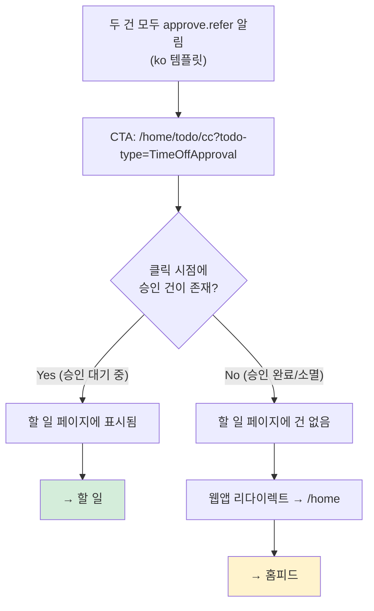

# CI-3914: 이메일 휴가 알림 [확인하기] 클릭 시 할 일/홈피드 이동 기준 불분명

> **상태**: 5차 조사 진행 중 — 2026-02-13

## 증상
- **회사**: 트러스테이 (Customer ID: 190083)
- **문의자**: sanghee.lee@trustay.me
- **대상 구성원**: joohyung.kim@trustay.me, hyunchul.lim@trustay.me
- 문의 내용:
  1. 이메일로 수신된 휴가 알림의 [확인하기] 버튼 클릭 시, **어떤 건은 "할 일"로, 어떤 건은 "홈피드"로 이동**되는 불일치가 발생 *(Linear 이슈 설명)*
  2. joohyung.kim@trustay.me가 2026-02-12(목) 오전 9:50에 등록한 **장기근속 특별휴가(3년차) 3일** → [확인하기] 클릭 시 **홈피드로만 이동** *(Linear 이슈 설명)*
  3. hyunchul.lim@trustay.me가 2026-02-10(화) 오후 11:08에 등록한 **연차 1일** → [확인하기] 클릭 시 **할 일로 이동** *(Linear 이슈 설명)*
  4. 어떤 기준으로 이동 대상이 달라지는지 문의 *(Linear 이슈 설명)*

### 이슈 정보
| 항목 | 값 |
|------|-----|
| Linear 상태 | 조사 완료 |
| 라벨 | 근태/근무/휴가 |
| 담당자 | 김영준(Enhance) |
| 생성일 | 2026-02-13 |
| 생성자 | 이주화 |

### 용어 설명
- **deep link**: 앱 내 특정 화면으로 직접 이동하는 URL. 이메일 [확인하기] 버튼에 포함됨
- **`MessageContext`**: 알림 발송 시 수신자, 내용, 이동 대상(deep link) 등을 담는 알림 시스템의 컨텍스트 객체
- **`approve.refer`**: 승인 **요청** 시 참조자에게 발송되는 알림. 이메일: "OO님이 휴가(XX)를 **등록**했어요." CTA web → `/home/todo/cc?todo-type=TimeOffApproval` (할 일)
- **`approved.refer`**: 승인 **완료** 시 참조자에게 발송되는 알림. 이메일: "OO님의 휴가(XX)가 **승인**되었어요." CTA web → `/home` (홈피드)
- **START_APPROVED**: 승인 프로세스가 시작과 동시에 자동 승인되는 상태 (예: 승인자가 본인인 경우, 자동 승인 정책)

## 현재까지 파악된 내용
- 문의자(sanghee.lee)의 수신자 ID: 848600, 알림 발신자: hyunchul.lim, joohyung.kim *(Linear 코멘트 @김영준, 2026-02-13 07:57)*
- **두 케이스 모두 승인 프로세스를 거침** — 이주화가 공유한 실제 URL 모두 `time-off/approval/{taskKey}` 포함 *(Linear 코멘트 @이주화, 2026-02-13 08:05)*
  - `{taskKey}`: 승인 태스크의 고유 식별자. URL에 포함 = 승인 프로세스가 생성되었음을 의미
  - 홈피드 URL: `/home?mobile-app-url=...time-off/approval/01kh7n7z71h7b57evep0kredvc...`
  - 할 일 URL: `/home/todo/cc?todo-type=TimeOffApproval&mobile-app-url=...time-off/approval/01kh3y2sqn7w3q4vzthzfmva9g...`
- **관리자가 휴가를 등록할 때는 승인을 발생시키지 않음(참조 포함)** — sanghee.lee가 두 건 모두에 대해 참조 알림을 수신했으므로, 두 건 모두 관리자 등록이 아닌 구성원 본인 등록임 *(사용자 피드백, 코드: time-tracking/work-schedule/service/src/main/kotlin/.../TimeTrackingTimeOffUseService.kt:119-121)*
- **두 알림 모두 `approve.refer` (승인 요청 참조)** — 이메일 내용이 "등록했어요"이지 "승인되었어요"가 아님 *(이주화 스크린샷, 사용자 피드백)*
  - `approve.refer` 이메일: "(참조) OO님이 휴가(XX)를 **등록**했어요."
  - `approved.refer` 이메일: "(참조) OO님의 휴가(XX)가 **승인**되었어요."
  - 스크린샷의 이메일은 "등록" → `approve.refer`
- 참조자 알림 유형은 **두 가지**가 존재함:
  - `FLEX_TIME_TRACKING_TIME_OFF_REQUEST_APPROVE_REFER` (승인 요청 참조) → CTA web: `/home/todo/cc?todo-type=TimeOffApproval` → **할 일** *(알림 템플릿: NotificationTemplates_ko.properties:445)*
  - `FLEX_TIME_TRACKING_TIME_OFF_REQUEST_APPROVED_REFER` (승인 완료 참조) → CTA web: `/home` → **홈피드** *(알림 템플릿: NotificationTemplates_ko.properties:468)*
- **연차(ANNUAL)와 맞춤휴가(CUSTOM)는 동일한 알림을 사용함** — 휴가 유형에 따른 알림 분기는 존재하지 않음 *(코드 분석)*
  - 승인 알림 라우팅은 `ApprovalProcessTargetCategory.TIME_OFF` 하나로 연차/맞춤휴가 모두 처리 *(코드: time-tracking/consumer/src/main/kotlin/.../ApprovalProcessStartedMessageContextFactory.kt:42-48)*
  - `TimeTrackingTimeOffApprovalNotificationMetadata`에 `timeOffType` 필드 자체가 없음 *(코드: time-tracking/service/src/main/kotlin/.../TimeTrackingTimeOffApprovalNotificationMetadata.kt)*

---

## 원인 분석

### 이전 조사 — 잘못된 분석들 (수정됨)

> **1차 (오류)**: ~~장기근속 특별휴가 = 관리자 등록 → 승인 미발생 → 등록 완료 알림 → 홈피드~~
> - 배제 근거: 관리자 등록 시 참조 알림 자체가 미발송됨. sanghee.lee가 참조 알림을 받았으므로 관리자 등록이 아님.
>
> **2차 (오류)**: ~~두 건에 서로 다른 알림 유형 발송: approve.refer(할 일) vs approved.refer(홈피드)~~
> - 배제 근거: 이메일 내용이 "등록했어요"(approve.refer)이지 "승인되었어요"(approved.refer)가 아님. 두 건 모두 `approve.refer` 알림.

### 배제된 가설

| # | 가설 | 배제 근거 |
|---|------|----------|
| 1 | 휴가 유형(연차 vs 맞춤휴가)에 따라 deep link가 다르게 생성됨 | 모든 휴가 유형이 동일한 `TIME_OFF` 카테고리로 처리됨 *(코드: time-tracking/approval/service/src/main/kotlin/.../TimeTrackingApprovalTaskServiceImpl.kt:65, 113)* |
| 2 | 장기근속 특별휴가가 관리자 직접 등록(지급)됨 | 관리자 등록 시 참조 알림 자체가 미발송됨. sanghee.lee가 참조 알림을 수신함 *(코드: time-tracking/work-schedule/service/src/main/kotlin/.../TimeTrackingTimeOffUseService.kt:236-241)* |
| 3 | 두 건에 서로 다른 알림 유형 발송 (`approve.refer` vs `approved.refer`) | 이메일 내용이 "등록했어요"(approve.refer 텍스트)이지 "승인되었어요"(approved.refer 텍스트)가 아님 *(이주화 스크린샷, 알림 템플릿 대조)* |
| 4 | 외부 알림 라이브러리 deep link 매핑 오류 | 라이브러리는 notification type에 따라 정확히 템플릿 매핑함 |
| 5 | en/ko 템플릿 CTA URL 차이가 원인 | 디폴트 locale = KOREAN → 설정 없는 수신자는 항상 ko 템플릿 사용. 한 건만 en 템플릿이 적용될 이유 없음 *(코드: NotificationSendUseCaseImpl.kt:342, DB: member_setting 값 없음)* |

### 3차 가설 (재부상): 클릭 시점의 승인 상태에 따른 웹앱 리다이렉트

> **5차 조사에서 3차 가설 재부상**: 알림 시스템의 디폴트 locale이 **KOREAN**임이 확인됨.
> sanghee.lee의 member_setting에 값이 없으면 디폴트(KOREAN) 적용 → **두 알림 모두 ko 템플릿** → 두 건 모두 CTA = `/home/todo/cc?todo-type=TimeOffApproval`
> → en/ko 템플릿 차이로는 이 현상을 설명할 수 없음 (4차 가설의 전제 붕괴)
> → 이주화가 공유한 URL이 **원본 href가 아니라 클릭 후 브라우저 URL**일 가능성 재부상

### ~~4차 가설 (반박됨): approve.refer CTA web URL의 en/ko 템플릿 차이~~

> 4차에서는 en 템플릿(`/home`)과 ko 템플릿(`/home/todo/cc`)의 URL 차이가 원인이라고 추정했음.
> → **5차 조사에서 반박**: 알림 시스템의 언어 결정 코드 확인 결과, 디폴트 locale = KOREAN.
> → `userSettingMap[userId]?.locale ?: Locale.KOREAN` *(NotificationSendUseCaseImpl.kt:342)*
> → sanghee.lee의 member_setting에 값 없음 → 디폴트 KOREAN → **두 건 모두 ko 템플릿 사용**
> → 한 건이 en 템플릿으로 렌더링될 이유가 없음

**단, en/ko CTA URL 불일치 자체는 별도 버그로 기록** (아래 "부록" 참조)

### 5차 분석 (현재): 동일 CTA → 웹앱 리다이렉트

#### 핵심 근거

1. **알림 시스템 언어 결정 로직 확인:**
   ```kotlin
   // NotificationSendUseCaseImpl.kt:342
   locale = userSettingMap[userId]?.locale ?: Locale.KOREAN
   ```
   - 수신자의 locale 설정 사용, 없으면 **KOREAN** *(코드 분석)*
   - 발신자/회사 설정은 영향 없음 *(코드 분석)*

2. **sanghee.lee의 설정:** member_setting에 값 없음 → 디폴트 KOREAN *(DB 조회)*

3. **결론:** 두 알림 모두 ko 템플릿 사용 → CTA = `/home/todo/cc?todo-type=TimeOffApproval`

#### 원인 추적



#### 표면 원인
두 건 모두 동일한 CTA URL(`/home/todo/cc?todo-type=TimeOffApproval`)이지만, **클릭 시점에 해당 승인 건이 할 일에 남아있는지 여부**에 따라 웹앱이 다르게 동작함.

| 케이스 | 알림 유형 | CTA URL | 클릭 시점 승인 상태 (추정) | 결과 |
|--------|----------|---------|-------------------------|------|
| 연차 (hyunchul.lim, 2/10 등록) | `approve.refer` | `/home/todo/cc` | 승인 대기 중 | **할 일** |
| 장기근속 특별휴가 (joohyung.kim, 2/12 등록) | `approve.refer` | `/home/todo/cc` | 이미 승인 완료 | **홈피드** (리다이렉트) |

#### 근본 원인 (5 Whys)

1. 왜 [확인하기]가 다른 곳으로 이동하는가? → 클릭 시점에 할 일에 해당 건이 존재하는지 여부가 다르기 때문
2. 왜 할 일에 존재 여부가 다른가? → 한 건은 아직 승인 대기 중이고, 다른 건은 이미 승인 완료되었기 때문
3. 왜 이미 승인 완료된 건은 홈피드로 가는가? → 웹앱의 할 일 페이지가 해당 건을 찾지 못하면 홈피드로 리다이렉트하기 때문 (추정)
4. **근본 원인**: 이메일 [확인하기] URL이 **발송 시점의 승인 상태를 기준으로 고정**되지만, **클릭 시점의 상태는 변할 수 있음** → 시간 경과에 따른 상태 불일치
#### 증거 정리

**이 가설을 지지하는 증거:**
1. 디폴트 locale = KOREAN → 두 건 모두 ko 템플릿 사용 → 동일한 CTA URL *(코드: NotificationSendUseCaseImpl.kt:342)*
2. 이메일 내용이 두 건 모두 한국어("등록했어요") → ko 템플릿 렌더링 확인 *(이주화 스크린샷)*
3. 장기근속 특별휴가(joohyung.kim, 2/12 등록)는 빠르게 승인 완료될 가능성 높음 → 클릭 시점에 할 일에 없음 (추정)
4. 연차(hyunchul.lim, 2/10 등록)는 아직 승인 대기 중일 가능성 → 클릭 시점에 할 일에 존재 (추정)

**확정하려면 필요한 추가 확인:**
1. **notification_deliver 테이블 조회** — 두 알림의 `notification_type`이 동일한지, 실제 렌더링된 CTA URL 확인
2. **이주화에게 확인** — 공유한 URL이 이메일 원본 href인지, 클릭 후 브라우저 주소창 URL인지 (핵심 검증)
3. **장기근속 특별휴가 승인 이력** — 승인 완료 시점이 이메일 클릭 시점보다 앞인지
4. **웹앱 할 일 페이지 리다이렉트 로직** — 프론트엔드에서 해당 건이 없을 때 어떻게 처리하는지

### 조사 과정

> **1차 판단 (오류)**: 장기근속 특별휴가 = 관리자 등록 → 승인 미발생 → 등록 완료 알림(topic 없음) → 홈피드
> → 사용자 피드백: "관리자가 휴가를 등록할 때는 승인을 발생시키지 않아(참조 포함)"
> → **핵심 반증**: 관리자 등록 시 참조 알림 자체가 미발송됨 *(코드: TimeTrackingTimeOffUseService.kt:236-241)*
>
> **2차 판단 (오류)**: 두 건에 서로 다른 알림 유형 (`approve.refer` vs `approved.refer`) 발송
> → 사용자 피드백: "approved.refer일 수가 없다. 이메일에 '휴가 등록'이라고 나와야 하는데, approved.refer는 '휴가 승인'이라고 나온다"
> → **핵심 반증**: `approved.refer` 이메일 템플릿은 "OO님의 휴가(XX)가 **승인**되었어요."인데, 실제 이메일은 "**등록**했어요."로 표시 *(알림 템플릿 대조)*
>
> **3차 판단 (보류)**: 두 건 모두 `approve.refer` 알림 → 동일한 CTA URL → 클릭 시점의 승인 상태에 따라 웹앱이 리다이렉트
> → 4차 조사에서 더 직접적인 원인 발견
>
> 💡 **4차 판단 (반박됨)**: `approve.refer.cta-web`이 en 템플릿(`/home`)과 ko 템플릿(`/home/todo/cc?todo-type=TimeOffApproval`)에서 다르게 정의됨
> → 근거: en/ko 템플릿 URL 차이가 이주화 공유 URL과 정확히 일치
> → **반박**: 알림 시스템 언어 결정 코드 확인 결과, 디폴트 locale = KOREAN *(코드: NotificationSendUseCaseImpl.kt:342)*
> → sanghee.lee의 member_setting에 값 없음 → 디폴트 KOREAN → **두 건 모두 ko 템플릿** → en/ko 차이로 설명 불가
>
> 💡 **5차 판단 (현재 가설)**: 두 건 모두 동일한 ko 템플릿 CTA URL(`/home/todo/cc`) 사용.
> 클릭 시점에 승인 건이 할 일에 남아있으면 할 일 표시, 이미 승인 완료되어 없으면 웹앱이 홈피드로 리다이렉트
> → 이주화가 공유한 URL은 이메일 원본 href가 아니라 **클릭 후 브라우저 주소창 URL**일 가능성 (추정)
>
> 💡 **코드 추적 — 참조자 알림 발송 경로**:
> 1. 승인 대기(STARTED) → `ApprovalProcessStartedMessageContextFactory` → `TimeOffApprovalProcessStartedMassageHandler.handleReferrers()` *(time-tracking/consumer/src/main/kotlin/.../TimeOffApprovalProcessStartedMassageHandler.kt:91-151)*
>    → `FlexTimeTrackingTimeOffRequestApproveReferMessageContext` 생성 → **approve.refer**
> 2. 즉시 승인(START_APPROVED) → `ApprovalProcessStartApprovedMessageContextFactory.onStartApprovedToReferrers()` *(time-tracking/consumer/src/main/kotlin/.../ApprovalProcessStartApprovedMessageContextFactory.kt:68-104)*
>    → `TimeOffApprovalProcessApprovedMassageHandler.handleReferrers()` 위임 → **approved.refer** (이메일: "승인되었어요")
> 3. 사후 승인(APPROVED) → `ApprovalProcessApprovedMessageContextFactory` → `TimeOffApprovalProcessApprovedMassageHandler.handleReferrers()` *(time-tracking/consumer/src/main/kotlin/.../TimeOffApprovalProcessApprovedMassageHandler.kt:87-147)*
>    → **approved.refer** (이메일: "승인되었어요")
>
> 💡 **핵심 추론**: 이메일이 "등록"이므로 START_APPROVED/APPROVED가 아닌 STARTED 시점에 발송된 `approve.refer`. 장기근속 특별휴가도 처음에는 STARTED 상태였다가 빠르게 승인 완료된 것.
> → 두 건 모두 `approve.refer` (CTA = `/home/todo/cc`) → 클릭 시점 차이로 한 건은 할 일, 한 건은 홈피드

---

## 스펙/버그 판별

### 판정: 스펙 (승인 상태 변화에 따른 정상 동작) + 별도 버그 (en 템플릿 CTA URL 불일치)

**이슈 자체에 대한 판정: 스펙**

**확인된 사실:**
- 두 건 모두 동일한 `approve.refer` 알림, ko 템플릿 사용 (디폴트 locale = KOREAN)
- CTA URL은 둘 다 `/home/todo/cc?todo-type=TimeOffApproval` (할 일)
- 클릭 시점에 승인이 이미 완료된 건은 할 일에 없으므로 웹앱이 홈피드로 리다이렉트 (추정)

**스펙으로 판단하는 근거:**
- 이메일은 발송 시점의 CTA를 고정하지만, 승인 상태는 시간에 따라 변함
- 할 일 페이지에서 해당 건이 없을 때 홈피드로 보내는 것은 UX 관점에서 합리적
- 이는 이메일 알림의 본질적 한계 (발송 시점 ≠ 클릭 시점)

**별도 버그: en/ko CTA URL 불일치 (CI-3914 이슈와는 직접 무관)**
- en 템플릿의 `approve.refer.cta-web` = `/home`, ko = `/home/todo/cc?todo-type=TimeOffApproval`
- 영어 사용자는 항상 홈피드로 이동 → **en 템플릿의 CTA URL이 잘못 설정된 것으로 보임**
- 총 3건의 en/ko CTA URL 불일치 발견 (아래 부록 참조)

**확정하려면 추가 확인 필요:**
- 이주화에게 공유한 URL이 이메일 원본 href인지 브라우저 URL인지 확인 (핵심)
- notification_deliver 테이블에서 실제 렌더링된 URL 확인

---

## 해결안 / 조사 방향

### 즉시 확인 필요 사항

1. **이주화에게 확인 (핵심)** — 공유한 URL이 이메일 원본 href인지, 클릭 후 브라우저 주소창 URL인지
   - **원본 href라면**: 4차 가설(en/ko) 또는 다른 원인 → 추가 조사
   - **브라우저 URL이라면**: 5차 가설(웹앱 리다이렉트) 확정

2. **notification_deliver 테이블 조회** — 두 알림의 세부 정보 확인 (SQL 결과 대기 중)
   ```sql
   select nd.*, n.notification_type, n.message_data_map
   from notification_deliver nd
            left join notification n on nd.notification_id = n.id
   where nd.receiver_id in (848600)
     and n.db_created_at >= '2026-01-01'
     and (message_data_map like '%744823%'
       or message_data_map like '%744813%')
   ```
   - `notification_type`이 두 건 모두 `FLEX_TIME_TRACKING_TIME_OFF_REQUEST_APPROVE_REFER`인지
   - 렌더링된 CTA URL 확인 가능한 필드가 있는지

3. **장기근속 특별휴가 승인 이력** — 승인 완료 시점 확인
   ```sql
   -- approval_task에서 해당 건의 상태 변경 이력
   -- taskKey: 01kh7n7z71h7b57evep0kredvc (홈피드 URL에서 추출)
   ```

### DB 조회 현황

> 📊 **member_setting 조회 결과** *(사용자 직접 조회)*
>
> 조회: `member_setting WHERE member_id IN (744832, 744842)` (두 발신자)
> 결과: **값 없음** → 디폴트 설정 사용
>
> 조회: `member_user_mapping WHERE user_id IN (744823, 744813)`
> 결과: member_id 744832, 744842 매핑 확인
>
> 📊 **알림 시스템 언어 결정 로직** *(코드 분석, 5차 조사)*
>
> `userSettingMap[userId]?.locale ?: Locale.KOREAN` *(NotificationSendUseCaseImpl.kt:342)*
> → 수신자 설정 없으면 **디폴트 KOREAN** → 두 알림 모두 ko 템플릿

### 해결안

**CI-3914 이슈 자체 (스펙인 경우):**

| # | 옵션 | 장점 | 단점 |
|---|------|------|------|
| 1 | 고객 안내: "승인 완료 후 [확인하기] 클릭 시 홈피드 이동은 정상 동작" | 변경 비용 없음 | 동일 문의 재발 가능 |
| 2 | UX 개선: 승인 완료된 건은 할 일 대신 직접 승인 상세로 이동하도록 CTA 변경 | 사용자 혼란 해소 | FE/BE 모두 수정 필요, 범위 큼 |

**별도 버그 (en/ko CTA URL 불일치):**

| # | 옵션 | 장점 | 단점 |
|---|------|------|------|
| 1 | en 템플릿 3건의 CTA URL을 ko와 동일하게 수정 | 근본 해결, 간단한 수정 | `flex-pavement-backend` 배포 필요 |
| 2 | 전수 점검 + 일괄 수정 | 유사 문제 재발 방지 | 점검 범위 넓음 |

### 고객 안내 (5차 가설 확정 시)

> 이메일의 [확인하기] 버튼은 "할 일" 페이지로 이동합니다. 다만, 해당 휴가의 승인이 이미 완료된 경우 할 일 목록에 표시되지 않아 홈피드로 이동될 수 있습니다. 이는 이메일 발송 시점과 클릭 시점의 승인 상태 차이로 인한 것으로, 정상적인 동작입니다.

---

### 부록: en/ko CTA URL 불일치 전수 점검 결과

> 📊 5차 조사에서 발견. CI-3914 이슈와는 직접 무관하지만, 영어 사용자에게 영향을 줄 수 있는 별도 버그.

| # | 키 | en URL | ko URL | 심각도 |
|---|---|---|---|---|
| 1 | `time-off.request.approve.refer.cta-web` | `/home` | `/home/todo/cc?todo-type=TimeOffApproval` | 🔴 높음 |
| 2 | `remind.work-record.missing.one.cta-web` | `/home` | `/time-tracking/my-work-record?ts=#{getVar('missingAt')}` | 🔴 높음 |
| 3 | `workflow.task.request-view.request.cta-web` | `/home/todo/inbox` | `/workflow/archive/my?task-key=#{getVar('taskKey')}` | 🔴 높음 |

*(flex-pavement-backend/notification/service/src/main/resources/ 내 알림 템플릿 비교)*

---

## 다음에 같은 문의가 오면

1. **이메일 확인**: 이메일 내용이 "등록했어요"인지 "승인되었어요"인지로 알림 유형 판별
2. **승인 상태 확인**: 해당 휴가의 승인이 이미 완료되었는지 확인
3. **안내**: "이메일 [확인하기]는 할 일 페이지로 이동합니다. 해당 승인이 이미 완료된 경우 할 일에 표시되지 않아 홈피드로 이동될 수 있습니다."

## 시나리오

> 이 시나리오는 CI-3914에서 조사 중인 현상을 문서화한 것이다. 두 이메일 모두 동일한 `approve.refer` 알림이지만, 클릭 시점의 승인 상태에 따라 이동 대상이 달라진다.

```gherkin
# language: ko
기능: 이메일 휴가 참조 알림 [확인하기] 버튼 이동 대상

  배경:
    주어진 구성원이 휴가를 등록했다
    그리고 해당 휴가 정책에 승인 절차가 활성화되어 있다
    그리고 참조자가 설정되어 있다
    그리고 참조자에게 approve.refer 알림이 발송되었다

  시나리오: 승인 대기 중에 [확인하기] 클릭 — 할 일로 이동
    주어진 해당 휴가의 승인이 아직 대기 중(STARTED)이다
    만약 참조자가 이메일 알림의 [확인하기] 버튼을 클릭한다
    그러면 "할 일" 페이지의 참조 탭으로 이동한다
    그리고 해당 휴가 승인 요청을 확인할 수 있다

  시나리오: 승인 완료 후에 [확인하기] 클릭 — 홈피드로 리다이렉트
    주어진 해당 휴가의 승인이 이미 완료(APPROVED)되었다
    만약 참조자가 이메일 알림의 [확인하기] 버튼을 클릭한다
    그러면 할 일 페이지에 해당 건이 없으므로 "홈피드"로 리다이렉트된다
```

## 연관 이슈
- [CI-3910](./CI-3910.md): 동일 회사(트러스테이, 190083), 동일 문의자(sanghee.lee@trustay.me)의 이메일 알림 관련 문의. CI-3910은 참조자 이메일 알림 미수신 건, CI-3914는 이메일 알림 클릭 시 이동 대상 불일치 건.

## 참고 자료
- Linear 이슈: https://linear.app/flexteam/issue/CI-3914/이메일로-온-휴가-알림-확인하기-클릭-시-어떤-것은-할-일로-어떤-것은-홈피드로-이동됩니다
- Slack 스레드: https://flex-cv82520.slack.com/archives/CRU35U9FC/p1770966702220209
- Intercom 대화: https://app.intercom.com/a/apps/xj5aqcy9/conversations/215473069831604
- Metabase 고객 정보: https://metabase.dp.grapeisfruit.com/dashboard/256?customer_id=190083
- Metabase 문의자 정보: https://metabase.dp.grapeisfruit.com/question/5699?customer_id=190083&email=sanghee.lee%40trustay.me
- 이주화 공유 URL *(Linear 코멘트, 2026-02-13 08:05)* — **클릭 후 브라우저 주소창 URL (추정)**:
  - 홈피드: `/home?mobile-app-url=...time-off/approval/01kh7n7z71h7b57evep0kredvc...`
  - 할 일: `/home/todo/cc?todo-type=TimeOffApproval&mobile-app-url=...time-off/approval/01kh3y2sqn7w3q4vzthzfmva9g...`
- 알림 템플릿 비교:
  ```properties
  # approve.refer (승인 요청 참조) — 이메일: "등록했어요" / CTA → 할 일
  flex.time-tracking.time-off.request.approve.refer.cta-web=#{getFlexWebUrl()}/home/todo/cc?todo-type=TimeOffApproval

  # approved.refer (승인 완료 참조) — 이메일: "승인되었어요" / CTA → 홈피드
  flex.time-tracking.time-off.request.approved.refer.cta-web=#{getFlexWebUrl()}/home
  ```
  *(flex-pavement-backend/notification/service/.../NotificationTemplates_ko.properties:445, 468)*
- 알림 발송 코드 위치:
  - `time-tracking/consumer/src/main/kotlin/.../TimeOffApprovalProcessStartedMassageHandler.kt:91-151` — approve.refer 발송 (승인 대기 시 참조자)
  - `time-tracking/consumer/src/main/kotlin/.../TimeOffApprovalProcessApprovedMassageHandler.kt:87-147` — approved.refer 발송 (승인 완료 시 참조자)
  - `time-tracking/consumer/src/main/kotlin/.../ApprovalProcessStartApprovedMessageContextFactory.kt:68-104` — START_APPROVED 시 참조자 알림 (approved handler 위임)
  - `time-tracking/consumer/src/main/kotlin/.../TimeOffApprovalProcessAutoApprovedMassageHandler.kt` — AUTO_APPROVED: handleRequester만 존재, 참조자 알림 없음
  - `time-tracking/work-schedule/service/src/main/kotlin/.../TimeTrackingTimeOffUseService.kt:119-241` — 관리자 등록 시 승인 미발생 (참조 알림도 없음)

## 미결 사항
- [x] 이메일 알림 [확인하기] 버튼의 이동 대상 결정 로직 확인 — `approve.refer` → `/home/todo/cc`, `approved.refer` → `/home`
- [x] 두 건 모두 승인 프로세스를 거쳤는지 확인 — URL에 `time-off/approval/{taskKey}` 포함
- [x] 1차 분석 오류 수정 — "관리자 등록" 가설 배제
- [x] 2차 분석 오류 수정 — "approved.refer" 가설 배제 (이메일 텍스트 "등록" ≠ approved.refer의 "승인")
- [x] 알림 시스템 언어 결정 로직 확인 — 디폴트 locale = KOREAN *(코드: NotificationSendUseCaseImpl.kt:342)*
- [x] en/ko CTA URL 불일치 전수 점검 — 3건 불일치 발견 (CI-3914와 직접 무관, 별도 버그)
- [ ] **이주화에게 확인 (핵심)**: 공유한 URL이 원본 링크(href)인지, 클릭 후 브라우저 URL인지
- [ ] **notification_deliver 테이블 조회 결과** — SQL 제공 완료, 결과 대기 중
- [ ] **장기근속 특별휴가 승인 이력 DB 확인** — 승인 완료 시점 vs 이메일 클릭 시점 비교
- [ ] **할 일 페이지 리다이렉트 동작 확인** — 프론트엔드 코드에서 완료된 승인 건 접근 시 동작 확인
- [ ] 5차 가설 확정/반박 — 이주화 URL 확인 + notification_deliver 결과로 판단
- [ ] en/ko CTA URL 불일치 수정 여부 — 별도 이슈로 등록할지 결정
