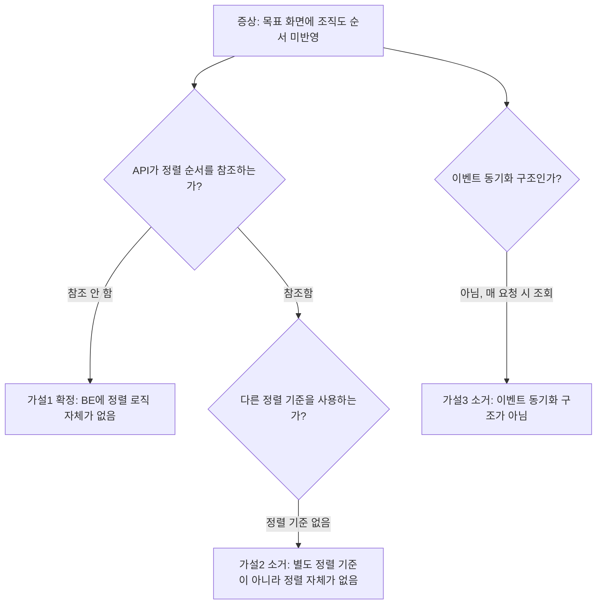

# CI-4125: 목표 화면에 조직도 순서 변경이 반영되지 않음

> **상태**: 원인 파악 완료 (버그) — 2026-03-16

## 증상
- **회사명**: 이삼오구 (Customer ID: 224251)
- **문의자**: soyeon2.kim@2359.co.kr
- **환경**: PROD
- **온도감**: 중 (D+1~2)
- **라벨**: 성과관리
- 문의 내용:
  1. [목표] > 전체목표 우측에 표시되는 조직도 순서와, 구성원 > 조직도 > 조직설정에서 보이는 조직도 순서가 상이함[^1]
  2. 조직개편 이후 조직도 내 순서를 수정했으나 [목표] 화면에는 반영되지 않음[^1]
  3. CS팀 테스트 계정에서도 동일 현상 재현됨[^2]

## 현재까지 파악된 내용
- 스크린샷으로 좌측(목표 화면)과 우측(조직설정 화면)의 순서 불일치가 확인됨[^2]
- 담당 그룹으로 sangyeon, ayoung에게 cc됨[^3]

## 원인 분석

**버그 확정**: 목표 화면의 조직 목록 조회 API가 조직설정의 정렬 순서(`displayOrder`/`displayOrderCustom`)를 참조하지 않아, 조직설정에서 순서를 변경해도 목표 화면에 반영되지 않는다.

핵심 근거:
1. `listDepartmentsRootObjectives()`가 `request.departmentIdHashes` 순서를 그대로 반환하며 BE 측 정렬 없음[^4]
2. `flex-core-backend`의 Department 엔티티에 `displayOrder`, `displayOrderCustom` 필드가 존재하고, internal API로 조회 가능하나 목표 API에서 미사용[^5][^6]
3. 조직 목표 응답 DTO(`DepartmentObjectiveMappingExtendedDto`)에 정렬 정보가 포함되지 않아 FE에서도 정렬 불가[^7]

### 가설 목록

| # | 가설 | 확인 방법 | 상태 |
|---|------|----------|------|
| 1 | 목표 API가 조직의 sortOrder를 참조하지 않고 클라이언트 요청 순서를 그대로 반환 | `flex-goal-backend` 조직 목표 조회 API 코드 확인 | ✅ 확정 |
| 2 | 목표 화면이 조직도 순서가 아닌 다른 정렬 기준(생성일, ID 등)을 사용 | 가설 1이 확정되어 별도 정렬 기준 자체가 없음을 확인 | ❌ 소거 — 별도 정렬 기준이 아니라 정렬 자체가 없음 |
| 3 | 조직도 순서 변경 이벤트를 목표 도메인이 수신하지 않음 | 이벤트 기반이 아닌 요청 시점 조회 방식으로 확인 | ❌ 소거 — 이벤트 동기화 구조가 아님, 매 요청 시 core internal API 호출 |

<details>
<summary>📋 조사 과정 상세</summary>

#### 원인 추적 분기



#### 가설 1 검증

`ObjectiveSearchApiController.listDepartmentsRootObjectives()` (line 239-277)를 분석한 결과:

```kotlin
// flex-goal-backend > goal/api/.../ObjectiveSearchApiController.kt:247-276
return request.departmentIdHashes
    .map { request.copy(departmentIdHashes = listOf(it)) }
    .map { copiedRequest ->
        copiedRequest.departmentIdentities.first().departmentId to objectiveSearchService.listRootObjectives(...)
    }
    .map { (departmentId, objectives) ->
        DepartmentRootObjectivesResponse(departmentId = departmentId, ...)
    }
    .let {
        ListDepartmentRootObjectivesResponse(departmentRootObjectives = it)
    }
```

- `departmentIdHashes` 리스트를 순서대로 map하여 결과를 반환
- 조직 정보(displayOrder 등)를 조회하거나 정렬하는 로직이 전혀 없음

#### 가설 2, 3 소거

- `flex-goal-backend`에 조직 목록 전용 엔드포인트가 없고, 목표 조직 매핑 API도 정렬 정보를 반환하지 않음
- `ObjectivePackMappingExtraServiceImpl.getDepartments()`에서 `asyncDepartmentLookUpInternalService.getAll()`로 조직 정보를 조회하지만, 이 결과가 정렬에 사용되지 않음[^8]
- 이벤트 수신/캐싱 구조가 아닌 매 요청 시점에 internal API로 조직 정보를 조회하는 구조

#### 근본 원인 추적 (5 Whys)

1. 왜 목표 화면에 조직도 순서가 반영되지 않는가? → API가 조직 정렬 순서를 사용하지 않음
2. 왜 정렬 순서를 사용하지 않는가? → `listDepartmentsRootObjectives()`에서 정렬 로직이 구현되지 않음
3. 왜 구현되지 않았는가? → (추정) 초기 구현 시 정렬 요구사항이 누락된 것으로 보임
4. 왜 FE에서도 정렬하지 못하는가? → 응답 DTO에 `displayOrder` 필드가 포함되지 않아 FE도 정렬 불가

</details>

### 스펙 vs 버그 판별

**버그**

> 💡 **판단 근거**: 조직설정에서 순서를 변경하면 시스템 전체에 반영되는 것이 기대 동작이다.
> → `flex-core-backend`에 `displayOrder`/`displayOrderCustom` 필드가 존재[^5]
> → 다른 화면에서는 이 순서가 적용될 것으로 예상됨
> → 목표 화면만 이 정렬을 무시하는 것은 의도된 스펙이 아닌 구현 누락이다

## 코드 위치

| 파일 | 설명 |
|------|------|
| `flex-goal-backend` > `goal/api/.../ObjectiveSearchApiController.kt:239-277` | 조직별 목표 조회 API — 정렬 없이 요청 순서 그대로 반환[^4] |
| `flex-core-backend` > `core/repository/.../Department.kt:52,55` | `displayOrder`, `displayOrderCustom` 필드 정의[^5] |
| `flex-goal-backend` > `goal/service/.../ObjectivePackMappingExtraServiceImpl.kt:30-34` | 조직 정보 조회 서비스 — displayOrder 포함하여 조회하나 정렬에 미사용[^8] |

<details>
<summary>📋 전체 코드 위치 목록 (7건)</summary>

| 파일 | 설명 |
|------|------|
| `flex-goal-backend` > `goal/api/.../ObjectiveSearchApiController.kt:239-277` | 조직별 목표 조회 API |
| `flex-goal-backend` > `goal/api/.../request/DepartmentObjectiveTreeRootSearchRequest.kt:15-46` | 요청 DTO — departmentIdHashes |
| `flex-goal-backend` > `goal/api/.../response/ListDepartmentRootObjectivesResponse.kt` | 응답 DTO |
| `flex-goal-backend` > `goal/api/.../response/ObjectivePackExtendedDto.kt:16` | `DepartmentObjectiveMappingExtendedDto` — displayOrder 미포함 |
| `flex-goal-backend` > `goal/service/.../ObjectivePackMappingExtraServiceImpl.kt:30-34` | 조직 정보 조회 서비스 |
| `flex-core-backend` > `core/repository/.../Department.kt:52,55` | displayOrder, displayOrderCustom 필드 |
| `flex-core-backend` > `core/protocol/.../DepartmentDto.kt:22` | DepartmentDto — displayOrder 포함 |

</details>

## 수정 시 사이드이펙트 포인트

| # | 영향 지점 | 위험도 | 설명 |
|---|----------|--------|------|
| 1 | `listDepartmentsRootObjectives()` 응답 순서 변경 | 🟡 | FE가 현재 응답 순서에 의존하여 렌더링하는 경우, 정렬 로직 추가 시 표시 순서가 달라짐. FE 측 확인 필요 |
| 2 | Internal API 추가 호출 | 🟢 | 조직 정보 조회를 위해 `asyncDepartmentLookUpInternalService.getAll()` 호출이 추가되나, 이미 다른 곳에서 사용 중이므로 영향 낮음 |
| 3 | `displayOrderCustom` 미설정 고객사 | 🟢 | `displayOrderCustom`이 null인 경우 `displayOrder` fallback 필요. null 처리 로직 확인 필요 |

## 해결안 / 조사 방향

### 즉시 대응 (표면 원인 해결)
없음 — 데이터 패치로 해결할 수 있는 문제가 아님. 코드 수정 필요.

### 근본 해결 옵션

**옵션 A: BE에서 정렬 (권장)**
- `listDepartmentsRootObjectives()`에서 조직 정보를 조회하여 `displayOrderCustom` (또는 `displayOrder`) 기준으로 결과를 정렬
- 장점: FE 변경 불필요, 다른 API 클라이언트에도 일관된 순서 보장
- 단점: 매 요청 시 조직 정보 조회 API 호출 추가 (이미 사용 중인 서비스이므로 부담 적음)

**옵션 B: FE에서 정렬**
- 응답 DTO에 `displayOrder` 필드를 추가하고, FE에서 정렬
- 장점: BE 정렬 로직 불필요
- 단점: FE 수정 필요, DTO 변경으로 API 계약 변경

**옵션 C: A+B 병행**
- BE에서 정렬하고, DTO에도 `displayOrder`를 포함하여 FE에서 추가 정렬 가능하게
- 가장 견고하나 양쪽 수정 필요

### 다음 단계
1. sangyeon, ayoung에게 버그 확정 내용 공유 및 수정 방향 합의
2. `ops:fix-issue CI-4125`로 옵션 A 기반 코드 수정 진행

## 참고 자료
- [Linear 이슈](https://linear.app/flexteam/issue/CI-4125/목표-화면에-조직도-순서-변경이-반영되지-않음)
- [Slack 스레드](https://flex-cv82520.slack.com/archives/CRU35U9FC/p1773646074865669?thread_ts=1773646074.865669&cid=CRU35U9FC)

## 미결 사항
- [x] `flex-goal-backend` 코드에서 목표 화면 조직도 순서 조회 로직 확인
- [x] 의도된 동작(스펙)인지 버그인지 판단 → **버그**
- [ ] 수정 방향 합의 (옵션 A/B/C)
- [ ] 코드 수정 및 PR 생성

## 각주
[^1]: Linear 이슈 설명, 2026-03-16
[^2]: Linear 코멘트 @오시은, 2026-03-16 — 스크린샷으로 목표 화면 vs 조직설정 순서 불일치 확인
[^3]: Linear 코멘트 @오시은, 2026-03-16 — "cc. @sangyeon @ayoung"
[^4]: 코드: `flex-goal-backend` > goal/api/src/main/kotlin/team/flex/goal/api/objective/search/ObjectiveSearchApiController.kt:247-276
[^5]: 코드: `flex-core-backend` > core/repository/src/main/kotlin/team/flex/core/repository/department/Department.kt:52,55
[^6]: 코드: `flex-core-backend` > core/protocol/src/main/kotlin/team/flex/core/department/dto/DepartmentDto.kt:22
[^7]: 코드: `flex-goal-backend` > goal/api/src/main/kotlin/team/flex/goal/api/objective/response/ObjectivePackExtendedDto.kt:16 — `DepartmentObjectiveMappingExtendedDto`에 displayOrder 미포함
[^8]: 코드: `flex-goal-backend` > goal/service/src/main/kotlin/team/flex/goal/objective/ObjectivePackMappingExtraServiceImpl.kt:30-34
