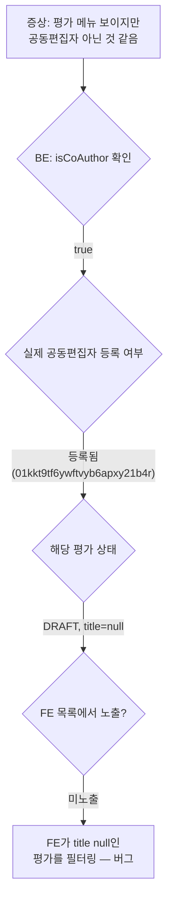

# CI-4129: 평가 공동편집자 아닌데 평가 메뉴 노출 — FE 목록 필터링 버그

## 증상
- **회사**: 토리든 (Customer ID: 219447)[^1]
- **문의자**: yonghyun_jeong@torriden.com[^1]
- **대상 구성원**: donghee.kim@torriden.com[^1]
- 문의 내용:
  1. 평가 관련 권한이 없고 평가 공동편집자도 아닌데 평가 메뉴가 보인다[^1]

## 원인 분석

### 조사 과정

> 💡 **판단 근거**: 최초 "공동편집자가 아닌데 메뉴 노출" 신고
> → BE 로그 확인: `isCoAuthor: true` 반환 확인[^2]
> → 대상자가 평가 `01kkt9tf6ywftvyb6apxy21b4r`의 공동편집자로 등록되어 있음 확인[^3]
> → 해당 평가는 DRAFT(임시저장) 상태, title이 null[^4]
> → FE에서 title이 null인 평가를 목록에서 필터링하고 있어서 목록이 비어 보임[^5]
> → 관리자 화면에서도 공동편집자(co-author)로 등록된 평가가 안 보여서 "공동편집자가 아닌데 메뉴가 보인다"고 오인

1. 이해나님이 BE 로그에서 `menu.options` API 응답 확인 → `isCoAuthor: true`[^2]
2. 대상자의 userIdHash `bQ8XMarW0X`로 조회 → 평가 `01kkt9tf6ywftvyb6apxy21b4r`에 공동편집자 등록 확인[^3]
3. 이성환님이 해당 평가 상태 확인 → DRAFT이고 title이 null[^4]
4. 이해나님이 QA 환경에서 재현 → title 없이 임시저장한 평가가 FE 목록에서 미노출 확인[^5]

### 원인
- **BE는 정상**: 대상자는 실제로 평가의 공동편집자이며 `isCoAuthor: true` 반환은 올바름[^2]
- **FE 버그**: title이 null인 DRAFT 평가를 FE 목록 뷰에서 필터링하여 미노출[^5]
- 결과적으로 사용자 입장에서는 평가 메뉴는 보이는데 목록이 비어 있어서 "권한 없는데 메뉴가 보인다"고 인식

BE는 정상이나 FE가 title이 null인 평가를 필터링하여 목록이 비어 보이는 흐름:



## 해결
- 이해나님이 FE 핫픽스 PR 생성 및 배포 완료[^6]
- title이 null인 임시저장 평가도 목록에 정상 노출되도록 수정
- 배포 후 donghee.kim@torriden.com 이 공동편집자로 등록된 임시저장 평가가 목록에 노출됨[^7]

## 다음에 같은 문의가 오면

1. **먼저 확인**: `menu.options` API(FE에서 GNB 메뉴 노출 여부를 결정하기 위해 호출하는 BE 엔드포인트) 로그에서 `isCoAuthor` 값 확인
   - `isCoAuthor: false`인데 메뉴가 보인다면 → FE GNB 메뉴 노출 로직 확인[^8]
   - `isCoAuthor: true`인데 목록이 비어 보인다면 → 아래 2번으로
2. **원인 판별**: 대상자가 공동편집자로 등록된 평가의 상태 확인
   - 평가가 DRAFT이고 title이 null → FE 목록 노출 버그 (이번 핫픽스로 수정됨)
   - 평가가 삭제(hard delete)된 상태인데 co-author 레코드 잔존 → BE `evaluation_co_author` 정리 필요
3. **조치**: FE 배포 이후에는 정상 노출되어야 함. 여전히 재현되면 FE 캐시 또는 BE 데이터 확인

## 시나리오

제목 없이 임시저장된 평가가 공동편집자의 목록에 정상 노출되는지 검증하는 시나리오:

```gherkin
# language: ko
기능: 평가 목록 노출 — 제목 없는 임시저장 평가

  시나리오: 공동편집자가 제목 없이 임시저장된 평가를 목록에서 확인
    주어진 구성원이 평가의 공동편집자로 등록되어 있다
    그리고 해당 평가는 DRAFT 상태이고 제목이 입력되지 않았다
    만약 구성원이 평가 목록을 조회한다
    그러면 제목이 없는 임시저장 평가도 목록에 노출된다
```

## 연관 이슈
- [CI-4117](./CI-4117.md): 같은 평가(Evaluation) 도메인 이슈 — 평가 등급 체계 validation 에러
- [CI-4135](../CI-4135.md): 동일 리뷰/평가 도메인. 평가 세팅 중 "알 수 없는 오류" 지속 발생

## 비고
### 참고 자료
- FE 메뉴 노출 로직: `flex-frontend` > `web-applications/remotes-gnb/server/getGrantedMenu/strategies/evaluation.ts:13`[^8]
- BE 메뉴 옵션 API: `flex-review-backend` > `evaluation/api/.../EvaluationOptionsApiController.kt`[^10]
- FE 핫픽스 PR: https://github.com/flex-team/flex-frontend-apps-performance-management/pull/4587[^6]
- Slack 스레드: https://flex-cv82520.slack.com/archives/CRU35U9FC/p1773715929492359[^11]

### 초기 오분석 기록
- 처음에는 "삭제된 평가의 co-author 레코드가 정리되지 않은 BE 버그"로 추정했으나[^9], 추가 확인 결과 해당 평가는 삭제되지 않은 DRAFT 상태였음[^4]
- BE의 `evaluation_co_author` 정리 미비 문제 자체는 잠재적 리스크로 남아 있음 (hard delete된 평가의 co-author 잔존 가능성)

## 각주
[^1]: Linear 이슈 설명, 2026-03-17
[^2]: Slack 스레드 이해나, 2026-03-17 — BE 로그: `{"featureActivated":true,"evaluationManagementGranted":false,"evaluationCreationGranted":false,"isCoAuthor":true}`
[^3]: Slack 스레드 이해나, 2026-03-17 — userIdHash `bQ8XMarW0X`가 평가 `01kkt9tf6ywftvyb6apxy21b4r`에 공동편집자 등록
[^4]: Slack 스레드 이성환, 2026-03-17 — "draft이고 title이 null입니다"
[^5]: Slack 스레드 이해나, 2026-03-17 — "title을 입력하지 않고 임시저장한 평가는 목록에서 노출이 안되네요? (서버에서는 오는데)"
[^6]: Slack 스레드 이해나, 2026-03-17 — https://github.com/flex-team/flex-frontend-apps-performance-management/pull/4587
[^7]: Slack 스레드 이해나, 2026-03-17 13:11 KST — "배포완료되었습니다!"
[^8]: Slack 스레드 이지훈, 2026-03-17 — FE 메뉴 노출 로직 참조 링크
[^9]: Slack 스레드 이성환, 2026-03-17 — "이거 삭제된 평가가 있을 때 기존 co author에서 제거를 안해주는 버그가 서버에 있는 듯 합니다"
[^10]: 코드베이스 확인 — `flex-review-backend` 내 `EvaluationOptionsApiController.kt`
[^11]: Slack 스레드 CI-4129, #cs_product_dev — https://flex-cv82520.slack.com/archives/CRU35U9FC/p1773715929492359
