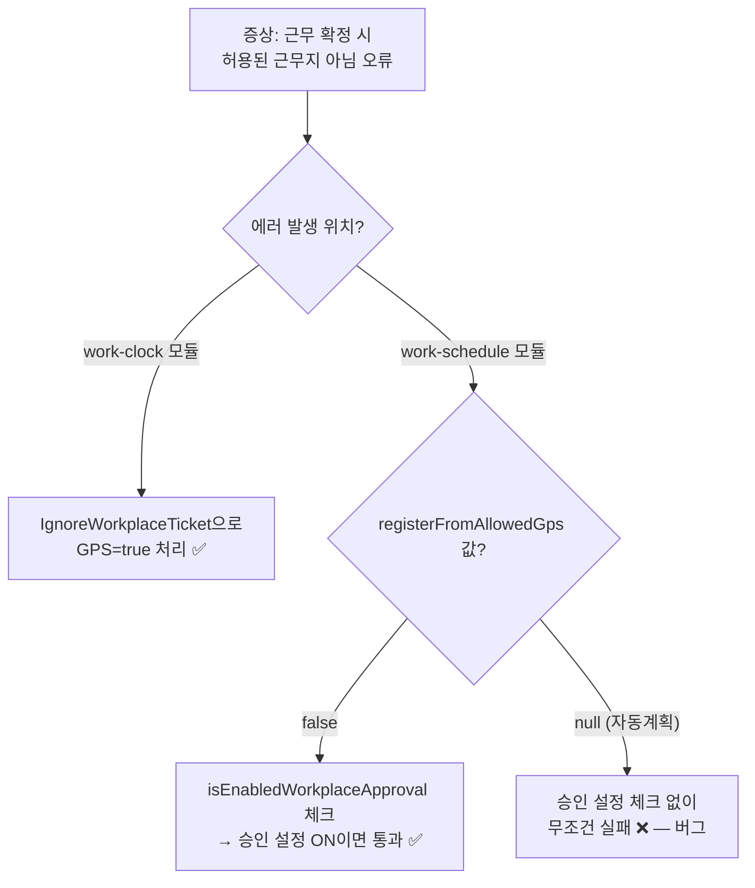

# CI-4172: 세콤 퇴근 후 근무 확정하기 시 "허용된 근무지가 아닙니다" 오류

> **상태**: 원인 파악 완료 — 2026-03-20
> **verdict**: bug — work-schedule 모듈의 null GPS 검증 누락

## 증상
- **문제 정의**: 세콤으로 근무 종료 후 "근무 확정하기" 클릭 시 "허용된 근무지가 아닙니다" 오류가 다수 구성원에게 발생
- **회사**: 도그지어 (Customer ID: 18005)
- **요청자**: jm.park@dogsear.co.kr
- **대상자**: hy.jeong@dogsear.co.kr, br.jeong@dogsear.co.kr, sw.kang@dogsear.co.kr 외 다수
- **영향 범위**: 최소 5명 이상 — 2026-03-19 하루 동안 44건 에러 발생[^4]
- **문제 시점**: 2026-03-19
- 문의 내용:
  1. 사무실 내에서 세콤으로 퇴근 후 근무 확정하기 클릭 시 "근무지 내가 아니라서 근무 종료가 안됨"
  2. iOS, 최신 버전, 위치 접근 허용 상태에서도 발생
  3. 앱 강제종료 후 재시도해도 동일

---

## 원인 분석

### 결론 (L1)

세콤 퇴근 후 "근무 확정" 시 `WorkScheduleWorkplaceRestrictionValidator`[^1]가 자동계획(PLAN_BY_WORK_SCHEDULE)[^6]으로 생성된 SWITCH 이벤트의 `registerFromAllowedGps = null`을 검증 실패로 처리하는 **버그**.

### 가설 검증

| # | 가설 | 확인 방법 | 상태 |
|---|------|----------|------|
| 1 | 클라이언트(iOS)가 API 호출 전에 자체 위치 검증하여 오류 표시 | access log에서 confirm-request API 호출 여부 확인 | ❌ 소거 — 백엔드에서 400 응답 확인됨[^4] |
| 2 | work-clock 모듈의 IgnoreWorkplaceTicket이 동작하지 않음 | 앱 로그에서 TrackingWorkplaceRestrictionServiceImpl 결과 확인 | ❌ 소거 — work-clock 레벨에서는 GPS=true로 정상 통과[^5] |
| 3 | work-schedule 모듈의 WorkScheduleWorkplaceRestrictionValidator가 자동계획 SWITCH 이벤트의 null GPS 데이터를 검증 실패 처리 | 앱 로그에서 스냅샷 데이터 확인 | ✅ **확정**[^5] |

### 핵심 증거 (L2)

> 💡 **판단 근거**: work-clock과 work-schedule 모듈의 **이중 검증 구조**에서 work-schedule 쪽만 실패
> → work-clock은 `IgnoreWorkplaceTicket`[^2]으로 GPS=true 처리 ✅
> → work-schedule은 SWITCH 이벤트(PLAN_BY_WORK_SCHEDULE, registerFromAllowedGps=null)를 재검증하여 실패 ❌
> → `registerFromAllowedGps == null` 케이스에서 `isEnabledWorkplaceApproval` 확인을 누락[^1]한 것이 근본 원인

**에러 코드 추적:**
- 발생한 에러: `TIMETRACKING_400_074`[^3] (`TIME_TRACKING_WORK_SCHEDULE_NOT_ALLOWED_WORKPLACE_GPS`)
- 이것은 work-clock 모듈의 `WORKCLOCK_400_018`이 아닌 **work-schedule** 모듈에서 발생하는 에러

**null vs false 비대칭 처리:**

| 조건 | 승인 설정 ON | 결과 |
|------|-------------|------|
| `registerFromAllowedGps == false` | 승인 체크 → 통과[^1] | ✅ 정상 |
| **`registerFromAllowedGps == null`** | **승인 체크 안 함** | ❌ **무조건 실패** |

**work-clock 이벤트 스냅샷** (traceId: `84766f142a4a22d37b85f7edcfb2ce38`)[^5]:

> 자동계획으로 생성된 SWITCH 이벤트(#3)만 GPS 데이터가 null이며, 이 이벤트에서 검증이 실패했다.

| # | eventType | workFormId | recordType | registerFromAllowedGps | 결과 |
|---|-----------|-----------|------------|----------------------|------|
| 1 | START | 84000 (근무, GPS) | RECORD | true | ✅ 통과 |
| 2 | SWITCH | 83992 (딜라이트, NA) | PLAN_BY_WORK_SCHEDULE | null | ✅ NA이므로 skip |
| 3 | SWITCH | **84000 (근무, GPS)** | **PLAN_BY_WORK_SCHEDULE** | **null** | ❌ **검증 실패** |
| 4 | STOP | null | RECORD | true | ✅ 통과 |

상세 분석 (L3) — 5 Whys 체인 + 증거 데이터

#### 5 Whys

1. **왜 "허용된 근무지가 아니에요" 오류가 발생했나?**
   → `WorkScheduleWorkplaceRestrictionValidator.validate()`[^1]에서 `WORK_SCHEDULE_NOT_ALLOWED_WORKPLACE_GPS` 예외 발생
2. **왜 work-schedule 검증이 실패했나?**
   → work-clock 이벤트 스냅샷 중 SWITCH(#3) 이벤트의 `registerFromAllowedGps = null`[^5]
3. **왜 SWITCH 이벤트에 GPS 데이터가 없나?**
   → 자동계획(PLAN_BY_WORK_SCHEDULE)[^6]으로 생성된 이벤트는 실제 GPS 측정을 하지 않아 `additionalData`가 모두 null
4. **왜 null이면 실패로 처리하나?**
   → `WorkScheduleWorkplaceRestrictionValidator.kt:215-220`[^1]에서 `registerFromAllowedGps == null` 케이스가 `isEnabledWorkplaceApproval` 여부를 확인하지 않고 무조건 실패 반환
5. **왜 false 케이스는 승인 설정을 확인하는데 null은 안 하나?**
   → 코드 누락 (버그)

#### access log 증거

2026-03-19 `flex-app.be-access-2026.03.19` 인덱스에서 confirm-requests/stop API 400 에러 44건 확인[^4]:
- 최소 5명의 사용자 (userIdHash: Kq059LK10v, 5M0nvaXw06, 5xEw2Za3zb, 248NgnD10e, 248NVLZZ8e)
- 에러 메시지: "허용된 근무지가 아니에요.\n근무지로 이동 후 근무를 등록해주세요."
- 에러 코드: TIMETRACKING_400_074

#### 앱 로그 증거

traceId: `84766f142a4a22d37b85f7edcfb2ce38`, `flex-app.be-api-2026.03.19` 인덱스[^5]:
- customerId: 18005, userId: 913819
- 근무 정책: 근무(84000, GPS), 딜라이트(83992, NA), 휴게(84013, null)
- 근무지 제한 승인 설정: true (enabled)
- work-clock 레벨 검증: IgnoreWorkplaceTicket → GPS=true, IP=true ✅
- work-schedule 레벨 검증: SWITCH 이벤트(84000, PLAN_BY_WORK_SCHEDULE)의 registerFromAllowedGps=null → 실패 ❌

### 스펙 vs 버그 판별

> 💡 **판단 근거**: `false` 케이스에서는 `isEnabledWorkplaceApproval` 체크 후 통과시키는 로직이 존재(line 224)[^1]하므로, `null` 케이스에서 동일 체크가 없는 것은 의도된 설계가 아닌 **코드 누락**. 자동계획(PLAN_BY_WORK_SCHEDULE)으로 생성된 이벤트에 GPS 데이터가 없는 것은 정상(시스템 생성 이벤트).

---

## 코드 위치

| 파일 | 라인 | 설명 |
|------|------|------|
| `WorkScheduleWorkplaceRestrictionValidator.kt`[^1] | 215-220 | 핵심 버그 — null GPS 케이스에서 승인 설정 미체크 |
| `WorkScheduleWorkplaceRestrictionValidator.kt`[^1] | 222-244 | false GPS 케이스 — 승인 설정 체크 로직 존재 (참고용) |
| `UserWorkClockConfirmRequestMappingService.kt`[^2] | 214, 338 | confirm request에서 IgnoreWorkplaceTicket 사용 |
| `TimeTrackingError.kt`[^3] | 62 | TIMETRACKING_400_074 에러 코드 정의 |

---

## 수정 시 사이드이펙트 포인트

| # | 영향 지점 | 위험도 | 설명 |
|---|----------|--------|------|
| 1 | GPS 판단 기준 근무유형에서 null GPS → 승인 통과 처리 | 🟡 중 | null GPS를 승인 설정 ON일 때 통과시키면 GPS 데이터 없이도 등록 가능. 단, `false` 케이스에서 이미 동일 처리 중 |
| 2 | GPS_OR_IP 판단 기준 (line 278-333)[^1] | 🟡 중 | 동일한 null 처리 패턴이 GPS_OR_IP에도 존재할 수 있음 |
| 3 | 일반 근무 종료(비-confirm) 플로우 | 🟢 낮 | 일반 stop은 클라이언트가 GPS 데이터를 전달하므로 null이 아님 |

---

## 해결안

### 즉시 대응 (표면 원인)
- 영향받는 사용자의 근무기록을 관리자 권한으로 수동 등록 (어드민에서 처리 가능)

### 근본 해결 (코드 수정)
1. `WorkScheduleWorkplaceRestrictionValidator.kt` line 215-220[^1]에서 `registerFromAllowedGps == null` 케이스에도 `isEnabledWorkplaceApproval` 체크 추가
2. `false` 케이스와 동일한 로직 적용: 승인 설정 ON이면 통과 (또는 승인 필요 상태로 전환)
3. GPS_OR_IP 케이스(line 278-333)[^1]에서도 동일 패턴 확인 및 수정 필요

---

## 연관 이슈
- [CI-4145](./CI-4145.md): 동일 도메인(세콤 연동 + 근무 종료) — 세콤 퇴근 시 시간 관련 이슈
- [CI-4157](./CI-4157.md): 세콤 출퇴근 연동 위젯 dry-run validation 실패
- [CI-4207](./CI-4207.md): 세콤 퇴근 후 근무 확정 알림 수신 — 건너뛰기 설정 활성화 상태에서도 알림 발송

## 참고 자료
- Linear: [CI-4172](https://linear.app/flexteam/issue/CI-4172)
- Slack: [스레드](https://flex-cv82520.slack.com/archives/CRU35U9FC/p1773971973077259)
- Intercom: [대화](https://app.intercom.com/a/apps/xj5aqcy9/conversations/215473544441393)
- Metabase: [회사 정보](https://metabase.dp.grapeisfruit.com/dashboard/256?customer_id=18005)
- 라벨: 모바일

## 미결 사항
- [ ] 근본 해결 코드 수정 PR 생성
- [ ] GPS_OR_IP 케이스(line 278-333)에서도 동일 null 처리 패턴 존재 여부 확인
- [ ] 영향받는 사용자 근무기록 수동 등록 완료 여부 확인

## 각주
[^1]: 코드: `flex-timetracking-backend` > work-schedule/service/src/main/kotlin/team/flex/tracking/workschedule/validator/multiday/WorkScheduleWorkplaceRestrictionValidator.kt:215-220
[^2]: 코드: `flex-timetracking-backend` > work-clock/api/src/main/kotlin/team/flex/workclock/api/UserWorkClockConfirmRequestMappingService.kt:214
[^3]: 코드: `flex-timetracking-backend` > time-tracking/exception/src/main/kotlin/team/flex/timetracking/exception/TimeTrackingError.kt:62
[^4]: access log — `flex-app.be-access-2026.03.19` 인덱스, confirm-requests stop API 400 에러 44건
[^5]: app log — traceId: `84766f142a4a22d37b85f7edcfb2ce38`, `flex-app.be-api-2026.03.19` 인덱스
[^6]: PLAN_BY_WORK_SCHEDULE — 자동계획으로 생성된 근무 이벤트. 사용자가 직접 등록하지 않고 근무 스케줄에 따라 시스템이 자동으로 생성하며, 실제 GPS 측정이 이루어지지 않아 위치 관련 데이터가 null이다.

## Claude 활동 로그

| 시각(KST) | 활동 |
|-----------|------|
| 2026-03-20 | 이슈 노트 초기 작성 |
| 2026-03-20 | 조사 결과 반영 — 원인 파악 완료 (bug: null GPS 검증 누락) |
