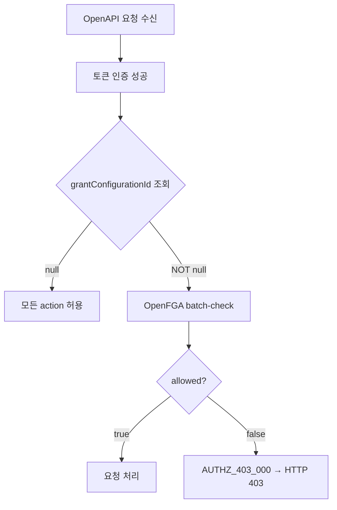

# CI-4270: OpenAPI 호출 시 403 에러 응답 — grant configuration DB↔OpenFGA 동기화 버그

> **compact**: 원본 175줄 → 정제 (2026-03-31). git log로 원본 추적 가능.

## 증상

- **문제 정의**: OpenAPI 호출 시 인증 API, /v2/departments/all, /v2/users/employee-numbers 외 모든 API에서 403 에러 응답[^1]
- **회사**: 쎄트렉아이 (Customer ID: 96860)
- **요청자**: 유지원 (CS) / **대상자**: ihk@satreci.com
- **영향 범위**: 해당 회사 OpenAPI 토큰의 모든 API 호출 (bypass 대상 제외)
- **문제 시점**: 2026-03-31 16:00 KST 경

## 원인 분석

### 원인

DB(flex_grant_authority_group)에는 23개 action이 모두 설정되어 있으나, authorization engine(OpenFGA) batch-check에서 `allowed=false` 반환 — **DB↔OpenFGA 동기화 버그**[^4][^5][^6]

### 조사 과정

> 💡 **판단 근거**: access log 403 패턴 확인[^4] → grant-configuration 조회에서 grantConfigurationId NOT null 확인[^5] → batch-check에서 `allowed=false` 확인[^6] → DB에 23개 action 모두 존재 확인[^7] → DB↔OpenFGA 동기화 불일치 확정
>>>>>>> 01332f8 (:memo: 2026-03-31 운영 노트 갱신 2nd)

### 메커니즘

## 해결

핫픽스 배포로 해소[^8]

## 발견한 스펙/제약

- grantConfigurationId null → 모든 action 허용, NOT null → 명시적 허용 action만 접근 가능[^3]
- `/v2/departments/all`, `/v2/users/employee-numbers`는 access check bypass — grant configuration과 무관하게 항상 접근 가능

## 다음에 같은 문의가 오면

1. **먼저 확인**: access log에서 `customerId` + `responseStatus=403`으로 조회, `flexErrorCode` 확인
2. **원인 판별**:
   - `AUTHZ_403_000` → grant configuration 이슈 (OpenFGA batch-check 거부)
   - `OPENAPI_403_001` → IP ACL 이슈 (client-real-ip 대조)
3. **grant configuration 이슈인 경우**: DB(flex_grant_authority_group)에 action 존재하는데 batch-check 거부 → OpenFGA 동기화 문제. authorization 담당자에게 에스컬레이션

## 참고 자료

- Linear: https://linear.app/flexteam/issue/CI-4270/api-호출시-에러-응답으로-수신됨
- Slack: https://flex-cv82520.slack.com/archives/CRU35U9FC/p1774943948178299
- Intercom: https://app.intercom.com/a/apps/xj5aqcy9/conversations/215473712150146

## 각주

[^1]: Linear 이슈 CI-4270 설명, 2026-03-31
[^2]: Linear 코멘트 @유지원, 2026-03-31 — 에러 응답 JSON (AUTHZ_403_000)
[^3]: 코드: `flex-openapi-backend` > openapi/api/.../OpenApiAccessCheckServiceImpl.kt:38-56
[^4]: access log: customerId=96860, responseStatus=403, flex-app.be-access-2026.03.31
[^5]: access log: traceId=f71b375c1a6d848da0d2f0e72bb31a89의 grant-configuration 응답
[^6]: access log: traceId=f71b375c1a6d848da0d2f0e72bb31a89의 batch-check 응답 `allowed=false`
[^7]: DB: flex_authorization.flex_grant_authority_group WHERE grant_id = '24e2e98a-...' (23건 모두 존재)
[^8]: Linear 코멘트 @윤성복, 2026-03-31 — "핫픽스 배포로 해소되었습니다"
