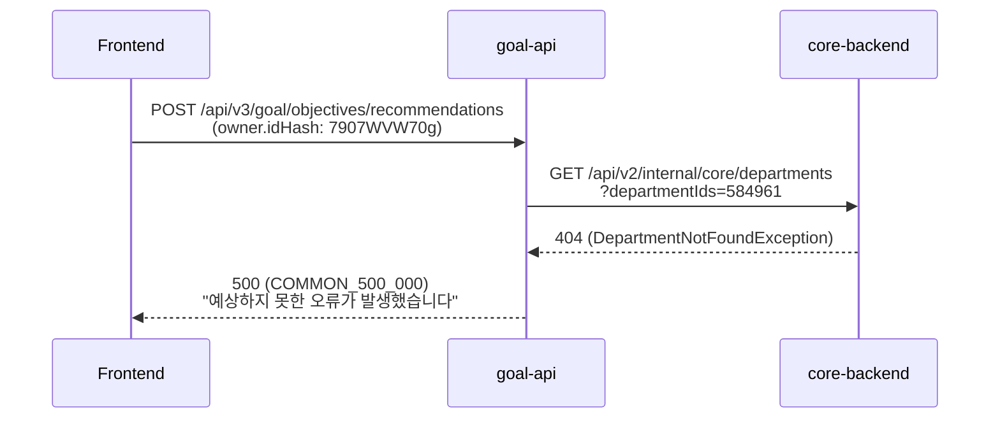

# CI-4275: 목표 > 삭제된 조직의 '상위목표 변경' 시 500 오류

> **상태**: 진행 중 — 2026-04-01

## 증상
- **문제 정의**: 삭제된 부서를 owner로 가진 목표에서 "상위목표 변경" 클릭 시 HTTP 500 오류 발생
- **회사**: flex (Customer ID: 42)
- **요청자**: 강주희 (CS팀)[^1]
- **대상자**: customer success 조직 목표 페이지 사용자
- **영향 범위**: 삭제된 부서를 owner로 가진 목표 전체 (동일 조건의 다른 목표도 해당 가능)
- **문제 시점**: 2026-04-01 10:45 KST
- 문의 내용:
  1. customer success 조직 목표 페이지에서 우측 상단 ··· > 상위목표 변경 클릭 시 '내용을 불러오지 못했습니다' 알럿 발생[^1]
  2. 다른 조직의 목표 페이지에서는 정상 동작[^2]

## 현재까지 파악된 내용

### 조사 과정

> 💡 **판단 근거**: access log에서 500 응답 확인[^3]
> → goal-api가 core-backend에 department 584961 조회 시 `DepartmentNotFoundException` 발생[^4]
> → department 584961 = "Customer Success Team" — 삭제된 부서[^5]
> → 삭제된 부서의 ID가 objective의 owner_id로 남아있어 조회 실패

#### 오류 흐름

#### 요청 파라미터

| 필드 | 값 | 비고 |
|------|-----|------|
| API | `POST /api/v3/goal/objectives/recommendations` | 상위목표 추천 API |
| recommendationType | `PARENT` | 상위목표 |
| owner.type | `DEPARTMENT` | |
| owner.idHash | `7907WVW70g` (= **584961**) | **삭제된 부서** (정상: 존재하는 부서 ID) |
| targetObjectiveId | `019b58e3-ae40-daa2-f4a0-c19cc83504d5` | |
| cycleYear | 2026 | |

#### 오류 코드 위치

- `ObjectiveMatrixSearchPropsBuilder.getDirectUpperDepartmentId()`[^6]에서 `asyncDepartmentLookUpInternalService.get(departmentId)` 호출
- department가 존재하지 않으면 Retrofit 404 → `FlexUnknownException`으로 wrap → 500 응답[^3]

### 정책 확인

- 삭제된 부서의 목표는 **danger 표시** 정책이 있음[^7]
- danger 상태에서도 다른 조직으로 변경할 수 있어야 함[^8]
- 현재는 상위목표 변경 시 owner department 조회에서 실패하여 변경 자체가 불가능한 상태

## 발견한 스펙/제약
- 삭제된 부서를 owner로 가진 목표에서 상위목표 추천 API 호출 시 department 조회 실패 → 500 에러[^3]
- 목표의 owner department가 삭제되면 danger 표시하고, 다른 조직으로 변경 가능해야 하는 정책이 존재하나 상위목표 변경 흐름에서는 미구현[^7][^8]

## 연관 이슈
- [CI-4125](./archive/CI-4125.md): 목표 화면에 조직도 순서 변경이 반영되지 않음 — 동일 서비스(goal-api)의 department 관련 이슈
- [CI-4284](./archive/CI-4284.md): 목표 엑셀 업로드 시 조직명 매칭 실패 — 동일하게 목표+조직 시계열 데이터 제약이 원인

## 참고 자료
- Access log: [OpenSearch 대시보드](https://log-dashboard.grapeisfruit.com/_dashboards/app/discover#/doc/f16cda60-f2fb-11ee-9a9d-4b897330ccb0/flex-app.be-access-2026.04.01?id=97d2de38-19fe-4515-8191-9917844a4d31)
- traceId: `794c0d76ed26a67f142283083dc89158`
- 삭제된 부서 정책 Notion: [링크](https://www.notion.so/flexnotion/10e0592a4a92800da602d68ff61460f5?source=copy_link#23a0592a4a9280ee9f0ce586006ac085)
- 코드 위치: `flex-goal-backend` > objective/repository-matrix/src/.../ObjectiveMatrixSearchPropsBuilder.kt:587-599

## 미결 사항
- [ ] `objective_v3` 테이블에서 해당 목표의 `owner_id`가 584961인지 DB 확인
- [ ] 동일 조건(삭제된 부서를 owner로 가진 목표)이 다른 목표에도 있는지 일괄 점검
- [ ] `getDirectUpperDepartmentId()`에서 department 404 시 graceful 처리 구현 (빈 추천 목록 반환 또는 안내 메시지)
- [ ] 삭제된 부서의 목표에서 owner 변경 가능하도록 처리 (danger 정책 연동)

## 각주
[^1]: Linear 이슈 설명 + Slack 첨부, @강주희, 2026-04-01
[^2]: Linear 코멘트 (시스템), 2026-04-01 — "다른 조직들의 목표 페이지에서는 이슈없는데, 이 페이지에서만 오류가 발생"
[^3]: Access log: `flex-app.be-access-2026.04.01` doc_id `97d2de38-19fe-4515-8191-9917844a4d31` — responseStatus: 500, exception: `retrofit2.HttpException: HTTP 404 Not Found`
[^4]: API log: `flex-app.be-api-2026.04.01` traceId `794c0d76ed26a67f142283083dc89158` — `DepartmentNotFoundException` at `DepartmentLookUpServiceImpl.get(DepartmentLookUpServiceImpl.kt:69)`
[^5]: Linear 코멘트 @김보라, 2026-04-01 — "584961는 Customer Success Team 이었는데. 이 팀이 삭제되어 부서를 못찾고 있는 상황"
[^6]: 코드: `flex-goal-backend` > objective/repository-matrix/src/.../ObjectiveMatrixSearchPropsBuilder.kt:587-599
[^7]: Notion: [삭제된 부서 danger 표시 정책](https://www.notion.so/flexnotion/10e0592a4a92800da602d68ff61460f5?source=copy_link#23a0592a4a9280ee9f0ce586006ac085)
[^8]: Linear 코멘트 @이윤주, 2026-04-01 — "danger로 표시한다는 정책이 있습니다. 누르면 다른 조직으로 바꿀 수는 있어야 합니다"
