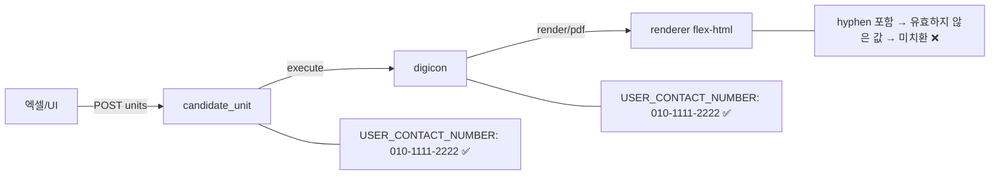

# CI-4297: 전자계약 엑셀 업로드 후 연락처 필드가 공란으로 발송됨

> **상태**: 해결 완료 — 2026-04-03

## 증상
- **문제 정의**: 전자계약 엑셀 업로드 기능으로 계약서를 발송하면, 연락처(USER_CONTACT_NUMBER) 필드가 공란으로 렌더링됨
- **회사**: 디노티시아 (Customer ID: 207050)
- **요청자**: h.cherry@dnotitia.com[^1]
- **대상자**: 93명 (digicon_candidate_set id=257984 기준)[^2]
- **영향 범위**: 엑셀 업로드 기능 선오픈 고객사 전체 (엑셀 외 일반 UI 경로도 동일 증상)
- **문제 시점**: 2026-04-01 14:16 KST
- 문의 내용:
  1. 엑셀 업로드 후 계약서 발송 시 연락처 필드가 공란으로 발송됨
  2. 이미 계약이 발송되어 일부 구성원이 서명 중인 상태
  3. 연락처 데이터 반영 요청

## 원인 분석

### 근본 원인
- **엑셀 업로드 시 연락처에 hyphen이 포함**(010-1111-2222)되어 저장됨
- **renderer(flex-html)가 hyphen 포함 전화번호를 유효하지 않은 데이터로 처리**하여 placeholder를 값으로 치환하지 않음[^15]
- 엑셀이 아닌 일반 UI 경로에서도 동일 — renderer 쪽 문제

### 데이터 저장은 정상
- digicon_candidate_unit에 USER_CONTACT_NUMBER 값이 정상 저장됨[^3]
- digicon 레코드에도 USER_CONTACT_NUMBER 값이 정상 저장됨[^4]
- 계약 내역 테이블에서 연락처 값이 정상 표시됨 (예: 010-1111-2222)[^5]

### PDF 렌더링 방식
- **실시간 렌더링** — PDF는 저장되지 않고, 구성원이 열 때마다 DB의 `placeholderValues`를 읽어서 렌더링[^16]
- 따라서 **DB 값을 수정하면 재발송 없이 즉시 반영됨**
- prod 93건 전부 `file_key` NULL (실시간 렌더링 확인)

### 데이터 흐름 검증



### prod 데이터 현황
- 총 93건: SUCCEED 66건 + IN_PROGRESS 27건
- render_version: V1_13 (전체 동일)
- `placeholder_values`는 `{cipher}` 암호화 — DB 직접 UPDATE 불가[^17]

## 해결

### 1. FE 핫픽스 (재발 방지) — 완료
- 엑셀 업로드 시 연락처에서 hyphen을 제거하도록 수정[^18]
- PR: https://github.com/flex-team/flex-frontend-apps-digicon/pull/161
- prod 배포 및 정상 동작 확인 완료 (지무근)

### 2. BE Operation API (기존 데이터 수정) — 리뷰 대기
- `placeholder_values`가 암호화되어 있어 DB 직접 UPDATE 불가
- 애플리케이션 레벨에서 복호화 → hyphen 제거 → 재암호화하는 Operation API 구현
- PR: https://github.com/flex-team/flex-digicon-backend/pull/771
- 브랜치: `juwon/CI-4297` (base: main)

**추가된 API:**

| Method | Endpoint | 용도 |
|--------|---------|------|
| GET | `.../candidate-sets/{candidateSetId}/placeholder-labels` | candidate set의 placeholder label 목록 조회 |
| POST | `.../sanitize-placeholder-values` | 지정 placeholder의 값에서 특정 문자열 제거 |

**로컬 테스트 결과:**
- dev 재현 데이터(candidateSetId=2897, customerId=3174)로 검증 완료
- sanitize 1차: totalCount=2, modifiedCount=2 (hyphen 제거 성공)
- sanitize 2차: totalCount=2, modifiedCount=0 (멱등성 확인)

### 3. prod 실행 계획 (리뷰 후)
```bash
# 1. placeholder label 확인
GET /api/operation/v2/digicon/customers/207050/candidate-sets/257984/placeholder-labels

# 2. hyphen 제거 실행
POST /api/operation/v2/digicon/customers/207050/sanitize-placeholder-values
{ "digiconCandidateSetId": 257984, "placeholderLabel": "구성원 연락처", "sanitizeString": "-" }
```

## 미결 사항
- [ ] BE PR 리뷰 및 머지 (성환님 검토 중)
- [ ] prod 배포 후 Operation API로 93건 데이터 수정 실행
- [ ] admin-shell 페이지 추가 (PR TODO)

## 참고 자료
- Linear: https://linear.app/flexteam/issue/CI-4297
- Slack 스레드: CRU35U9FC/p1775092908834599[^1]
- prod candidate_set id: 257984 (93건 발송, SUCCEED 66건 + IN_PROGRESS 27건)[^2]
- dev 재현 customer_id: 3174, candidateSetId: 2897, template id: 1838 ("CI-4297 reproduce")
- dev 재현 digicon: 52OrReYOYr (엑셀), pnb1lvrOw9 (UI) — 둘 다 동일 증상

## 각주
[^1]: Linear 이슈 첨부 Slack 스레드, 2026-04-01
[^2]: DB: `flex_digicon.digicon_candidate_set` WHERE id=257984, customer_id=207050
[^3]: dev access log: `POST /api/v2/digicon/sets/rZgQ2M7OmL/units` 응답에 USER_CONTACT_NUMBER 포함 (8개 placeholder), 2026-04-02 11:12 KST
[^4]: dev digicon GET API: `/api/v2/digicon/users/52Or1KAgYr` 응답에서 digicon 52OrReYOYr의 USER_CONTACT_NUMBER value="010-1111-2222" 확인
[^5]: dev 전자계약 계약 내역 페이지에서 연락처 컬럼 값 표시 확인 (Playwright 스크린샷)
[^6]: dev HTML 렌더 확인: `POST /action/v2/digicon/52OrReYOYr/render/html` 응답에서 `data-placeholder-type="USER_CONTACT_NUMBER"` 마커 미치환, 전화번호 값 미포함
[^7]: dev HTML 렌더 확인: `POST /action/v2/digicon/pnb1lvrOw9/render/html` (UI 생성 계약) 응답에서도 동일하게 마커 미치환
[^8]: 코드: `flex-digicon-backend` > service/src/.../file/DigiconFileServiceImpl.kt:49-105
[^9]: 코드: `flex-digicon-backend` > service/src/.../candidate/DigiconCandidateUnitServiceImpl.kt:100-104
[^10]: 코드: `flex-digicon-backend` > service/src/.../placeholder/DigiconPlaceholderValueServiceImpl.kt:235-236
[^11]: 코드: `flex-digicon-backend` > service/src/.../DigiconServiceImpl.kt:104-124
[^12]: 코드: `flex-digicon-backend` > service/src/.../file/DigiconFileServiceImpl.kt:49-105
[^13]: 코드: `flex-digicon-backend` > integration/src/.../file/FlexHtmlServiceImpl.kt:46-88
[^14]: dev digicon GET API: template form HTML에 `data-placeholder-type="USER_CONTACT_NUMBER">@구성원 연락처` 존재 확인
[^15]: Linear 코멘트 (지무근): "hypen이 포함된 전화번호 데이터를 renderer에서 유효하지 않은 데이터로 바라보고 값을 채워주지 않는 문제"
[^16]: 코드 분석: `DigiconFileServiceImpl.renderToPDF()`에서 매번 DB 조회 → FlexHtmlApi.render() 호출, S3/디스크 저장 없음
[^17]: prod DB: digicon.placeholder_values 컬럼이 `{cipher}` prefix로 암호화됨 — SQL로 직접 수정 불가
[^18]: FE PR: https://github.com/flex-team/flex-frontend-apps-digicon/pull/161 — prod 배포 완료 (지무근, 2026-04-02)
