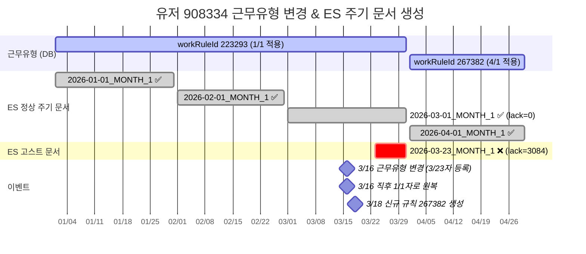
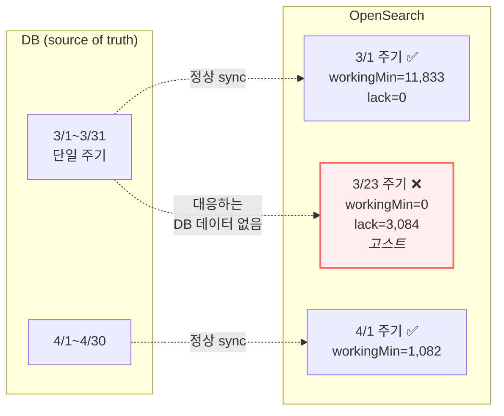

# CI-4304: 근태 대시보드 근무시간미달 — 고스트 periodicWorkSchedule 노출

> **상태**: 해결 완료 — 2026-04-03 (고객 확인 완료, 근본 수정은 별도 이슈로 분리)

## 요약

근태 대시보드에서 주기 단위 근무시간미달 조회 시, 실제로는 미달이 없는 구성원이 미달로 표시된다. 원인은 ES에 잔존하는 **고스트 periodicWorkSchedule 문서**가 대시보드 조회에 노출되는 것이다.

두 건의 코드 변경이 겹치면서 발생했다:
1. **클린업 범위 축소** ([`a6a06b6be9`](https://github.com/flex-team/flex-timetracking-backend/commit/a6a06b6be9), 2025-09-04) — 구 규칙 ID의 고스트를 클린업하지 못하게 됨
2. **조회 결과 확장** (`ed5035c24b`, 2025-11-17) — 주기연장일귀속 스펙으로 `associateBy` → `groupBy` 변경, 고스트도 함께 노출

ES 재동기화로는 해결 불가 (문서 ID가 달라 upsert 대상에 미포함). **고스트 문서를 ES에서 직접 삭제**해야 한다.

## 증상

| 항목 | 내용 |
|---|---|
| 회사 | 라이온하트스튜디오 (Customer ID: 191254) |
| 요청자 | goeun@lionhearts.co.kr |
| 대상자 | 황미나 (user_id: 908334, `eGzKryK90n`) |
| 영향 범위 | 근무규칙 변경이 있었던 유저 최소 9명[^1] |
| 문제 시점 | 현재 지속. 3월 주기 조회 시 |

문의: 근태 대시보드 > 근무시간 미달에 표시되는 구성원의 근무기록을 확인하면 미달 기록이 없다. 다수 구성원 동일 발생.

## 원인 분석

### 0. 유저 근무유형 변경과 주기 문서 생성 과정

대상 유저(908334)의 근무유형은 모두 **1개월 주기(MONTH/1, beginDate dayOfMonth=1)**이다[^5]. 정상적이라면 주기 문서의 `startDateOfPeriod`는 항상 **매월 1일**이어야 한다.

**유저 근무유형 이력** (`v2_user_work_rule_event`):

| id | date_from | db_created_at (KST) | workRuleId | 규칙명 | event_type | 비고 |
|---|---|---|---|---|---|---|
| 1372405 | 1970-01-01 | 2025-12-10 18:45:42 | 223293 | 선택적근무(코어 10:30~16:30) | REGISTER | 최초 등록 |
| **1467313** | **2026-03-23** | **2026-03-18 14:49:56** | **267382** | **선택적근무_202604** | **REGISTER** | **3/23자로 신규 규칙 적용 → 이때 고스트 생성** |
| **1467900** | **2026-03-23** | **2026-03-18 17:11:41** | **223293** | **선택적근무(코어 10:30~16:30)** | **REGISTER** | **같은 날 3/23자로 구 규칙 재등록** |
| 1467902 | 2026-01-01 | 2026-03-18 17:11:47 | 223293 | 선택적근무(코어 10:30~16:30) | REGISTER | 1/1자로 원복 (6초 후) |
| 1468157 | 2026-04-01 | 2026-03-18 17:49:19 | 267382 | 선택적근무_202604 | REGISTER | 4/1자로 신규 규칙 적용 |

> DB: `flex.v2_user_work_rule` WHERE user_id = 908334[^19]
>
> 3/18 오후에 짧은 시간 안에 여러 번 변경이 발생했다. id 1467313에서 3/23자로 267382를 적용했다가, 약 2시간 뒤(1467900, 1467902) 223293으로 원복하고 1/1자로 재설정한 뒤, 다시 4/1자로 267382를 적용(1468157)했다. 이 과정에서 3/23 boundary clamp로 생긴 고스트가 잔존.

> 3/23자 변경 → 원복의 과정에서 `UserWorkRuleChangedEventConsumer`의 re-sync가 boundary clamp로 3/23 시작 주기 문서를 ES에 생성했고, 원복 후에도 이 문서가 삭제되지 않았다. (왜 삭제되지 않았는지는 [2. 고스트가 왜 클린업되지 않았는가](#2-고스트가-왜-클린업되지-않았는가) 참고)

아래 다이어그램은 이 변경 이력에 따른 ES 주기 문서 생성 과정을 보여준다:



**핵심**: 3/16에 근무유형을 3/23자로 변경했다가 다시 1/1자로 원복하는 과정에서, boundary clamp로 생성된 `..._2026-03-23_MONTH_1` 문서가 삭제되지 않고 남았다. 이 고스트 문서는 `workingMinutes=0`, `lackOfWorkingMinutes=3084`로 기록되어 대시보드에서 근무시간미달로 표시된다.



### 1. ES 주기 문서 현재 상태

ES periodicWorkSchedule 상태[^3]:

| 주기 시작 | workRuleId | workingMin | lackMin | lastModified (KST) | 판정 |
|---|---|---|---|---|---|
| 2026-03-01 | 223293 | 11,833 | 0 | 2026-03-31 17:57 | ✅ 정상 |
| **2026-03-23** | **223293** | **0** | **3,084** | **2026-03-16 05:31** | ❌ 고스트 |
| 2026-04-01 | 267382 | 1,082 | 8,722 | 2026-04-01 06:05 | ✅ 정상 |

고스트의 `lastModified`(2026-03-16)가 근무유형 변경 시점과 일치한다.

DB 기반 초과근무 API에서는 3월이 `2026-03-01 ~ 2026-03-31` 단일 주기로 계산되며, 3/23 주기는 존재하지 않는다[^14]. **DB(source of truth)에 실체가 없는 ES 고스트 확정.**

### 2. 고스트가 왜 클린업되지 않았는가

`UserWorkRuleChangedEventConsumer`에는 고스트를 삭제하는 클린업 로직(`cleanUpStartNotOriginalStartedPeriodicWorkSchedules`)이 있다. 하지만 두 가지 구조적 문제로 이 케이스의 고스트를 잡지 못했다.

**문제 1: 클린업 대상 규칙 ID 범위 축소** — 2025-09-04 변경(`a6a06b6be9`)으로 클린업 대상 조회 방식이 바뀌었다[^16]:

| 시점 | 방식 | 구 규칙 고스트 클린업 |
|---|---|---|
| 변경 전 | `getByUserAndDate(syncDateRange.from)` | ⭕ 가능 — 날짜에 따라 구 규칙이 반환될 수 있었음 |
| 변경 후 | `getByIdentity(event.userWorkRuleId)` | ❌ 불가 — 이벤트를 발생시킨 규칙 ID만 대상 |

**문제 2: 클린업 → re-sync 실행 순서** — 클린업이 먼저 실행되고 re-sync가 나중에 실행되므로, re-sync가 만드는 고스트를 클린업이 잡을 수 없다.

이 유저의 실제 이벤트 흐름에 적용하면:

```
[id 1467313] 3/18 14:49 — 3/23자로 267382 적용
  ① 클린업: 대상 = workRuleId 267382의 고스트 → 아직 없음 → 삭제 0건
  ② re-sync: boundary clamp → 3/23 시작 주기 문서 생성 (workRuleId 223293으로!)
     → 고스트 생성됨

[id 1467900] 3/18 17:11 — 3/23자로 223293 재등록 (원복 시도)
  ① 클린업: 대상 = workRuleId 223293의 고스트
     → 3/23 고스트(workRuleId 223293)가 대상에 포함될 수 있음
     → 하지만 클린업이 먼저 실행되고...
  ② re-sync: boundary clamp → 3/23 문서를 다시 생성할 수 있음
     → 클린업이 지웠어도 re-sync가 다시 만듦

[id 1467902] 3/18 17:11 — 1/1자로 223293 원복 (6초 후)
  ① 클린업: 대상 = workRuleId 223293의 고스트
     → 3/23 고스트 삭제 시도 가능
  ② re-sync: 이번에는 1/1자이므로 boundary clamp 없음 → 3/1 문서만 upsert
     → 그런데 직전 이벤트(id 1467900)의 re-sync가 아직 Kafka 처리 중이라면?
     → 이벤트 처리 순서가 보장되지 않아 고스트가 남을 수 있음
```

**핵심**: 짧은 시간에 여러 변경이 연속 발생하면, 각 이벤트의 클린업과 re-sync가 Kafka 비동기 처리로 뒤섞이면서 "클린업 → 재생성" 순환이 발생한다. 최종적으로 3/23 고스트가 잔존하게 됐다.

### 3. 고스트가 왜 대시보드에 노출되는가

대시보드 조회 쿼리(`OsPeriodicWorkScheduleSearchChildCondition`)는 최초 생성(2024-07-16)부터 `startDateOfPeriod`를 **range 필터**(from~to)로 조회한다[^18]. `startDateOfPeriod`를 정확히 매칭하는 `termQuery`였던 적은 없다. 따라서 조회 범위 3/1~3/31에 `startDateOfPeriod=3/23`인 고스트도 포함된다. `dayOfMonth` 검증도 처음부터 없었다. 고스트 방어는 클린업이 사전 제거하는 것에 의존하는 설계였다.

여기에 **2025-11-17 변경**([`ed5035c24b`](https://github.com/flex-team/flex-timetracking-backend/commit/ed5035c24b))이 추가됐다[^17]:

```kotlin
// 변경 전: associateBy { it.userId }  → 같은 유저면 마지막 것만 남김
// 변경 후: groupBy { it.userId }      → 같은 유저의 문서를 모두 포함
```

이 변경은 주기연장일귀속(`distributePeriodOverToDay`) 분할 주기 누락 수정이 목적이었으나, **부수 효과로 고스트도 조회 결과에 포함**되게 됐다.

### 4. 재동기화로 해결되지 않는 이유

재동기화 실행 후 검증한 결과[^15]:
- 3/1 정상 문서: `lastModified` 갱신됨 ✅
- 3/23 고스트: `lastModified` 변경 없음 ❌

ES upsert는 문서 ID 기반이므로, 정상 문서(`..._2026-03-01_MONTH_1`)와 고스트(`..._2026-03-23_MONTH_1`)는 서로 다른 문서로 취급된다. 재동기화는 정상 문서만 갱신하고 고스트를 건드리지 않는다.

### 5. 인사이트(데이터팀) 영향

**영향 없음.** 주기연장일귀속 스펙 변경과 함께 인사이트에서는 periodicWorkSchedule 주기 문서를 아예 사용하지 않기로 했다.

## 해결

### 즉시 조치 (현상 해소)

**코드 수정 배포가 우선.** ES 고스트를 직접 삭제하는 것은 대상이 많아 현실적이지 않다 (이 회사만 9명+, 다른 회사도 있을 수 있음). 아래 근본 해결을 배포하여 고스트가 조회되지 않도록 한 뒤, 필요시 클린업 배치로 고스트 데이터 정리.

⚠️ **ES 재동기화로는 해결 불가** — 문서 ID 기반 upsert이므로 고스트를 덮어쓰지 않음 (실행 후 확인 완료[^15])

### 근본 해결 — 방안 비교

단독으로 완벽한 방안은 없으며, **조회 방어 + 생성 방지**의 조합이 필요하다.

#### 조회 방어 (고스트가 있어도 안 보이게)

| 방안 | 내용 | 난이도 | 즉시 효과 | 비고 |
|---|---|---|---|---|
| **A. ES script 필터** | `OsPeriodicWorkScheduleSearchChildCondition` 에 `startDateOfPeriod.dayOfMonth == beginDate.dayOfMonth` script 필터 추가 | 소 | ✅ | 클린업에 이미 동일 script 존재[^12]. 성능 우려는 있으나 대상이 이미 좁혀진 상태 |
| **B. terms 쿼리** | 규칙의 period 패턴으로 유효한 `startDateOfPeriod` 를 미리 계산하여 range 대신 terms 매칭 | 소 | ✅ | script 없이 정확 매칭. 단, 주기연장일귀속 활성화 시 정당한 분할 주기를 놓칠 수 있음 |
| **C. 서비스 후처리** | ES 결과를 받은 후 서비스 레이어에서 period 패턴 불일치 문서 제거 | 소 | ⚠️ | ES aggregation에서 이미 고스트가 카운트에 포함되므로 집계 수치를 되돌릴 수 없음 |
| **D. 일모델 전환** | 대시보드 근무시간미달을 periodicWorkSchedule 대신 일별 workSchedule 기반으로 전환 | 대 | ✅ | [PR #11281](https://github.com/flex-team/flex-timetracking-backend/pull/11281) 에서 시도 후 리버트됨. 리버트 사유 해소 여부 검토 필요 |
| **E. DB 주기 매칭** | 유저별 실제 workingPeriodRange를 DB에서 조회하여 ES 쿼리에 반영 | 대 | ✅ | 가장 정확하나 대시보드가 ES를 쓰는 이유(DB 부하 회피)를 훼손 |

#### 생성 방지 (고스트 자체를 줄이거나 제거)

| 방안 | 내용 | 난이도 | 비고 |
|---|---|---|---|
| **F. 클린업 범위 복원** | `OsPeriodicWorkScheduleCleansingSyncService` 에서 구 규칙 ID도 대상에 포함 | 중 | Kafka 비동기 처리로 이벤트 순서 보장 안 됨 — 짧은 시간 연속 변경 시 빈틈 여전히 존재 |
| **G. sync 시 삭제** | re-sync에서 정상 문서 upsert 후, 같은 유저+규칙의 다른 `startDateOfPeriod` 문서 삭제 | 중 | 자기 치유(self-healing). sync 경로 변경 부담 있음 |

#### 추천 조합

**조회 방어 A(script 필터) + 생성 방지 F(클린업 범위 복원)** 이 가장 현실적인 조합이다:
- A로 배포 즉시 기존+신규 고스트 모두 조회 차단
- F로 고스트 데이터 자체도 줄여감
- 둘 다 기존 코드에 유사 로직이 있어 구현 리스크 낮음

단, 담당 개발자가 **주기연장일귀속 향후 활성화 계획**과 함께 판단해야 한다. 활성화 시 B(terms)는 정당한 분할 주기를 놓칠 수 있고, D(일모델 전환)가 더 근본적일 수 있다.

## 다음에 같은 문의가 오면

1. OpenSearch에서 해당 유저의 periodicWorkSchedule 조회 → `startDateOfPeriod`의 dayOfMonth가 규칙의 beginDate와 다른 문서 확인
2. dayOfMonth 불일치 + `workingMinutes=0` 이면 고스트
3. ES에서 직접 삭제. ⚠️ 재동기화로는 안 됨

## 미결 사항

- [ ] 근본 수정 이슈 생성 및 배포 (클린업 범위 + 조회 필터)
- [ ] 배포 후 고스트 클린업 배치 실행
- [ ] 3/1 시작 9명 중 실제 미달 vs 고스트 구분
- [ ] 다른 회사 동일 패턴 확인

## 참고 자료

### 영향을 준 PR

| PR | 제목 | 머지일 | 영향 |
|---|---|---|---|
| [#11119](https://github.com/flex-team/flex-timetracking-backend/pull/11119) | [Chore] OS주기문서 클렌징 로직 수정 | 2025-09-04 | 클린업 대상을 `getByIdentity`로 변경 → 구 규칙 ID 고스트 클린업 누락 |
| [#11281](https://github.com/flex-team/flex-timetracking-backend/pull/11281) | TT-15582 근태관리대시보드 - 근무시간미달, 휴게시간미달 모두 일모델만 사용하도록 수정 | 2025-10-29 | 대시보드에서 주기 문서 대신 일별 문서를 사용하도록 변경 (이후 리버트됨) |
| [#11366](https://github.com/flex-team/flex-timetracking-backend/pull/11366) | Revert #11281 + 주기모델 조회 시 여러 주기 포함되도록 수정 | 2025-11-17 | `associateBy` → `groupBy` 변경, 고스트도 조회 결과에 포함되게 됨 |

> **배경**: #11281에서 대시보드 근무시간미달/휴게시간미달을 일모델만 사용하도록 변경했으나, 이슈가 있어 #11366에서 리버트하면서 주기모델로 복원 + 여러 주기가 조회되도록 `groupBy`로 변경했다. 이 `groupBy` 변경이 고스트 노출의 직접 원인이다.

### 관련 데이터

- 대상 유저: `v2_user_work_rule_event` WHERE user_id = 908334 — 근무유형 변경 이력에서 3/23자 변경 확인
- 근무규칙: `v2_customer_work_rule` WHERE id IN (223293, 267382) — 둘 다 MONTH/1, beginDate dayOfMonth=1
- ES 인덱스: `prod-v2-tracking-work-schedules`, routing `191254_908334`
- access log: insufficient-work API, email `goeun@lionhearts.co.kr`, 2026-04-02

### 링크

- Slack: [CI-4304 조사 현황](https://flex-cv82520.slack.com/archives/CRU35U9FC/p1775131431278739?thread_ts=1775109375.097529&cid=CRU35U9FC)
- 코드: `UserWorkRuleChangedEventConsumer`, `OsPeriodicWorkScheduleCleansingSyncService`, `OsPeriodicWorkScheduleSearchChildCondition`, `WorkScheduleDashboardLookUpServiceImpl`

## 각주

[^1]: API 응답에서 startDateOfPeriod가 1일이 아닌 유저 9명 (3/4: 2명, 3/10: 1명, 3/17: 3명, 3/23: 3명)
[^2]: access log: `flex-app.be-access-2026.04.02`, ipath: `/api/v2/time-tracking/customers/{customerIdHash}/dashboards/insufficient-work`
[^3]: OpenSearch: `prod-v2-tracking-work-schedules`, routing: `191254_908334`
[^4]: OpenSearch: 동일 인덱스, workSchedule 문서 조회 (2026-03-23 ~ 2026-03-31)
[^5]: DB: `flex.v2_customer_work_rule` WHERE id IN (223293, 267382) — 둘 다 `working_period_begin_date=2024-05-01` (dayOfMonth=1), MONTH/1
[^6]: 코드: `UserWorkRuleChangedEventConsumer` — 클린업 → re-sync 순서 실행
[^9]: 스펙 확인: "고스트는 남을 수 있으나 조회 시 필터링되어야 함"
[^14]: 초과근무 API (DB 기반) — 3월 `workingPeriodRange: 2026-03-01 ~ 2026-03-31`, 3/23 분할 없음
[^15]: 재동기화 검증 (2026-04-02 21:05 KST) — 3/1 문서 갱신, 3/23 고스트 미변경 확인
[^16]: [PR #11119](https://github.com/flex-team/flex-timetracking-backend/pull/11119) (2025-09-04, 커밋 [`a6a06b6be9`](https://github.com/flex-team/flex-timetracking-backend/commit/a6a06b6be9)): 클린업 `getByUserAndDate` → `getByIdentity`. 구 규칙 ID 고스트가 클린업 범위에서 빠짐
[^17]: [PR #11366](https://github.com/flex-team/flex-timetracking-backend/pull/11366) (2025-11-17, 커밋 [`ed5035c24b`](https://github.com/flex-team/flex-timetracking-backend/commit/ed5035c24b)): [#11281](https://github.com/flex-team/flex-timetracking-backend/pull/11281) 리버트 + `associateBy` → `groupBy`. 주기연장일귀속 수정의 부수 효과로 고스트 노출
[^18]: `OsPeriodicWorkScheduleSearchChildCondition` 코드 이력 — `dayOfMonth` 검증 추가/제거된 적 없음
[^19]: DB: `flex.v2_user_work_rule` WHERE user_id = 908334 AND customer_id = 191254 — 5건 조회. 3/18에 짧은 시간 내 복수 변경 확인
