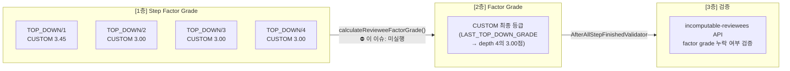
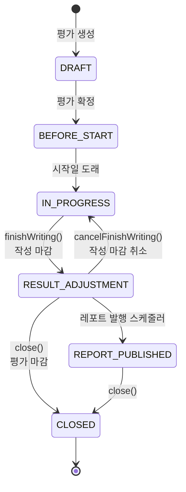
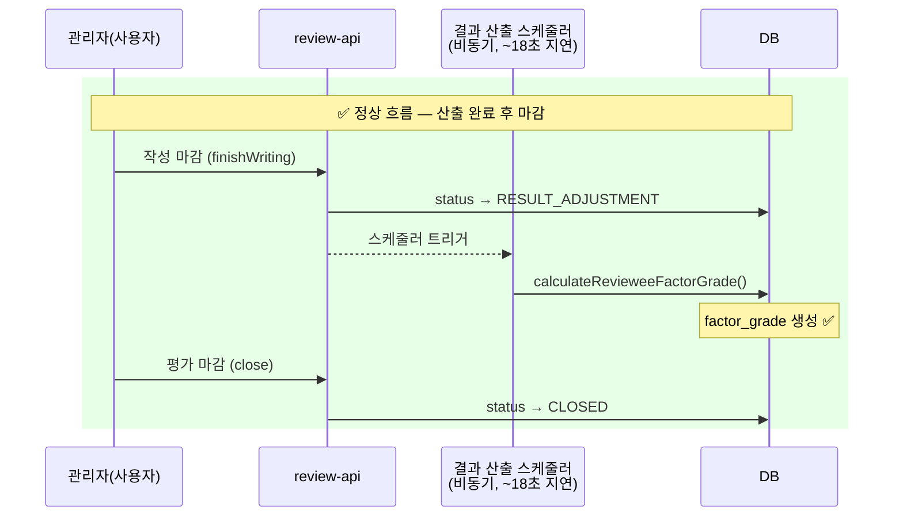
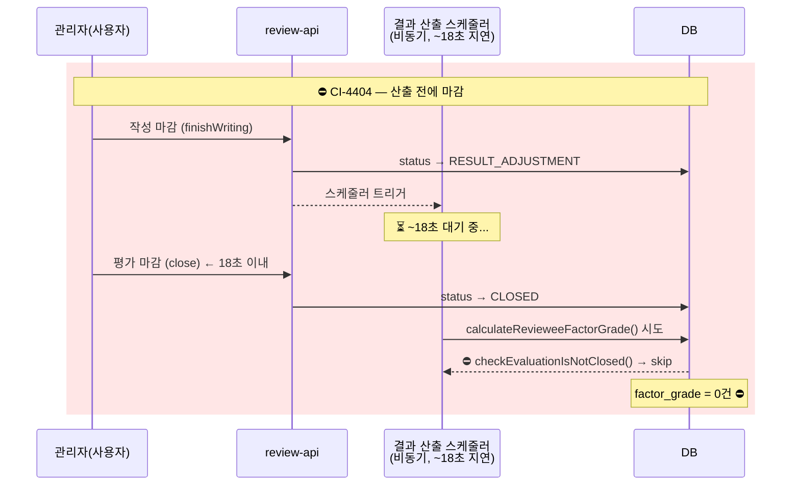
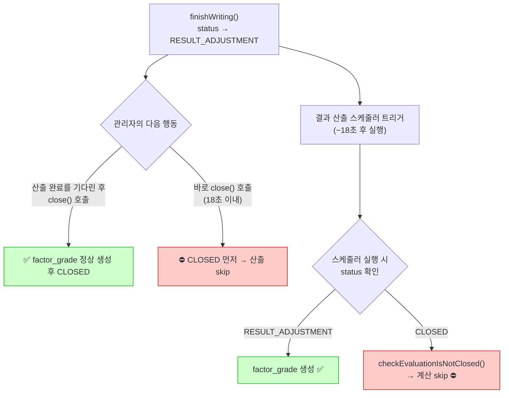
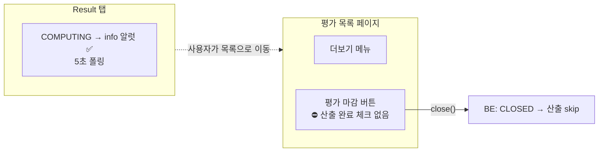

# CI-4404: 평가 등급 산출 오류 — 상태 변경 경합으로 factor grade 미생성

> **verdict**: `spec` (상태 변경 경합) — 도메인 개발자 확인[^12]
> **상태**: 해결 완료 — 2026-04-13 (스펙 확인 완료, 대응 방법 협의됨)

## 도메인 용어집

### 평가 구조

| 용어 | 설명 | 이 이슈에서 |
|------|------|------------|
| **평가(Evaluation)** | 하나의 평가 세션. 관리자가 생성→평가자 작성→관리자 마감 | "수습평가_개발·운영팀 이승훈M test" |
| **대상자(Reviewee)** | 평가를 받는 구성원 | 이승훈M (user_id: 632373, hashedId: `QVzlRley8R`) |
| **평가자(Reviewer)** | 평가를 작성하는 사람. 셀프/하향 등 유형 | 본인이 셀프+하향 모두 수행 |
| **단계(Step)** | 평가 작성의 각 라운드. SELF, TOP_DOWN 등 | SELF/1, TOP_DOWN/1~4 |
| **요소(Factor)** | 평가 항목 분류. PERFORMANCE, COMPETENCY, CUSTOM 등 | CUSTOM (이 평가는 CUSTOM만 사용) |

### 등급 산출 3계층 구조

평가 등급은 아래에서 위로 순차 산출됨:

| 계층 | DB 테이블 | 역할 | 이 이슈 |
|------|-----------|------|---------|
| **1층** Step Factor Grade | `evaluation_reviewee_step_factor_grade` | 단계별 요소 등급 (원본) | **4건** ✅ |
| **2층** Factor Grade | `evaluation_reviewee_factor_grade` | 요소별 집계 등급 | **0건** ⛔ |
| **3층** 검증 | incomputable-reviewees API | factor grade 누락 시 NOT_COMPUTED | CUSTOM → NOT_COMPUTED |

### 등급 산출 방식

| 방식 | 코드명 | 설명 |
|------|--------|------|
| **하향 마지막 등급** | `LAST_TOP_DOWN_GRADE` | TOP_DOWN 마지막 depth의 점수를 factor grade로 사용 |
| **가중 평균** | `WEIGHTED` | 여러 단계 점수를 가중치로 합산 |

이 평가: `LAST_TOP_DOWN_GRADE` → TOP_DOWN depth 4의 3.00점이 CUSTOM factor grade가 되어야 함

### 평가 상태 전이

> 이 이슈의 핵심: RESULT_ADJUSTMENT 진입 시 결과 산출 스케줄러(~18초 지연)가 트리거되는데, 완료 전에 CLOSED로 전환되면 산출이 skip됨

---

## 증상

- **문제 정의**: 하향 1~4차 등급이 모두 산출 완료되었으나, CUSTOM 팩터의 factor grade 레코드가 미생성되어 "등급을 산출할 수 없는 대상자" 에러 표시
- **회사**: 프롭티어 (Customer ID: 176018)
- **요청자**: 이주화 (CS)[^1]
- **대상자**: 이승훈M (userIdHash: `QVzlRley8R`)[^2]
- **영향 범위**: 1명 (해당 평가의 특정 대상자)
- **문제 시점**: 2026-04-10
- 문의 내용:
  1. 평가 등급 산출 오류 — "등급을 산출할 수 없는 대상자가 있어요" 에러 배너가 뜨는데 이유를 모르겠음[^1]
  2. 작성 마감 취소 불가 — 평가 상태가 "종료"인데 "결과 조정 중인 평가만 작성 마감 취소 처리를 할 수 있습니다" 오류[^1]

### 평가 설정 요약[^1]

- evaluationId: `01knv0b9y921maarxs92s6v0e4`
- 셀프 → 등급 미사용 / 하향 1~4차 → 등급 사용, 산출 완료
- 종합평가 등급: 하향 마지막 등급 반영 (`LAST_TOP_DOWN_GRADE`)

---

## 원인 확정: 상태 변경 경합 (Race Condition)

### 무엇이 일어났나[^12]

1. 관리자가 **작성 마감**(finishWriting)을 실행 → status가 `RESULT_ADJUSTMENT`로 전환
2. 이 시점에 결과 산출 스케줄러가 트리거됨 (**~18초 후 실행 예정**)
3. 관리자가 산출 완료를 기다리지 않고 **18초 이내에 평가 마감**(close) 실행 → status가 `CLOSED`로 전환
4. 스케줄러가 실행되었으나, `calculateRevieweeFactorGrade()` 내부의 `checkEvaluationIsNotClosed()` 에서 CLOSED 상태를 감지하여 **계산 skip**[^5]
5. `evaluation_reviewee_factor_grade` 에 레코드가 생성되지 않음 → `incomputable-reviewees` API가 NOT_COMPUTED 반환 → 에러 배너 표시

### 경합 지점 요약

### 문의 2: 작성 마감 취소 불가 — 스펙 정상 동작[^6]

`cancelFinishWriting()`은 `RESULT_ADJUSTMENT` 상태에서만 가능. 이 평가는 이미 CLOSED이므로 불가.
- `EvaluationCommandService.cancelFinishWriting()` — `status != RESULT_ADJUSTMENT` 이면 예외[^6]
- 에러 메시지 "결과 조정 중인 평가만 작성 마감 취소 처리를 할 수 있습니다" — 코드와 일치

### verdict

| 항목 | 판정 |
|------|------|
| 등급 산출 오류 | **spec** — 결과 산출 완료 전 상태 변경에 의한 타이밍 이슈. 버그가 아닌 구조적 한계.[^12] |
| 작성 마감 취소 불가 | **spec** — CLOSED 상태에서는 불가. 의도된 동작.[^6] |

---

## 조사 근거

### DB 교차 검증

| 테이블 | 건수 | 의미 |
|--------|------|------|
| `evaluation_reviewee_step_factor_grade` | **4건** ✅ | 1층 step factor grade 정상 생성[^7] |
| `evaluation_reviewee_factor_grade` | **0건** ⛔ | 2층 집계 미실행[^8] |
| `evaluation` | status=CLOSED, 설정 정상[^10] | `grades_to_calculate=["FACTOR_GRADE"]`, `factor_grade_calculations=[{LAST_TOP_DOWN_GRADE, CUSTOM}]` |

step_factor_grade 상세 (reviewee_user_id = 632373)[^7]:

| step_type | depth | factor_type | converted_score | 생성 시각 (ULID) |
|-----------|-------|-------------|-----------------|-----------------|
| TOP_DOWN | 1 | CUSTOM | 3.4500 | 15:42:21 KST |
| TOP_DOWN | 2 | CUSTOM | 3.0000 | 15:42:37 KST |
| TOP_DOWN | 3 | CUSTOM | 3.0000 | 15:45:51 KST |
| TOP_DOWN | 4 | CUSTOM | **3.0000** | 15:47:21 KST |

### 행동 타임라인 (DB ULID + OpenSearch 로그)[^11]

| 시각 (KST) | 이벤트 | 출처 |
|------------|--------|------|
| 15:12:55 | evaluation 생성 | DB ULID |
| 15:40:00 | reviewer 작성 시작 (SELF + TOP_DOWN 1~4) | consumer 로그 |
| 15:42~15:47 | step_factor_grade 4건 순차 생성 | DB ULID |
| **15:51~15:52** | **Kafka event consumer retry** — offset 11230 반복 5회+ | consumer 로그 |
| ??? | evaluation → CLOSED (시점 불명, access log 0건) | — |
| 16:33 | Linear 이슈 접수 | Linear |

> factor grade 계산 관련 로그(`WritingFinished`, `factorGrade`) 0건, ERROR/WARN 0건 — 계산이 시도되었으나 예외가 swallow되었거나, 트리거 자체가 되지 않음[^11]

### 가설 소거 과정

| # | 가설 | 결과 | 근거 |
|---|------|------|------|
| 1 | 설정 누락 (`gradesToCalculate`에 FACTOR_GRADE 없음) | ~~탈락~~ | 설정 정상[^10] |
| 2 | 설정 누락 (`factorGradeCalculations`에 CUSTOM 없음) | ~~탈락~~ | 설정 정상[^10] |
| 3 | **상태 변경 경합 (CLOSED 차단)** | **확정** | 도메인 개발자 확인[^12] |
| 4 | gradeMapping 미설정 | — | 가설 3에서 확정되어 추적 불필요 |

### FE 조사 + 독립 검증

FE 조사(이해나)[^2]를 전제로 BE 조사를 진행한 후, FE 분석 자체를 독립 검증[^13]:

| 검증 항목 | 결과 |
|-----------|------|
| 에러 배너 원인 | `incomputable-reviewees` API **단독** 의존. 다른 API/상태 관여 없음 |
| 빈 응답 시 에러 | 불가능 — 빈 배열이면 에러 배너 절대 미표시 |
| 에러 배너 컴포넌트 | `ResultAlert.tsx:29` 확인. 이해나 분석과 일치 |

**결론**: FE 분석은 정확했음. 에러의 유일한 원인은 BE `incomputable-reviewees` API가 NOT_COMPUTED를 반환하는 것.[^13]

### 관련 코드

| 위치 | 파일 | 설명 |
|------|------|------|
| FE | `ResultAlert.tsx:29` | 에러 배너 표시 — incomputableType 기반[^13] |
| FE | `useGetEvaluationResult.ts` | incomputable-reviewees API 호출 (무조건)[^13] |
| BE | `AfterAllStepFinishedValidator.kt:270-285` | factor grade 없으면 NOT_COMPUTED 판정[^5] |
| BE | `EvaluationRevieweeFactorGradeCalculator.kt:50-115` | factor grade 계산 전제조건[^5] |
| BE | `EvaluationRevieweeFactorGradeCommandService.kt:72` | **`checkEvaluationIsNotClosed()`** — CLOSED이면 계산 차단[^5] |
| BE | `EvaluationReviewerHandler.kt` | Kafka WritingFinished 핸들러 — CLOSED 예외 skip[^9] |
| BE | `EvaluationCommandService.kt` | `cancelFinishWriting()` — RESULT_ADJUSTMENT에서만 가능[^6] |

---

## 해결 방안

### 이 평가 즉시 해결

Operation API로 factor grade를 수동 재계산할 수 있음[^9]. 단, CLOSED 상태 제약에 주의:

| 방법 | API | CLOSED 제약 |
|------|-----|------------|
| **수동 재계산** | `POST /api/operation/v3/evaluation/recalculate-all-reviewees-factor-grade` | `checkEvaluationIsNotClosed()` 에서 차단 가능 |
| **이벤트 강제 재발행** | `POST /api/operation/v3/evaluation/produce-reviewer-writing-finished-event` | 핸들러에서 동일 CLOSED 체크 |
| **DB 직접 INSERT** | `evaluation_reviewee_factor_grade` 에 레코드 수동 생성 | CLOSED 제약 없음, 단 DML 승인 필요 |

> ⚠️ 방법 1, 2는 CLOSED 상태에서 차단될 가능성이 높음. 평가 담당 BE에게 확인 필요.
> 방법 3이 가장 확실하지만 DML 승인이 필요함. step_factor_grade depth 4의 값(3.00, grade_item_id: `01knv0ba3y0cb7vtzyv09bbv5d`)을 사용.

### 재발 방지 (구조 개선)

#### 현재 UX 가드 비대칭[^14]

| 액션 | 미산출 경고 | 차단 | 위치 |
|------|-----------|------|------|
| **작성 마감** (finishWriting) | ✅ `allRevieweeGradeHasCalculated` 체크 → 미산출 경고 다이얼로그 | 경고만 (강행 가능) | Home 탭 |
| **평가 마감** (close) | ⛔ **없음** | ⛔ **없음** | 목록 더보기 메뉴 |

close 버튼은 Result 탭이 아닌 **평가 목록 더보기(...) 메뉴**에 있음. Result 탭에서 "산출 진행 중"(COMPUTING) info 알럿을 보여주지만, 사용자가 목록으로 돌아가서 close를 누르면 아무 체크 없이 실행됨.
- close disabled 조건: `Draft/BeforeStart/Closed` 상태만. **COMPUTING·incomputable 무관계**[^14]
- close 전 validation: 체크박스 동의 확인 다이얼로그만. factor grade 산출 완료 여부 체크 없음[^14]

> finishWriting에는 미산출 경고가 구현되어 있는데 close에는 없는 것이 핵심 비대칭. 동일 패턴을 close에도 적용하면 이 이슈는 방지됨.

#### 개선안 비교

| 개선안 | 설명 | 장점 | 단점 | 구현 위치 |
|--------|------|------|------|----------|
| **A. close() 전 FE 경고** | close 전에 `incomputable-reviewees` 또는 `allRevieweeGradeHasCalculated` 체크. 미완료 시 경고 다이얼로그 (finishWriting과 동일 패턴) | 가장 낮은 비용, 기존 패턴 재사용 | 사용자가 무시하면 재발 | FE `EvaluationMoreOption.tsx` |
| **B. close() BE 가드** | close() API에서 factor grade 산출 완료 여부 체크. 미완료 시 거부 | 확실한 차단 | API 변경 필요, 사용자가 산출 대기 강제 | BE `EvaluationCommandService.close()` |
| **C. close() 시 동기 보완 산출** | close() 호출 시 factor grade가 없으면 동기적으로 산출 후 마감 | 사용자 경험 유지 + 정합성 보장 | close() 응답 시간 증가, 로직 복잡도 | BE `EvaluationCommandService.close()` |

> **추천**: A(FE 경고)를 먼저 적용하고, 빈도가 높으면 B 또는 C로 강화.
> finishWriting의 `checkForFinishWritingEvaluation` + `allRevieweeGradeHasCalculated` 패턴이 이미 있으므로, close에 동일 패턴을 적용하는 것이 가장 일관적.

---

## 영향 범위

- 이 이슈: 1건 1명 (프롭티어, 이승훈M)
- 재현 조건: 작성 마감 후 ~18초 이내에 평가 마감을 실행하면 동일 현상 발생 가능
- 발생 빈도: 낮음 — 의도적으로 빠르게 마감하지 않는 한 정상 흐름에서는 산출 완료 후 마감

---

## 참고 자료

- Linear: [CI-4404](https://linear.app/flexteam/issue/CI-4404)
- Slack: [#customer-issues 스레드](https://flex-cv82520.slack.com/archives/CRU35U9FC/p1775806398789539)
- 평가 상세: https://flex.team/evaluation/manage/detail/01knv0b9y921maarxs92s6v0e4?step=RESULT
- Metabase 고객 정보: [dashboard](https://metabase.dp.grapeisfruit.com/dashboard/256?customer_id=176018)
- 분석 보고서 (다이어그램 포함): `/tmp/CI-4404-analysis.md`

## 미결 사항

- [x] ~~factor_grade 레코드 존재 여부~~ → **0건 확정**[^8]
- [x] ~~작성 마감 취소 불가 스펙 확인~~ → **스펙 정상 동작**[^6]
- [x] ~~evaluation 설정 확인~~ → **설정 정상**[^10]
- [x] ~~verdict 확정~~ → **spec** (상태 변경 경합)[^12]
- [x] ~~Kafka 소비 로그 확인~~ → consumer retry 패턴 발견[^11]
- [x] ~~FE 조사 독립 검증~~ → FE 분석 정확[^13]
- [x] Operation API로 factor grade 재계산 시도 — CLOSED 상태에서 재계산 가능 확인됨
- [x] 고객사에 원인 안내 + 대응 방법 공유 — 완료
- [x] 재발 방지 개선안 도메인 팀과 협의 — 완료 (Linear Done)

## 각주

[^1]: Linear 이슈 CI-4404 설명, 2026-04-10
[^2]: Linear 코멘트 @이해나, 2026-04-10 — FE 교차 조사 완료, BE 확인 요청
[^3]: Linear 코멘트 @이주화, 2026-04-10 — 스크린샷 첨부 (이미지는 Linear에서 확인)
[^5]: 코드: `flex-review-backend` > `EvaluationRevieweeFactorGradeCalculator.kt:50-115` — 계산 전제조건. `EvaluationRevieweeFactorGradeCommandService.kt:72` — `checkEvaluationIsNotClosed()`
[^6]: 코드: `flex-review-backend` > `EvaluationCommandService.kt` — `cancelFinishWriting()` 에서 `RESULT_ADJUSTMENT` 상태 체크
[^7]: DB: `flex_review.evaluation_reviewee_step_factor_grade` WHERE evaluation_id = '01knv0b9y921maarxs92s6v0e4' — 4건 (TOP_DOWN depth 1~4, CUSTOM)
[^8]: DB: `flex_review.evaluation_reviewee_factor_grade` WHERE evaluation_id = '01knv0b9y921maarxs92s6v0e4' — 0건
[^9]: 코드: `flex-review-backend` > `EvaluationReviewerHandler.kt` — Kafka `EvaluationReviewersWritingFinishedEvent` 핸들러. Operation API `/recalculate-all-reviewees-factor-grade` 로 수동 재계산 가능
[^10]: DB: `flex_review.evaluation` WHERE id = '01knv0b9y921maarxs92s6v0e4' — status=CLOSED, grades_to_calculate=["FACTOR_GRADE"], factor_grade_calculations=[{"calculation":"LAST_TOP_DOWN_GRADE","evaluationFactorType":"CUSTOM"}]
[^11]: OpenSearch prod `flex-app.be-*-2026.04.10` — review-consumer 로그 15:40~17:10 KST. WritingFinished/factorGrade 키워드 0건. consumer retry 패턴(offset 11230 반복) 확인
[^12]: 도메인 개발자(평가 담당 BE) 확인, 2026-04-10 — 작성 마감 → 결과 산출 스케줄러(18초 지연) 처리 전에 사용자가 평가 마감으로 상태 변경. CLOSED 체크에 의해 계산 skip. 버그가 아닌 상태 변경 타이밍 이슈
[^13]: 코드: `flex-frontend-apps-performance-management` > `ResultAlert.tsx:29`, `useGetEvaluationResult.ts`, `gradeChecker.ts:40-45` — FE 독립 검증. 에러 배너는 `incomputable-reviewees` API 단독 의존, 다른 경로 없음
[^14]: 코드: `flex-frontend-apps-performance-management` > `EvaluationMoreOption.tsx:71-74` — close disabled 조건에 COMPUTING/incomputable 체크 없음. `useConfirmEvaluationCloseDialog.tsx` — factor grade 산출 완료 체크 없음. `EvaluationSummaryActionResult.tsx:69-90` — finishWriting 전에는 `allRevieweeGradeHasCalculated` 체크가 있음 (비대칭)
