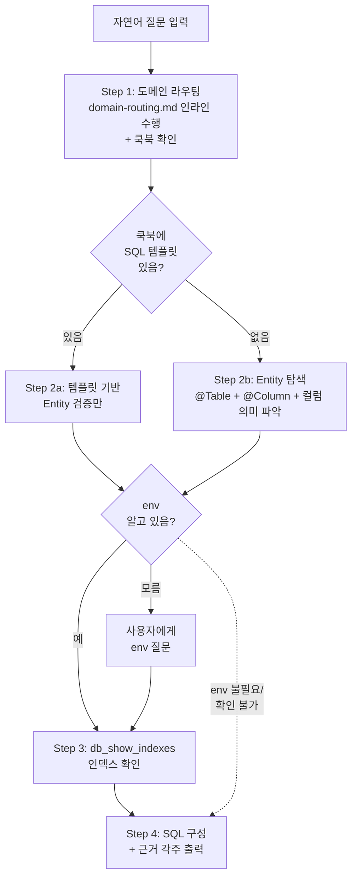

# ops-db-query-builder 스킬 디자인

## 개요

자연어 질문을 받아 **근거 있는 SQL 쿼리**를 구성하는 오케스트레이터 스킬.
테이블명/컬럼명을 절대 추측하지 않고, 기존 지식(도메인맵 → 쿡북 → Entity → 인덱스)을 순서대로 탐색한다.

## SKILL.md Frontmatter

```yaml
---
name: ops-db-query-builder
description: >
  DB 쿼리가 필요할 때 근거 있는 SQL을 구성하는 오케스트레이터.
  도메인 라우팅 → 쿡북 확인 → Entity 탐색 → 인덱스 확인 → SQL + 근거 각주 출력.
  Triggers: 'SQL 만들어줘', '쿼리 짜줘', '테이블 뭐야', 'DB 조회 필요',
  또는 다른 ops 스킬 내부에서 DB 쿼리가 필요할 때.
allowed-tools: Read, Grep, Glob, Agent, Skill(ops-find-domain), MCP(db_show_indexes, db_describe)
argument-hint: <자연어 질문 (예: "특정 회사의 사번 보유 구성원 수")>
---
```

## 역할

- **트리거**: 다른 ops 스킬 내부에서 DB 쿼리가 필요할 때 호출. 사용자 직접 호출도 가능.
- **입력**: 자연어 질문 (예: `"특정 회사의 사번 보유 구성원 수"`)
- **출력**: SQL 쿼리 + 근거 각주 (Entity 출처, 인덱스 정보). env 지정이나 실행은 하지 않음.
- **실행 위임**: 최종 SQL 실행은 호출하는 쪽이 `db:db-query` 로 수행.

## Input / Argument Resolution

- `$ARGUMENTS` 가 자연어 질문이면 그대로 사용
- `$ARGUMENTS` 가 비어있으면 → 대화 컨텍스트에서 쿼리 의도를 추출 시도. 추출 불가 시 사용자에게 질문
- 질문이 너무 모호하면 (예: "데이터 좀 봐줘") → 구체적으로 어떤 데이터인지 사용자에게 질문
- 복수 질문이 한 번에 들어오면 → 하나씩 순차 처리

## 파이프라인



## Step 상세

### Step 1. 도메인 라우팅 (인라인 수행)

- `ops-common/domain-routing.md` 를 Read하여 인라인 수행 (기존 ops 스킬 패턴과 통일)
- 자연어 질문에서 키워드 추출 → `domain-map.ttl` + `GLOSSARY.md` 에서 도메인/repo/모듈(`d:mod`) 특정
- 해당 도메인의 `COOKBOOK.md` 섹션 확인
- 쿡북에 SQL 템플릿이 있으면 Step 2a, 없으면 Step 2b로 분기
- **다중 도메인이 후보인 경우** → 후보를 사용자에게 보여주고 주 대상 도메인 선택 요청

### Step 2a. 쿡북 템플릿 기반 (쇼트서킷)

- 쿡북의 SQL 템플릿을 가져온다
- 템플릿에 등장하는 테이블/컬럼이 현재 Entity와 일치하는지 **검증만** 수행
  - repo에서 `@Table(name = "템플릿의_테이블명")` Grep
  - 해당 Entity의 `@Column` 확인
- 일치하면 템플릿 채택, 불일치하면 Step 2b로 폴백
- **파라미터 바인딩**: 템플릿의 조건부를 사용자 질문 맥락으로 매핑. 플레이스홀더는 `{파라미터명}` 형식으로 표기 (예: `{회사ID}`, `{시작일}`)

### Step 2b. Entity 탐색 (풀 탐색)

Step 1에서 특정된 repo + 모듈(`d:mod`) 범위 안에서 탐색:

1. **Entity 찾기**: 도메인 키워드로 Entity 클래스 Grep. 탐색 범위는 `d:mod` 결과로 한정
2. **테이블/컬럼 확인**: `@Table(name = "...")`, `@Column(name = "...")` 확인
3. **컬럼 의미 파악**:
   - 필드 타입이 enum → enum 클래스를 읽어서 가능한 값 확인
   - 필드 의미가 불명확 → 해당 필드를 사용하는 Repository/Service 코드를 Grep해서 비즈니스 맥락 파악
   - FK(`@ManyToOne`, `@JoinColumn`) → 참조 Entity도 확인
4. **연관 Entity 확인**: 조인이 필요한 경우 관련 테이블도 동일하게 탐색

의미를 특정하기 어려운 경우 → 후보 해석을 사용자에게 보여주고 확인 요청.

#### JPA 패턴 주의사항

| 패턴 | 대응 |
|------|------|
| `@Column` 생략 | Spring naming strategy(camelCase → snake_case) 기반 추론 + `db_describe` 로 교차 검증 |
| `@MappedSuperclass` / `@Inheritance` | 부모 클래스까지 추적하여 컬럼 확인 |
| `@Embedded` / `@Embeddable` | 분리된 클래스에서 필드 확인 |
| `@ManyToOne` + `@JoinColumn` | FK 컬럼명 추출 → 참조 테이블의 PK 확인 |
| `@OneToMany(mappedBy)` | 역방향 관계 — 실제 FK는 대상 Entity 쪽에 있음 |
| `@JoinTable` | 중간 테이블명/컬럼명을 어노테이션에서 확인 |
| `@Where` (soft-delete) | SQL WHERE 조건에 반영 필요 여부 확인 |

**Entity-DB 스키마 불일치 의심 시**: `db_describe` 로 실제 컬럼 목록을 교차 검증.

### Step 3. 인덱스 확인 (optional)

- env가 이미 알려져 있으면 (이슈 조사 맥락 등) 그 환경으로 조회
- env를 모르면 사용자에게 질문
- env 확인이 불가능한 상황이면 → "인덱스 미확인" 경고를 붙이고 Step 4로 진행
- `db_show_indexes` 로 대상 테이블의 인덱스 조회
- WHERE/JOIN에 쓸 컬럼이 인덱스에 포함되는지 확인
- 인덱스가 없는 컬럼으로 필터링해야 하면 경고 포함

### Step 4. SQL 구성 + 출력

출력 포맷 예시:

```sql
-- 특정 회사의 사번 보유 구성원 수
SELECT COUNT(*)
FROM actual_table_name
WHERE company_id = {회사ID}
  AND employee_number IS NOT NULL;
```

```
[근거]
- 테이블: actual_table_name
  └ flex-core-backend > src/.../MemberEntity.kt @Table(name = "actual_table_name")
- 컬럼 company_id
  └ MemberEntity.kt @Column(name = "company_id")
- 컬럼 employee_number
  └ MemberEntity.kt @Column(name = "employee_number")
- 인덱스: idx_company_id (company_id) ✅ 활용됨
```

> 근거 각주의 파일 경로는 탐색 시점의 스냅샷이며, 코드 변경 시 무효화될 수 있다.

## 기존 스킬과의 통합

### ops-investigate-issue 와의 관계

`ops-investigate-issue` Step 5에서 SQL을 직접 작성하는 부분을 이 스킬로 대체할 수 있다:

- **Before**: investigate-issue가 Entity 확인 의무 절차를 인라인으로 수행
- **After**: investigate-issue가 `ops-db-query-builder` 를 호출 → SQL + 근거를 받아서 → `db:db-query` 로 실행

이 통합은 `ops-db-query-builder` 완성 후 별도 작업으로 investigate-issue 스킬을 업데이트한다.

## 에러/예외 처리

| 상황 | 동작 |
|------|------|
| 도메인 라우팅 결과 없음 | "도메인을 특정하지 못했습니다" + 사용한 키워드 알려주고 중단 |
| 다중 도메인이 후보인 경우 | 후보를 사용자에게 보여주고 주 대상 도메인 선택 요청 |
| 쿡북 템플릿 검증 실패 (Entity 불일치) | Step 2b 풀 탐색으로 폴백 |
| Entity를 못 찾음 | 탐색한 키워드/범위를 보여주고 중단 |
| `@Column` 생략으로 컬럼명 불확실 | `db_describe` 로 실제 컬럼 목록 교차 검증 |
| `db_show_indexes` 실패 (1Password 만료 등) | 인덱스 미확인 경고를 붙이고 SQL은 출력 — 실행 전 인덱스 확인 권고 |
| 여러 테이블이 후보인 경우 | 후보 목록을 사용자에게 보여주고 선택 요청 |
| 컬럼 의미를 특정하기 어려운 경우 | 후보 해석을 사용자에게 보여주고 확인 요청 |
| cross-domain 조인 질문 | 각 도메인별로 Entity 탐색 후 조인 가능 여부 판단. 불가하면 사용자에게 알림 |

## 핵심 원칙

1. **추측 금지** — 테이블명/컬럼명을 절대 추측하지 않는다
2. **근거 각주 필수** — 모든 SQL 요소에 Entity 출처를 붙인다
3. **인덱스 활용** — 인덱스를 확인해서 WHERE/JOIN이 인덱스를 타도록 구성한다
4. **기존 패턴 재활용** — `domain-routing.md` 인라인 수행 + `db_show_indexes`/`db_describe` 조합
5. **실행 분리** — SQL 구성까지만 담당, env 결정과 실행은 호출 쪽 책임
