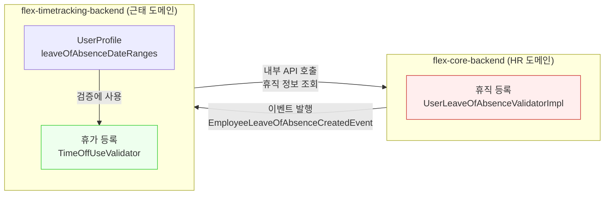

# [CI-4120](https://linear.app/flexteam/issue/CI-4120): 휴직 기간과 휴가 사용 간 검증 비대칭 문의

## 증상

> **용어**: 휴직(Leave of Absence)은 근로자가 일정 기간 근로 의무를 면제받는 제도(육아휴직, 병가휴직 등). 휴가(Time Off)는 연차·반차 등 근로일에 쉬는 것.

내부 CS 팀에서 접수된 문의.[^1]

- 휴직이 등록된 기간에 휴가를 사용하려 하면 **"휴직 기간에 휴가 사용이 불가"** 알림이 표시되며 차단됨
- 반대로, 휴가가 이미 사용된 기간에 휴직을 등록하면 **정상적으로 등록됨**
- 즉, 휴직→휴가는 검증이 있지만 휴가→휴직은 검증이 없는 **비대칭 동작**에 대한 문의
- 환경: PROD / 문의 유형: question (의도된 동작인지 확인 요청)

## 현재까지 파악된 내용

- 안희종이 설계 의도를 확인해줌[^7]:
  - **휴가→휴직 허용 이유**: 유즈케이스가 있음. 미래에 등록한 휴가가 있는 상태에서 갑자기 휴직이 발생할 수 있고, 이때 휴직 기간의 휴가는 **잔여를 차감하지 않는 방식**으로 처리됨
  - **휴직→휴가 차단 이유**: 휴직 중에 휴가를 사용하는 유즈케이스가 없음
- 이슈 상태: **Not a Bug**로 종결[^8]
- Slack 스레드에서 원본 문의 맥락 확인 가능[^2]

## 원인 분석

**스펙 (의도된 설계)** — 서비스 경계 분리 + 유즈케이스 기반 의도적 비대칭.[^7]

### 핵심 증거

1. 휴가 등록 시 휴직 검증: `flex-timetracking-backend` > `TimeOffUseValidator.kt:178` 에서 `leaveOfAbsenceDateRanges` 확인 후 차단[^3]
2. 휴직 등록 시 휴가 검증: `flex-core-backend` > `UserLeaveOfAbsenceValidatorImpl.kt:86-185` 에서 **기존 휴직 중복만 검증**, 휴가 데이터 미참조[^4]
3. 휴직 등록 이벤트(`EmployeeLeaveOfAbsenceCreatedEventV1/V2`) 발행 후 `flex-timetracking-backend`가 수신하지만, 기존 휴가 자동 취소 로직 없음 — 검색 인덱스 갱신만 수행[^5]

### 가설 목록

| # | 가설 | 확인 방법 | 상태 |
|---|------|----------|------|
| 1 | 서비스 경계로 인해 휴직 validator가 휴가 데이터를 참조하지 않음 | 양쪽 validator 코드 확인 | ✅ 확정 |
| 2 | 휴직 등록 이벤트로 기존 휴가를 자동 취소하는 후처리가 있을 수 있음 | 이벤트 컨슈머 분석 | ❌ 소거 — 후처리 없음[^5] |
| 3 | "Prevention forward" 패턴의 의도적 설계 | 전체 이벤트 플로우 분석 | ✅ 확정 |

<details>
<summary>📋 조사 과정 상세</summary>

### 서비스 분리 구조



- 휴가 등록(`flex-timetracking-backend`) → `flex-core-backend`에서 휴직 정보를 가져와 검증 ✅
- 휴직 등록(`flex-core-backend`) → `flex-timetracking-backend`의 휴가 정보를 **참조하지 않음** ❌

### 휴직 등록 validator가 확인하는 항목 (전체)

`UserLeaveOfAbsenceValidatorImpl.kt:86-185`[^4]:
- 필수값 검증 (status, beginDate, endDate, paymentRatio)
- 시작일 > 종료일 역전 체크
- **기존 휴직 기간 중복만 확인** (cancelable 상태의 다른 휴직과 겹치는지)
- 입사일 이전 날짜 설정 불가
- 급여 비율 범위 (0~1)
- 메모 길이 (500자)

→ 휴가(time-off) 관련 검증은 **전혀 없음**

### 이벤트 후처리 플로우

```
flex-core-backend (휴직 등록)
    ↓ EmployeeLeaveOfAbsenceCreatedEventV1/V2 발행
flex-timetracking-backend (SearchWorkScheduleUserSyncConsumer)
    ↓ OpenSearch 인덱스 갱신 (leaveOfAbsence=true)
    ↓ WorkScheduleEnrichmentEvent 발행
    → 기존 휴가 취소 로직 없음
```

`SearchWorkScheduleUserSyncConsumer.kt:194-274`[^5]는 검색 인덱스만 업데이트하고, `TrackingUserPersonalLookUpService`는 on-demand로 휴직 정보를 가져와 **향후 검증**에만 사용.

</details>

### 스펙 vs 버그 판별

**스펙 (의도된 설계)**

| 판별 기준 | 결과 |
|----------|------|
| 코드상 의도적 분기 처리? | `flex-core-backend` validator가 자체 도메인(휴직) 데이터만 검증하는 것은 서비스 경계 설계 원칙에 부합 |
| 시스템 전체 패턴 일관성? | "Prevention forward" — 미래 액션 차단, 기존 데이터 소급 취소 안 함 (일관된 패턴) |
| 유사 사례? | [CI-3858](https://linear.app/flexteam/issue/CI-3858) 보상휴가 비대칭도 서비스 간 검증 범위 차이에서 발생[^6] |
| 담당자 확인? | 안희종이 유즈케이스 기반 의도적 설계임을 확인[^7] |

**근거**: 안희종 확인에 따르면, 휴가가 있는 상태에서 휴직이 발생하는 유즈케이스(미래에 등록해둔 휴가 + 갑작스런 휴직)는 실제 존재하며, 이때 휴직 기간의 휴가는 **잔여를 차감하지 않는 방식**으로 처리된다. 반대로 휴직 중 휴가 사용은 유즈케이스가 없으므로 차단한다.[^7] 시스템 전체적으로도 **"Prevention forward"** 패턴을 사용한다.

## 코드 위치

| 역할 | 위치 |
|------|------|
| 휴가→휴직 검증 | `flex-timetracking-backend` > `time-off/service/.../TimeOffUseValidator.kt:178`[^3] |
| 휴직 등록 validator | `flex-core-backend` > `core/service-business/.../UserLeaveOfAbsenceValidatorImpl.kt:86`[^4] |
| 휴직 이벤트 컨슈머 | `flex-timetracking-backend` > `tracking-search/consumer/.../SearchWorkScheduleUserSyncConsumer.kt:194`[^5] |

<details>
<summary>📋 전체 코드 위치 목록</summary>

| 파일 | 역할 |
|------|------|
| `flex-timetracking-backend` > `time-off/service/.../TimeOffUseValidator.kt:178-194` | 휴가 등록 시 휴직 기간 검증 |
| `flex-core-backend` > `core/service-business/.../UserLeaveOfAbsenceValidatorImpl.kt:86-185` | 휴직 등록 시 검증 (휴가 미참조) |
| `flex-core-backend` > `core/service-business/.../UserLeaveOfAbsenceServiceImpl.kt:74-91` | 휴직 등록 + 이벤트 발행 |
| `flex-core-backend` > `core/api/.../UserLeaveOfAbsenceController.kt` | 휴직 등록 API |
| `flex-timetracking-backend` > `tracking-search/consumer/.../SearchWorkScheduleUserSyncConsumer.kt:194-274` | 휴직 이벤트 수신 → 검색 인덱스 갱신 |
| `flex-timetracking-backend` > `tracking-user/service/.../TrackingUserPersonalLookUpServiceImpl.kt:147-149` | 휴직 정보 on-demand 조회 |
| `flex-timetracking-backend` > `tracking-user/model/.../TrackingUserBaseModel.kt:79-91` | 휴직 모델 + 날짜 검증 유틸 |
| `flex-timetracking-backend` > `work-clock/service/.../WorkClockRegisterDuringLeaveOfAbsenceValidator.kt` | 출퇴근 시 휴직 검증 |
| `flex-timetracking-backend` > `work-schedule/service/.../WorkScheduleRegisterDuringLeaveOfAbsenceValidatorLogic.kt` | 근무일정 시 휴직 검증 |

</details>

## 다음에 같은 문의가 오면

1. **의도된 스펙임을 안내**: 휴직 중 휴가 사용은 유즈케이스가 없어 차단, 휴가가 있는 상태에서 휴직 등록은 유즈케이스가 있어 허용[^7]
2. **잔여 차감 안내**: 휴직 기간에 걸친 기존 휴가는 **잔여를 차감하지 않는 방식**으로 처리됨
3. **운영 가이드**: 필요 시 휴직 등록 전 해당 기간의 기존 휴가를 먼저 취소/조정 권장
4. **검증 방향 요약**:
   - 휴가 등록 시 → 휴직 기간 체크 ✅ (차단됨)
   - 휴직 등록 시 → 기존 휴가 체크 ❌ (허용됨, 잔여 미차감 처리)

## 시나리오

```gherkin
# language: ko
기능: 휴직과 휴가 간 검증

  시나리오: 휴직 기간에 휴가를 등록하려고 시도
    주어진 구성원에게 2026-04-01부터 2026-04-30까지 휴직이 등록되어 있다
    만약 해당 구성원이 2026-04-15에 연차를 등록하려고 한다
    그러면 "휴직 기간에 휴가 사용이 불가" 검증 오류가 발생한다
    그리고 휴가 등록이 차단된다

  시나리오: 휴가가 등록된 기간에 휴직을 등록
    주어진 구성원이 2026-04-15에 연차를 사용했다
    만약 관리자가 해당 구성원에게 2026-04-01부터 2026-04-30까지 휴직을 등록한다
    그러면 휴직이 정상적으로 등록된다
    그리고 휴직 기간에 포함된 기존 휴가의 잔여는 차감되지 않는다
```

## 해결안 / 조사 방향

이슈 유형이 question이므로 CS 답변 안내가 우선.

**즉시 대응**: CS 팀에 아래 내용을 전달
- 현재 동작은 의도된 설계. 휴직 등록은 HR 관리 영역, 휴가 등록은 근태 관리 영역으로 분리되어 있음
- 휴직 등록 전 기존 휴가를 먼저 정리하는 운영 프로세스 권장

**UX 개선 가능성** (별도 검토 사항):
- 휴직 등록 시 해당 기간에 기존 휴가가 있으면 **경고(Warning)** 표시 (차단은 아닌 안내) — `flex-core-backend` → `flex-timetracking-backend` 내부 API 호출 추가 필요
- 장단점: 서비스 간 결합도 증가 vs 관리자 편의성 향상

## 연관 이슈

- [CI-3858](https://linear.app/flexteam/issue/CI-3858) ([노트](./CI-3858.md)) — 보상휴가 비대칭 검증 (forAssign 모드 차이). 서비스 간 검증 범위 차이로 인한 비대칭이라는 패턴이 유사[^6]

## 참고 자료

- [CI-4120](https://linear.app/flexteam/issue/CI-4120)
- [Slack 스레드](https://flex-cv82520.slack.com/archives/C01SEAZV737/p1773640240658469)[^2]

## 미결 사항

- [x] 휴가 등록 시 휴직 기간 검증 로직 확인
- [x] 휴직 등록 시 기존 휴가 존재 여부 검증 로직 확인
- [x] 비대칭 동작이 의도된 것인지 판단 → **스펙**
- [x] Slack 스레드에서 추가 맥락 확인 → 안희종이 Linear에서 직접 답변 완료[^7]

## 각주

[^1]: [CI-4120](https://linear.app/flexteam/issue/CI-4120) — 2026-03-16 14:50 KST 접수. Feedback Template 경유, 담당 그룹: 근무/휴가
[^2]: [Slack 스레드](https://flex-cv82520.slack.com/archives/C01SEAZV737/p1773640240658469) — 원본 문의 스레드
[^3]: `flex-timetracking-backend` > `time-off/service/src/main/kotlin/team/flex/timeoff/use/validator/TimeOffUseValidator.kt:178` — `isNotUsedTimeOffsDuringLeaveOfAbsenceDateRange()` 메서드
[^4]: `flex-core-backend` > `core/service-business/src/main/kotlin/team/flex/core/service/business/pause/validator/UserLeaveOfAbsenceValidatorImpl.kt:86-185` — 휴직 등록 검증 전체 로직
[^5]: `flex-timetracking-backend` > `tracking-search/consumer/src/main/kotlin/team/flex/tracking/search/workschedule/consumer/SearchWorkScheduleUserSyncConsumer.kt:194-274` — 휴직 이벤트 수신 후 OpenSearch 인덱스 갱신만 수행, 기존 휴가 취소 로직 없음
[^6]: [CI-3858](https://linear.app/flexteam/issue/CI-3858) — 보상휴가 비대칭 검증 사례. 서비스 간 검증 범위 차이로 인한 비대칭 패턴이 동일
[^7]: Linear 코멘트 @안희종, 2026-03-16 15:34 KST — 휴가→휴직 허용은 유즈케이스 기반 의도적 설계, 잔여 미차감 처리
[^8]: [CI-4120](https://linear.app/flexteam/issue/CI-4120) — 상태 "Not a Bug"로 변경, 2026-03-16 18:02 KST
